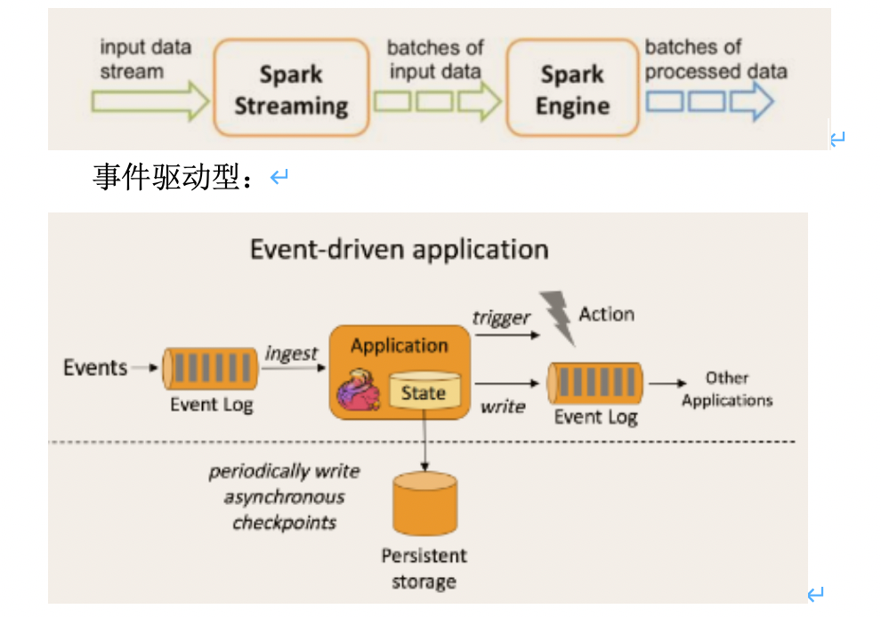

## Flink的重要特点 

 

### 2.1 事件驱动型(Event-driven)

事件驱动型应用是一类具有状态的应用，它从一个或多个事件流提取数据，并根据到来的事件触发计算、状态更新或其他外部动作。比较典型的就是以kafka为代表的消息队列几乎都是事件驱动型应用。

 

与之不同的就是SparkStreaming微批次，如图：

### 流与批的世界观

   **批处理**的特点是有界、持久、大量，非常适合需要访问全套记录才能完成的计算工作，一般用于离线统计。

**流处理**的特点是无界、实时,  无需针对整个数据集执行操作，而是对通过系统传输的每个数据项执行操作，一般用于实时统计。

 

  **在spark的世界观中**，一切都是由批次组成的，离线数据是一个大批次，而实时数据是由一个一个无限的小批次组成的。

  **而在flink的世界观中**，一切都是由流组成的，离线数据是有界限的流，实时数据是一个没有界限的流，这就是所谓的有界流和无界流。

 

**无界数据流**：**无界数据流有一个开始但是没有结束**，它们不会在生成时终止并提供数据，必须连续处理无界流，也就是说必须在获取后立即处理event。对于无界数据流我们无法等待所有数据都到达，因为输入是无界的，并且在任何时间点都不会完成。处理无界数据通常要求以特定顺序（例如事件发生的顺序）获取event，以便能够推断结果完整性。

**有界数据流**：**有界数据流有明确定义的开始和结束**，可以在执行任何计算之前通过获取所有数据来处理有界流，处理有界流不需要有序获取，因为可以始终对有界数据集进行排序，有界流的处理也称为批处理。

### 分层api

 

​                               

最底层级的抽象仅仅提供了有状态流，它将通过过程函数（Process Function）被嵌入到DataStream API中。底层过程函数（Process Function） 与 DataStream API 相集成，使其可以对某些特定的操作进行底层的抽象，它允许用户可以自由地处理来自一个或多个数据流的事件，并使用一致的容错的状态。除此之外，用户可以注册事件时间并处理时间回调，从而使程序可以处理复杂的计算。

实际上，**大多数应用并不需要上述的底层抽象，而是针对核心****API****（Core APIs****）** **进行编程，比如DataStream API****（有界或无界流数据）以及DataSet API****（有界数据集）**。这些API为数据处理提供了通用的构建模块，比如由用户定义的多种形式的转换（transformations），连接（joins），聚合（aggregations），窗口操作（windows）等等。DataSet API 为有界数据集提供了额外的支持，例如循环与迭代。这些API处理的数据类型以类（classes）的形式由各自的编程语言所表示。

Table API 是以表为中心的声明式编程，其中表可能会动态变化（在表达流数据时）。Table API遵循（扩展的）关系模型：表有二维数据结构（schema）（类似于关系数据库中的表），同时API提供可比较的操作，例如select、project、join、group-by、aggregate等。Table API程序声明式地定义了什么逻辑操作应该执行，而不是准确地确定这些操作代码的看上去如何 。 尽管Table API可以通过多种类型的用户自定义函数（UDF）进行扩展，其仍不如核心API更具表达能力，但是使用起来却更加简洁（代码量更少）。除此之外，Table API程序在执行之前会经过内置优化器进行优化。

**你可以在表与 DataStream/DataSet** **之间无缝切换，以允许程序将 Table API** **与 DataStream** **以及 DataSet** **混合使用**。

Flink提供的最高层级的抽象是 SQL 。这一层抽象在语法与表达能力上与 Table API 类似，但是是以SQL查询表达式的形式表现程序。SQL抽象与Table API交互密切，同时SQL查询可以直接在Table API定义的表上执行。

### 2.4 支持有状态计算

Flink在1.4版本中实现了状态管理，所谓状态管理就是在流失计算过程中将算子的中间结果保存在内存或者文件系统中，等下一个事件进入算子后可以让当前事件的值与历史值进行汇总累计。

 

### 2.5 支持exactly-once语义

在分布式系统中，组成系统的各个计算机是独立的。这些计算机有可能fail。

一个sender发送一条message到receiver。根据receiver出现fail时sender如何处理fail，可以将message delivery分为三种语义:

**At Most once:** 对于一条message,receiver最多收到一次(0次或1次).

可以达成At Most Once的策略:

sender把message发送给receiver.无论receiver是否收到message,sender都不再重发message.

**At Least once:** 对于一条message,receiver最少收到一次(1次及以上).

可以达成At Least Once的策略:

sender把message发送给receiver.当receiver在规定时间内没有回复ACK或回复了error信息,那么sender重发这条message给receiver,直到sender收到receiver的ACK.

**Exactly once:** 对于一条message,receiver确保只收到一次 

### 2.6  支持事件时间（EventTime）

  目前大多数框架时间窗口计算，都是采用当前系统时间，以时间为单位进行的聚合计算只能反应数据到达计算引擎的时间，而并不是实际业务时间

 

#  Flink运行架构

## 任务提交流程（yarn模式）

​                               

图 Yarn模式任务提交流程

Flink任务提交后，Client向HDFS上传Flink的Jar包和配置，之后向Yarn ResourceManager提交任务，ResourceManager分配Container资源并通知对应的NodeManager启动ApplicationMaster，ApplicationMaster启动后加载Flink的Jar包和配置构建环境，然后启动JobManager，之后ApplicationMaster向ResourceManager申请资源启动TaskManager，ResourceManager分配Container资源后，由ApplicationMaster通知资源所在节点的NodeManager启动TaskManager，NodeManager加载Flink的Jar包和配置构建环境并启动TaskManager，TaskManager启动后向JobManager发送心跳包，并等待JobManager向其分配任务。

## 任务调度原理

客户端不是运行时和程序执行的一部分，但它用于准备并发送dataflow(JobGraph)给Master(JobManager)，然后，客户端断开连接或者维持连接以等待接收计算结果。

 当 Flink 集群启动后，首先会启动一个 JobManger 和一个或多个的 TaskManager。由 Client 提交任务给 JobManager，JobManager 再调度任务到各个 TaskManager 去执行，然后 TaskManager 将心跳和统计信息汇报给 JobManager。TaskManager 之间以流的形式进行数据的传输。上述三者均为独立的 JVM 进程。

**Client** 为提交 Job 的客户端，可以是运行在任何机器上（与 JobManager 环境连通即可）。提交 Job 后，Client 可以结束进程（Streaming的任务），也可以不结束并等待结果返回。

**JobManager** 主要负责调度 Job 并协调 Task 做 checkpoint，职责上很像 Storm 的 Nimbus。从 Client 处接收到 Job 和 JAR 包等资源后，会生成优化后的执行计划，并以 Task 的单元调度到各个 TaskManager 去执行。

**TaskManager** 在启动的时候就设置好了槽位数（Slot），每个 slot 能启动一个 Task，Task 为线程。从 JobManager 处接收需要部署的 Task，部署启动后，与自己的上游建立 Netty 连接，接收数据并处理。 

**关于执行图**

Flink 中的执行图可以分成四层：**StreamGraph** -> **JobGraph** -> **ExecutionGraph** -> **物理执行图**。

**StreamGraph**：是根据用户通过 Stream API 编写的代码生成的最初的图。用来表示程序的拓扑结构。

**JobGraph**：StreamGraph经过优化后生成了 JobGraph，提交给 JobManager 的数据结构。主要的优化为，将多个符合条件的节点 chain 在一起作为一个节点，这样可以减少数据在节点之间流动所需要的序列化/反序列化/传输消耗。

**ExecutionGraph**：JobManager 根据 JobGraph 生成ExecutionGraph。ExecutionGraph是JobGraph的并行化版本，是调度层最核心的数据结构。

**物理执行图**：JobManager 根据 ExecutionGraph 对 Job 进行调度后，在各个TaskManager 上部署 Task 后形成的“图”，并不是一个具体的数据结构。

 

## 3 Worker与Slots 

**每一个worker(TaskManager)****是一个JVM****进程，它可能会在独立的线程上执行一个或多个subtask**。为了控制一个worker能接收多少个task，worker通过task slot来进行控制（一个worker至少有一个task slot）。·

每个task slot表示TaskManager拥有资源的一个固定大小的子集。假如一个TaskManager有三个slot，那么它会将其管理的内存分成三份给各个slot。**资源****slot****化意味着一个subtask****将不需要跟来自其他job****的subtask****竞争被管理的内存，取而代之的是它将拥有一定数量的内存储备**。需要注意的是，这里不会涉及到CPU的隔离，slot目前仅仅用来隔离task的受管理的内存。

**通过调整task slot****的数量，允许用户定义subtask****之间如何互相隔离**。如果一个TaskManager一个slot，那将意味着每个task group运行在独立的JVM中（该JVM可能是通过一个特定的容器启动的），而一个TaskManager多个slot意味着更多的subtask可以共享同一个JVM。而在同一个JVM进程中的task将共享TCP连接（基于多路复用）和心跳消息。它们也可能共享数据集和数据结构，因此这减少了每个task的负载。

 图 TaskManager与Slot

**Task Slot****是静态的概念，是指TaskManager****具有的并发执行能力**，可以通过参数taskmanager.numberOfTaskSlots进行配置，而**并行度****parallelism****是动态概念，即TaskManager****运行程序时实际使用的并发能力**，可以通过参数parallelism.default进行配置。

也就是说，假设一共有3个TaskManager，每一个TaskManager中的分配3个TaskSlot，也就是每个TaskManager可以接收3个task，一共9个TaskSlot，如果我们设置parallelism.default=1，即运行程序默认的并行度为1，9个TaskSlot只用了1个，有8个空闲，因此，设置合适的并行度才能提高效率。 

## 4 并行数据流

**Flink****程序的执行具有并行、分布式的特性**。在执行过程中，一个 stream 包含一个或多个 stream partition ，而每一个 operator 包含一个或多个 operator subtask，这些operator subtasks在不同的线程、不同的物理机或不同的容器中彼此互不依赖得执行。

**一个特定operator****的subtask****的个数被称之为其parallelism(****并行度)**。一个stream的并行度总是等同于其producing operator的并行度。一个程序中，不同的operator可能具有不同的并行度。

图 并行数据流

Stream在operator之间传输数据的形式可以是one-to-one(forwarding)的模式也可以是redistributing的模式，具体是哪一种形式，取决于operator的种类。

**One-to-one**：**stream(****比如在source****和map operator****之间)****维护着分区以及元素的顺序**。那意味着map operator的subtask看到的元素的个数以及顺序跟source operator的subtask生产的元素的个数、顺序相同，map、fliter、flatMap等算子都是one-to-one的对应关系。

 **类似于spark****中的窄依赖**

**Redistributing**：**stream(map()****跟keyBy/window****之间或者keyBy/window****跟sink****之间)****的分区会发生改变**。每一个operator subtask依据所选择的transformation发送数据到不同的目标subtask。例如，keyBy() 基于hashCode重分区、broadcast和rebalance会随机重新分区，这些算子都会引起redistribute过程，而redistribute过程就类似于Spark中的shuffle过程。

**类似于spark****中的宽依赖**

##  Flink中的数据类型和处理模型

Flink中的数据类型有有界数据流和无界数据流，所谓有界数据流指的是有边界的数据，比如批次数据、流式数据中的窗口数据。无界数据流指的是没有边界的数据流，比如源源不断产生的流式数据。

Flink中三种处理数据模型：

l Flink批处理

Flink批处理中处理的有界数据流

l Flin流式处理

Flink流式处理中处理的有有界数据流也有无界数据流

l FlinSQL处理

FlinkSQL中处理的有有界数据流也有无界数据流

## Flink Source和Sink

l 数据源Source

Source 是Flink获取数据的地方。以下source中和批处理的source类似，但是以下源作为dataStream流处理时，是一条条处理，最终得到的不是一个总结果，而是每次处理后都会得到一个结果。

1) socketTextStream – 读取Socket数据流

2) readTextFile() -- 逐行读取文本文件获取数据流，每行都返回字符串。

3) fromCollection() – 从集合中创建数据流。 

4) fromElements – 从给定的数据对象创建数据流，所有数据类型要一致。

5) addSource – 添加新的源函数,例如从kafka中读取数据，参见读取kafka数据案例。

 

l 数据写出 Sink

1) writeAsText() – 以字符串的形式逐行写入文件，调用每个元素的toString()得到写入的字符串。

2) writeAsCsv() – 将元组写出以逗号分隔的csv文件。注意：只能作用到元组数据上。

3) print() – 控制台直接输出结果，调用对象的toString()方法得到输出结果。

addSink() – 自定义接收函数。例如将结果保存到kafka中，参见kafka案例。

