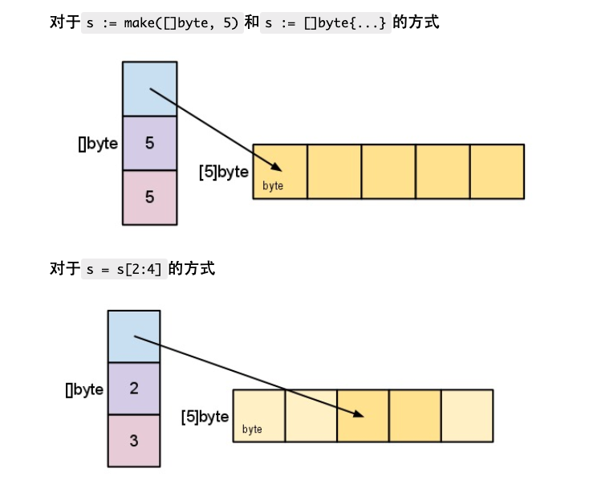
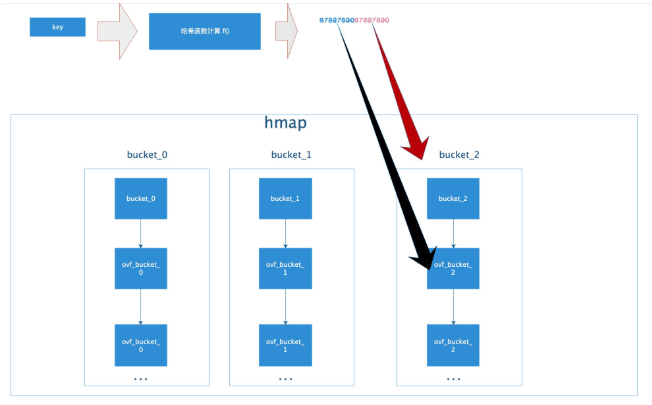
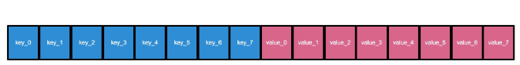
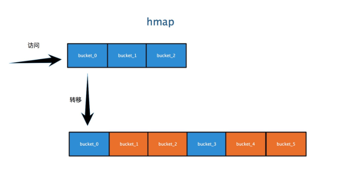

<!-- TOC -->

    - [目录结构](#目录结构)
    - [make 和 new 的异同](#make-和-new-的异同)
        - [new](#new)
        - [make](#make)
- [基本语法](#基本语法)
- [HTTP](#http)
- [URL](#url)
    - [绝对url与相对url](#绝对url与相对url)
- [Curl](#curl)
- [ASCII 与 Unicode 与 UTF-8](#ascii-与-unicode-与-utf-8)
- [iota的使用](#iota的使用)
- [flag.Parse()](#flagparse)
    - [基本数据类型](#基本数据类型)
        - [字符](#字符)
        - [字符串](#字符串)
        - [基本数据的默认值](#基本数据的默认值)
        - [数据转换](#数据转换)
        - [基本数据类型和string的转化](#基本数据类型和string的转化)
        - [string  转基本数据类型](#string--转基本数据类型)
    - [闭包](#闭包)
    - [defer](#defer)
    - [string 常用函数](#string-常用函数)
    - [时间类](#时间类)
    - [错误处理机制](#错误处理机制)
    - [数组](#数组)
        - [数组注意的细节](#数组注意的细节)
    - [切片](#切片)
        - [切片的三种定义方式](#切片的三种定义方式)
        - [切片的传参](#切片的传参)
        - [切片的append](#切片的append)
    - [map](#map)
        - [map的 curd](#map的-curd)
        - [map的遍历](#map的遍历)
        - [map切片](#map切片)
    - [go语言的面向对象](#go语言的面向对象)
    - [结构体](#结构体)
        - [结构体的三种初始化方式](#结构体的三种初始化方式)
    - [方法](#方法)
        - [需要方法的原因](#需要方法的原因)
        - [方法的传值与传地址](#方法的传值与传地址)
    - [工厂模式代替构造函数](#工厂模式代替构造函数)
    - [断言:](#断言)
    - [时区对应表:](#时区对应表)
    - [匿名字段](#匿名字段)
    - [接口](#接口)
    - [结构体初始化](#结构体初始化)
    - [flag解析命令行参数](#flag解析命令行参数)
    - [序列化与反序列化](#序列化与反序列化)
    - [单元测试](#单元测试)
    - [协程(goroutine)](#协程goroutine)
    - [通道](#通道)
        - [通道分类](#通道分类)
            - [只读  只写  双向](#只读--只写--双向)
        - [通道的阻塞情况](#通道的阻塞情况)
        - [for循环的阻塞情况](#for循环的阻塞情况)
        - [select一个线程读多个通道](#select一个线程读多个通道)
    - [反射](#反射)
    - [网络编程](#网络编程)
        - [tcp socket编程,比如qq聊天](#tcp-socket编程比如qq聊天)
        - [http编程,比如web开发](#http编程比如web开发)
    - [匿名函数](#匿名函数)
    - [go modules](#go-modules)
        - [go mod init example.com/hello](#go-mod-init-examplecomhello)
        - [import与gomod的细节](#import与gomod的细节)
        - [go list -m all](#go-list--m-all)
        - [包的版本号](#包的版本号)
            - [更改某个依赖包的版本号](#更改某个依赖包的版本号)
        - [常用命令](#常用命令)
    - [导入包的知识点](#导入包的知识点)
- [err的理解](#err的理解)
- [panic recover err](#panic-recover-err)
    - [panic](#panic)
    - [recover](#recover)
    - [defer](#defer-1)
    - [err和panic的区别](#err和panic的区别)
    - [总结](#总结)
    - [go build 和  go install的区别](#go-build-和--go-install的区别)
    - [proto的使用](#proto的使用)
    - [结构体的三种声明方式](#结构体的三种声明方式)
    - [解析json的方法](#解析json的方法)
        - [知道数据结构就先写数据结构](#知道数据结构就先写数据结构)

<!-- /TOC -->


## 目录结构

https://blog.csdn.net/stpeace/article/details/82710969
goroot  是 go的sdk的安装目录

gopath是项目的存储路径,gopath下有src,pkg,bin

src下是源代码

pkg是执行`go install <import下的依赖包名字> `时,在pkg下生成一份main中依赖的包

bin是执行`go install main.go` 时,在bin下生成可执行文件main,同时在pkg中生成依赖的包文件


## make 和 new 的异同

二者都是内存的分配（堆上），但是make只用于slice、map以及channel的初始化（非零值）；而new用于类型的内存分配，并且内存置为零。所以在我们编写程序的时候，就可以根据自己的需要很好的选择了。

make返回的还是这三个引用类型本身；而new返回的是指向类型的指针。

### new
```
package main
import (
 "fmt"
)
func main() {
 var i *int
 *i=10
 fmt.Println(*i)
}
这个例子会打印出什么？0还是10?。以上全错，运行的时候会painc，原因如下：
```
panic: runtime error: invalid memory address or nil pointer dereference
从这个提示中可以看出，对于引用类型的变量，我们不光要声明它，还要为它分配内容空间，否则我们的值放在哪里去呢？这就是上面错误提示的原因。

对于值类型的声明不需要，是因为已经默认帮我们分配好了。

对于上面的问题我们如何解决呢？既然我们知道了没有为其分配内存，那么我们使用new分配一个吧。
```
func main() {
 var i *int
 i=new(int)
 *i=10
 fmt.Println(*i)
}
```
现在再运行程序，完美PASS，打印10。现在让我们看下new这个内置的函数。

// The new built-in function allocates memory. The first argument is a type,
// not a value, and the value returned is a pointer to a newly
// allocated zero value of that type.
func new(Type) *Type
它只接受一个参数，这个参数是一个类型，分配好内存后，返回一个指向该类型内存地址的指针。同时请注意它同时把分配的内存置为零，也就是类型的零值。

我们的例子中，如果没有*i=10，那么打印的就是0。这里体现不出来new函数这种内存置为零的好处，我们再看一个例子。
```
func main() {
 u:=new(user)
 u.lock.Lock()
 u.name = "张三"
 u.lock.Unlock()
 fmt.Println(u)
}
type user struct {
 lock sync.Mutex
 name string
 age int
}
```
示例中的user类型中的lock字段我不用初始化，直接可以拿来用，不会有无效内存引用异常，因为它已经被零值了。

这就是new，它返回的永远是类型的指针，指向分配类型的内存地址。

### make

make也是用于内存分配的，但是和new不同，它只用于chan、map以及切片的内存创建，而且它返回的类型就是这三个类型本身，而不是他们的指针类型，因为这三种类型就是引用类型，所以就没有必要返回他们的指针了。

注意，因为这三种类型是引用类型，所以必须得初始化，但是不是置为零值，这个和new是不一样的。

func make(t Type, size ...IntegerType) Type
从函数声明中可以看到，返回的还是该类型


# 基本语法

引入的包或者变量没有用到,编译无法通过

推荐使用行注释而不是快注释

go的每一个文件都属于一个包,go是用包来管理文件的

func的首字母大写类似于其他语言的public

导包的时候从src下面开始写 

build mian包的时候,其他的包会编译成.a文件,存放在pkg里面

切片

Go 数组的长度不可改变，在特定场景中这样的集合就不太适用，Go中提供了一种灵活，功能强悍的内置类型切片("动态数组"),与数组相比切片的长度是不固定的，可以追加元素，在追加时可能使切片的容量增大。

直接初始化切片，[]表示是切片类型，{1,2,3}初始化值依次是1,2,3.其cap=len=3


s := arr[:] 

初始化切片s,是数组arr的引用

断言:
```
value,ok: = a.(string)
if !ok{
    fmt.Println("不是string类型")
}
fmt.Println("值为",value)
```


# HTTP

golang 发送http请求:https://blog.csdn.net/iamlihongwei/article/details/78854899


# URL

URL 由多个部分组成。为了讲解，下面是一个比较复杂的 URL。

https://www.example.com:80/path/to/myfile.html?key1=value1&key2=value2#anchor

我们看看，这个 URL 的各个部分。

协议

协议（scheme）是浏览器请求服务器资源的方法，上例是https://的部分，表示使用 HTTPS 协议。

互联网支持多种协议，必须指明网址使用哪一种协议，默认是 HTTP 协议。也就是说，如果省略协议，直接在浏览器地址栏输入www.example.com，那么浏览器默认会访问http://www.example.com。HTTPS 是 HTTP 的加密版本，出于安全考虑，越来越多的网站使用这个协议。

HTTP 和 HTTPS 的协议名称后面，紧跟着一个冒号和两个斜杠（://）。其他协议不一定如此，邮件地址协议mailto:的协议名后面只有一个冒号，比如mailto:foo@example.com。

主机

主机（host）是资源所在的网站名或服务器的名字，又称为域名。上例的主机是www.example.com。

有些主机没有域名，只有 IP 地址，比如192.168.2.15。这种情况常常出现在局域网。

端口

同一个域名下面可能同时包含多个网站，它们之间通过端口（port）区分。“端口”就是一个整数，可以简单理解成，访问者告诉服务器，想要访问哪一个网站。默认端口是80，如果省略了这个参数，服务器就会返回80端口的网站。

端口紧跟在域名后面，两者之间使用冒号分隔，比如www.example.com:80。

路径

路径（path）是资源在网站的位置。比如，/path/index.html这个路径，指向网站的/path子目录下面的网页文件index.html。

互联网的早期，路径是真实存在的物理位置。现在由于服务器可以模拟这些位置，所以路径只是虚拟位置。

路径可能只包含目录，不包含文件名，比如/foo/，甚至结尾的斜杠都可以省略。这时，服务器通常会默认跳转到该目录里面的index.html文件（即等同于请求/foo/index.html），但也可能有其他的处理（比如列出目录里面的所有文件），这取决于服务器的设置。一般来说，访问www.example.com这个网址，很可能返回的是网页文件www.example.com/index.html。

查询参数

查询参数（parameter）是提供给服务器的额外信息。参数的位置是在路径后面，两者之间使用?分隔，上例是?key1=value1&key2=value2。

查询参数可以有一组或多组。每组参数都是键值对（key-value pair）的形式，同时具有键名(key)和键值(value)，它们之间使用等号（=）连接。比如，key1=value就是一个键值对，key1是键名，value1是键值。

多组参数之间使用&连接，比如key1=value1&key2=value2。

锚点

锚点（anchor）是网页内部的定位点，使用#加上锚点名称，放在网址的最后，比如#anchor。浏览器加载页面以后，会自动滚动到锚点所在的位置。

## 绝对url与相对url
资源存放的相对路径与绝对路径

# Curl

发送表单信息
发送表单信息有GET和POST两种方法。GET方法相对简单，只要把数据附在网址后面即可。
```
$ curl www.cnblogs.com/form.cgi?data=xxx
```
POST方法必须把数据和网址分开，curl就要用到–data参数。
```
$ curl -X POST --data "data=xxx" www.cnblogs.com/form.cgi

curl -X POST $robot_addr -d "{\"msgtype\":\"text\",\"text\":{\"content\":\"推荐索引构建告警：\n$content\"}"
```

# ASCII 与 Unicode 与 UTF-8

ASCII码
在学校学 C 语言的时候，了解到一些计算机内部的机制，知道所有的信息最终都表示为一个二进制的字符串，每一个二进制位有 0 和 1 两种状态，通过不同的排列组合，使用 0 和 1 就可以表示世界上所有的东西，感觉有点中国“太极”的感觉——“太极生两仪，两仪生四象，四象生八卦”。

在计算机种中，1 字节对应 8 位二进制数，而每位二进制数有 0、1 两种状态，因此 1 字节可以组合出 256 种状态。如果这 256 中状态每一个都对应一个符号，就能通过 1 字节的数据表示 256 个字符。美国人于是就制定了一套编码（其实就是个字典），描述英语中的字符和这 8 位二进制数的对应关系，这被称为 ASCII 码。

ASCII 码一共定义了 128 个字符，例如大写的字母 A 是 65（这是十进制数，对应二进制是0100 0001）。这 128 个字符只使用了 8 位二进制数中的后面 7 位，最前面的一位统一规定为 0。

历史问题
英语用 128 个字符来编码完全是足够的，但是用来表示其他语言，128 个字符是远远不够的。于是，一些欧洲的国家就决定，将 ASCII 码中闲置的最高位利用起来，这样一来就能表示 256 个字符。但是，这里又有了一个问题，那就是不同的国家的字符集可能不同，就算它们都能用 256 个字符表示全，但是同一个码点（也就是 8 位二进制数）表示的字符可能可能不同。例如，144 在阿拉伯人的 ASCII 码中是 گ，而在俄罗斯的 ASCII 码中是 ђ。

因此，ASCII 码的问题在于尽管所有人都在 0 - 127 号字符上达成了一致，但对于 128 - 255 号字符上却有很多种不同的解释。与此同时，亚洲语言有更多的字符需要被存储，一个字节已经不够用了。于是，人们开始使用两个字节来存储字符。

各种各样的编码方式成了系统开发者的噩梦，因为他们想把软件卖到国外。于是，他们提出了一个“内码表”的概念，可以切换到相应语言的一个内码表，这样才能显示相应语言的字母。在这种情况下，如果使用多语种，那么就需要频繁的在内码表内进行切换。

Unicode
最终，美国人意识到他们应该提出一种标准方案来展示世界上所有语言中的所有字符，出于这个目的，Unicode诞生了。

Unicode 当然是一本很厚的字典，记录着世界上所有字符对应的一个数字。具体是怎样的对应关系，又或者说是如何进行划分的，就不是我们考虑的问题了，我们只用知道 Unicode 给所有的字符指定了一个数字用来表示该字符。

对于 Unicode 有一些误解，它仅仅只是一个字符集，规定了符合对应的二进制代码，至于这个二进制代码如何存储则没有任何规定。它的想法很简单，就是为每个字符规定一个用来表示该字符的数字，仅此而已。

Unicode 编码方案
之前提到，Unicode 没有规定字符对应的二进制码如何存储。以汉字“汉”为例，它的 Unicode 码点是 0x6c49，对应的二进制数是 110110001001001，二进制数有 15 位，这也就说明了它至少需要 2 个字节来表示。可以想象，在 Unicode 字典中往后的字符可能就需要 3 个字节或者 4 个字节，甚至更多字节来表示了。

这就导致了一些问题，计算机怎么知道你这个 2 个字节表示的是一个字符，而不是分别表示两个字符呢？这里我们可能会想到，那就取个最大的，假如 Unicode 中最大的字符用 4 字节就可以表示了，那么我们就将所有的字符都用 4 个字节来表示，不够的就往前面补 0。这样确实可以解决编码问题，但是却造成了空间的极大浪费，如果是一个英文文档，那文件大小就大出了 3 倍，这显然是无法接受的。

于是，为了较好的解决 Unicode 的编码问题， UTF-8 和 UTF-16 两种当前比较流行的编码方式诞生了。当然还有一个 UTF-32 的编码方式，也就是上述那种定长编码，字符统一使用 4 个字节，虽然看似方便，但是却不如另外两种编码方式使用广泛。

UTF-8
UTF-8 是一个非常惊艳的编码方式，漂亮的实现了对 ASCII 码的向后兼容，以保证 Unicode 可以被大众接受。

UTF-8 是目前互联网上使用最广泛的一种 Unicode 编码方式，它的最大特点就是可变长。它可以使用 1 - 4 个字节表示一个字符，根据字符的不同变换长度。编码规则如下：

对于单个字节的字符，第一位设为 0，后面的 7 位对应这个字符的 Unicode 码点。因此，对于英文中的 0 - 127 号字符，与 ASCII 码完全相同。这意味着 ASCII 码那个年代的文档用 UTF-8 编码打开完全没有问题。

对于需要使用 N 个字节来表示的字符（N > 1），第一个字节的前 N 位都设为 1，第 N + 1 位设为0，剩余的 N - 1 个字节的前两位都设位 10，剩下的二进制位则使用这个字符的 Unicode 码点来填充。

<div align="center">  </div><br>

根据上面编码规则对照表，进行 UTF-8 编码和解码就简单多了。下面以汉字“汉”为利，具体说明如何进行 UTF-8 编码和解码。

“汉”的 Unicode 码点是 0x6c49（110 1100 0100 1001），通过上面的对照表可以发现，0x0000 6c49 位于第三行的范围，那么得出其格式为 1110xxxx 10xxxxxx 10xxxxxx。接着，从“汉”的二进制数最后一位开始，从后向前依次填充对应格式中的 x，多出的 x 用 0 补上。这样，就得到了“汉”的 UTF-8 编码为 11100110 10110001 10001001，转换成十六进制就是 0xE6 0xB7 0x89。

解码的过程也十分简单：如果一个字节的第一位是 0 ，则说明这个字节对应一个字符；如果一个字节的第一位1，那么连续有多少个 1，就表示该字符占用多少个字节。


<div align="center">  </div><br>
<div align="center">  </div><br>
<div align="center">  </div><br>
<div align="center">  </div><br>
<div align="center">  </div><br>
<div align="center">  </div><br>
<div align="center">  </div><br>
<div align="center">  </div><br>
<div align="center">  </div><br>
<div align="center">  </div><br>
<div align="center">  </div><br>


# iota的使用

https://www.jianshu.com/p/08d6a4216e96

# flag.Parse()
```go
import "fmt" 
 
var infile *string = flag.String("i", "infile", "File contains values for sorting") 
var outfile *string = flag.String("o", "outfile", "File to receive sorted values") 
var algorithm *string = flag.String("a", "qsort", "Sort algorithm") 
 
func main() {     
	flag.Parse() 
    if infile != nil {
		fmt.Println("infile =", *infile, "outfile =", *outfile, "algorithm =", *algorithm)
	}
}
```
flag.String()方法返回的是保存日后解析出来的对应参数的值的位置、位置、位置，是一个已经分配好的空间，我们可以用infile这个指针变量来接受这个位置，待日后重新进入main入口进呢人执行flag.Parse()函数之后，这3个位置上就出现了我们传入的参数（其实在程序初始化期就有默认值），可以使用*infile来访问具体的内容。


## 基本数据类型  

### 字符

### 字符串  

反引号

统一unicode

赋值后不可修改

### 基本数据的默认值

0  ""  和  flase

### 数据转换

不能编译器自动转换,要显示转换

var a int32 = int32(b);b的值转换成int32给了a,**但b本身的数据类型和值没有改变**

int8转换成int64 不报错,但按照溢出结果显示

### 基本数据类型和string的转化
方法一  使用fmt
```
用Sprintf转换
var a int32 = 13
var b float32 = 12.222 
fmt.Sprintf("%d",a)
fmt.Sprintf("%f",b)
```

方法二  strconv类

### string  转基本数据类型

strconv.ParseInt/Bool

前提是string有效 不能是"hello"之类的非数字字符串

## 闭包 

函数引用的参数和 函数本身构成闭包

## defer

## string 常用函数
包括字符串操作,int类型和进制的转换

## 时间类

time.Now()

Format的20060102的知识

时间单位  time.Second  time.MillionSecond


## 错误处理机制  

errors.New("错误信息")

panic()  接受interface{}类型的参数,可以接受error类型变量,输出错误信息,并**退出程序**

recover(),用defer压栈 可以捕获异常,见下图

<div align="center">  </div><br>

## 数组

var array [2]int = [2]int {1,2}

array:=[...]int{1,2,3,4}

数组的内存是连续存放的 

遍历用 for index,value:= range array{}

### 数组注意的细节

1) 数组是多个相同类型数据的组合,一个数组一旦声明/定义了,其长度是固定的, 不能动态变化

2)var arr []int 这时 arr 就是一个 slice 切片

1) 数组中的元素可以是任何数据类型，包括值类型和引用类型，但是不能混用。 

2) 数组创建后，如果没有赋值，有默认值(零值)
数值类型数组:默认值为 0 字符串数组: 默认值为 "" bool 数组: 默认值为 false

1) 数组下标必须在指定范围内使用，否则报 panic:数组越界，比如 var arr [5]int 则有效下标为 0-4

2) **Go的数组属值类型，在默认情况下是值传递，因此会进行值拷贝。数组间不会相互影响**

3) 如想在其它函数中，去修改原来的数组，可以使用引用传递(指针方式)

4)  长度是数组类型的一部分，在传递函数参数时 需要考虑数组的长度


## 切片


切片

Go 数组的长度不可改变，在特定场景中这样的集合就不太适用，Go中提供了一种灵活，功能强悍的内置类型切片("动态数组"),与数组相比切片的长度是不固定的，可以追加元素，在追加时可能使切片的容量增大。

直接初始化切片，[]表示是切片类型，{1,2,3}初始化值依次是1,2,3.其cap=len=3


s := arr[:] 

初始化切片s,是数组arr的引用


切片的长度是可以变化的，因此切片是一个可以动态变化数组。

切片定义的基本语法:
  var 切片名 []类型 比如:var a [] int

slice 是一个引用类型

slice 从底层来说，其实就是一个数据结构(struct 结构体) 
```
type slice struct {
ptr *[2]int 
len int 
cap int
}
```

### 切片的三种定义方式
定义一个切片,然后定义一个数组,并把数组的一部分分给切片

make  指定大小和容量,底层管理数组

定义切片的时候直接 初始化一个数组

<div align="center">  </div><br>

append()  底层创建一个新的数组,对原数组进行拷贝

切片是引用类型,遵循引用的规律

切片由大传小的时候不会报错,而是把对应位置的赋值过去

string 是一个底层数组是byte的切片,可以使用相关的切片功能,但是string是不可修改的,可以先转换成byte数组,修改,再转换成string
### 切片的传参
```go
func main() {

    slice := []int{0, 1, 2, 3}
    fmt.Printf("slice: %v slice addr %p \n", slice, &slice)

    ret := changeSlice(slice)
    fmt.Printf("slice: %v ret: %v slice addr %p \n", slice, &slice, ret)
}

func changeSlice(s []int) []int {
	fmt.Printf("func: %p \n", &s)
    s[1] = 111
    return s
}
```
输出
```
slice: [0 1 2 3], slice addr: 0xc4200660c0 
func: 0xc4200661c0 (与main函数中的地址不同)
slice: [0 111 2 3], ret: [0 111 2 3], slice addr: 0xc4200660c0
```

问题1:
slice 和 &slice打印的结果都是数据,&slice没有打印地址
```                 
Printf("%v", people)   {zhangsan}，
Printf("%+v", people)  {Name:zhangsan}
Printf("#v", people)   main.Human{Name:"zhangsan"}
Printf("%T", people)   main.Human
```
问题2:
slice作为传参,在changeslice函数内部修改后,main里面的slice也发生了变化

因为slice被传入时,他的参数被复制了一份给changeslice内部的s,s和slice指向的是同一个底层匿名数组,所以修改s,本质是修改底层数组.slice的底层就被修改了

问题3:
changeslice函数内部的slice和main里面的slice不是同一个 

因为slice被传入时,他的参数被复制了一份给changeslice内部的s,所以s和slice其实是两个不同的变量,所以s的地址与slice地址不同

问题4:
如果保证s和slice的地址相同?

传引用:
```go
func main() {
    slice := []int{0, 1}
    fmt.Printf("slice %v %p \n", slice, &slice)

    changeSlice(&slice)
    fmt.Printf("slice %v %p \n", slice, &slice)

    slice[1] = -1111

    fmt.Printf("slice %v %p \n", slice, &slice)
}

func changeSlice(s *[]int) {
    fmt.Printf("func s %v %p \n", *s, s)
    (*s)[0] = -1
    *s = append(*s, 3)
    (*s)[1] =  1111
}

输出

slice [0 1] 0xc42000a1e0 
func s [0 1] 0xc42000a1e0 
slice [-1 1111 3] 0xc42000a1e0 
slice [-1 -1111 3] 0xc42000a1e0
```

### 切片的append
切片都依赖底层的数组结构，即使是直接创建的切片，也会生成一个匿名的数组。

使用append时候，本质上是针对底层依赖的数组进行操作。如果切片的容量大于长度，给切片追加元素其实是修改底层数中，切片元素后面的元素。

如果容量满了，就不能在原来的数组上修改，而是要创建一个新的数组，当然golang是通过创建一个新的切片实现的，因为新切片必然也有一个新的数组，并且这个数组的长度是原来的2倍，使用动态规划算法的简单实现。

超出容量的append过程:

1.创建一个新的临时切片t，t的长度和slice切片的长度一样，但是t的容量是slice切片的2倍，一个动态规划的方式。新建切片的时候，底层也创建了一个匿名的数组，数组的长度和切片容量一样。

2.复制s里面的元素到t里，即填入匿名数组中。然后把t赋值给slice，现在slice的指向了底层的匿名数组。

3.转变成小于容量的append方法。


## map


声明不会赋值,make的时候分配了内存空间,才能赋值和使用
声明方式1:  
var m map[string] string  
m = make(map[string]string,10)  

声明方式2

var m = make(map[string]string,10)

声明方式3

var m map[string][string] = map[string]string{"no1":"sx"}

### map的 curd

m["no1"]="zyc"

delete (m,"no1")

批量删除: make一个新空间

### map的遍历

没啥难度,用到再查

### map切片

一个切片,每一个下标的内容都是一个逻辑实体的几个key,value ;比如:
[妖怪一: 年龄:13 名字:sx][妖怪二:  年龄:18  名字:lll]

好处是可以让key,value对用append()动态增长;并且每一个下标内容都可以代表一个逻辑实体

```
var sm []map[string]string = []map[string]string  
sm[0] = make(map[string]string){"年龄":"12","名字":"sx"}
m2 = make(map[string]string){"年龄":"18","名字":"lll"}
sm.append(m2)
```


## go语言的面向对象

去除了继承,重载,构造函数,析构函数,隐藏this指针

go的类是 struct,继承通过匿名字段来实现,

go语言其实是面向接口编程 


## 结构体
结构体类型是值类型,拷贝的时候是值拷贝,p2=p1的时候 p1的空间会被拷贝一份;如果修改p1的内容,p2内容不变,

如果 var p2 *Person = &p1 这个时候拷贝的不再是内存,而是空间地址,p1,p2指向的是同一个对象


go语言中,指向结构体实例的变量,是一个引用类型;有的语言是指针类型,比如 : 
cat1:= struct{},cat1是一个引用类型
 
<div align="center">  </div><br>
<div align="center">  </div><br>

结构体内存是连续的

结构体的tag标签
<div align="center">  </div><br>

### 结构体的三种初始化方式
```go
// 1-struct as a value type:
    var pers1 Person
    pers1.firstName = "Chris"
    pers1.lastName = "Woodward"
    upPerson(&pers1)
    fmt.Printf("The name of the person is %s %s\n", pers1.firstName, pers1.lastName)

    // 2—struct as a pointer:
    pers2 := new(Person)
    pers2.firstName = "Chris"
    pers2.lastName = "Woodward"
    (*pers2).lastName = "Woodward"  // 这是合法的
    upPerson(pers2)
    fmt.Printf("The name of the person is %s %s\n", pers2.firstName, pers2.lastName)

    // 3—struct as a literal:
    pers3 := &Person{"Chris","Woodward"}
    upPerson(pers3)
    fmt.Printf("The name of the person is %s %s\n", pers3.firstName, pers3.lastName)
}
```

## 方法 

### 需要方法的原因

Go 不是纯粹的面向对象编程语言，而且Go不支持类。因此，基于类型的方法是一种实现和类相似行为的途径。

相同的名字的方法可以定义在不同的类型上，而相同名字的函数是不被允许的。假设我们有一个 Square 和 Circle 结构体。可以在 Square 和 Circle 上分别定义一个 Area 方法。

### 方法的传值与传地址

在func与方法名之间,可以使用指针接收器与值接收器,该方法就可以使用结构体的字段

一般来说，指针接收器可以使用在：对方法内部的接收器所做的改变应该对调用者可见时。

指针接收器也可以被使用在如下场景：当拷贝一个结构体的代价过于昂贵时。考虑下一个结构体有很多的字段。在方法内使用这个结构体做为值接收器需要拷贝整个结构体，这是很昂贵的。在这种情况下使用指针接收器，结构体不会被拷贝，只会传递一个指针到方法内部使用。

在其他的所有情况，值接收器都可以被使用。


区分func后面是传值还是传地址
```go
//对于方法（如struct的方法），
//接收者为值类型时，可以直接用指针类型的变量调用方法，反过来同样也可以

func (p Person) test03() {
	p.Name = "jack"
	fmt.Println("test03() =", p.Name) // jack
}

func (p *Person) test04() {
	p.Name = "mary"
	fmt.Println("test03() =", p.Name) // mary
}

func main() {

	p := Person{"tom"}
	test01(p)
	test02(&p)

	p.test03()
	fmt.Println("main() p.name=", p.Name) // tom
	
	(&p).test03() // 从形式上是传入地址，但是本质仍然是值拷贝

	fmt.Println("main() p.name=", p.Name) // tom


	(&p).test04()
	fmt.Println("main() p.name=", p.Name) // mary
	p.test04() // 等价 (&p).test04 , 从形式上是传入值类型，但是本质仍然是地址拷贝

}
```
## 工厂模式代替构造函数


## 断言:
```
value,ok: = a.(string)
if !ok{
    fmt.Println("不是string类型")
}
fmt.Println("值为",value)
```

## 时区对应表:

```
月份 1,01,Jan,January
日　 2,02,_2
时　 3,03,15,PM,pm,AM,am
分　 4,04
秒　 5,05
年　 06,2006
时区 -07,-0700,Z0700,Z07:00,-07:00,MST
周几 Mon,Monday
```
```
format := time.Now().Format("2006年01月15时 时区MST")
fmt.Println(format)
```

## 匿名字段

go通过匿名来实现继承

当匿名字段是一个struct的时候，那么这个struct所拥有的全部字段,方法,无论大写小写都可以被使用

可以使用简化访问   A继承了B   a.b.name  可以简化为  a.name 

如果继承了多个结构体,有相同的字段,则不能用简化的方式

## 接口 

接口不包含变量,但是可以包含接口(继承)

go中没有implements关键字,只要一个变量包含了接口的所有方法,就说实现了该方法

自定义数据类型 和  结构体都可以实现接口

一个类型需要把接口所有的方法都实现

A接口继承了B C接口  ,如果要实现A接口,那BC接口的方法也要实现

接口是一个指针(引用类型),所以如果不初始化就使用,会返回nil


## 结构体初始化

rect1 := new(Rect)

rect3 := &Rect{0, 0, 100, 200}

rect4 := &Rect{width:100, height:200}

rect2 := &Rect{}

```
注意以上四个全部为指向Rect结构的指针(指针变量)，因为使用了new()函数和&操作符,指针有了值之后,它输出的就是指针所指向值得类型．

a := Rect{}则表示这个是一个Rect{}类型的指针

输出类型%T时候的区别:

*main.Rect()  //前四个

main.Rect
```


## flag解析命令行参数

``` go

func main() {

	//定义几个变量，用于接收命令行的参数值
	var user string
	var pwd string
	var host string
	var port int

	//&user 就是接收用户命令行中输入的 -u 后面的参数值
	//"u" ,就是 -u 指定参数
	//"" , 默认值
	//"用户名,默认为空" 说明
	flag.StringVar(&user, "u", "", "用户名,默认为空")
	flag.StringVar(&pwd, "pwd", "", "密码,默认为空")
	flag.StringVar(&host, "h", "localhost", "主机名,默认为localhost")
	flag.IntVar(&port, "port", 3306, "端口号，默认为3306")
	//这里有一个非常重要的操作,转换， 必须调用该方法
	flag.Parse()

	//输出结果
	fmt.Printf("user=%v pwd=%v host=%v port=%v", 
		user, pwd, host, port)

}
```

## 序列化与反序列化 

序列化
```go
	//将monster 序列化
	data, err := json.Marshal(&monster) //..
	if err != nil {
		fmt.Printf("序列号错误 err=%v\n", err)
	}
	//输出序列化后的结果
	fmt.Printf("monster序列化后=%v\n", string(data))
```

反序列化

```go

//演示将json字符串，反序列化成map
func unmarshalMap() {
	//str := "{\"address\":\"洪崖洞\",\"age\":30,\"name\":\"红孩儿\"}"
	str := testMap()
	//定义一个map
	var a map[string]interface{} 

	//反序列化
	//注意：反序列化map,不需要make,因为make操作被封装到 Unmarshal函数
	//传入的是引用传递,只有引用传递才会改变函数外面的a的值
	err := json.Unmarshal([]byte(str), &a)
	if err != nil {
		fmt.Printf("unmarshal err=%v\n", err)
	}
	fmt.Printf("反序列化后 a=%v\n", a)

}
```

## 单元测试


<div align="center">  </div><br>

<div align="center">  </div><br>


## 协程(goroutine)

go的主线程(进程级别)内,可以开启多个协程(编译器级别优化,轻量级的线程)

协程特点:  
有独立的栈空间  
共享程序堆内存  
调度由用户控制  
协程是轻量级的线程  


协程的资源消耗要小于线程,这是go语言的在并发上的巨大优势.线程等于堆资源+栈 ,协程是多个协程存储在一个线程中,协程的堆资源在线程中,栈资源用线程的堆来保存.所以多个协程可以在一个线程里面运行.


MPG模式   

m是主线程,p是上下文,g是协程
<div align="center">  </div><br>

<div align="center">  </div><br>

## 通道

先进先出,线程安全,存储类型统一

管道关闭后,只可读,不可写

遍历用for-range,遍历的前提是管道关闭,不然报错

```go
管道使用实例


//演示一下管道的使用
//1. 创建一个可以存放3个int类型的管道
var intChan chan int
intChan = make(chan int, 3)
//2. 看看intChan是什么
fmt.Printf("intChan 的值=%v intChan本身的地址=%p\n", intChan, &intChan)
//3. 向管道写入数据
intChan<- 10
num := 211
intChan<- num
intChan<- 50
// //如果从channel取出数据后，可以继续放入
<-intChan
intChan<- 98//注意点, 当我们给管写入数据时，不能超过其容量
//4. 看看管道的长度和cap(容量)
fmt.Printf("channel len= %v cap=%v \n", len(intChan), cap(intChan)) // 3, 3
//5. 从管道中读取数据
var num2 int
num2 = <-intChan 
fmt.Println("num2=", num2)
fmt.Printf("channel len= %v cap=%v \n", len(intChan), cap(intChan))  // 2, 3


管道的遍历
for v:=range intChan{
	fmt.Println(v)
}
```


管道读写的实例
```go

//write Data
func writeData(intChan chan int) {
	for i := 1; i <= 50; i++ {
		//放入数据
		intChan<- i //
		fmt.Println("writeData ", i)
		//time.Sleep(time.Second)
	}
	close(intChan) //关闭
}

//read data
func readData(intChan chan int, exitChan chan bool) {

	for {
		v, ok := <-intChan
		if !ok {
			break
		}
		time.Sleep(time.Second)
		fmt.Printf("readData 读到数据=%v\n", v) 
	}
	//readData 读取完数据后，即任务完成
	exitChan<- true
	close(exitChan)

}

func main() {

	//创建两个管道
	intChan := make(chan int, 10)
	exitChan := make(chan bool, 1)
	
	go writeData(intChan)
	go readData(intChan, exitChan)

	//time.Sleep(time.Second * 10)
	//exitChan存在的意义是为了防止主线程main的退出,要等到readData读完之后再退出
	for {
		_, ok := <-exitChan
		if !ok {
			break
		}
	}

}
```
### 通道分类


#### 只读  只写  双向
只读:  

var chan1 <-chan int

 only_read := make(<-chan int,1) 

只写

var chan2 chan<- int

only_write := make(chan<- int, 1) 

双向通道

make (chan int , 10)

在调用只接受只读/只写通道的函数的时候，只需要把一个元素类型匹配的双向通道传给它就行了。没必要用单向通道，因为Go 语言在这种情况下自动地把双向通道转换为函数所需的单向通道。
比如:
```go
func SendInt(ch chan<- int) {
      ch <- rand.Intn(1000)
  }


intChan1 := make(chan int, 3)
  SendInt(intChan1)

```
### 通道的阻塞情况
无论是有缓存通道、还是无缓冲通道都存在阻塞的情况。阻塞场景共4个，有缓存和无缓冲各2个。

**无缓冲通道**的特点是，发送的数据需要被读取后发送才会完成（同步），它阻塞场景是：

通道中无数据，但执行读通道。  
通道中无数据，向通道写数据，但无协程读取。


**有缓存通道**的特点是，有缓存时可以向通道中写入数据后直接返回（异步），它阻塞场景是：

通道缓存无数据，但执行读通道(接收数据)。  
通道缓存已经占满，向通道写数据(发送数据)，但无协程读。

### for循环的阻塞情况
for range 遍历通道要注意的点：

  1.for 语句会不断尝试从intChan2 中取出元素值，即使intChan2被关闭，它也会在取出所有剩余的元素值之后再结束关闭。  
  2.当 intChan2中没有元素值时，它会被阻塞在有 for关键字的那一行，直捣有新的元素可取。  
  3.假设intChan2的值为nil，那么它会被永远阻塞在有for关键字的那一行。  

### select一个线程读多个通道

[select细节好文](https://studygolang.com/articles/15195)

```go
package main
import (
	"fmt"
	"time"
)

func main() {

	//使用select可以解决从管道取数据的阻塞问题

	//1.定义一个管道 10个数据int
	intChan := make(chan int, 10)
	for i := 0; i < 10; i++ {
		intChan<- i
	}
	//2.定义一个管道 5个数据string
	stringChan := make(chan string, 5)
	for i := 0; i < 5; i++ {
		stringChan <- "hello" + fmt.Sprintf("%d", i)
	}

	//传统的方法在遍历管道时，如果不关闭会阻塞而导致 deadlock

	//问题，在实际开发中，可能我们不好确定什么关闭该管道.
	//可以使用select 方式可以解决
	//label:
	for {
		select {
			//注意: 这里，如果intChan一直没有关闭，不会一直阻塞而deadlock
			//，会自动到下一个case匹配
			case v := <-intChan : 
				fmt.Printf("从intChan读取的数据%d\n", v)
				time.Sleep(time.Second)
			case v := <-stringChan :
				fmt.Printf("从stringChan读取的数据%s\n", v)
				time.Sleep(time.Second)
			default :
				fmt.Printf("都取不到了，不玩了, 程序员可以加入逻辑\n")
				time.Sleep(time.Second)
				return 
				//break label
		}
	}
}
```

goroutine(协程)中使用recover,来解决协程中出现panic的问题,导致程序崩溃.使用了recover之后,出错协程的异常被捕获,主线程不受影响
```go

//函数
func sayHello() {
	for i := 0; i < 10; i++ {
		time.Sleep(time.Second)
		fmt.Println("hello,world")
	}
}
//函数
func test() {
	//这里我们可以使用defer + recover
	defer func() {
		//捕获test抛出的panic
		if err := recover(); err != nil {
			fmt.Println("test() 发生错误", err)
		}
	}()
	//定义了一个map,这里有error
	var myMap map[int]string
	myMap[0] = "golang" //error
}

func main() {

	go sayHello()
	go test()


	for i := 0; i < 10; i++ {
		fmt.Println("main() ok=", i)
		time.Sleep(time.Second)
	}

}
```
## 反射


## 网络编程

### tcp socket编程,比如qq聊天

### http编程,比如web开发

## 匿名函数

defer的调用解读

```go
defer func() {
	 fmt.Println(“Hello，world”) 
}()

可以看成

func aa() { 
    fmt.Println("Hello，world")
}

func main() {

    defer aa()
}
```

## go modules

### go mod init example.com/hello

go.mod 文件只存在于模块的根目录中。模块子目录的代码包的导入路径等于模块根目录的导入路径（就是前面说的 module path）加上子目录的相对路径。比如，我们如果创建了一个子目录叫 world，我们不需要（也不会想要）在子目录里面再运行一次 go mod init 了，这个代码包会被认为就是 example.com/hello 模块的一部分，而这个代码包的导入路径就是 example.com/hello/world。

### import与gomod的细节
当我们imort一个包的时候, go.mod 文件里面又没有指定这个包的时候，go 命令行工具会自动寻找包含这个代码包的模块的最新版本，并添加到 go.mod 中（这里的 " 最新 " 指的是：它是最近一次被 tag 的稳定版本（即非预发布版本，non-prerelease），如果没有，则是最近一次被 tag 的预发布版本，如果没有，则是最新的没有被 tag 过的版本）。


比如，go新导入的 rsc.io/quote 包解析为 rec.io/quote v1.5.2模块:
```go
package hello
 
import "rsc.io/quote"
 
func Hello() string {
    return quote.Hello()

```

它还会下载 rsc.io/quote 模块依赖的两个依赖项。即 rsc.io/sampler 和 golang.org/x/text。但是只有直接依赖会记录在 go.mod 文件里面：


### go list -m all

在上述 go list 命令的输出中，当前的模块，又称为主模块 (main module)，永远都在第一行，接着是主模块的依赖项，以依赖项的 module path 排序。

### 包的版本号

一个语义化版本号包括三个部分：主版本号（major）、次版本号（minor）、修订号（patch）。举个例子：对于版本 v0.1.2，主版本号是 0，次版本号是 1，修订号是 2。我们先来过一遍更新某个模块的次版本号的流程。

#### 更改某个依赖包的版本号
```
go get rsc.io/sampler@v1.3.1

```

### 常用命令
```
go mod init 创建了一个新的模块，初始化 go.mod 文件并且生成相应的描述
go build, go test 和其它构建代码包的命令，会在需要的时候在 go.mod 文件中添加新的依赖项
go list -m all 列出了当前模块所有的依赖项
go get 修改指定依赖项的版本（或者添加一个新的依赖项）
go mod tidy 移除模块中没有用到的依赖项。
```


## 导入包的知识点

1. 点操作
我们有时候会看到如下的方式导入包
import(
. "fmt"
)
这个点操作的含义就是这个包导入之后在你调用这个包的函数时，你可以省略前缀的包名，也就是前面你调
用的fmt.Println("hello world")可以省略的写成Println("hello world")
2. 别名操作
别名操作顾名思义我们可以把包命名成另一个我们用起来容易记忆的名字
import(
f "fmt"
)
别名操作的话调用包函数时前缀变成了我们的前缀，即f.Println("hello world")
3. _操作
这个操作经常是让很多人费解的一个操作符，请看下面这个import
import (
"database/sql"
_ "github.com/ziutek/mymysql/godrv"
)
_操作其实是引入该包，而不直接使用包里面的函数，而是调用了该包里面的init函数。

# err的理解

```go
for{
	err := rows.Scan(&tmp)
		if err != nil {
			log.Errorc(ctx, "mysql,rows.Scan failed,err(%s)", err)
			continue
		}
		mids = append(mids, tmp)
}
此处err如果存在,则不能再对mids进行append,所以不单单是log.Errorc,还要continue,不要把错误放进mids
```

```go
_, err := d.userClient.UpdateUserStatistics(ctx, in)
	if err != nil {
	
		log.Errorc(ctx, "mysql,update user_statistic failed,err(%s)", err)
		return

	}
	如果err存在,则要return,让这个方法返回.不然后面的代码可能会出现不可预知的错误,导致程序崩溃
```

```go
func (d *Dao) GetVideoStatisticPlaySumByMid(ctx context.Context, mid int64) (sum int64,err error) {
	s := []int64{mid}
	in := &archive.FilterVideosReq{Mids: s}
	response, err := d.archiveClient.FilterVideos(ctx, in)
		reply, err := d.archiveClient.ListVideoStat(ctx, &req)
		if err != nil {
			log.Errorc(ctx, "mysql,list videostat by mid from video_statistic failed,err(%s)", err)
			// return 错误写法
			return -1,err
		}
		stat := reply.VideoStats[v.Svid].View
		sum += stat
	}
	// return sum  错误写法
	return sum,nil
}
这个函数的功能是获取mids,如果出现了err,要告知调用它的函数,所以要在返回值里面放一个err
```


# panic recover err

背景：Go语言追求简洁优雅，所以，Go语言不支持传统的 try…catch…finally 这种异常，因为Go语言的设计者们认为，将异常与控制结构混在一起会很容易使得代码变得混乱。因为开发者很容易滥用异常，甚至一个小小的错误都抛出一个异常。在Go语言中，使用多值返回来返回错误。不要用异常代替错误，更不要用来控制流程。在极个别的情况下，才使用Go中引入的Exception处理：defer, panic, recover。


## panic 

假如函数F中发生了panic语句，会终止其后要执行的代码，在panic所在函数F内如果存在要执行的defer函数列表，按照defer的逆序执行

返回函数F的调用者G，在G中，调用函数F语句之后的代码不会执行，假如函数G中存在要执行的defer函数列表，按照defer的逆序执行，这里的defer 有点类似 try-catch-finally 中的 finally

直到goroutine整个退出，主程序崩溃并报告错误

## recover
recover专用于恢复panic,或者说平息运行时恐慌， recover 函数无需任何参数，并且会返回一个空接口类型的值

如果用法正确，这个值实际就是即将恢复的panic包含的值，并且，如果这个panic 是因为我们调用panic函数引发的，那么该值同时也会是我们此次调用panic函数时，传入的参数值副本
```go
package main


import (
    "fmt"
    "errors"
)

func main() {
    fmt.Println("Enter function main.")
    defer func() {
        fmt.Println("Enter defer function")
        if p:= recover(); p!= nil {
            fmt.Printf("panic :%s\n", p)
        }
        fmt.Println("Exit defer function")
    }()

    panic(errors.New("something wrong"))
    fmt.Println("Exit function main.")
}
```

## defer
defer 就是被用来延迟执行代码的。这个延迟会延迟到该语句所在的函数即将执行结束的那一刻，无论结执行的原因是什么

一个defer语句总是由一个defer关键字和一个调用表达式组成

但是需要注意一些限制： 有些表达式不能出现在这里，包括：针对Go语言内建函数的调用表达式，以及针对unsafe包中函数的调用表达式


## err和panic的区别
panic 表示进程内的错误。panic 的原因来自于代码的逻辑 bug，比如强制类型转换失败，比如数组越界。这个代表了程序员的责任不到位，导致了程序的panic。

error 代表进程外的错误。比如输入符合预期。比如访问外部的服务失败。这些都不是程序员可以设计控制的。这些情况的错误处理是业务逻辑的一部分。

## 总结
**error**

是一个用于标准错误处理的接口，是内建的接口类型

type error interface{

    Error() string

}

提供了New方法创建error结构体

Errorf函数

fmt中有一个返回error结构体的方法Errorf，内部使用errors包的New方法实现

**panic**

当遇到不可恢复的错误状态的时候，如数组访问越界、空指针引用等，这些运行时错误会引起panic异常。

创建panic

panic内置函数支持任何参数值

func panic(v interface{})

**recover**

recover用于从panic状态中恢复并重新获得流程控制权

func recover() interface{}

recover函数只在defer调用的函数中有效

defer func(){

    if err:= recover();err !=nil{

        fmt.Println(rcover())

    }

}

## go build 和  go install的区别

作用

go build：用于测试编译包，在项目目录下生成可执行文件（有main包）。

go install：主要用来生成库和工具。一是编译包文件（无main包），将编译后的包文件放到 pkg 目录下（$GOPATH/pkg）。二是编译生成可执行文件（有main包），将可执行文件放到 bin 目录（$GOPATH/bin）。

2. 相同点
都能生成可执行文件

1. 不同点
go build 不能生成包文件, go install 可以生成包文件  
go build 生成可执行文件在当前目录下， go install 生成可执行文件在bin目录下（$GOPATH/bin）  


## proto的使用

https://blog.csdn.net/DinnerHowe/article/details/79805250

## 结构体的三种声明方式

// 然后创建实例化结构体 : 每个元素都需要使用逗号 ，结尾
	// 简短变量创建
	m := Movie{
		Name:   "www.ydook.com",
		Rating: 10,
	}
	fmt.Println(m)

	// 显式创建
	var M Movie
	M.Name = "MyName"
	M.Rating = 9
	fmt.Println(M)

	// new() 简短变量创建
	movi := new(Movie)
	movi.Name = "New() struct"
	movi.Rating = 8
	fmt.Println(movi)
————————————————
版权声明：本文为CSDN博主「YDOOK」的原创文章，遵循 CC 4.0 BY-SA 版权协议，转载请附上原文出处链接及本声明。
原文链接：https://blog.csdn.net/weixin_42255190/article/details/98942901


## 解析json的方法


### 知道数据结构就先写数据结构
```go
package main
import (
	"bytes"
	"encoding/json"
	"fmt"
	"path/filepath"
	"regexp"
	"runtime"
)
type Contact struct {
	Name string `json:"name"`
	Title string `json:"title,omitempty"`
	Contact struct {
		Home string `json:"home"`
		Cell string `json:"cell"`
	} `json:"contact"`
}
 
var JSON = `{
	"name":"Gopher",
	"title":"", 
	"contact":{
		"home":"123123123",
		"cell":"456456456"
		}
	}`
 
func main() {
	// 解析json
	var c Contact
	err := json.Unmarshal([]byte(JSON), &c)
	if err != nil {
		fmt.Println("ERROR", err)
		return
	}
	fmt.Println(c.Contact)
	fmt.Println(c.Title)
	fmt.Println(c.Name)
 
	// 编码json
	data, _ := json.Marshal(c)
	fmt.Println(string(data))
 ```
### 不知道数据结构的时候解析json
```go

	var tmp map[string]interface{}
	_ = json.Unmarshal([]byte(JSON), &tmp)
	
	//断言转型
	str := tmp["name"].(string)
	//显式转型(go没有自动转型)
	str2 : = string(tmp["name"])
 
}

```
## 转型包 strconv  ParseXxx

https://www.cnblogs.com/f-ck-need-u/p/9863915.html


## time

获取当前时间

currentTime:=time.Now()

进程休眠

time.Sleep(10 * time.Millisecond) //time的sleep


## go一个协程的原理,main怎么办


## http的知识
### 请求头
响应码是哪部分
### 请求行

### 请求实体


## go实现http请求

### http.Get和http.Post

```go
func httpGet() {
    resp, err := http.Get("http://www.baidu.com")
    if err != nil {
        fmt.Println(err)
        return
    }
    defer resp.Body.Close()
    body, err := ioutil.ReadAll(resp.Body)
    fmt.Println(string(body))
}

func httpPost() {
    resp, err := http.Post("http://www.baidu.com",
                           "application/x-www-form-urlencode",
						   strings.NewReader("name=abc")) 
	// Content-Type post请求必须设置,application/json比较常用
    if err != nil {
        return
    }
    defer resp.Body.Close()
    body, err := ioutil.ReadAll(resp.Body)
    fmt.Println(string(body))
}
```
### http.Client
```go
// http.Client
func httpDo() {
	client := &http.Client{}
	//设置请求头(方法和地址)和请求体
    req, err := http.NewRequest("POST", 
                                "http://www.baidu.com", 
                                strings.NewReader("name=abc"))
    if err != nil {
        return
	}
	//担任设置需要的请求行(属性的key和value)
    req.Header.Set("Content-Type", "application/x-www-form-urlencoded")
    resp, err := client.Do(req)
    if err != nil {
        return
    }
    defer resp.Body.Close()
    body, err := ioutil.ReadAll(resp.Body)
    if err != nil {
        return
    }
    fmt.Println(string(body))
}
```


## go部署到服务器

windows服务器
先本地编译

go build main.go

编译后会在同级目录生成可执行文件

main.exe

### linux服务器
方法一：服务器上去编译
安装go，配置GOPATH

1，把服务器上配置成本地一样的环境

2，包括项目里面所依赖的包

3，项目源码拷贝到与服务器，服务器上编译

go build main.go

编译后会在同级目录生成可执行文件

main

最后执行 ./main 就行了。

如果想让项目在后台执行：执行 nohup ./main & ，这样就可以程序在后台运行了

注意：发现如果按照官方给的安装方法只指定GOROOT的路径，于是自己新建一个目录gopath 作为GOPATH 的目录，并且设置环境变量（export GOPATH=/newhome/go/gopath）。在gopath下新建3个文件夹（模仿windows GOPATH的方式，也是go语言的工作环境目录）分别为 src、pkg、bin目录

### 方法二：本地编译
cmd控制台到main.go文件目录下

CGO_ENABLED=0 GOOS=linux GOARCH=amd64 go build set.go

会生成一个没有后缀的二进制文件

main

将该文件放入linux系统某个文件夹下

赋予权限

chmod 777 main

最后执行 ./main 就行了。

如果想让项目在后台执行：执行 nohup ./main & ，这样就可以程序在后台运行了
## 传文件到linux

scp 文件路径  目标机器用户名@目标机器id:目标路径(比如~/)

## nohup与&

### nohup
不挂断地运行命令。我们在使用Xshell等工具执行Linux脚本时，有时候会由于网络问题，导致失去连接，终端断开，程序运行一半就意外结束了。这种时候，就可以用nohup指令来运行指令，使程序可以忽略挂起信号继续运行。

### &
用途：在后台运行

### nohup与&区别
&：是指在后台运行，当用户退出（挂起）的时候，命令自动跟着结束

nohup：不挂断的运行，注意并没有后台运行的功能，就是指用nohup运行命令可以使命令永久的执行下去，和用户终端没有关系，例如我们断开SSH连接都不会影响他的运行，注意了nohup没有后台运行的意思；&才是后台运行

因此将nohup和&结合使用，就可以实现使命令永久地在后台执行的功能

## 杀掉进程

netstat -antp | grep 端口号

ps -ef | grep  程序名

kill -9 pid

## 遍历mysql某个表的所有行
```go
rows, err := d.db.Query(ctx, _getAllMid)
	defer rows.Close()
	var tmp int64
	if err!=nil{
		log.Error("")
	}
	for rows.Next() {
		err:=rows.Scan(&tmp)
		if err!=nil{
			log.Error("")
		}
		mids = append(mids, tmp)
	}
```
## 遍历结构体,切片,map
```go
package main
import (
    "fmt"
    "reflect"
)
type person struct {
    name string
    age  int
}
func main() {
    v := reflect.ValueOf(person{"steve", 30})
    count := v.NumField()
    for i := 0; i < count; i++ {
        f := v.Field(i)
        switch f.Kind() {
        case reflect.String:
            fmt.Println(f.String())
        case reflect.Int:
            fmt.Println(f.Int())
        }
    }
}
```


```go
切片
slice := []string{"hello","world","hello","everyone!"}
    for k,val:=range slice{
        fmt.Printf("slice %d is :%s\n",k,val )
	}
```

```go
遍历map
for key, val := range m {
        fmt.Printf("%v===>%v\n", key, val)
	}


顺序遍历map
m := make(map[string]string)
    m["1"] = "hello"
    m["2"] = "world"
    m["3"] = "go"
    m["4"] = "is"
    m["5"] = "cool"

    sorted_keys := make([]string, 0)
    for k, _ := range m {
        sorted_keys = append(sorted_keys, k)
    }
    sort.Strings(sorted_keys)

    for _, k := range sorted_keys {
        fmt.Printf("%v=====>%v\n", k, m[k])
    }
```

# 线上数据库的分批查询

线上数据库的数据量非常大,一次性查出所有符合条件的row会很消耗内存
```
select * from datatable limit offset,amount
```
 这里就会有一个问题，随着offset值的越来越大，这条sql要扫描的表数据就会越来越多，因为要定位到offset这一行就需要扫描比offset小的所有行。显然在一张大数据量的表中，去这样做，性能就会出问题。为了避免这样的情形出现，我们自然会想到使用索引来解决，比如使用自增序列id进行分批取：
```
select * from datatable where id >= start and id<start+batchCount
```
这样我们对id建索引，然后分批去取，显然效果会高很多，但是如果自增序列由于删除等操作变得不是连续，就会出现空执行和多执行的情况出现
```
select * from datatable where id >= start limit batchCount
取出来之后,记得更新下次的id为返回的所有id中最大的,而不是start+batchCount
不过注意,这样起始id会被查询两次,有的业务会有问题
```
然后每次取回来我们再计算出起始id值，再去取下一批数据。这样就可以既避免了第一种不走索引，查询性能低下的问题，又解决了第二种id不连续，导致取回来的数据量不稳定导致浪费的问题了。

# Cron表达式(定时格式)

<div align="center">  </div><br>


## * 星号 

使用星号(*) 指示着你想在这个域上包含所有合法的值。例如，在月份域上使用星号意味着每个月都会触发这个 trigger。

0 * 17 * * ? 

意义：每天从下午5点到下午5:59中的每分钟激发一次 trigger。它停在下午 5:59 是因为值 17 在小时域上，在下午 6 点时，小时变为 18 了，也就不再理会这个 trigger，直到下一天的下午5点。 

## ? 问号 

? 号只能用在日和周域上，但是不能在这两个域上同时使用。你可以认为 ? 字符是 "我并不关心在该域上是什么值。" 这不同于星号，星号是指示着该域上的每一个值。? 是说不为该域指定值。 
不能同时这两个域上指定值的理由是难以解释甚至是难以理解的。基本上，假定同时指定值的话，意义就会变得含混不清了：考虑一下，如果一个表达式在日域上有值11，同时在周域上指定了 WED。那么是要 trigger 仅在每个月的11号，且正好又是星期三那天被激发？还是在每个星期三的11号被激发呢？要去除这种不明确性的办法就是不能同时在这两个域上指定值。 

只要记住，假如你为这两域的其中一个指定了值，那就必须在另一个字值上放一个 ?。 

表达式样例： 

0 10,44 14 ? 3 WED 

意义：在三月中的每个星期三的下午 2:10 和 下午 2:44 被触发。

## , 逗号 

逗号 (,) 是用来在给某个域上指定一个值列表的。例如，使用值 0,15,30,45 在秒域上意味着每15秒触发一个 trigger。 

表达式样例： 

0 0,15,30,45 * * * ? 

意义：每刻钟触发一次 trigger。 

## 斜杠 (/) 
是用于时间表的递增的。我们刚刚用了逗号来表示每15分钟的递增，但是我们也能写成这样 0/15。 

表达式样例： 

0/15 0/30 * * * ? 

意义：在整点和半点时每15秒触发 trigger。 

## - 中划线 

中划线 (-) 用于指定一个范围。例如，在小时域上的 3-8 意味着 "3,4,5,6,7 和 8 点。"  域的值不允许回卷，所以像 50-10 这样的值是不允许的。 

表达式样例： 

0 45 3-8 ? * * 

意义：在上午的3点至上午的8点的45分时触发 trigger。 

## L 字母

L 说明了某域上允许的最后一个值。它仅被日和周域支持。当用在日域上，表示的是在月域上指定的月份的最后一天。例如，当月域上指定了 JAN 时，在日域上的 L 会促使 trigger 在1月31号被触发。假如月域上是 SEP，那么 L 会预示着在9月30号触发。换句话说，就是不管指定了哪个月，都是在相应月份的时最后一天触发 trigger。 

表达式 0 0 8 L * ? 意义是在每个月最后一天的上午 8:00 触发 trigger。在月域上的 * 说明是 "每个月"。 

当 L 字母用于周域上，指示着周的最后一天，就是星期六 (或者数字7)。所以如果你需要在每个月的最后一个星期六下午的 11:59 触发 trigger，你可以用这样的表达式 0 59 23 ? * L。 

当使用于周域上，你可以用一个数字与 L 连起来表示月份的最后一个星期 X。例如，表达式 0 0 12 ? * 2L 说的是在每个月的最后一个星期一触发 trigger。 

## W 字母 

W 字符代表着平日 (Mon-Fri)，并且仅能用于日域中。它用来指定离指定日的最近的一个平日。大部分的商业处理都是基于工作周的，所以 W 字符可能是非常重要的。例如，日域中的 15W 意味着 "离该月15号的最近一个平日。" 假如15号是星期六，那么 trigger 会在14号(星期四)触发，因为距15号最近的是星期一，这个例子中也会是17号（译者Unmi注：不会在17号触发的，如果是15W，可能会是在14号(15号是星期六)或者15号(15号是星期天)触发，也就是只能出现在邻近的一天，如果15号当天为平日直接就会当日执行）。W 只能用在指定的日域为单天，不能是范围或列表值。 

## 井号 

# 字符仅能用于周域中。它用于指定月份中的第几周的哪一天。例如，如果你指定周域的值为 6#3，它意思是某月的第三个周五 (6=星期五，#3意味着月份中的第三周)。另一个例子 2#1 意思是某月的第一个星期一 (2=星期一，#1意味着月份中的第一周)。注意，假如你指定 #5，然而月份中没有第 5 周，那么该月不会触发。

示例：

表达式意义

"0 0 12 * *?" 每天中午12点触发

"0 15 10 ? **" 每天上午10:15触发

"0 15 10 * *?" 每天上午10:15触发

"0 15 10 * * ?*" 每天上午10:15触发

"0 15 10 * * ?2005" 2005年的每天上午10:15触发

"0 * 14 * *?" 在每天下午2点到下午2:59期间的每1分钟触发

"0 0/5 14 * *?" 在每天下午2点到下午2:55期间的每5分钟触发

"0 0/5 14,18 ** ?" 在每天下午2点到2:55期间和下午6点到6:55期间的每5分钟触发

"0 0-5 14 * *?" 在每天下午2点到下午2:05期间的每1分钟触发

"0 10,44 14 ? 3WED" 每年三月的星期三的下午2:10和2:44触发

"0 15 10 ? *MON-FRI" 周一至周五的上午10:15触发

"0 15 10 15 *?" 每月15日上午10:15触发

"0 15 10 L *?" 每月最后一日的上午10:15触发

"0 15 10 ? *6L" 每月的最后一个星期五上午10:15触发

"0 15 10 ? * 6L2002-2005" 2002年至2005年的每月的最后一个星期五上午10:15触发

"0 15 10 ? *6#3" 每月的第三个星期五上午10:15触发


# go 中while和do while的实现


## while
```go
var i int = 1
    for {
        if i > 10 {
            break
        }
        fmt.Println("hello! ", i)
        i++
    }
```
## do while

```go
var i int = 1
    for {
        fmt.Println("hello! ", i)
        i++
     if i > 10 {
            break
        }
	}
```
# 指针 
## 重要知识点
在Go语言中，直接砍掉了 C 语言指针最复杂的指针运算部分，只留下了获取指针（&运算符）和获取对象（*运算符）的运算，用法和C语言很类似。但不同的是，Go语言中没有->操作符来调用指针所属的成员，而与一般对象一样，都是使用.来调用。


Go 语言自带指针隐式解引用 ：对于一些复杂类型的指针， 如果要访问成员变量时候需要写成类似*p.field的形式时，只需要p.field即可访问相应的成员。

用new(structName)：这个方法得到的是*structName类型，即类的指针类型；

用structName{init para}：这个方法得到的是structName类型，即类的实例类型，不是指针

```go
package main

import (
    "fmt"
)

type Student struct {
    name   string
    age    int
    weight float32
    score  []int
}

func main(){
   pp := new(Student)                                  //使用 new 关键字创建一个指针
   *pp = Student{"qishuangming", 23, 65.0, []int{2, 3, 6}}
   fmt.Printf("stu pp have %d subjects\n", len((*pp).score))
   fmt.Printf("stu pp have %d subjects\n", len(pp.score)) //Go语言自带隐式解引用
}
```

## 引用与指针区别
指针是一个实体，而引用仅是个别名；

引用使用时无需解引用(*)，指针需要解引用；

引用只能在定义时被初始化一次，之后不可变；指针可变；

引用没有 const，指针有 const；const修饰的指针不可变；

引用不能为空，指针可以为空；

**从内存分配上看：程序为指针变量分配内存区域，而引用不需要分配内存区域。**

“sizeof 引用”得到的是所指向的变量(对象)的大小，而“sizeof 指针”得到的是指针本身(所指向的变量或对象的地址)的大小；
指针和引用的自增(++)运算意义不一样；

**两者都是地址的概念，指针指向一块儿内存，其内容为所指内存的地址；引用是某块儿内存的别名。**

# 值类型与引用类型的区别


**数组和结构体是值类型,map slice是引用类型**
'

## 声明变量时候的却别
```go
package main
import (
 "fmt"
)
func main() {
 var i *int
 *i=10
 fmt.Println(*i)
}
这个例子会打印出什么？0还是10?。以上全错，运行的时候会painc，原因如下：

panic: runtime error: invalid memory address or nil pointer dereference

```


对于引用类型的变量，我们不光要声明它，还要为它分配内容空间，否则我们的值放在哪里去呢？这就是上面错误提示的原因

对于值类型的声明不需要，是因为已经默认帮我们分配好了
分配内存，Go提供了两种方式，分别是new和make

## 数值传递上的区别
值类型在赋值给另一个变量的时候是值拷贝,引用类型则是指针拷贝(地址拷贝)

只要区别在于函数传参的时候,因为数组和结构体是值类型,形参的改变不会导致传参的改变. 如果传地址则可以改变传参

```go
type person struct {
	name string
	age int
}

func main() {
	p:=person{
		name:"sx"
		age:12
	}

	change (&p)
	uableChange(p)
}
func change (p *person){
	p.age--
}
func unableChange(p person)[
	p.age++
]
```
##  在new 和 make的区别
### new
Go提供内建函数new

func new(Type) *Type

它只接受一个参数，这个参数是一个类型，分配好内存后，返回一个指向该类型内存地址的指针。同时请注意它同时把分配的内存置为零，也就是类型的零值。那么上面的函数可以改写成
```go
func main() {
 var i *int
 i=new(int)
 *i=10
 fmt.Println(*i)
}
```
这就是new，它返回的永远是类型的指针，指向分配类型的内存地址
### make
make也是用于内存分配的，但和new不同，它只用于通道chan、映射map以及切片slice的内存创建

它的返回的类型就是这三个类型本身，而不是他们的指针类型，因为这三种类型本身就是引用类型

注意，因为这三种类型是引用类型，所以必须得初始化，但不是置为零值

func make(t Type, size ...IntegerType) Type
### new 和 make的区别
二者都是内存的分配（堆上），但是make只用于slice、map以及channel的初始化（非零值）；而new用于类型的内存分配，并且内存置为零

make返回的还是这三个引用类型本身；而new返回的是指向类型的指针
new不常用，通常都是采用短语句声明以及结构体的字面量达到我们的目的，比如：
```go
i:=0
u:=user{}
```
make函数是无可替代的

# slice 
复制的时候,数组是值拷贝,slice是指针拷贝
## 介绍
```
type slice struct {
    array unsafe.Pointer
    len   int
    cap   int
}
```
ptr指的是指向array的pointer，len是指切片的长度, cap指的是切片的容量。
<div align="center">  </div><br>


## 扩容

slice这种数据结构便于使用和管理数据集合，可以理解为是一种“动态数组”，扩容规则是:

+ 如果切片的容量小于1024个元素，那么扩容的时候slice的cap就翻番，乘以2；

+ 一旦元素个数超过1024个元素，增长因子就变成1.25，即每次增加原来容量的四分之一。

+ 如果扩容之后，还没有触及原数组的容量，那么，切片中的指针指向的位置，就还是原数组，如果扩容之后，超过了原数组的容量，那么，Go就会开辟一块新的内存，把原来的值拷贝过来，这种情况丝毫不会影响到原数组。


```go
举例:
import (
    "fmt"
)
func main(){
    arr := [4]int{10, 20, 30, 40}
    slice := arr[0:2]
    testSlice1 := slice
    testSlice2 := append(append(append(slice, 1),2),3)
    slice[0] = 11
  
    fmt.Println(testSlice1[0])
    fmt.Println(testSlice2[0])
}
输出：

11
10
```
## nil切片和空切片

空切片一般会用来表示一个空的集合。比如数据库查询，一条结果也没有查到，那么就可以返回一个空切片。

空切片和 nil 切片的区别在于，空切片指向的地址不是nil，指向的是一个内存地址，但是它没有分配任何内存空间，即底层元素包含0个元素。


```go
nil切片
var snil []int
空切片
var sempty :=make([]int,0)  或
var sempty :=[]int{}

```
## 切片的三种定义方式,map两种

### 1.定义一个切片，然后让切片去引用一个已经创建好的数组

```go
package main
import (
    "fmt"
)

func main() {
    var arr [5]int = [...]int {1, 2, 3, 4, 5}
    var slice = arr[1:3]
    fmt.Println("arr=", arr)
    fmt.Println("slice=", slice)
    fmt.Println("slice len", len(slice))
    fmt.Println("slice cap", cap(slice))
}
```

### 2.通过make来创建切片。

基本语法：var 切片名 []type = make([], len, [cap])；参数说明：type是数据类型、len是大小、cap是切片容量（容量必须>=长度）

通过make方式创建切片可以指定切片大小和容量
如果没有给切片的各个元素赋值，那么就会使用默认值(int、float=>0, strint=>"", bool=>false)
荣国make方式创建的切片对应的数组是由make底层维护，对外不可见，也就是只能通过slice访问各个元素

```go

package main
import (
    "fmt"
)


func main() {
    var slice []float64 = make([]float64, 5, 10)
    //没有给值，默认都是0
    fmt.Println(slice)  //[0 0 0 0 0]

    //赋值
    slice[1] = 5
    slice[3] = 10  
    fmt.Println(slice)  //[0 5 0 10 0]


    fmt.Println("slice大小:", len(slice)) //slice大小: 5
    fmt.Println("slice容量:", cap(slice)) //slice容量: 10
}
```
### 3.定义一个切片，直接就指定具体数组，使用原理类似于make的方式

```go
package main
import (
    "fmt"
)


func main() {
    var slice []string = []string{"zhangsan", "lisi", "wangwu"}
    fmt.Println("slice=", slice) //slice= [zhangsan lisi wangwu]
    fmt.Println("slice len", len(slice)) //slice len 3
    fmt.Println("slice cap", cap(slice)) //slice cap 3
}
```
 
### 第一种和第二种的区别

第一种方式是直接引用数组，这个数组是事先存在的，程序员可见
第二种方式是通过make来创建切片，make也会创建一个数组，是由切片在底层维护，程序员不可见

### 共享数组产生bug

多个切片引用一个数组时候,扩容以后并没有新建一个新的数组，扩容前后的数组都是同一个，这也就导致了新的切片修改了一个值，也影响到了老的切片了。并且 append() 操作也改变了原来数组里面的值。一个 append() 操作影响了这么多地方，如果原数组上有多个切片，那么这些切片都会被影响！无意间就产生了莫名的 bug！


# map
## 创建 

## 底层原理

https://i6448038.github.io/2018/08/26/map-secret/

一个map是一个bucket数组,bucket可以链式追加,如图:
<div align="center">  </div><br>

根据key经过hash计算处的值会分为高八位和低八位,低八位用于寻找位于map的哪个bucket,高八位用于寻找bucket内部的哪个key

<div align="center">  </div><br>


<div align="center">  </div><br>
go的bucket内部并不是key0/value0/key1/value1的形式，这样做的好处是：在key和value的长度不同的时候，可以消除padding带来的空间浪费。

## map的扩容
当以上的哈希表增长的时候，Go语言会将bucket数组的数量扩充一倍，产生一个新的bucket数组，并将旧数组的数据迁移至新数组。

## 加载因子
判断扩充的条件，就是哈希表中的加载因子(即loadFactor)。

加载因子是一个阈值，一般表示为：散列包含的元素数 除以 位置总数。是一种“产生冲突机会”和“空间使用”的平衡与折中：加载因子越小，说明空间空置率高，空间使用率小，但是加载因子越大，说明空间利用率上去了，但是“产生冲突机会”高了。

每种哈希表的都会有一个加载因子，数值超过加载因子就会为哈希表扩容。


当Go的map长度增长到大于加载因子所需的map长度时，Go语言就会将产生一个新的bucket数组，然后把旧的bucket数组移到一个属性字段oldbucket中。**注意：并不是立刻把旧的数组中的元素转义到新的bucket当中，而是，只有当访问到具体的某个bucket的时候，会把bucket中的数据转移到新的bucket中。并且不会直接删除旧的bucket，而是把原来的引用去掉，利用GC清除内存。**

<div align="center">  </div><br>

 
# channel

关闭已经关闭的管道会有panic

关闭有缓冲的chan时,会立即禁止写入,但可以读取,读取完之后才返回false

## 管道关闭原则

**没有任何情况会迫使你违反通道关闭原则。 如果你遇到这样的一个情况，请你重新想想你的设计并重写你的代码。**

不允许**接收方**关闭通道

发送者不能关闭一个有多个并发发送者的通道

## select 

在UNIX中，select()函数用来监控一组描述符，该机制常被用于实现高并发的socket服务器程序。Go语言直接在语言级别支持select关键字，用于处理异步IO问题，大致结构如下：

```go
select {
    case <- chan1:
    // 如果chan1成功读到数据
     
    case chan2 <- 1:
    // 如果成功向chan2写入数据
 
    default:
    // 默认分支
}
```

# 协程
## 原理
协程是基于线程的。内部实现上，维护了一组数据结构和 n 个线程，真正的执行还是线程，协程执行的代码被扔进一个待执行队列中，由这 n 个线程从队列中拉出来执行。这就解决了协程的执行问题。那么协程是怎么切换的呢？

答案是：golang 对各种 io函数 进行了封装，这些封装的函数提供给应用程序使用，而其内部调用了操作系统的异步 io函数，当这些异步函数返回 busy 或 bloking 时，golang 利用这个时机将现有的执行序列压栈，让线程去拉另外一个协程的代码来执行，基本原理就是这样，利用并封装了操作系统的异步函数。包括 linux 的 epoll、select 和 windows 的 iocp、event 等。
## 改变线程多路复用的尴尬

在一些高并发的网络服务器编程中，使用一个线程服务一个 socket 连接是很不明智的。于是操作系统提供了基于事件模式的异步编程模型。用少量的线程来服务大量的网络连接和I/O操作。但是采用异步和基于事件的编程模型，复杂化了程序代码的编写，非常容易出错。因为线程穿插，也提高排查错误的难度。

 　　协程，一个高并发的网络服务器，每一个socket连接进来，服务器用一个协程来对他进行服务。代码非常清晰。而且兼顾了性能。


## 特点
### 内存占用少
每个 goroutine (协程) 默认占用内存远比 Java 、C 的线程少。  
goroutine：2KB   
线程：8MB  

### 非抢占(非公平)
对于 协程(用户级线程)，这是对内核透明的，也就是系统并不知道有协程的存在，是完全由用户自己的程序进行调度的，因为是由用户程序自己控制，那么就很难像抢占式调度那样做到强制的 CPU 控制权切换到其他进程/线程，通常只能进行 协作式调度，**需要协程自己主动把控制权转让出去**之后，其他协程才能被执行到。

### 切换开销小
goroutine 切换开销方面远比线程小

线程：涉及模式切换(从用户态切换到内核态)、16个寄存器、PC、SP...等寄存器的刷新等。

goroutine：只有三个寄存器的值修改 - PC / SP / DX.

## 主从函数并发
```go
func printHello() {
	fmt.Println("hello world goroutine")
}

func main() {
	go printHello()    // 创建了协程
	fmt.Println("main goroutine")
}
```
```
输出
main goroutine
```

当协程创建完毕之后，主函数立即返回继续执行下一行代码，不像函数调用，需要等函数执行完成。主协程执行完毕，程序便退出，printHello 协程随即也退出，便不会有输出。

# strings.NewReader()

NewReader创建一个从s读取数据的Reader
```
type Reader struct {
	s        string //对应的字符串
	i        int64  // 当前读取到的位置
	prevRune int   
}
```

## Len,Size，Read方法

Len作用: 返回未读的字符串长度

Size的作用:返回字符串的长度

read的作用: 读取字符串信息
```go
	r := strings.NewReader("abcdefghijklmn")
	fmt.Println(r.Len())   // 输出14  初始时，未读长度等于字符串长度
	var buf []byte
	buf = make([]byte, 5)
	readLen, err := r.Read(buf)
	fmt.Println("读取到的长度:", readLen) //读取到的长度5
	if err != nil {
		fmt.Println("错误:", err)
	}
	fmt.Println(buf)            //adcde
	fmt.Println(r.Len())        //9   读取到了5个 剩余未读是14-5
	fmt.Println(r.Size())       //14   字符串的长度
```
# wait group
WaitGroup 对象内部有一个计数器，最初从0开始，它有三个方法：Add(), Done(), Wait() 用来控制计数器的数量。Add(n) 把计数器设置为n ，Done() 每次把计数器-1 ，wait() 会阻塞代码的运行，直到计数器地值减为0。

```go
func main() {
    wg := sync.WaitGroup{}
    wg.Add(100)
    for i := 0; i < 100; i++ {
        go func(i int) {
            fmt.Println(i)
            wg.Done()
        }(i)
    }
    wg.Wait()
}
```
## WaitGroup对象不是一个引用类型
WaitGroup对象是一个结构体,在go语言中结构体不是一个引用类型，在通过函数传值的时候需要使用地址：
```go
unc main() {
    wg := sync.WaitGroup{}
    wg.Add(100)
    for i := 0; i < 100; i++ {
        go f(i, &wg)
    }
    wg.Wait()
}

// 一定要通过指针传值，不然进程会进入死锁状态
func f(i int, wg *sync.WaitGroup) { 
    fmt.Println(i)
    wg.Done()
}
```
# 闭包

# sql timestamp

在go里面用string来接收对应的字段


# Go Module

## go mod init
在项目根目录下执行  go mod init 项目名

这时可看到目录内多了 go.mod 文件，内容很简单只有两行：

module github.com/islishude/gomodtest

go 1.12
首行为当前的模块名称，接下来是 go 的使用版本。这两行和 npm package.json 的 name 和 engine 字段的功能很类似。

然后新建一个 main.go 写入以下内容，这里我们引用了 rsc.io/quote 包，注意我们现在还没有下载这个包。
```go
package main

import (
	"fmt"

	"rsc.io/quote"
)

func main() {
	fmt.Println(quote.Hello())
}
```
如果是默认情况下，使用 go run main.go 肯定会提示找不到这个包的错误，但是当前 gomod 模式，如果没有此依赖回先下载这个依赖。

$ go run main.go
go: finding rsc.io/quote v1.5.2
go: finding rsc.io/sampler v1.3.0
go: finding golang.org/x/text v0.0.0-20170915032832-14c0d48ead0c
go: downloading rsc.io/quote v1.5.2
go: extracting rsc.io/quote v1.5.2
go: downloading rsc.io/sampler v1.3.0
go: extracting rsc.io/sampler v1.3.0
go: downloading golang.org/x/text v0.0.0-20170915032832-14c0d48ead0c
go: extracting golang.org/x/text v0.0.0-20170915032832-14c0d48ead0c
Hello, world.
因为包含 http://golang.org 下的包，记得设置代理。这个时候当前包目录除了 go.mod 还有一个 go.sum 的文件，这个类似 npm package-lock.json。

gomod 不会在 $GOPATH/src 目录下保存 rsc.io 包的源码，而是包源码和链接库保存在 $GOPATH/pkg/mod 目录下。

$ ls $GOPATH/pkg/mod
cache      golang.org rsc.io

除了 go run 命令以外，go build、go test 等命令也能自动下载相关依赖包。

## 安装依赖
如果要想先下载依赖，那么可以直接像以前那样 go get 即可，不过 gomod 下可以跟语义化版本号，比如 go get foo@v1.2.3，也可以跟 git 的分支或 tag，比如go get foo@master，当然也可以跟 git 提交哈希，比如 go get foo@e3702bed2。需要特别注意的是，gomod 除了遵循语义化版本原则外，还遵循最小版本选择原则，也就是说如果当前版本是 v1.1.0，只会下载不超过这个最大版本号。如果使用 go get foo@master，下次在下载只会和第一次的一样，无论 master 分支是否更新了代码，如下所示，使用包含当前最新提交哈希的虚拟版本号替代直接的 master 版本号。

$ go get golang.org/x/crypto/sha3@master
go: finding golang.org/x/crypto/sha3 latest
go: finding golang.org/x/crypto latest
$ cat go.mod
module github.com/adesight/test

go 1.12

require (
	golang.org/x/crypto v0.0.0-20190313024323-a1f597ede03a // indirect
	rsc.io/quote v1.5.2
)
如果下载所有依赖可以使用 go mod download 命令。

## 移除依赖
当前代码中不需要了某些包，删除相关代码片段后并没有在 go.mod 文件中自动移出。

运行下面命令可以移出所有代码中不需要的包：

go mod tidy

如果仅仅修改 go.mod 配置文件的内容，那么可以运行 go mod edit --droprequire=path，比如要移出 golang.org/x/crypto 包

go mod edit --droprequire=golang.org/x/crypto


## 查看依赖包

go list -m all

# go build,install,get区别

[关于编译链接,词法语法分析的好文](https://www.cnblogs.com/qcrao-2018/p/11124360.html)


## go build 
在当前目录下编译生成可执行文件。依赖包编译的.a文件存放在临时文件夹,编译结束后删除

## go install 
如果为可执行文件（package "main"且包含main方法），则会编译生成可执行文件到【$GOPATH/bin】目录下  

如果为可执行文件import引入的其他包 ，就会被编译到【GOPATH/pkg】目录下。

go install 也可以完成类似【go build】的功能，区别在于【go install】会生成二进制文件到【GOPATH/pkg】目录下,会把可执行文件自动生成到【GOBIN】目录下，这是在一开始被配置到【$PATH】中了，这样就可以使项目可执行文件能被方便的全局调用。


# context  源码阅读

## 简介

golang 的 Context包，是专门用来简化对于处理单个请求的多个goroutine之间与请求域的数据、取消信号、截止时间等相关操作，这些操作可能涉及多个 API 调用。
比如有一个网络请求Request，每个Request都需要开启一个goroutine做一些事情，这些goroutine又可能会开启其他的goroutine。这样的话， 我们就可以通过Context，来跟踪这些goroutine，并且通过Context来控制他们的目的，这就是Go语言为我们提供的Context，中文可以称之为“上下文”。

另外一个实际例子是，在Go服务器程序中，每个请求都会有一个goroutine去处理。然而，处理程序往往还需要创建额外的goroutine去访问后端资源，比如数据库、RPC服务等。由于这些goroutine都是在处理同一个请求，所以它们往往需要访问一些共享的资源，比如用户身份信息、认证token、请求截止时间等。而且如果请求超时或者被取消后，所有的goroutine都应该马上退出并且释放相关的资源。这种情况也需要用Context来为我们取消掉所有goroutine

## 源码

context接口的核心:
```go
type Context interface {

Deadline() (deadline time.Time, ok bool)

Done() <-chan struct{}

Err() error

Value(key interface{}) interface{}

}
```
Deadline方法是获取设置的截止时间的意思，第一个返回式是截止时间，到了这个时间点，Context会自动发起取消请求；第二个返回值ok==false时表示没有设置截止时间，如果需要取消的话，需要调用取消函数进行取消。


Done方法返回一个只读的chan，类型为struct{}，我们在goroutine中，如果该方法返回的chan可以读取(c.done 被close的时候可以被读取)，则意味着parent context已经发起了取消请求，我们通过Done方法收到这个信号后，就应该做清理操作，然后退出goroutine，释放资源。之后，Err 方法会返回一个错误，告知为什么 Context 被取消。


Err方法返回取消的错误原因，因为什么Context被取消。


Value方法获取该Context上绑定的值，是一个键值对，所以要通过一个Key才可以获取对应的值，这个值一般是线程安全的。


## context的根源上下文

```go
var (
	background = new(emptyCtx)

	todo = new(emptyCtx)
)

func Background() Context {

	return background

}

func TODO() Context {

	return todo
}

```

一个是Background，主要用于main函数、初始化以及测试代码中，作为Context这个树结构的最顶层的Context，也就是根Context，它不能被取消。  

一个是TODO，如果我们不知道该使用什么Context的时候，可以使用这个，但是实际应用中，暂时还没有使用过这个TODO。  

他们两个本质上都是emptyCtx结构体类型，是一个不可取消，没有设置截止时间，没有携带任何值的Context。  

```go
type emptyCtx int

func (*emptyCtx) Deadline() (deadline time.Time, ok bool) {

	return
}

func (*emptyCtx) Done() <-chan struct{} {

	return nil
}

func (*emptyCtx) Err() error {

	return nil
}

func (*emptyCtx) Value(key interface{}) interface{} {

	return nil
}
```

## 其他类型的context
WithCancel函数，传递一个父Context作为参数，返回子Context，以及一个取消函数用来取消Context。

WithDeadline函数，和WithCancel差不多，它会多传递一个截止时间参数，意味着到了这个时间点，会自动取消Context，当然我们也可以不等到这个时候，可以提前通过取消函数进行取消。

WithTimeout和WithDeadline基本上一样，这个表示是超时自动取消，是多少时间后自动取消Context的意思。

WithValue函数和取消Context无关，它是为了生成一个绑定了一个键值对数据的Context，这个绑定的数据可以通过Context.Value方法访问到，这是我们实际用经常要用到的技巧，一般我们想要通过上下文来传递数据时，可以通过这个方法，如我们需要tarce追踪系统调用栈的时候。


## WithCancel源码阅读
context.WithCancel生成了一个withCancel的实例以及一个cancelFuc，这个函数就是用来关闭ctxWithCancel中的 Done channel 函数。
下面来分析下源码实现，首先看看初始化，如下：
```go
func newCancelCtx(parent Context) cancelCtx {
	return cancelCtx{
		Context: parent,
		done:    make(chan struct{}),
	}
}

func WithCancel(parent Context) (ctx Context, cancel CancelFunc) {
	c := newCancelCtx(parent)
	propagateCancel(parent, &c)
	return &c, func() { c.cancel(true, Canceled) }
}
newCancelCtx返回一个初始化的cancelCtx，cancelCtx结构体继承了Context，实现了canceler方法：
//*cancelCtx 和 *timerCtx 都实现了canceler接口，实现该接口的类型都可以被直接canceled
type canceler interface {
    cancel(removeFromParent bool, err error)
    Done() <-chan struct{}
}


type cancelCtx struct {
    Context
    done chan struct{} // closed by the first cancel call.
    mu       sync.Mutex
    children map[canceler]struct{} // set to nil by the first cancel call
    err      error             // 当其被cancel时将会把err设置为非nil
}

func (c *cancelCtx) Done() <-chan struct{} {
    return c.done
}

func (c *cancelCtx) Err() error {
    c.mu.Lock()
    defer c.mu.Unlock()
    return c.err
}

func (c *cancelCtx) String() string {
    return fmt.Sprintf("%v.WithCancel", c.Context)
}

//核心是关闭c自己的done通道
//同时会设置c.err = err, c.children = nil
//依次遍历c.children，每个child分别cancel
//如果设置了removeFromParent，则将c从其parent的children中删除
func (c *cancelCtx) cancel(removeFromParent bool, err error) {
    if err == nil {
        panic("context: internal error: missing cancel error")
    }
    c.mu.Lock()
    if c.err != nil {
        c.mu.Unlock()
        return // already canceled
    }
    c.err = err
    close(c.done)
    for child := range c.children {
        // NOTE: acquiring the child's lock while holding parent's lock.
        child.cancel(false, err)
    }
    c.children = nil
    c.mu.Unlock()

    if removeFromParent {
        removeChild(c.Context, c) // 从此处可以看到 cancelCtx的Context项是一个类似于parent的概念
    }
}
```
可以看到，所有的children都存在一个map中；Done方法会返回其中的done channel， 而另外的cancel方法会关闭Done channel并且逐层向下遍历，关闭children的channel，并且将当前canceler从parent中移除。

WithCancel初始化一个cancelCtx的同时，还执行了propagateCancel方法，最后返回一个cancel function。

propagateCancel 方法定义如下：
```go
// propagateCancel arranges for child to be canceled when parent is.
func propagateCancel(parent Context, child canceler) {
	if parent.Done() == nil {
		return // parent is never canceled
	}
	if p, ok := parentCancelCtx(parent); ok {
		p.mu.Lock()
		if p.err != nil {
			// parent has already been canceled
			child.cancel(false, p.err)
		} else {
			if p.children == nil {
				p.children = make(map[canceler]struct{})
			}
			p.children[child] = struct{}{}
		}
		p.mu.Unlock()
	} else {
		go func() {
			select {
			case <-parent.Done():
				child.cancel(false, parent.Err())
			case <-child.Done():
			}
		}()
	}
}
```
propagateCancel 的含义就是传递cancel，从当前传入的parent开始（包括该parent），向上查找最近的一个可以被cancel的parent， 如果找到的parent已经被cancel，则将方才传入的child树给cancel掉，否则，将child节点直接连接为找到的parent的children中（Context字段不变，即向上的父亲指针不变，但是向下的孩子指针变直接了）； 如果没有找到最近的可以被cancel的parent，即其上都不可被cancel，则启动一个goroutine等待传入的parent终止，则cancel传入的child树，或者等待传入的child终结。


<div align="center">  </div><br>
<div align="center">  </div><br>
<div align="center">  </div><br>
<div align="center">  </div><br>
<div align="center">  </div><br>
<div align="center">  </div><br>
<div align="center">  </div><br>
<div align="center">  </div><br>
<div align="center">  </div><br>
<div align="center">  </div><br>
<div align="center">  </div><br>
<div align="center">  </div><br>
<div align="center">  </div><br>
<div align="center">  </div><br>
<div align="center">  </div><br>
<div align="center">  </div><br>
<div align="center">  </div><br>
<div align="center">  </div><br>
