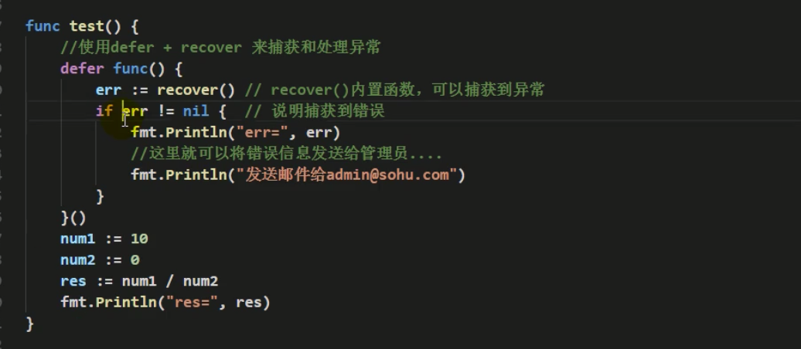
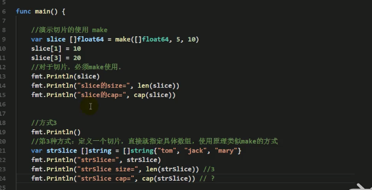
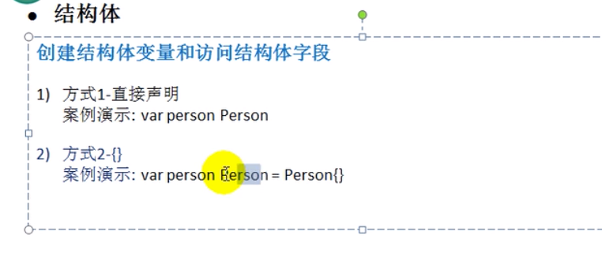
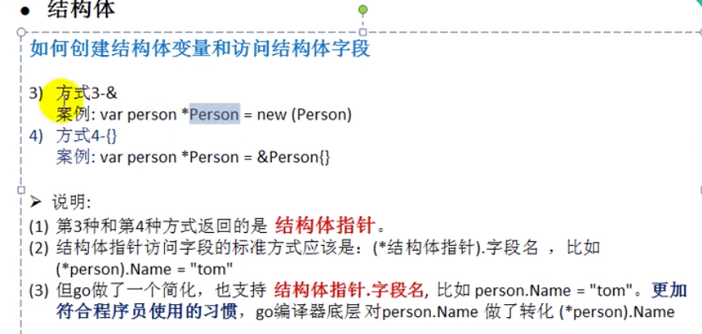
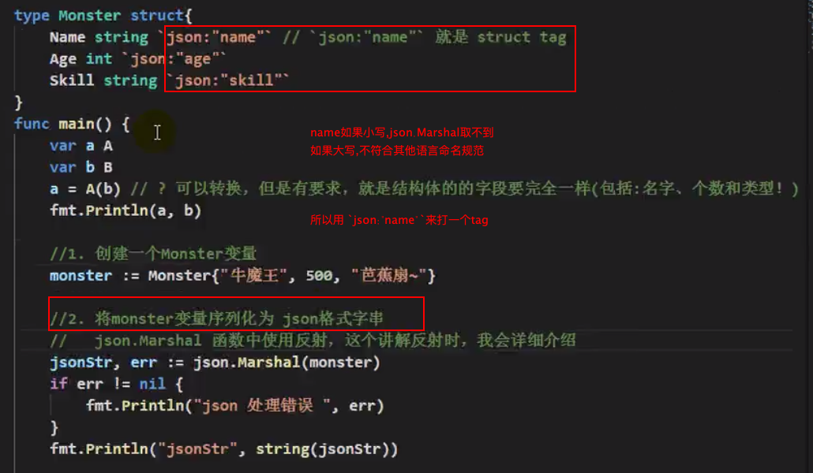
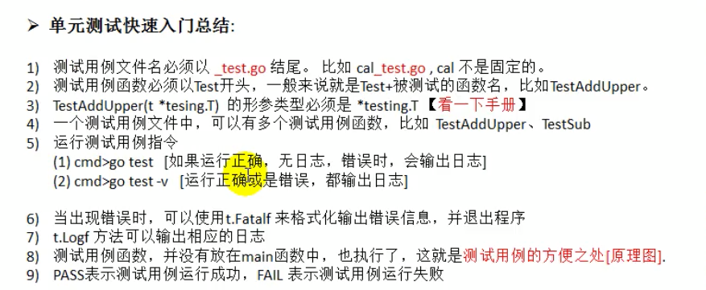
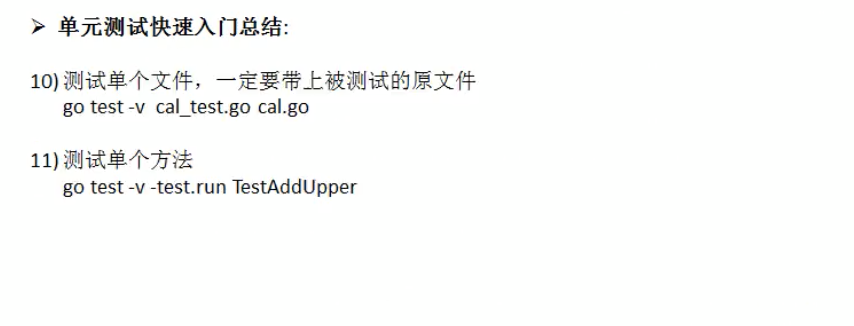
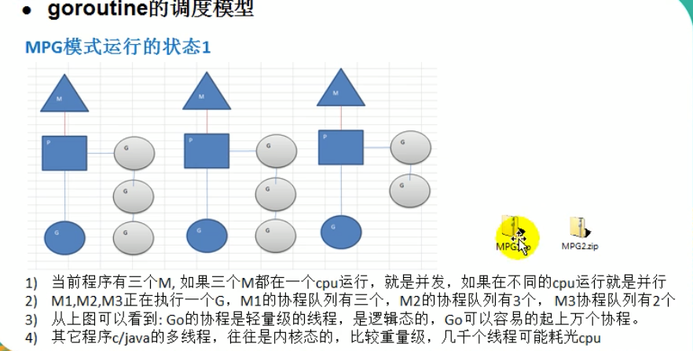
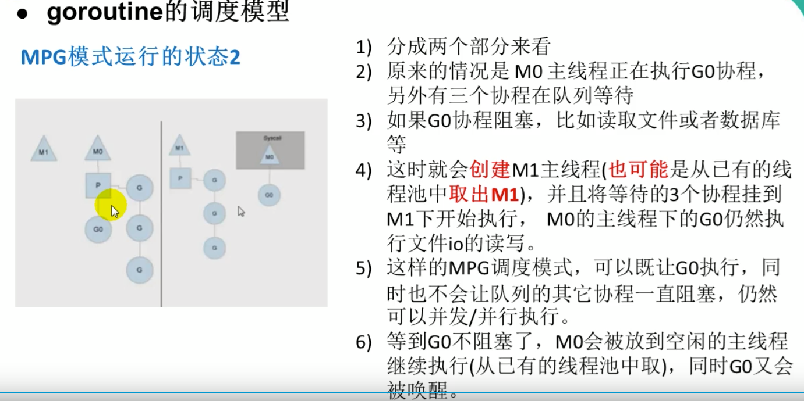

## 目录结构

https://blog.csdn.net/stpeace/article/details/82710969

goroot  是 go的sdk的安装目录

gopath是项目的存储路径,gopath下有src,pkg,bin

src下是源代码

pkg是执行`go install <import下的依赖包名字> `时,在pkg下生成一份main中依赖的包

bin是执行`go install main.go` 时,在bin下生成可执行文件main,同时在pkg中生成依赖的包文件


## make 和 new 的异同

二者都是内存的分配（堆上），但是make只用于slice、map以及channel的初始化（非零值）；而new用于类型的内存分配，并且内存置为零。所以在我们编写程序的时候，就可以根据自己的需要很好的选择了。

make返回的还是这三个引用类型本身；而new返回的是指向类型的指针。

### new
```
package main
import (
 "fmt"
)
func main() {
 var i *int
 *i=10
 fmt.Println(*i)
}
这个例子会打印出什么？0还是10?。以上全错，运行的时候会painc，原因如下：
```
panic: runtime error: invalid memory address or nil pointer dereference
从这个提示中可以看出，对于引用类型的变量，我们不光要声明它，还要为它分配内容空间，否则我们的值放在哪里去呢？这就是上面错误提示的原因。

对于值类型的声明不需要，是因为已经默认帮我们分配好了。

对于上面的问题我们如何解决呢？既然我们知道了没有为其分配内存，那么我们使用new分配一个吧。
```
func main() {
 var i *int
 i=new(int)
 *i=10
 fmt.Println(*i)
}
```
现在再运行程序，完美PASS，打印10。现在让我们看下new这个内置的函数。

// The new built-in function allocates memory. The first argument is a type,
// not a value, and the value returned is a pointer to a newly
// allocated zero value of that type.
func new(Type) *Type
它只接受一个参数，这个参数是一个类型，分配好内存后，返回一个指向该类型内存地址的指针。同时请注意它同时把分配的内存置为零，也就是类型的零值。

我们的例子中，如果没有*i=10，那么打印的就是0。这里体现不出来new函数这种内存置为零的好处，我们再看一个例子。
```
func main() {
 u:=new(user)
 u.lock.Lock()
 u.name = "张三"
 u.lock.Unlock()
 fmt.Println(u)
}
type user struct {
 lock sync.Mutex
 name string
 age int
}
```
示例中的user类型中的lock字段我不用初始化，直接可以拿来用，不会有无效内存引用异常，因为它已经被零值了。

这就是new，它返回的永远是类型的指针，指向分配类型的内存地址。

### make

make也是用于内存分配的，但是和new不同，它只用于chan、map以及切片的内存创建，而且它返回的类型就是这三个类型本身，而不是他们的指针类型，因为这三种类型就是引用类型，所以就没有必要返回他们的指针了。

注意，因为这三种类型是引用类型，所以必须得初始化，但是不是置为零值，这个和new是不一样的。

func make(t Type, size ...IntegerType) Type
从函数声明中可以看到，返回的还是该类型


# 基本语法

引入的包或者变量没有用到,编译无法通过

推荐使用行注释而不是快注释

go的每一个文件都属于一个包,go是用包来管理文件的

func的首字母大写类似于其他语言的public

导包的时候从src下面开始写 

build mian包的时候,其他的包会编译成.a文件,存放在pkg里面

切片

Go 数组的长度不可改变，在特定场景中这样的集合就不太适用，Go中提供了一种灵活，功能强悍的内置类型切片("动态数组"),与数组相比切片的长度是不固定的，可以追加元素，在追加时可能使切片的容量增大。

直接初始化切片，[]表示是切片类型，{1,2,3}初始化值依次是1,2,3.其cap=len=3


s := arr[:] 

初始化切片s,是数组arr的引用

断言:
```
value,ok: = a.(string)
if !ok{
    fmt.Println("不是string类型")
}
fmt.Println("值为",value)
```


# HTTP

golang 发送http请求:https://blog.csdn.net/iamlihongwei/article/details/78854899


# URL

URL 由多个部分组成。为了讲解，下面是一个比较复杂的 URL。

https://www.example.com:80/path/to/myfile.html?key1=value1&key2=value2#anchor

我们看看，这个 URL 的各个部分。

协议

协议（scheme）是浏览器请求服务器资源的方法，上例是https://的部分，表示使用 HTTPS 协议。

互联网支持多种协议，必须指明网址使用哪一种协议，默认是 HTTP 协议。也就是说，如果省略协议，直接在浏览器地址栏输入www.example.com，那么浏览器默认会访问http://www.example.com。HTTPS 是 HTTP 的加密版本，出于安全考虑，越来越多的网站使用这个协议。

HTTP 和 HTTPS 的协议名称后面，紧跟着一个冒号和两个斜杠（://）。其他协议不一定如此，邮件地址协议mailto:的协议名后面只有一个冒号，比如mailto:foo@example.com。

主机

主机（host）是资源所在的网站名或服务器的名字，又称为域名。上例的主机是www.example.com。

有些主机没有域名，只有 IP 地址，比如192.168.2.15。这种情况常常出现在局域网。

端口

同一个域名下面可能同时包含多个网站，它们之间通过端口（port）区分。“端口”就是一个整数，可以简单理解成，访问者告诉服务器，想要访问哪一个网站。默认端口是80，如果省略了这个参数，服务器就会返回80端口的网站。

端口紧跟在域名后面，两者之间使用冒号分隔，比如www.example.com:80。

路径

路径（path）是资源在网站的位置。比如，/path/index.html这个路径，指向网站的/path子目录下面的网页文件index.html。

互联网的早期，路径是真实存在的物理位置。现在由于服务器可以模拟这些位置，所以路径只是虚拟位置。

路径可能只包含目录，不包含文件名，比如/foo/，甚至结尾的斜杠都可以省略。这时，服务器通常会默认跳转到该目录里面的index.html文件（即等同于请求/foo/index.html），但也可能有其他的处理（比如列出目录里面的所有文件），这取决于服务器的设置。一般来说，访问www.example.com这个网址，很可能返回的是网页文件www.example.com/index.html。

查询参数

查询参数（parameter）是提供给服务器的额外信息。参数的位置是在路径后面，两者之间使用?分隔，上例是?key1=value1&key2=value2。

查询参数可以有一组或多组。每组参数都是键值对（key-value pair）的形式，同时具有键名(key)和键值(value)，它们之间使用等号（=）连接。比如，key1=value就是一个键值对，key1是键名，value1是键值。

多组参数之间使用&连接，比如key1=value1&key2=value2。

锚点

锚点（anchor）是网页内部的定位点，使用#加上锚点名称，放在网址的最后，比如#anchor。浏览器加载页面以后，会自动滚动到锚点所在的位置。

## 绝对url与相对url
资源存放的相对路径与绝对路径

# Curl

发送表单信息
发送表单信息有GET和POST两种方法。GET方法相对简单，只要把数据附在网址后面即可。
```
$ curl www.cnblogs.com/form.cgi?data=xxx
```
POST方法必须把数据和网址分开，curl就要用到–data参数。
```
$ curl -X POST --data "data=xxx" www.cnblogs.com/form.cgi

curl -X POST $robot_addr -d "{\"msgtype\":\"text\",\"text\":{\"content\":\"推荐索引构建告警：\n$content\"}"
```

# ASCII 与 Unicode 与 UTF-8

ASCII码
在学校学 C 语言的时候，了解到一些计算机内部的机制，知道所有的信息最终都表示为一个二进制的字符串，每一个二进制位有 0 和 1 两种状态，通过不同的排列组合，使用 0 和 1 就可以表示世界上所有的东西，感觉有点中国“太极”的感觉——“太极生两仪，两仪生四象，四象生八卦”。

在计算机种中，1 字节对应 8 位二进制数，而每位二进制数有 0、1 两种状态，因此 1 字节可以组合出 256 种状态。如果这 256 中状态每一个都对应一个符号，就能通过 1 字节的数据表示 256 个字符。美国人于是就制定了一套编码（其实就是个字典），描述英语中的字符和这 8 位二进制数的对应关系，这被称为 ASCII 码。

ASCII 码一共定义了 128 个字符，例如大写的字母 A 是 65（这是十进制数，对应二进制是0100 0001）。这 128 个字符只使用了 8 位二进制数中的后面 7 位，最前面的一位统一规定为 0。

历史问题
英语用 128 个字符来编码完全是足够的，但是用来表示其他语言，128 个字符是远远不够的。于是，一些欧洲的国家就决定，将 ASCII 码中闲置的最高位利用起来，这样一来就能表示 256 个字符。但是，这里又有了一个问题，那就是不同的国家的字符集可能不同，就算它们都能用 256 个字符表示全，但是同一个码点（也就是 8 位二进制数）表示的字符可能可能不同。例如，144 在阿拉伯人的 ASCII 码中是 گ，而在俄罗斯的 ASCII 码中是 ђ。

因此，ASCII 码的问题在于尽管所有人都在 0 - 127 号字符上达成了一致，但对于 128 - 255 号字符上却有很多种不同的解释。与此同时，亚洲语言有更多的字符需要被存储，一个字节已经不够用了。于是，人们开始使用两个字节来存储字符。

各种各样的编码方式成了系统开发者的噩梦，因为他们想把软件卖到国外。于是，他们提出了一个“内码表”的概念，可以切换到相应语言的一个内码表，这样才能显示相应语言的字母。在这种情况下，如果使用多语种，那么就需要频繁的在内码表内进行切换。

Unicode
最终，美国人意识到他们应该提出一种标准方案来展示世界上所有语言中的所有字符，出于这个目的，Unicode诞生了。

Unicode 当然是一本很厚的字典，记录着世界上所有字符对应的一个数字。具体是怎样的对应关系，又或者说是如何进行划分的，就不是我们考虑的问题了，我们只用知道 Unicode 给所有的字符指定了一个数字用来表示该字符。

对于 Unicode 有一些误解，它仅仅只是一个字符集，规定了符合对应的二进制代码，至于这个二进制代码如何存储则没有任何规定。它的想法很简单，就是为每个字符规定一个用来表示该字符的数字，仅此而已。

Unicode 编码方案
之前提到，Unicode 没有规定字符对应的二进制码如何存储。以汉字“汉”为例，它的 Unicode 码点是 0x6c49，对应的二进制数是 110110001001001，二进制数有 15 位，这也就说明了它至少需要 2 个字节来表示。可以想象，在 Unicode 字典中往后的字符可能就需要 3 个字节或者 4 个字节，甚至更多字节来表示了。

这就导致了一些问题，计算机怎么知道你这个 2 个字节表示的是一个字符，而不是分别表示两个字符呢？这里我们可能会想到，那就取个最大的，假如 Unicode 中最大的字符用 4 字节就可以表示了，那么我们就将所有的字符都用 4 个字节来表示，不够的就往前面补 0。这样确实可以解决编码问题，但是却造成了空间的极大浪费，如果是一个英文文档，那文件大小就大出了 3 倍，这显然是无法接受的。

于是，为了较好的解决 Unicode 的编码问题， UTF-8 和 UTF-16 两种当前比较流行的编码方式诞生了。当然还有一个 UTF-32 的编码方式，也就是上述那种定长编码，字符统一使用 4 个字节，虽然看似方便，但是却不如另外两种编码方式使用广泛。

UTF-8
UTF-8 是一个非常惊艳的编码方式，漂亮的实现了对 ASCII 码的向后兼容，以保证 Unicode 可以被大众接受。

UTF-8 是目前互联网上使用最广泛的一种 Unicode 编码方式，它的最大特点就是可变长。它可以使用 1 - 4 个字节表示一个字符，根据字符的不同变换长度。编码规则如下：

对于单个字节的字符，第一位设为 0，后面的 7 位对应这个字符的 Unicode 码点。因此，对于英文中的 0 - 127 号字符，与 ASCII 码完全相同。这意味着 ASCII 码那个年代的文档用 UTF-8 编码打开完全没有问题。

对于需要使用 N 个字节来表示的字符（N > 1），第一个字节的前 N 位都设为 1，第 N + 1 位设为0，剩余的 N - 1 个字节的前两位都设位 10，剩下的二进制位则使用这个字符的 Unicode 码点来填充。

<div align="center">  </div><br>

根据上面编码规则对照表，进行 UTF-8 编码和解码就简单多了。下面以汉字“汉”为利，具体说明如何进行 UTF-8 编码和解码。

“汉”的 Unicode 码点是 0x6c49（110 1100 0100 1001），通过上面的对照表可以发现，0x0000 6c49 位于第三行的范围，那么得出其格式为 1110xxxx 10xxxxxx 10xxxxxx。接着，从“汉”的二进制数最后一位开始，从后向前依次填充对应格式中的 x，多出的 x 用 0 补上。这样，就得到了“汉”的 UTF-8 编码为 11100110 10110001 10001001，转换成十六进制就是 0xE6 0xB7 0x89。

解码的过程也十分简单：如果一个字节的第一位是 0 ，则说明这个字节对应一个字符；如果一个字节的第一位1，那么连续有多少个 1，就表示该字符占用多少个字节。


<div align="center">  </div><br>
<div align="center">  </div><br>
<div align="center">  </div><br>
<div align="center">  </div><br>
<div align="center">  </div><br>
<div align="center">  </div><br>
<div align="center">  </div><br>
<div align="center">  </div><br>
<div align="center">  </div><br>
<div align="center">  </div><br>
<div align="center">  </div><br>


# iota的使用

https://www.jianshu.com/p/08d6a4216e96

# flag.Parse()
```go
import "fmt" 
 
var infile *string = flag.String("i", "infile", "File contains values for sorting") 
var outfile *string = flag.String("o", "outfile", "File to receive sorted values") 
var algorithm *string = flag.String("a", "qsort", "Sort algorithm") 
 
func main() {     
	flag.Parse() 
    if infile != nil {
		fmt.Println("infile =", *infile, "outfile =", *outfile, "algorithm =", *algorithm)
	}
}
```
flag.String()方法返回的是保存日后解析出来的对应参数的值的位置、位置、位置，是一个已经分配好的空间，我们可以用infile这个指针变量来接受这个位置，待日后重新进入main入口进呢人执行flag.Parse()函数之后，这3个位置上就出现了我们传入的参数（其实在程序初始化期就有默认值），可以使用*infile来访问具体的内容。


## 基本数据类型  

### 字符

### 字符串  

反引号

统一unicode

赋值后不可修改

### 基本数据的默认值

0  ""  和  flase

### 数据转换

不能编译器自动转换,要显示转换

var a int32 = int32(b);b的值转换成int32给了a,**但b本身的数据类型和值没有改变**

int8转换成int64 不报错,但按照溢出结果显示

### 基本数据类型和string的转化
方法一  使用fmt
```
用Sprintf转换
var a int32 = 13
var b float32 = 12.222 
fmt.Sprintf("%d",a)
fmt.Sprintf("%f",b)
```

方法二  strconv类

### string  转基本数据类型

strconv.ParseInt/Bool

前提是string有效 不能是"hello"之类的非数字字符串

## 闭包 

函数引用的参数和 函数本身构成闭包

## defer

## string 常用函数
包括字符串操作,int类型和进制的转换

## 时间类

time.Now()

Format的20060102的知识

时间单位  time.Second  time.MillionSecond


## 错误处理机制  

errors.New("错误信息")

panic()  接受interface{}类型的参数,可以接受error类型变量,输出错误信息,并**退出程序**

recover(),用defer压栈 可以捕获异常,见下图

<div align="center">  </div><br>

## 数组

var array [2]int = [2]int {1,2}

array:=[...]int{1,2,3,4}

数组的内存是连续存放的 

遍历用 for index,value:= range array{}

### 数组注意的细节

1) 数组是多个相同类型数据的组合,一个数组一旦声明/定义了,其长度是固定的, 不能动态变化

2)var arr []int 这时 arr 就是一个 slice 切片

1) 数组中的元素可以是任何数据类型，包括值类型和引用类型，但是不能混用。 

2) 数组创建后，如果没有赋值，有默认值(零值)
数值类型数组:默认值为 0 字符串数组: 默认值为 "" bool 数组: 默认值为 false

1) 数组下标必须在指定范围内使用，否则报 panic:数组越界，比如 var arr [5]int 则有效下标为 0-4

2) **Go的数组属值类型，在默认情况下是值传递，因此会进行值拷贝。数组间不会相互影响**

3) 如想在其它函数中，去修改原来的数组，可以使用引用传递(指针方式)

4)  长度是数组类型的一部分，在传递函数参数时 需要考虑数组的长度


## 切片


切片

Go 数组的长度不可改变，在特定场景中这样的集合就不太适用，Go中提供了一种灵活，功能强悍的内置类型切片("动态数组"),与数组相比切片的长度是不固定的，可以追加元素，在追加时可能使切片的容量增大。

直接初始化切片，[]表示是切片类型，{1,2,3}初始化值依次是1,2,3.其cap=len=3


s := arr[:] 

初始化切片s,是数组arr的引用


切片的长度是可以变化的，因此切片是一个可以动态变化数组。

切片定义的基本语法:
  var 切片名 []类型 比如:var a [] int

slice 是一个引用类型

slice 从底层来说，其实就是一个数据结构(struct 结构体) 
```
type slice struct {
ptr *[2]int 
len int 
cap int
}
```

### 切片的三种定义方式
定义一个切片,然后定义一个数组,并把数组的一部分分给切片

make  指定大小和容量,底层管理数组

定义切片的时候直接 初始化一个数组

<div align="center">  </div><br>

append()  底层创建一个新的数组,对原数组进行拷贝

切片是引用类型,遵循引用的规律

切片由大传小的时候不会报错,而是把对应位置的赋值过去

string 是一个底层数组是byte的切片,可以使用相关的切片功能,但是string是不可修改的,可以先转换成byte数组,修改,再转换成string

## map


声明不会赋值,make的时候分配了内存空间,才能赋值和使用
声明方式1:  
var m map[string] string  
m = make(map[string]string,10)  

声明方式2

var m = make(map[string]string,10)

声明方式3

var m map[string][string] = map[string]string{"no1":"sx"}

### map的 curd

m["no1"]="zyc"

delete (m,"no1")

批量删除: make一个新空间

### map的遍历

没啥难度,用到再查

### map切片

一个切片,每一个下标的内容都是一个逻辑实体的几个key,value ;比如:
[妖怪一: 年龄:13 名字:sx][妖怪二:  年龄:18  名字:lll]

好处是可以让key,value对用append()动态增长;并且每一个下标内容都可以代表一个逻辑实体

```
var sm []map[string]string = []map[string]string  
sm[0] = make(map[string]string){"年龄":"12","名字":"sx"}
m2 = make(map[string]string){"年龄":"18","名字":"lll"}
sm.append(m2)
```


## go语言的面向对象

去除了继承,重载,构造函数,析构函数,隐藏this指针

go的类是 struct,继承通过匿名字段来实现,

go语言其实是面向接口编程 


## 结构体
结构体类型是值类型,拷贝的时候是值拷贝,p2=p1的时候 p1的空间会被拷贝一份;如果修改p1的内容,p2内容不变,

如果 var p2 *Person = &p1 这个时候拷贝的不再是内存,而是空间地址,p1,p2指向的是同一个对象


go语言中,指向结构体实例的变量,是一个引用类型;有的语言是指针类型,比如 : 
cat1:= struct{},cat1是一个引用类型
 
<div align="center">  </div><br>
<div align="center">  </div><br>

结构体内存是连续的

结构体的tag标签
<div align="center">  </div><br>

## 方法 

### 需要方法的原因

Go 不是纯粹的面向对象编程语言，而且Go不支持类。因此，基于类型的方法是一种实现和类相似行为的途径。

相同的名字的方法可以定义在不同的类型上，而相同名字的函数是不被允许的。假设我们有一个 Square 和 Circle 结构体。可以在 Square 和 Circle 上分别定义一个 Area 方法。

### 方法的传值与传地址

在func与方法名之间,可以使用指针接收器与值接收器,该方法就可以使用结构体的字段

一般来说，指针接收器可以使用在：对方法内部的接收器所做的改变应该对调用者可见时。

指针接收器也可以被使用在如下场景：当拷贝一个结构体的代价过于昂贵时。考虑下一个结构体有很多的字段。在方法内使用这个结构体做为值接收器需要拷贝整个结构体，这是很昂贵的。在这种情况下使用指针接收器，结构体不会被拷贝，只会传递一个指针到方法内部使用。

在其他的所有情况，值接收器都可以被使用。


区分func后面是传值还是传地址
```go
//对于方法（如struct的方法），
//接收者为值类型时，可以直接用指针类型的变量调用方法，反过来同样也可以

func (p Person) test03() {
	p.Name = "jack"
	fmt.Println("test03() =", p.Name) // jack
}

func (p *Person) test04() {
	p.Name = "mary"
	fmt.Println("test03() =", p.Name) // mary
}

func main() {

	p := Person{"tom"}
	test01(p)
	test02(&p)

	p.test03()
	fmt.Println("main() p.name=", p.Name) // tom
	
	(&p).test03() // 从形式上是传入地址，但是本质仍然是值拷贝

	fmt.Println("main() p.name=", p.Name) // tom


	(&p).test04()
	fmt.Println("main() p.name=", p.Name) // mary
	p.test04() // 等价 (&p).test04 , 从形式上是传入值类型，但是本质仍然是地址拷贝

}
```
## 工厂模式代替构造函数


## 断言:
```
value,ok: = a.(string)
if !ok{
    fmt.Println("不是string类型")
}
fmt.Println("值为",value)
```

## 时区对应表:

```
月份 1,01,Jan,January
日　 2,02,_2
时　 3,03,15,PM,pm,AM,am
分　 4,04
秒　 5,05
年　 06,2006
时区 -07,-0700,Z0700,Z07:00,-07:00,MST
周几 Mon,Monday
```
```
format := time.Now().Format("2006年01月15时 时区MST")
fmt.Println(format)
```

## 匿名字段

go通过匿名来实现继承

当匿名字段是一个struct的时候，那么这个struct所拥有的全部字段,方法,无论大写小写都可以被使用

可以使用简化访问   A继承了B   a.b.name  可以简化为  a.name 

如果继承了多个结构体,有相同的字段,则不能用简化的方式

## 接口 

接口不包含变量,但是可以包含接口(继承)

go中没有implements关键字,只要一个变量包含了接口的所有方法,就说实现了该方法

自定义数据类型 和  结构体都可以实现接口

一个类型需要把接口所有的方法都实现

A接口继承了B C接口  ,如果要实现A接口,那BC接口的方法也要实现

接口是一个指针(引用类型),所以如果不初始化就使用,会返回nil


## 结构体初始化

rect1 := new(Rect)

rect3 := &Rect{0, 0, 100, 200}

rect4 := &Rect{width:100, height:200}

rect2 := &Rect{}

```
注意以上四个全部为指向Rect结构的指针(指针变量)，因为使用了new()函数和&操作符,指针有了值之后,它输出的就是指针所指向值得类型．

a := Rect{}则表示这个是一个Rect{}类型的指针

输出类型%T时候的区别:

*main.Rect()  //前四个

main.Rect
```


## flag解析命令行参数

``` go

func main() {

	//定义几个变量，用于接收命令行的参数值
	var user string
	var pwd string
	var host string
	var port int

	//&user 就是接收用户命令行中输入的 -u 后面的参数值
	//"u" ,就是 -u 指定参数
	//"" , 默认值
	//"用户名,默认为空" 说明
	flag.StringVar(&user, "u", "", "用户名,默认为空")
	flag.StringVar(&pwd, "pwd", "", "密码,默认为空")
	flag.StringVar(&host, "h", "localhost", "主机名,默认为localhost")
	flag.IntVar(&port, "port", 3306, "端口号，默认为3306")
	//这里有一个非常重要的操作,转换， 必须调用该方法
	flag.Parse()

	//输出结果
	fmt.Printf("user=%v pwd=%v host=%v port=%v", 
		user, pwd, host, port)

}
```

## 序列化与反序列化 

序列化
```go
	//将monster 序列化
	data, err := json.Marshal(&monster) //..
	if err != nil {
		fmt.Printf("序列号错误 err=%v\n", err)
	}
	//输出序列化后的结果
	fmt.Printf("monster序列化后=%v\n", string(data))
```

反序列化

```go

//演示将json字符串，反序列化成map
func unmarshalMap() {
	//str := "{\"address\":\"洪崖洞\",\"age\":30,\"name\":\"红孩儿\"}"
	str := testMap()
	//定义一个map
	var a map[string]interface{} 

	//反序列化
	//注意：反序列化map,不需要make,因为make操作被封装到 Unmarshal函数
	//传入的是引用传递,只有引用传递才会改变函数外面的a的值
	err := json.Unmarshal([]byte(str), &a)
	if err != nil {
		fmt.Printf("unmarshal err=%v\n", err)
	}
	fmt.Printf("反序列化后 a=%v\n", a)

}
```

## 单元测试


<div align="center">  </div><br>

<div align="center">  </div><br>


## 协程(goroutine)

go的主线程(进程级别)内,可以开启多个协程(编译器级别优化,轻量级的线程)

协程特点:  
有独立的栈空间  
共享程序堆内存  
调度由用户控制  
协程是轻量级的线程  


协程的资源消耗要小于线程,这是go语言的在并发上的巨大优势.线程等于堆资源+栈 ,协程是多个协程存储在一个线程中,协程的堆资源在线程中,栈资源用线程的堆来保存.所以多个协程可以在一个线程里面运行.


MPG模式   

m是主线程,p是上下文,g是协程
<div align="center">  </div><br>

<div align="center">  </div><br>

## 管道

先进先出,线程安全,存储类型统一

管道关闭后,只可读,不可写

遍历用for-range,遍历的前提是管道关闭,不然报错

```go
管道使用实例


//演示一下管道的使用
//1. 创建一个可以存放3个int类型的管道
var intChan chan int
intChan = make(chan int, 3)
//2. 看看intChan是什么
fmt.Printf("intChan 的值=%v intChan本身的地址=%p\n", intChan, &intChan)
//3. 向管道写入数据
intChan<- 10
num := 211
intChan<- num
intChan<- 50
// //如果从channel取出数据后，可以继续放入
<-intChan
intChan<- 98//注意点, 当我们给管写入数据时，不能超过其容量
//4. 看看管道的长度和cap(容量)
fmt.Printf("channel len= %v cap=%v \n", len(intChan), cap(intChan)) // 3, 3
//5. 从管道中读取数据
var num2 int
num2 = <-intChan 
fmt.Println("num2=", num2)
fmt.Printf("channel len= %v cap=%v \n", len(intChan), cap(intChan))  // 2, 3


管道的遍历
for v:=range intChan{
	fmt.Println(v)
}
```


管道读写的实例
```go

//write Data
func writeData(intChan chan int) {
	for i := 1; i <= 50; i++ {
		//放入数据
		intChan<- i //
		fmt.Println("writeData ", i)
		//time.Sleep(time.Second)
	}
	close(intChan) //关闭
}

//read data
func readData(intChan chan int, exitChan chan bool) {

	for {
		v, ok := <-intChan
		if !ok {
			break
		}
		time.Sleep(time.Second)
		fmt.Printf("readData 读到数据=%v\n", v) 
	}
	//readData 读取完数据后，即任务完成
	exitChan<- true
	close(exitChan)

}

func main() {

	//创建两个管道
	intChan := make(chan int, 10)
	exitChan := make(chan bool, 1)
	
	go writeData(intChan)
	go readData(intChan, exitChan)

	//time.Sleep(time.Second * 10)
	//exitChan存在的意义是为了防止主线程main的退出,要等到readData读完之后再退出
	for {
		_, ok := <-exitChan
		if !ok {
			break
		}
	}

}
```
### 只读只写的chan
var chan1 <-chan int

var chan2 chan<- int

### select解决一个协程本可以读三个channel却在一个channel上阻塞的问题

```go
package main
import (
	"fmt"
	"time"
)

func main() {

	//使用select可以解决从管道取数据的阻塞问题

	//1.定义一个管道 10个数据int
	intChan := make(chan int, 10)
	for i := 0; i < 10; i++ {
		intChan<- i
	}
	//2.定义一个管道 5个数据string
	stringChan := make(chan string, 5)
	for i := 0; i < 5; i++ {
		stringChan <- "hello" + fmt.Sprintf("%d", i)
	}

	//传统的方法在遍历管道时，如果不关闭会阻塞而导致 deadlock

	//问题，在实际开发中，可能我们不好确定什么关闭该管道.
	//可以使用select 方式可以解决
	//label:
	for {
		select {
			//注意: 这里，如果intChan一直没有关闭，不会一直阻塞而deadlock
			//，会自动到下一个case匹配
			case v := <-intChan : 
				fmt.Printf("从intChan读取的数据%d\n", v)
				time.Sleep(time.Second)
			case v := <-stringChan :
				fmt.Printf("从stringChan读取的数据%s\n", v)
				time.Sleep(time.Second)
			default :
				fmt.Printf("都取不到了，不玩了, 程序员可以加入逻辑\n")
				time.Sleep(time.Second)
				return 
				//break label
		}
	}
}
```

goroutine(协程)中使用recover,来解决协程中出现panic的问题,导致程序崩溃.使用了recover之后,出错协程的异常被捕获,主线程不受影响
```go

//函数
func sayHello() {
	for i := 0; i < 10; i++ {
		time.Sleep(time.Second)
		fmt.Println("hello,world")
	}
}
//函数
func test() {
	//这里我们可以使用defer + recover
	defer func() {
		//捕获test抛出的panic
		if err := recover(); err != nil {
			fmt.Println("test() 发生错误", err)
		}
	}()
	//定义了一个map,这里有error
	var myMap map[int]string
	myMap[0] = "golang" //error
}

func main() {

	go sayHello()
	go test()


	for i := 0; i < 10; i++ {
		fmt.Println("main() ok=", i)
		time.Sleep(time.Second)
	}

}
```
## 反射


## 网络编程

### tcp socket编程,比如qq聊天

### http编程,比如web开发

## 匿名函数

defer的调用解读

```go
defer func() {
	 fmt.Println(“Hello，world”) 
}()

可以看成

func aa() { 
    fmt.Println("Hello，world")
}

func main() {

    defer aa()
}
```

## go modules

### go mod init example.com/hello

go.mod 文件只存在于模块的根目录中。模块子目录的代码包的导入路径等于模块根目录的导入路径（就是前面说的 module path）加上子目录的相对路径。比如，我们如果创建了一个子目录叫 world，我们不需要（也不会想要）在子目录里面再运行一次 go mod init 了，这个代码包会被认为就是 example.com/hello 模块的一部分，而这个代码包的导入路径就是 example.com/hello/world。

### import与gomod的细节
当我们imort一个包的时候, go.mod 文件里面又没有指定这个包的时候，go 命令行工具会自动寻找包含这个代码包的模块的最新版本，并添加到 go.mod 中（这里的 " 最新 " 指的是：它是最近一次被 tag 的稳定版本（即非预发布版本，non-prerelease），如果没有，则是最近一次被 tag 的预发布版本，如果没有，则是最新的没有被 tag 过的版本）。


比如，go新导入的 rsc.io/quote 包解析为 rec.io/quote v1.5.2模块:
```go
package hello
 
import "rsc.io/quote"
 
func Hello() string {
    return quote.Hello()

```

它还会下载 rsc.io/quote 模块依赖的两个依赖项。即 rsc.io/sampler 和 golang.org/x/text。但是只有直接依赖会记录在 go.mod 文件里面：


### go list -m all

在上述 go list 命令的输出中，当前的模块，又称为主模块 (main module)，永远都在第一行，接着是主模块的依赖项，以依赖项的 module path 排序。

### 包的版本号

一个语义化版本号包括三个部分：主版本号（major）、次版本号（minor）、修订号（patch）。举个例子：对于版本 v0.1.2，主版本号是 0，次版本号是 1，修订号是 2。我们先来过一遍更新某个模块的次版本号的流程。

#### 更改某个依赖包的版本号
```
go get rsc.io/sampler@v1.3.1

```

### 常用命令
```
go mod init 创建了一个新的模块，初始化 go.mod 文件并且生成相应的描述
go build, go test 和其它构建代码包的命令，会在需要的时候在 go.mod 文件中添加新的依赖项
go list -m all 列出了当前模块所有的依赖项
go get 修改指定依赖项的版本（或者添加一个新的依赖项）
go mod tidy 移除模块中没有用到的依赖项。
```


## 导入包的知识点

1. 点操作
我们有时候会看到如下的方式导入包
import(
. "fmt"
)
这个点操作的含义就是这个包导入之后在你调用这个包的函数时，你可以省略前缀的包名，也就是前面你调
用的fmt.Println("hello world")可以省略的写成Println("hello world")
2. 别名操作
别名操作顾名思义我们可以把包命名成另一个我们用起来容易记忆的名字
import(
f "fmt"
)
别名操作的话调用包函数时前缀变成了我们的前缀，即f.Println("hello world")
3. _操作
这个操作经常是让很多人费解的一个操作符，请看下面这个import
import (
"database/sql"
_ "github.com/ziutek/mymysql/godrv"
)
_操作其实是引入该包，而不直接使用包里面的函数，而是调用了该包里面的init函数。


<div align="center">  </div><br>
<div align="center">  </div><br>
<div align="center">  </div><br>
<div align="center">  </div><br>
<div align="center">  </div><br>
<div align="center">  </div><br>
<div align="center">  </div><br>
<div align="center">  </div><br>
<div align="center">  </div><br>
<div align="center">  </div><br>
<div align="center">  </div><br>
<div align="center">  </div><br>
<div align="center">  </div><br>
<div align="center">  </div><br>
<div align="center">  </div><br>
<div align="center">  </div><br>
<div align="center">  </div><br>
<div align="center">  </div><br>
<div align="center">  </div><br>
<div align="center">  </div><br>
<div align="center">  </div><br>
<div align="center">  </div><br>
<div align="center">  </div><br>
