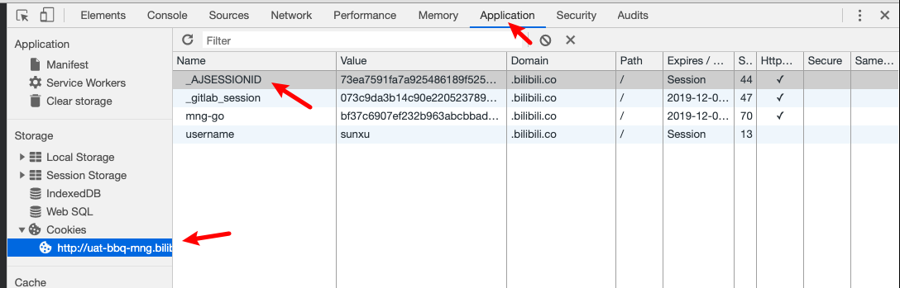

<!-- TOC -->

- [1. 一 、基础概念](#1-%e4%b8%80-%e5%9f%ba%e7%a1%80%e6%a6%82%e5%bf%b5)
  - [1.1. 简介](#11-%e7%ae%80%e4%bb%8b)
  - [1.2. 工作原理](#12-%e5%b7%a5%e4%bd%9c%e5%8e%9f%e7%90%86)
  - [1.3. 特点](#13-%e7%89%b9%e7%82%b9)
- [2. 知识结构(接下来几章将按照本章顺序详细介绍各个知识点)](#2-%e7%9f%a5%e8%af%86%e7%bb%93%e6%9e%84%e6%8e%a5%e4%b8%8b%e6%9d%a5%e5%87%a0%e7%ab%a0%e5%b0%86%e6%8c%89%e7%85%a7%e6%9c%ac%e7%ab%a0%e9%a1%ba%e5%ba%8f%e8%af%a6%e7%bb%86%e4%bb%8b%e7%bb%8d%e5%90%84%e4%b8%aa%e7%9f%a5%e8%af%86%e7%82%b9)
  - [2.1. 请求报文(分为请求行,请求头,请求体)](#21-%e8%af%b7%e6%b1%82%e6%8a%a5%e6%96%87%e5%88%86%e4%b8%ba%e8%af%b7%e6%b1%82%e8%a1%8c%e8%af%b7%e6%b1%82%e5%a4%b4%e8%af%b7%e6%b1%82%e4%bd%93)
    - [2.1.1. 请求行(分为请求方法,URL,请求协议)](#211-%e8%af%b7%e6%b1%82%e8%a1%8c%e5%88%86%e4%b8%ba%e8%af%b7%e6%b1%82%e6%96%b9%e6%b3%95url%e8%af%b7%e6%b1%82%e5%8d%8f%e8%ae%ae)
    - [2.1.2. 请求头(重要属性,比如content-type)](#212-%e8%af%b7%e6%b1%82%e5%a4%b4%e9%87%8d%e8%a6%81%e5%b1%9e%e6%80%a7%e6%af%94%e5%a6%82content-type)
    - [2.1.3. 请求体](#213-%e8%af%b7%e6%b1%82%e4%bd%93)
  - [2.2. 响应报文](#22-%e5%93%8d%e5%ba%94%e6%8a%a5%e6%96%87)
- [3. HTTP 方法](#3-http-%e6%96%b9%e6%b3%95)
  - [3.1. GET](#31-get)
  - [3.2. HEAD](#32-head)
  - [3.3. POST](#33-post)
  - [3.4. PUT](#34-put)
  - [3.5. PATCH](#35-patch)
  - [3.6. DELETE](#36-delete)
  - [3.7. OPTIONS](#37-options)
  - [3.8. CONNECT](#38-connect)
  - [3.9. TRACE](#39-trace)
- [4.GET 和 POST 比较](#4get-%e5%92%8c-post-%e6%af%94%e8%be%83)
  - [4.1. 作用](#41-%e4%bd%9c%e7%94%a8)
  - [4.2. 参数](#42-%e5%8f%82%e6%95%b0)
  - [4.3. 安全](#43-%e5%ae%89%e5%85%a8)
  - [4.4. 幂等性](#44-%e5%b9%82%e7%ad%89%e6%80%a7)
  - [4.5. 可缓存](#45-%e5%8f%af%e7%bc%93%e5%ad%98)
  - [4.6. XMLHttpRequest](#46-xmlhttprequest)
  - [4.7. TCP底层的区别](#47-tcp%e5%ba%95%e5%b1%82%e7%9a%84%e5%8c%ba%e5%88%ab)
- [5. URI](#5-uri)
- [6. HTTP/2.0](#6-http20)
  - [6.1. HTTP/1.x 缺陷](#61-http1x-%e7%bc%ba%e9%99%b7)
  - [6.2. 二进制分帧层](#62-%e4%ba%8c%e8%bf%9b%e5%88%b6%e5%88%86%e5%b8%a7%e5%b1%82)
  - [6.3. 服务端推送](#63-%e6%9c%8d%e5%8a%a1%e7%ab%af%e6%8e%a8%e9%80%81)
  - [6.4. 首部压缩](#64-%e9%a6%96%e9%83%a8%e5%8e%8b%e7%bc%a9)
  - [6.5. HTTP/1.1 新特性](#65-http11-%e6%96%b0%e7%89%b9%e6%80%a7)
- [7. HTTP 首部](#7-http-%e9%a6%96%e9%83%a8)
  - [7.1. 通用首部字段](#71-%e9%80%9a%e7%94%a8%e9%a6%96%e9%83%a8%e5%ad%97%e6%ae%b5)
  - [7.2. 请求首部字段](#72-%e8%af%b7%e6%b1%82%e9%a6%96%e9%83%a8%e5%ad%97%e6%ae%b5)
  - [7.3. 响应首部字段](#73-%e5%93%8d%e5%ba%94%e9%a6%96%e9%83%a8%e5%ad%97%e6%ae%b5)
  - [7.4. 实体首部字段](#74-%e5%ae%9e%e4%bd%93%e9%a6%96%e9%83%a8%e5%ad%97%e6%ae%b5)
- [8. 响应状态码](#8-%e5%93%8d%e5%ba%94%e7%8a%b6%e6%80%81%e7%a0%81)
  - [8.1. XX 信息](#81-xx-%e4%bf%a1%e6%81%af)
  - [8.2. XX 成功](#82-xx-%e6%88%90%e5%8a%9f)
  - [8.3. XX 重定向](#83-xx-%e9%87%8d%e5%ae%9a%e5%90%91)
  - [8.4. XX 客户端错误](#84-xx-%e5%ae%a2%e6%88%b7%e7%ab%af%e9%94%99%e8%af%af)
  - [8.5. XX 服务器错误](#85-xx-%e6%9c%8d%e5%8a%a1%e5%99%a8%e9%94%99%e8%af%af)
- [9. 具体应用](#9-%e5%85%b7%e4%bd%93%e5%ba%94%e7%94%a8)
  - [9.1. 连接管理](#91-%e8%bf%9e%e6%8e%a5%e7%ae%a1%e7%90%86)
    - [9.1.1. 短连接与长连接](#911-%e7%9f%ad%e8%bf%9e%e6%8e%a5%e4%b8%8e%e9%95%bf%e8%bf%9e%e6%8e%a5)
    - [9.1.2. 流水线](#912-%e6%b5%81%e6%b0%b4%e7%ba%bf)
  - [9.2. Cookie](#92-cookie)
    - [9.2.1. 用途](#921-%e7%94%a8%e9%80%94)
    - [cookie的获取,通过postman来模拟前端请求](#cookie%e7%9a%84%e8%8e%b7%e5%8f%96%e9%80%9a%e8%bf%87postman%e6%9d%a5%e6%a8%a1%e6%8b%9f%e5%89%8d%e7%ab%af%e8%af%b7%e6%b1%82)
    - [9.2.2. 创建过程](#922-%e5%88%9b%e5%bb%ba%e8%bf%87%e7%a8%8b)
    - [9.2.3. 分类](#923-%e5%88%86%e7%b1%bb)
    - [9.2.4. 作用域](#924-%e4%bd%9c%e7%94%a8%e5%9f%9f)
    - [9.2.5. JavaScript](#925-javascript)
    - [9.2.6. HttpOnly](#926-httponly)
    - [9.2.7. Secure](#927-secure)
    - [9.2.8. Session](#928-session)
    - [9.2.9. 浏览器禁用 Cookie](#929-%e6%b5%8f%e8%a7%88%e5%99%a8%e7%a6%81%e7%94%a8-cookie)
    - [9.2.10. Cookie 与 Session 选择](#9210-cookie-%e4%b8%8e-session-%e9%80%89%e6%8b%a9)
  - [9.3. 缓存](#93-%e7%bc%93%e5%ad%98)
    - [9.3.1. 优点](#931-%e4%bc%98%e7%82%b9)
    - [9.3.2. 实现方法](#932-%e5%ae%9e%e7%8e%b0%e6%96%b9%e6%b3%95)
    - [9.3.3. Cache-Control](#933-cache-control)
    - [9.3.4. 缓存验证](#934-%e7%bc%93%e5%ad%98%e9%aa%8c%e8%af%81)
  - [9.4. 内容协商](#94-%e5%86%85%e5%ae%b9%e5%8d%8f%e5%95%86)
    - [9.4.1. 类型](#941-%e7%b1%bb%e5%9e%8b)
    - [9.4.2. Vary](#942-vary)
  - [9.5. 内容编码](#95-%e5%86%85%e5%ae%b9%e7%bc%96%e7%a0%81)
  - [9.6. 范围请求](#96-%e8%8c%83%e5%9b%b4%e8%af%b7%e6%b1%82)
    - [9.6.1. Range](#961-range)
    - [9.6.2. Accept-Ranges](#962-accept-ranges)
    - [9.6.3. 响应状态码](#963-%e5%93%8d%e5%ba%94%e7%8a%b6%e6%80%81%e7%a0%81)
  - [9.7. 分块传输编码](#97-%e5%88%86%e5%9d%97%e4%bc%a0%e8%be%93%e7%bc%96%e7%a0%81)
  - [9.8. 多部分对象集合](#98-%e5%a4%9a%e9%83%a8%e5%88%86%e5%af%b9%e8%b1%a1%e9%9b%86%e5%90%88)
  - [9.9. 虚拟主机](#99-%e8%99%9a%e6%8b%9f%e4%b8%bb%e6%9c%ba)
  - [9.10. 通信数据转发](#910-%e9%80%9a%e4%bf%a1%e6%95%b0%e6%8d%ae%e8%bd%ac%e5%8f%91)
    - [9.10.1. 代理](#9101-%e4%bb%a3%e7%90%86)
    - [9.10.2. 网关](#9102-%e7%bd%91%e5%85%b3)
    - [9.10.3. 隧道](#9103-%e9%9a%a7%e9%81%93)
- [10. HTTPS](#10-https)
  - [10.1. 加密](#101-%e5%8a%a0%e5%af%86)
    - [10.1.1. 对称密钥加密](#1011-%e5%af%b9%e7%a7%b0%e5%af%86%e9%92%a5%e5%8a%a0%e5%af%86)
    - [10.1.2. 非对称密钥加密](#1012-%e9%9d%9e%e5%af%b9%e7%a7%b0%e5%af%86%e9%92%a5%e5%8a%a0%e5%af%86)
    - [10.1.3. HTTPS 采用的加密方式](#1013-https-%e9%87%87%e7%94%a8%e7%9a%84%e5%8a%a0%e5%af%86%e6%96%b9%e5%bc%8f)
  - [10.2. 认证](#102-%e8%ae%a4%e8%af%81)
  - [10.3. 完整性保护](#103-%e5%ae%8c%e6%95%b4%e6%80%a7%e4%bf%9d%e6%8a%a4)
  - [10.4. HTTPS 的缺点](#104-https-%e7%9a%84%e7%bc%ba%e7%82%b9)

<!-- /TOC -->

# 1. 一 、基础概念
## 1.1. 简介

HTTP协议是Hyper Text Transfer Protocol（超文本传输协议）的缩写,是用于从万维网（WWW:World Wide Web ）服务器传输超文本到本地浏览器的传送协议

HTTP是一个基于TCP/IP通信协议来传递数据（HTML 文件, 图片文件, 查询结果等）。


## 1.2. 工作原理
HTTP协议工作于客户端-服务端架构上。浏览器作为HTTP客户端通过URL向HTTP服务端即WEB服务器发送所有请求。

Web服务器有：Apache服务器，IIS服务器（Internet Information Services）等。

Web服务器根据接收到的请求后，向客户端发送响应信息。

HTTP默认端口号为80，但是你也可以改为8080或者其他端口。

## 1.3. 特点
HTTP是无连接：无连接的含义是限制每次连接只处理一个请求。服务器处理完客户的请求，并收到客户的应答后，即断开连接。采用这种方式可以节省传输时间。

HTTP是媒体独立的：这意味着，只要客户端和服务器知道如何处理的数据内容，任何类型的数据都可以通过HTTP发送。客户端以及服务器指定使用适合的MIME-type内容类型。

HTTP是无状态：HTTP协议是无状态协议。无状态是指协议对于事务处理没有记忆能力。缺少状态意味着如果后续处理需要前面的信息，则它必须重传，这样可能导致每次连接传送的数据量增大。另一方面，在服务器不需要先前信息时它的应答就较快。

# 2. 知识结构(接下来几章将按照本章顺序详细介绍各个知识点)

## 2.1. 请求报文(分为请求行,请求头,请求体)

<div align="center">  </div><br>

### 2.1.1. 请求行(分为请求方法,URL,请求协议)
请求方法，HTTP/1.1 定义的请求方法有8种：GET、POST、PUT、DELETE、PATCH、HEAD、OPTIONS、TRACE,最常的两种GET和POST，如果是RESTful接口的话一般会用到GET、POST、DELETE、PUT。

请求对应的URL地址，它和报文头的Host属性组成完整的请求URL

协议名称及版本号。


### 2.1.2. 请求头(重要属性,比如content-type)
HTTP的报文头，报文头包含若干个属性，格式为“属性名:属性值”，服务端据此获取客户端的信息。

其中一些重要的属性:  
Content-Type 决定了请求体的格式,常用的有application/json

### 2.1.3. 请求体
报文体，它将一个页面表单中的组件值通过param1=value1&param2=value2的键值对形式编码成一个格式化串，它承载多个请求参数的数据。不但报文体可以传递请求参数，请求URL也可以通过类似于“/chapter15/user.html? param1=value1&param2=value2”的方式传递请求参数。

## 2.2. 响应报文

<div align="center">  </div><br>


# 3. HTTP 方法

客户端发送的  **请求报文**  第一行为请求行，包含了方法字段。

## 3.1. GET

> 获取资源

当前网络请求中，绝大部分使用的是 GET 方法。

## 3.2. HEAD

> 获取报文首部

和 GET 方法类似，但是不返回报文实体主体部分。

主要用于确认 URL 的有效性以及资源更新的日期时间等。

## 3.3. POST

> 传输实体主体

POST 主要用来传输数据，而 GET 主要用来获取资源。

更多 POST 与 GET 的比较请见第九章。

## 3.4. PUT

> 上传文件

由于自身不带验证机制，任何人都可以上传文件，因此存在安全性问题，一般不使用该方法。

```html
PUT /new.html HTTP/1.1
Host: example.com
Content-type: text/html
Content-length: 16

<p>New File</p>
```

## 3.5. PATCH

> 对资源进行部分修改

PUT 也可以用于修改资源，但是只能完全替代原始资源，PATCH 允许部分修改。

```html
PATCH /file.txt HTTP/1.1
Host: www.example.com
Content-Type: application/example
If-Match: "e0023aa4e"
Content-Length: 100

[description of changes]
```

## 3.6. DELETE

> 删除文件

与 PUT 功能相反，并且同样不带验证机制。

```html
DELETE /file.html HTTP/1.1
```

## 3.7. OPTIONS

> 查询支持的方法

查询指定的 URL 能够支持的方法。

会返回 `Allow: GET, POST, HEAD, OPTIONS` 这样的内容。

## 3.8. CONNECT

> 要求在与代理服务器通信时建立隧道

使用 SSL（Secure Sockets Layer，安全套接层）和 TLS（Transport Layer Security，传输层安全）协议把通信内容加密后经网络隧道传输。

```html
CONNECT www.example.com:443 HTTP/1.1
```

<div align="center">  </div><br>

## 3.9. TRACE

> 追踪路径

服务器会将通信路径返回给客户端。

发送请求时，在 Max-Forwards 首部字段中填入数值，每经过一个服务器就会减 1，当数值为 0 时就停止传输。

通常不会使用 TRACE，并且它容易受到 XST 攻击（Cross-Site Tracing，跨站追踪）。

# 4.GET 和 POST 比较

## 4.1. 作用

GET 用于获取资源，而 POST 用于传输实体主体。

## 4.2. 参数

GET 和 POST 的请求都能使用额外的参数，但是 GET 的参数是以查询字符串出现在 URL 中，而 POST 的参数存储在实体主体中。不能因为 POST 参数存储在实体主体中就认为它的安全性更高，因为照样可以通过一些抓包工具（Fiddler）查看。

因为 URL 只支持 ASCII 码，因此 GET 的参数中如果存在中文等字符就需要先进行编码。例如 `中文` 会转换为 `%E4%B8%AD%E6%96%87`，而空格会转换为 `%20`。POST 参数支持标准字符集。

```
GET /test/demo_form.asp?name1=value1&name2=value2 HTTP/1.1
```

```
POST /test/demo_form.asp HTTP/1.1
Host: w3schools.com
name1=value1&name2=value2
```

## 4.3. 安全

1. 安全的 HTTP 方法不会改变服务器状态，也就是说它只是可读的。

GET 方法是安全的，而 POST 却不是，因为 POST 的目的是传送实体主体内容，这个内容可能是用户上传的表单数据，上传成功之后，服务器可能把这个数据存储到数据库中，因此状态也就发生了改变。

安全的方法除了 GET 之外还有：HEAD、OPTIONS。

不安全的方法除了 POST 之外还有 PUT、DELETE。

2. GET比POST更不安全，因为参数直接暴露在URL上，所以不能用来传递敏感信息。

3. GET请求在URL中传送的参数是有长度限制的，而POST么有。

## 4.4. 幂等性

幂等的 HTTP 方法，同样的请求被执行一次与连续执行多次的效果是一样的，服务器的状态也是一样的。换句话说就是，幂等方法不应该具有副作用（统计用途除外）。

所有的安全方法也都是幂等的。

在正确实现的条件下，GET，HEAD，PUT 和 DELETE 等方法都是幂等的，而 POST 方法不是。

GET /pageX HTTP/1.1 是幂等的，连续调用多次，客户端接收到的结果都是一样的：

```
GET /pageX HTTP/1.1
GET /pageX HTTP/1.1
GET /pageX HTTP/1.1
GET /pageX HTTP/1.1
```

POST /add_row HTTP/1.1 不是幂等的，如果调用多次，就会增加多行记录：

```
POST /add_row HTTP/1.1   -> Adds a 1nd row
POST /add_row HTTP/1.1   -> Adds a 2nd row
POST /add_row HTTP/1.1   -> Adds a 3rd row
```

DELETE /idX/delete HTTP/1.1 是幂等的，即使不同的请求接收到的状态码不一样：

```
DELETE /idX/delete HTTP/1.1   -> Returns 200 if idX exists
DELETE /idX/delete HTTP/1.1   -> Returns 404 as it just got deleted
DELETE /idX/delete HTTP/1.1   -> Returns 404
```

## 4.5. 可缓存

如果要对响应进行缓存，需要满足以下条件：

- 请求报文的 HTTP 方法本身是可缓存的，包括 GET 和 HEAD，但是 PUT 和 DELETE 不可缓存，POST 在多数情况下不可缓存的,除非手动设置。
- 响应报文的状态码是可缓存的，包括：200, 203, 204, 206, 300, 301, 404, 405, 410, 414, and 501。
- 响应报文的 Cache-Control 首部字段没有指定不进行缓存。

## 4.6. XMLHttpRequest

为了阐述 POST 和 GET 的另一个区别，需要先了解 XMLHttpRequest：

> XMLHttpRequest 是一个 API，它为客户端提供了在客户端和服务器之间传输数据的功能。它提供了一个通过 URL 来获取数据的简单方式，并且不会使整个页面刷新。这使得网页只更新一部分页面而不会打扰到用户。XMLHttpRequest 在 AJAX 中被大量使用。

- 在使用 XMLHttpRequest 的 POST 方法时，浏览器会先发送 Header 再发送 Data。但并不是所有浏览器会这么做，例如火狐就不会。
- 而 GET 方法 Header 和 Data 会一起发送。

## 4.7. TCP底层的区别

GET产生一个TCP数据包；POST产生两个TCP数据包。

对于GET方式的请求，浏览器会把http header和data一并发送出去，服务器响应200（返回数据）；

而对于POST，浏览器先发送header，服务器响应100 continue，浏览器再发送data，服务器响应200 ok（返回数据）。

# 5. URI

URI 包含 URL 和 URN。

URI 在于I(Identifier)是统一资源标示符，可以唯一标识一个资源。

URL在于Locater，一般来说（URL）统一资源定位符，可以提供找到该资源的路径，比如http://www.zhihu.com/question/21950864，但URL又是URI，因为它可以标识一个资源，所以URL又是URI的子集。举个是个URI但不是URL的例子：

urn:isbn:0-486-27557-4，这个是一本书的isbn，可以唯一标识这本书，更确切说这个是URN。

<div align="center">  </div><br>


# 6. HTTP/2.0

## 6.1. HTTP/1.x 缺陷

HTTP/1.x 实现简单是以牺牲性能为代价的：

- 客户端需要使用多个连接才能实现并发和缩短延迟；
- 不会压缩请求和响应首部，从而导致不必要的网络流量；
- 不支持有效的资源优先级，致使底层 TCP 连接的利用率低下。

## 6.2. 二进制分帧层

HTTP/2.0 将报文分成 HEADERS 帧和 DATA 帧，它们都是二进制格式的。

<div align="center">  </div><br>

在通信过程中，只会有一个 TCP 连接存在，它承载了任意数量的双向数据流（Stream）。

- 一个数据流（Stream）都有一个唯一标识符和可选的优先级信息，用于承载双向信息。
- 消息（Message）是与逻辑请求或响应对应的完整的一系列帧。
- 帧（Frame）是最小的通信单位，来自不同数据流的帧可以交错发送，然后再根据每个帧头的数据流标识符重新组装。

<div align="center">  </div><br>

## 6.3. 服务端推送

HTTP/2.0 在客户端请求一个资源时，会把相关的资源一起发送给客户端，客户端就不需要再次发起请求了。例如客户端请求 page.html 页面，服务端就把 script.js 和 style.css 等与之相关的资源一起发给客户端。

<div align="center">  </div><br>

## 6.4. 首部压缩

HTTP/1.1 的首部带有大量信息，而且每次都要重复发送。

HTTP/2.0 要求客户端和服务器同时维护和更新一个包含之前见过的首部字段表，从而避免了重复传输。

不仅如此，HTTP/2.0 也使用 Huffman 编码对首部字段进行压缩。

<div align="center">  </div><br>

## 6.5. HTTP/1.1 新特性

详细内容请见上文

- 默认是长连接
- 支持流水线
- 支持同时打开多个 TCP 连接
- 支持虚拟主机
- 新增状态码 100
- 支持分块传输编码
- 新增缓存处理指令 max-age


# 7. HTTP 首部

有 4 种类型的首部字段：通用首部字段、请求首部字段、响应首部字段和实体首部字段。

各种首部字段及其含义如下（不需要全记，仅供查阅）：

## 7.1. 通用首部字段

| 首部字段名 | 说明 |
| :--: | :--: |
| Cache-Control | 控制缓存的行为 |
| Connection | 控制不再转发给代理的首部字段、管理持久连接|
| Date | 创建报文的日期时间 |
| Pragma | 报文指令 |
| Trailer | 报文末端的首部一览 |
| Transfer-Encoding | 指定报文主体的传输编码方式 |
| Upgrade | 升级为其他协议 |
| Via | 代理服务器的相关信息 |
| Warning | 错误通知 |

## 7.2. 请求首部字段

| 首部字段名 | 说明 |
| :--: | :--: |
| Accept | 用户代理可处理的媒体类型 |
| Accept-Charset | 优先的字符集 |
| Accept-Encoding | 优先的内容编码 |
| Accept-Language | 优先的语言（自然语言） |
| Authorization | Web 认证信息 |
| Expect | 期待服务器的特定行为 |
| From | 用户的电子邮箱地址 |
| Host | 请求资源所在服务器 |
| If-Match | 比较实体标记（ETag） |
| If-Modified-Since | 比较资源的更新时间 |
| If-None-Match | 比较实体标记（与 If-Match 相反） |
| If-Range | 资源未更新时发送实体 Byte 的范围请求 |
| If-Unmodified-Since | 比较资源的更新时间（与 If-Modified-Since 相反） |
| Max-Forwards | 最大传输逐跳数 |
| Proxy-Authorization | 代理服务器要求客户端的认证信息 |
| Range | 实体的字节范围请求 |
| Referer | 对请求中 URI 的原始获取方 |
| TE | 传输编码的优先级 |
| User-Agent | HTTP 客户端程序的信息 |

## 7.3. 响应首部字段

| 首部字段名 | 说明 |
| :--: | :--: |
| Accept-Ranges | 是否接受字节范围请求 |
| Age | 推算资源创建经过时间 |
| ETag | 资源的匹配信息 |
| Location | 令客户端重定向至指定 URI |
| Proxy-Authenticate | 代理服务器对客户端的认证信息 |
| Retry-After | 对再次发起请求的时机要求 |
| Server | HTTP 服务器的安装信息 |
| Vary | 代理服务器缓存的管理信息 |
| WWW-Authenticate | 服务器对客户端的认证信息 |

## 7.4. 实体首部字段

| 首部字段名 | 说明 |
| :--: | :--: |
| Allow | 资源可支持的 HTTP 方法 |
| Content-Encoding | 实体主体适用的编码方式 |
| Content-Language | 实体主体的自然语言 |
| Content-Length | 实体主体的大小 |
| Content-Location | 替代对应资源的 URI |
| Content-MD5 | 实体主体的报文摘要 |
| Content-Range | 实体主体的位置范围 |
| Content-Type | 实体主体的媒体类型 |
| Expires | 实体主体过期的日期时间 |
| Last-Modified | 资源的最后修改日期时间 |


# 8. 响应状态码

服务器返回的  **响应报文**  中第一行为状态行，包含了状态码以及原因短语，用来告知客户端请求的结果。

| 状态码 | 类别 | 含义 |
| :---: | :---: | :---: |
| 1XX | Informational（信息性状态码） | 接收的请求正在处理 |
| 2XX | Success（成功状态码） | 请求正常处理完毕 |
| 3XX | Redirection（重定向状态码） | 需要进行附加操作以完成请求 |
| 4XX | Client Error（客户端错误状态码） | 服务器无法处理请求 |
| 5XX | Server Error（服务器错误状态码） | 服务器处理请求出错 |

## 8.1. XX 信息

-  **100 Continue** ：表明到目前为止都很正常，客户端可以继续发送请求或者忽略这个响应。

## 8.2. XX 成功

-  **200 OK** 

-  **204 No Content** ：请求已经成功处理，但是返回的响应报文不包含实体的主体部分。一般在只需要从客户端往服务器发送信息，而不需要返回数据时使用。

-  **206 Partial Content** ：表示客户端进行了范围请求，响应报文包含由 Content-Range 指定范围的实体内容。

## 8.3. XX 重定向

-  **301 Moved Permanently** ：永久性重定向

-  **302 Found** ：临时性重定向

-  **303 See Other** ：和 302 有着相同的功能，但是 303 明确要求客户端应该采用 GET 方法获取资源。

- 注：虽然 HTTP 协议规定 301、302 状态下重定向时不允许把 POST 方法改成 GET 方法，但是大多数浏览器都会在 301、302 和 303 状态下的重定向把 POST 方法改成 GET 方法。

-  **304 Not Modified** ：如果请求报文首部包含一些条件，例如：If-Match，If-Modified-Since，If-None-Match，If-Range，If-Unmodified-Since，如果不满足条件，则服务器会返回 304 状态码。

-  **307 Temporary Redirect** ：临时重定向，与 302 的含义类似，但是 307 要求浏览器不会把重定向请求的 POST 方法改成 GET 方法。

## 8.4. XX 客户端错误

-  **400 Bad Request** ：请求报文中存在语法错误。

-  **401 Unauthorized** ：该状态码表示发送的请求需要有认证信息（BASIC 认证、DIGEST 认证）。如果之前已进行过一次请求，则表示用户认证失败。

-  **403 Forbidden** ：请求被拒绝。

-  **404 Not Found** 

## 8.5. XX 服务器错误

-  **500 Internal Server Error** ：服务器正在执行请求时发生错误。

-  **503 Service Unavailable** ：服务器暂时处于超负载或正在进行停机维护，现在无法处理请求。


# 9. 具体应用

## 9.1. 连接管理

<div align="center">  </div><br>

### 9.1.1. 短连接与长连接

当浏览器访问一个包含多张图片的 HTML 页面时，除了请求访问的 HTML 页面资源，还会请求图片资源。如果每进行一次 HTTP 通信就要新建一个 TCP 连接，那么开销会很大。

长连接只需要建立一次 TCP 连接就能进行多次 HTTP 通信。

- 从 HTTP/1.1 开始默认是长连接的，如果要断开连接，需要由客户端或者服务器端提出断开，使用 `Connection : close`；
- 在 HTTP/1.1 之前默认是短连接的，如果需要使用长连接，则使用 `Connection : Keep-Alive`。

### 9.1.2. 流水线

默认情况下，HTTP 请求是按顺序发出的，下一个请求只有在当前请求收到响应之后才会被发出。由于受到网络延迟和带宽的限制，在下一个请求被发送到服务器之前，可能需要等待很长时间。

流水线是在同一条长连接上连续发出请求，而不用等待响应返回，这样可以减少延迟。

## 9.2. Cookie

HTTP 协议是无状态的，主要是为了让 HTTP 协议尽可能简单，使得它能够处理大量事务。HTTP/1.1 引入 Cookie 来保存状态信息。

Cookie 是服务器发送到用户浏览器并保存在本地的一小块数据，它会在浏览器之后向同一服务器再次发起请求时被携带上，用于告知服务端两个请求是否来自同一浏览器。由于之后每次请求都会需要携带 Cookie 数据，因此会带来额外的性能开销（尤其是在移动环境下）。

Cookie 曾一度用于客户端数据的存储，因为当时并没有其它合适的存储办法而作为唯一的存储手段，但现在随着现代浏览器开始支持各种各样的存储方式，Cookie 渐渐被淘汰。新的浏览器 API 已经允许开发者直接将数据存储到本地，如使用 Web storage API（本地存储和会话存储）或 IndexedDB。

### 9.2.1. 用途

- 会话状态管理（如用户登录状态、购物车、游戏分数或其它需要记录的信息）
- 个性化设置（如用户自定义设置、主题等）
- 浏览器行为跟踪（如跟踪分析用户行为等）


### cookie的获取,通过postman来模拟前端请求
从前端页面获取请求url:
f12  network  查看url
<div align="center">  </div>

获取cookie:
f12  application   cookie 

<div align="center">  </div>

注意这个值是放在请求头里面的,所以不是放在postman的QueryParam,而是请求头

https://blog.csdn.net/qq_34178998/article/details/80361315

### 9.2.2. 创建过程

服务器发送的响应报文包含 Set-Cookie 首部字段，客户端得到响应报文后把 Cookie 内容保存到浏览器中。

```html
HTTP/1.0 200 OK
Content-type: text/html
Set-Cookie: yummy_cookie=choco
Set-Cookie: tasty_cookie=strawberry

[page content]
```

客户端之后对同一个服务器发送请求时，会从浏览器中取出 Cookie 信息并通过 Cookie 请求首部字段发送给服务器。

```html
GET /sample_page.html HTTP/1.1
Host: www.example.org
Cookie: yummy_cookie=choco; tasty_cookie=strawberry
```

### 9.2.3. 分类

- 会话期 Cookie：浏览器关闭之后它会被自动删除，也就是说它仅在会话期内有效。
- 持久性 Cookie：指定过期时间（Expires）或有效期（max-age）之后就成为了持久性的 Cookie。

```html
Set-Cookie: id=a3fWa; Expires=Wed, 21 Oct 2015 07:28:00 GMT;
```

### 9.2.4. 作用域

Domain 标识指定了哪些主机可以接受 Cookie。如果不指定，默认为当前文档的主机（不包含子域名）。如果指定了 Domain，则一般包含子域名。例如，如果设置 Domain=mozilla.org，则 Cookie 也包含在子域名中（如 developer.mozilla.org）。

Path 标识指定了主机下的哪些路径可以接受 Cookie（该 URL 路径必须存在于请求 URL 中）。以字符 %x2F ("/") 作为路径分隔符，子路径也会被匹配。例如，设置 Path=/docs，则以下地址都会匹配：

- /docs
- /docs/Web/
- /docs/Web/HTTP

### 9.2.5. JavaScript

浏览器通过 `document.cookie` 属性可创建新的 Cookie，也可通过该属性访问非 HttpOnly 标记的 Cookie。

```html
document.cookie = "yummy_cookie=choco";
document.cookie = "tasty_cookie=strawberry";
console.log(document.cookie);
```

### 9.2.6. HttpOnly

标记为 HttpOnly 的 Cookie 不能被 JavaScript 脚本调用。跨站脚本攻击 (XSS) 常常使用 JavaScript 的 `document.cookie` API 窃取用户的 Cookie 信息，因此使用 HttpOnly 标记可以在一定程度上避免 XSS 攻击。

```html
Set-Cookie: id=a3fWa; Expires=Wed, 21 Oct 2015 07:28:00 GMT; Secure; HttpOnly
```

### 9.2.7. Secure

标记为 Secure 的 Cookie 只能通过被 HTTPS 协议加密过的请求发送给服务端。但即便设置了 Secure 标记，敏感信息也不应该通过 Cookie 传输，因为 Cookie 有其固有的不安全性，Secure 标记也无法提供确实的安全保障。

### 9.2.8. Session

除了可以将用户信息通过 Cookie 存储在用户浏览器中，也可以利用 Session 存储在服务器端，存储在服务器端的信息更加安全。

Session 可以存储在服务器上的文件、数据库或者内存中。也可以将 Session 存储在 Redis 这种内存型数据库中，效率会更高。

使用 Session 维护用户登录状态的过程如下：

- 用户进行登录时，用户提交包含用户名和密码的表单，放入 HTTP 请求报文中；
- 服务器验证该用户名和密码，如果正确则把用户信息存储到 Redis 中，它在 Redis 中的 Key 称为 Session ID；
- 服务器返回的响应报文的 Set-Cookie 首部字段包含了这个 Session ID，客户端收到响应报文之后将该 Cookie 值存入浏览器中；
- 客户端之后对同一个服务器进行请求时会包含该 Cookie 值，服务器收到之后提取出 Session ID，从 Redis 中取出用户信息，继续之前的业务操作。

应该注意 Session ID 的安全性问题，不能让它被恶意攻击者轻易获取，那么就不能产生一个容易被猜到的 Session ID 值。此外，还需要经常重新生成 Session ID。在对安全性要求极高的场景下，例如转账等操作，除了使用 Session 管理用户状态之外，还需要对用户进行重新验证，比如重新输入密码，或者使用短信验证码等方式。

### 9.2.9. 浏览器禁用 Cookie

此时无法使用 Cookie 来保存用户信息，只能使用 Session。除此之外，不能再将 Session ID 存放到 Cookie 中，而是使用 URL 重写技术，将 Session ID 作为 URL 的参数进行传递。

### 9.2.10. Cookie 与 Session 选择

- Cookie 只能存储 ASCII 码字符串，而 Session 则可以存储任何类型的数据，因此在考虑数据复杂性时首选 Session；
- Cookie 存储在浏览器中，容易被恶意查看。如果非要将一些隐私数据存在 Cookie 中，可以将 Cookie 值进行加密，然后在服务器进行解密；
- 对于大型网站，如果用户所有的信息都存储在 Session 中，那么开销是非常大的，因此不建议将所有的用户信息都存储到 Session 中。


## 9.3. 缓存

### 9.3.1. 优点

- 缓解服务器压力；
- 降低客户端获取资源的延迟：缓存通常位于内存中，读取缓存的速度更快。并且缓存服务器在地理位置上也有可能比源服务器来得近，例如浏览器缓存。

### 9.3.2. 实现方法

- 让代理服务器进行缓存；
- 让客户端浏览器进行缓存。

### 9.3.3. Cache-Control

HTTP/1.1 通过 Cache-Control 首部字段来控制缓存。

**3.1 禁止进行缓存** 

no-store 指令规定不能对请求或响应的任何一部分进行缓存。

```html
Cache-Control: no-store
```

**3.2 强制确认缓存** 

no-cache 指令规定缓存服务器需要先向源服务器验证缓存资源的有效性，只有当缓存资源有效时才能使用该缓存对客户端的请求进行响应。

```html
Cache-Control: no-cache
```

**3.3 私有缓存和公共缓存** 

private 指令规定了将资源作为私有缓存，只能被单独用户使用，一般存储在用户浏览器中。

```html
Cache-Control: private
```

public 指令规定了将资源作为公共缓存，可以被多个用户使用，一般存储在代理服务器中。

```html
Cache-Control: public
```

**3.4 缓存过期机制** 

max-age 指令出现在请求报文，并且缓存资源的缓存时间小于该指令指定的时间，那么就能接受该缓存。

max-age 指令出现在响应报文，表示缓存资源在缓存服务器中保存的时间。

```html
Cache-Control: max-age=31536000
```

Expires 首部字段也可以用于告知缓存服务器该资源什么时候会过期。

```html
Expires: Wed, 04 Jul 2012 08:26:05 GMT
```

- 在 HTTP/1.1 中，会优先处理 max-age 指令；
- 在 HTTP/1.0 中，max-age 指令会被忽略掉。

### 9.3.4. 缓存验证

需要先了解 ETag 首部字段的含义，它是资源的唯一标识。URL 不能唯一表示资源，例如 `http://www.google.com/` 有中文和英文两个资源，只有 ETag 才能对这两个资源进行唯一标识。

```html
ETag: "82e22293907ce725faf67773957acd12"
```

可以将缓存资源的 ETag 值放入 If-None-Match 首部，服务器收到该请求后，判断缓存资源的 ETag 值和资源的最新 ETag 值是否一致，如果一致则表示缓存资源有效，返回 304 Not Modified。

```html
If-None-Match: "82e22293907ce725faf67773957acd12"
```

Last-Modified 首部字段也可以用于缓存验证，它包含在源服务器发送的响应报文中，指示源服务器对资源的最后修改时间。但是它是一种弱校验器，因为只能精确到一秒，所以它通常作为 ETag 的备用方案。如果响应首部字段里含有这个信息，客户端可以在后续的请求中带上 If-Modified-Since 来验证缓存。服务器只在所请求的资源在给定的日期时间之后对内容进行过修改的情况下才会将资源返回，状态码为 200 OK。如果请求的资源从那时起未经修改，那么返回一个不带有实体主体的 304 Not Modified 响应报文。

```html
Last-Modified: Wed, 21 Oct 2015 07:28:00 GMT
```

```html
If-Modified-Since: Wed, 21 Oct 2015 07:28:00 GMT
```

## 9.4. 内容协商

通过内容协商返回最合适的内容，例如根据浏览器的默认语言选择返回中文界面还是英文界面。

### 9.4.1. 类型

**1.1 服务端驱动型** 

客户端设置特定的 HTTP 首部字段，例如 Accept、Accept-Charset、Accept-Encoding、Accept-Language，服务器根据这些字段返回特定的资源。

它存在以下问题：

- 服务器很难知道客户端浏览器的全部信息；
- 客户端提供的信息相当冗长（HTTP/2 协议的首部压缩机制缓解了这个问题），并且存在隐私风险（HTTP 指纹识别技术）；
- 给定的资源需要返回不同的展现形式，共享缓存的效率会降低，而服务器端的实现会越来越复杂。

**1.2 代理驱动型** 

服务器返回 300 Multiple Choices 或者 406 Not Acceptable，客户端从中选出最合适的那个资源。

### 9.4.2. Vary

```html
Vary: Accept-Language
```

在使用内容协商的情况下，只有当缓存服务器中的缓存满足内容协商条件时，才能使用该缓存，否则应该向源服务器请求该资源。

例如，一个客户端发送了一个包含 Accept-Language 首部字段的请求之后，源服务器返回的响应包含 `Vary: Accept-Language` 内容，缓存服务器对这个响应进行缓存之后，在客户端下一次访问同一个 URL 资源，并且 Accept-Language 与缓存中的对应的值相同时才会返回该缓存。

## 9.5. 内容编码

内容编码将实体主体进行压缩，从而减少传输的数据量。

常用的内容编码有：gzip、compress、deflate、identity。

浏览器发送 Accept-Encoding 首部，其中包含有它所支持的压缩算法，以及各自的优先级。服务器则从中选择一种，使用该算法对响应的消息主体进行压缩，并且发送 Content-Encoding 首部来告知浏览器它选择了哪一种算法。由于该内容协商过程是基于编码类型来选择资源的展现形式的，响应报文的 Vary 首部字段至少要包含 Content-Encoding。

## 9.6. 范围请求

如果网络出现中断，服务器只发送了一部分数据，范围请求可以使得客户端只请求服务器未发送的那部分数据，从而避免服务器重新发送所有数据。

### 9.6.1. Range

在请求报文中添加 Range 首部字段指定请求的范围。

```html
GET /z4d4kWk.jpg HTTP/1.1
Host: i.imgur.com
Range: bytes=0-1023
```

请求成功的话服务器返回的响应包含 206 Partial Content 状态码。

```html
HTTP/1.1 206 Partial Content
Content-Range: bytes 0-1023/146515
Content-Length: 1024
...
(binary content)
```

### 9.6.2. Accept-Ranges

响应首部字段 Accept-Ranges 用于告知客户端是否能处理范围请求，可以处理使用 bytes，否则使用 none。

```html
Accept-Ranges: bytes
```

### 9.6.3. 响应状态码

- 在请求成功的情况下，服务器会返回 206 Partial Content 状态码。
- 在请求的范围越界的情况下，服务器会返回 416 Requested Range Not Satisfiable 状态码。
- 在不支持范围请求的情况下，服务器会返回 200 OK 状态码。

## 9.7. 分块传输编码

Chunked Transfer Encoding，可以把数据分割成多块，让浏览器逐步显示页面。

## 9.8. 多部分对象集合

一份报文主体内可含有多种类型的实体同时发送，每个部分之间用 boundary 字段定义的分隔符进行分隔，每个部分都可以有首部字段。

例如，上传多个表单时可以使用如下方式：

```html
Content-Type: multipart/form-data; boundary=AaB03x

--AaB03x
Content-Disposition: form-data; name="submit-name"

Larry
--AaB03x
Content-Disposition: form-data; name="files"; filename="file1.txt"
Content-Type: text/plain

... contents of file1.txt ...
--AaB03x--
```

## 9.9. 虚拟主机

HTTP/1.1 使用虚拟主机技术，使得一台服务器拥有多个域名，并且在逻辑上可以看成多个服务器。

## 9.10. 通信数据转发

### 9.10.1. 代理

代理服务器接受客户端的请求，并且转发给其它服务器。

使用代理的主要目的是：

- 缓存
- 负载均衡
- 网络访问控制
- 访问日志记录

代理服务器分为正向代理和反向代理两种：

- 用户察觉得到正向代理的存在。

<div align="center">  </div><br>

- 而反向代理一般位于内部网络中，用户察觉不到。

<div align="center">  </div><br>

### 9.10.2. 网关

与代理服务器不同的是，网关服务器会将 HTTP 转化为其它协议进行通信，从而请求其它非 HTTP 服务器的服务。

### 9.10.3. 隧道

使用 SSL 等加密手段，在客户端和服务器之间建立一条安全的通信线路。

# 10. HTTPS

HTTP 有以下安全性问题：

- 使用明文进行通信，内容可能会被窃听；
- 不验证通信方的身份，通信方的身份有可能遭遇伪装；
- 无法证明报文的完整性，报文有可能遭篡改。

HTTPS 并不是新协议，而是让 HTTP 先和 SSL（Secure Sockets Layer）通信，再由 SSL 和 TCP 通信，也就是说 HTTPS 使用了隧道进行通信。

通过使用 SSL，HTTPS 具有了加密（防窃听）、认证（防伪装）和完整性保护（防篡改）。

<div align="center">  </div><br>

## 10.1. 加密

### 10.1.1. 对称密钥加密

对称密钥加密（Symmetric-Key Encryption），加密和解密使用同一密钥。

- 优点：运算速度快；
- 缺点：无法安全地将密钥传输给通信方。

<div align="center">  </div><br>

### 10.1.2. 非对称密钥加密

非对称密钥加密，又称公开密钥加密（Public-Key Encryption），加密和解密使用不同的密钥。

公开密钥所有人都可以获得，通信发送方获得接收方的公开密钥之后，就可以使用公开密钥进行加密，接收方收到通信内容后使用私有密钥解密。

非对称密钥除了用来加密，还可以用来进行签名。因为私有密钥无法被其他人获取，因此通信发送方使用其私有密钥进行签名，通信接收方使用发送方的公开密钥对签名进行解密，就能判断这个签名是否正确。

- 优点：可以更安全地将公开密钥传输给通信发送方；
- 缺点：运算速度慢。

<div align="center">  </div><br>

### 10.1.3. HTTPS 采用的加密方式

HTTPS 采用混合的加密机制，使用**非对称密钥加密**用于**传输对称密钥**,来保证传输过程的安全性，之后使用对称密钥加密进行通信来保证通信过程的效率。（下图中的 Session Key 就是对称密钥）

<div align="center">  </div><br>

## 10.2. 认证

通过使用  **证书**  来对通信方进行认证。

数字证书认证机构（CA，Certificate Authority）是客户端与服务器双方都可信赖的第三方机构。

服务器的运营人员向 CA 提出公开密钥的申请，CA 在判明提出申请者的身份之后，会对已申请的公开密钥做数字签名，然后分配这个已签名的公开密钥，并将该公开密钥放入公开密钥证书后绑定在一起。

进行 HTTPS 通信时，服务器会把证书发送给客户端。客户端取得其中的公开密钥之后，先使用数字签名进行验证，如果验证通过，就可以开始通信了。

<div align="center">  </div><br>

## 10.3. 完整性保护

SSL 提供报文摘要功能来进行完整性保护。

HTTP 也提供了 MD5 报文摘要功能，但不是安全的。例如报文内容被篡改之后，同时重新计算 MD5 的值，通信接收方是无法意识到发生了篡改。

HTTPS 的报文摘要功能之所以安全，是因为它结合了加密和认证这两个操作。试想一下，加密之后的报文，遭到篡改之后，也很难重新计算报文摘要，因为无法轻易获取明文。

## 10.4. HTTPS 的缺点

- 因为需要进行加密解密等过程，因此速度会更慢；
- 需要支付证书授权的高额费用。
