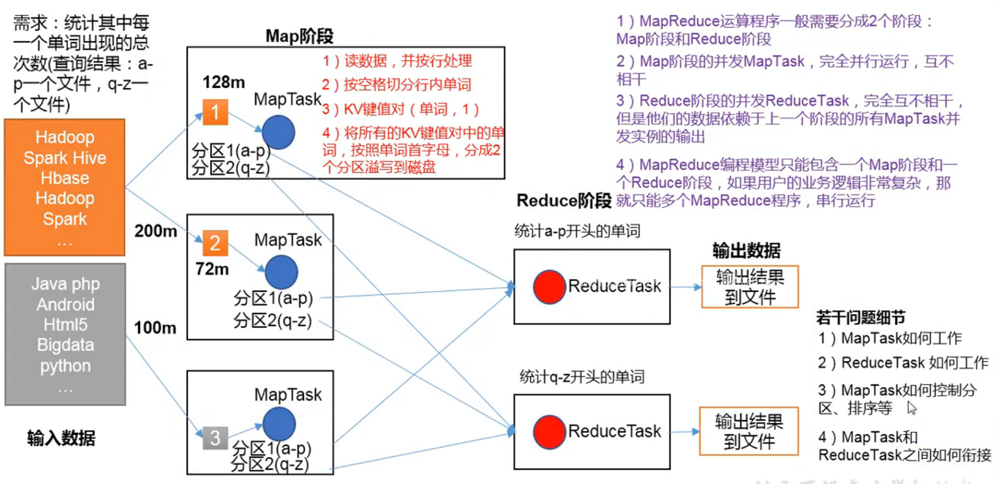
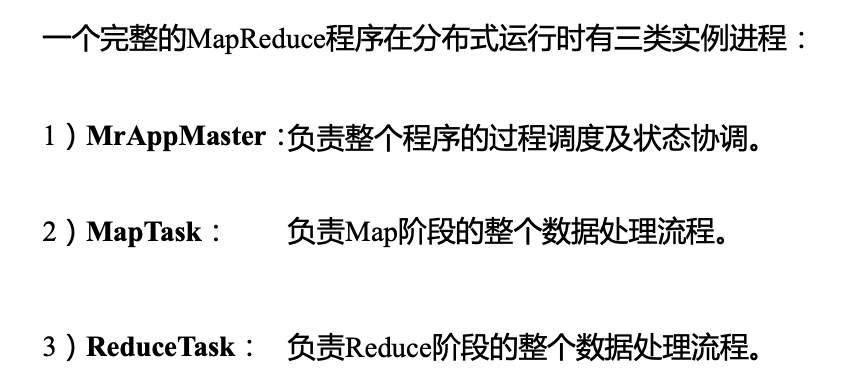
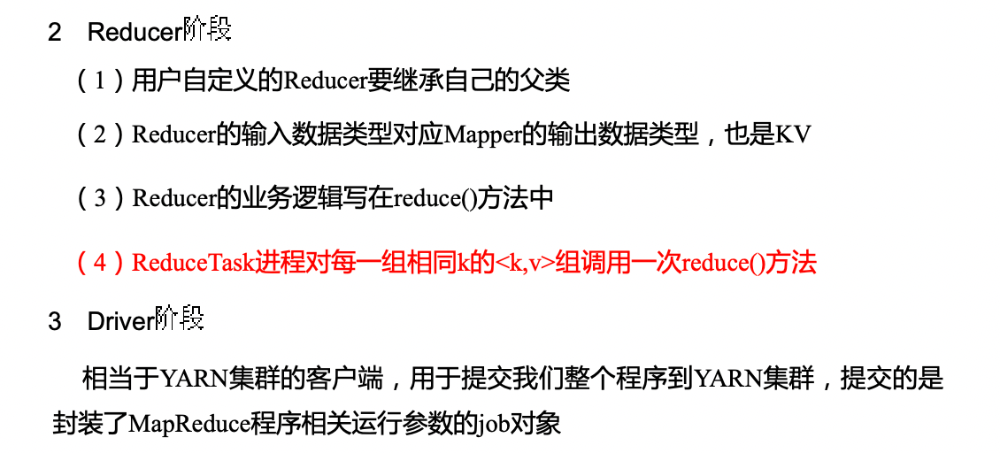
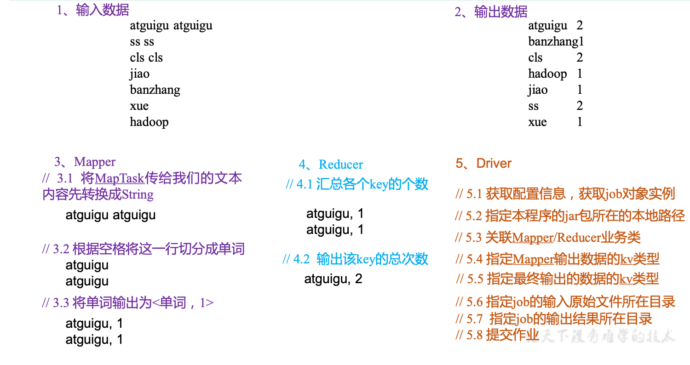
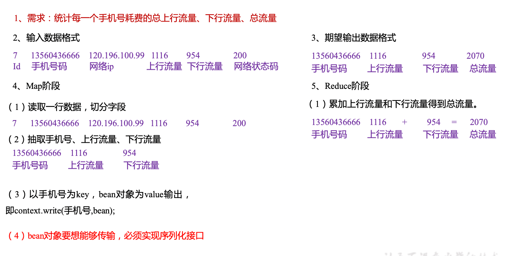
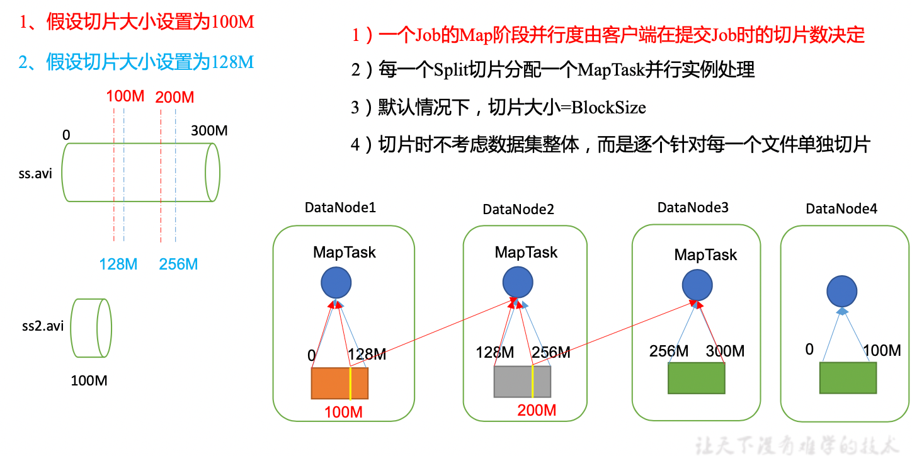
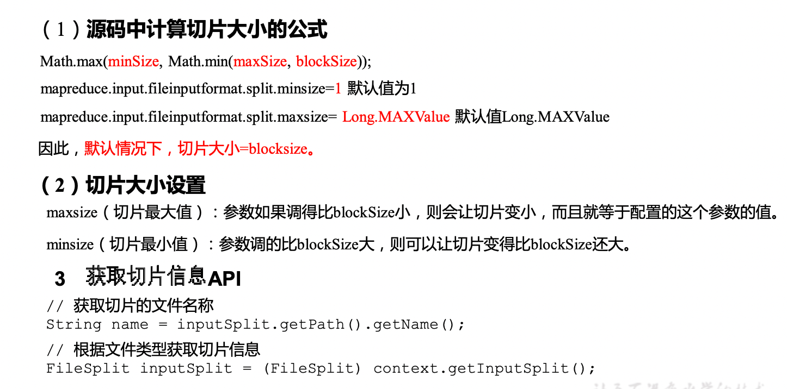

# Hadoop

# Yarn

# HDFS


# MapReduce

## 优缺点

### 优点

1Mapreduce 易于编程

它简单的实现一些接口，就可以完成个分布式程序，这个分布式程序可以分布到大量廉价的 PC 机器上运行。也就是说你写一个分布式程序，跟写个简单的串行程序是一模一样的。就是因为这个特点使得 Map？编程变得非常流行。

2 良好的扩展性

当你的计算资源不能得到满足的时候，你可以通过简单的增加机器来扩展它的计算能力。

3. 高容错性

Mapreduce 设计的初衷就是使程序能够部署在廉价的 PC 机器上，这就要求它具有很高的容错性。比如其中一台机器挂了，它可以把上面的计算任务转移到另外一个节点上运行，不至于这个任务运行失败，而且这个过程不需要人工参与，而完全是由 Hadoop F 内部完成的

4 适合 PB 级以上海量数据的离线处理

可以实现上干台服务器集群并发工作，提供数据处理能力。


### 缺点

1. 不擅长实时计算，无法在毫秒内返回结果
2. 不擅长流式计算
3. 不擅长有向图计算


## 核心思想



1）分布式的运算程序往往需要分成至少2个阶段。

2）第一个阶段的MapTask并发实例，完全并行运行，互不相干。

3）第二个阶段的ReduceTask并发实例互不相干，但是他们的数据依赖于上一个阶段的所有MapTask并发实例的输出。

4）MapReduce编程模型只能包含一个Map阶段和一个Reduce阶段，如果用户的业务逻辑非常复杂，那就只能多个MapReduce程序，串行运行。

总结：分析WordCount数据流走向深入理解MapReduce核心思想。


## MapReduce进程







## 统计文件中单词出现的个数



### 编写mapper

```java
import java.io.IOException;
import org.apache.hadoop.io.IntWritable;
import org.apache.hadoop.io.LongWritable;
import org.apache.hadoop.io.Text;
import org.apache.hadoop.mapreduce.Mapper;

public class WordcountMapper extends Mapper<LongWritable, Text, Text, IntWritable>{
	
	Text k = new Text();
	IntWritable v = new IntWritable(1);
	
	@Override
	protected void map(LongWritable key, Text value, Context context)	throws IOException, InterruptedException {
		
		// 1 获取一行
		String line = value.toString();
		
		// 2 切割
		String[] words = line.split(" ");
		
		// 3 输出
		for (String word : words) {
			
			k.set(word);
			context.write(k, v);
		}
	}
}

```

### Reducer

```java
import java.io.IOException;
import org.apache.hadoop.io.IntWritable;
import org.apache.hadoop.io.Text;
import org.apache.hadoop.mapreduce.Reducer;

public class WordcountReducer extends Reducer<Text, IntWritable, Text, IntWritable>{

int sum;
IntWritable v = new IntWritable();

	@Override
	protected void reduce(Text key, Iterable<IntWritable> values,Context context) throws IOException, InterruptedException {
		
		// 1 累加求和
		sum = 0;
		for (IntWritable count : values) {
			sum += count.get();
		}
		
		// 2 输出
       v.set(sum);
		context.write(key,v);
	}
}


```

 

### Driver

```java
import java.io.IOException;
import org.apache.hadoop.conf.Configuration;
import org.apache.hadoop.fs.Path;
import org.apache.hadoop.io.IntWritable;
import org.apache.hadoop.io.Text;
import org.apache.hadoop.mapreduce.Job;
import org.apache.hadoop.mapreduce.lib.input.FileInputFormat;
import org.apache.hadoop.mapreduce.lib.output.FileOutputFormat;

public class WordcountDriver {

	public static void main(String[] args) throws IOException, ClassNotFoundException, InterruptedException {

		// 1 获取配置信息以及封装任务
		Configuration configuration = new Configuration();
		Job job = Job.getInstance(configuration);

		// 2 设置jar加载路径
		job.setJarByClass(WordcountDriver.class);

		// 3 设置map和reduce类
		job.setMapperClass(WordcountMapper.class);
		job.setReducerClass(WordcountReducer.class);

		// 4 设置map输出
		job.setMapOutputKeyClass(Text.class);
		job.setMapOutputValueClass(IntWritable.class);

		// 5 设置最终输出kv类型
		job.setOutputKeyClass(Text.class);
		job.setOutputValueClass(IntWritable.class);
		
		// 6 设置输入和输出路径
		FileInputFormat.setInputPaths(job, new Path(args[0]));
		FileOutputFormat.setOutputPath(job, new Path(args[1]));

		// 7 提交
		boolean result = job.waitForCompletion(true);

		System.exit(result ? 0 : 1);
	}
}

```

## 序列化与反序列化(制作bean)

注意反序列化的顺序和序列化的顺序完全一致

可以方便数据组织成一个对象在网络中传输  


### 适用场景



### Bean

```java
import java.io.DataInput;
import java.io.DataOutput;
import java.io.IOException;
import org.apache.hadoop.io.Writable;

// 1 实现writable接口
public class FlowBean implements Writable{

	private long upFlow;
	private long downFlow;
	private long sumFlow;
	
	//2  反序列化时，需要反射调用空参构造函数，所以必须有
	public FlowBean() {
		super();
	}

	public FlowBean(long upFlow, long downFlow) {
		super();
		this.upFlow = upFlow;
		this.downFlow = downFlow;
		this.sumFlow = upFlow + downFlow;
	}
	
	//3  写序列化方法
	@Override
	public void write(DataOutput out) throws IOException {
		out.writeLong(upFlow);
		out.writeLong(downFlow);
		out.writeLong(sumFlow);
	}
	
	//4 反序列化方法
	//5 反序列化方法读顺序必须和写序列化方法的写顺序必须一致
	@Override
	public void readFields(DataInput in) throws IOException {
		this.upFlow  = in.readLong();
		this.downFlow = in.readLong();
		this.sumFlow = in.readLong();
	}

	// 6 编写toString方法，方便后续打印到文本
	@Override
	public String toString() {
		return upFlow + "\t" + downFlow + "\t" + sumFlow;
	}

	public long getUpFlow() {
		return upFlow;
	}

	public void setUpFlow(long upFlow) {
		this.upFlow = upFlow;
	}

	public long getDownFlow() {
		return downFlow;
	}

	public void setDownFlow(long downFlow) {
		this.downFlow = downFlow;
	}

	public long getSumFlow() {
		return sumFlow;
	}

	public void setSumFlow(long sumFlow) {
		this.sumFlow = sumFlow;
	}
}

```


### Mapper

```java
import java.io.IOException;
import org.apache.hadoop.io.LongWritable;
import org.apache.hadoop.io.Text;
import org.apache.hadoop.mapreduce.Mapper;

public class FlowCountMapper extends Mapper<LongWritable, Text, Text, FlowBean>{
	
	FlowBean v = new FlowBean();
	Text k = new Text();
	
	@Override
	protected void map(LongWritable key, Text value, Context context)	throws IOException, InterruptedException {
		
		// 1 获取一行
		String line = value.toString();
		
		// 2 切割字段
		String[] fields = line.split("\t");
		
		// 3 封装对象
		// 取出手机号码
		String phoneNum = fields[1];

		// 取出上行流量和下行流量
		long upFlow = Long.parseLong(fields[fields.length - 3]);
		long downFlow = Long.parseLong(fields[fields.length - 2]);

		k.set(phoneNum);
		v.set(downFlow, upFlow);
		
		// 4 写出
		context.write(k, v);
	}
}

```

### Reducer

```java
import java.io.IOException;
import org.apache.hadoop.io.Text;
import org.apache.hadoop.mapreduce.Reducer;

public class FlowCountReducer extends Reducer<Text, FlowBean, Text, FlowBean> {

	@Override
	protected void reduce(Text key, Iterable<FlowBean> values, Context context)throws IOException, InterruptedException {

		long sum_upFlow = 0;
		long sum_downFlow = 0;

		// 1 遍历所用bean，将其中的上行流量，下行流量分别累加
		for (FlowBean flowBean : values) {
			sum_upFlow += flowBean.getUpFlow();
			sum_downFlow += flowBean.getDownFlow();
		}

		// 2 封装对象
		FlowBean resultBean = new FlowBean(sum_upFlow, sum_downFlow);
		
		// 3 写出
		context.write(key, resultBean);
	}
}

```

### Driver


```java
import java.io.IOException;
import org.apache.hadoop.conf.Configuration;
import org.apache.hadoop.fs.Path;
import org.apache.hadoop.io.Text;
import org.apache.hadoop.mapreduce.Job;
import org.apache.hadoop.mapreduce.lib.input.FileInputFormat;
import org.apache.hadoop.mapreduce.lib.output.FileOutputFormat;

public class FlowsumDriver {

	public static void main(String[] args) throws IllegalArgumentException, IOException, ClassNotFoundException, InterruptedException {
		
// 输入输出路径需要根据自己电脑上实际的输入输出路径设置
args = new String[] { "e:/input/inputflow", "e:/output1" };

		// 1 获取配置信息，或者job对象实例
		Configuration configuration = new Configuration();
		Job job = Job.getInstance(configuration);

		// 6 指定本程序的jar包所在的本地路径
		job.setJarByClass(FlowsumDriver.class);

		// 2 指定本业务job要使用的mapper/Reducer业务类
		job.setMapperClass(FlowCountMapper.class);
		job.setReducerClass(FlowCountReducer.class);

		// 3 指定mapper输出数据的kv类型
		job.setMapOutputKeyClass(Text.class);
		job.setMapOutputValueClass(FlowBean.class);

		// 4 指定最终输出的数据的kv类型
		job.setOutputKeyClass(Text.class);
		job.setOutputValueClass(FlowBean.class);
		
		// 5 指定job的输入原始文件所在目录
		FileInputFormat.setInputPaths(job, new Path(args[0]));
		FileOutputFormat.setOutputPath(job, new Path(args[1]));

		// 7 将job中配置的相关参数，以及job所用的java类所在的jar包， 提交给yarn去运行
		boolean result = job.waitForCompletion(true);
		System.exit(result ? 0 : 1);
	}
}

```


## 

## MapTask并行度决定机制

**数据块：**Block是HDFS物理上把数据分成一块一块。

**数据切片：**数据切片只是在逻辑上对输入进行分片，并不会在磁盘上将其切分成片进行存储。





## 切片




###  CombineTextInputFormat切片机制

框架默认的TextInputFormat切片机制是对任务按文件规划切片，不管文件多小，都会是一个单独的切片，都会交给一个MapTask，这样如果有大量小文件，就会产生大量的MapTask，处理效率极其低下。

1、应用场景：

CombineTextInputFormat用于小文件过多的场景，它可以将多个小文件从逻辑上规划到一个切片中，这样，多个小文件就可以交给一个MapTask处理。

2、虚拟存储切片最大值设置

CombineTextInputFormat.setMaxInputSplitSize(job, 4194304);// 4m

注意：虚拟存储切片最大值设置最好根据实际的小文件大小情况来设置具体的值。

3、切片机制

生成切片过程包括：虚拟存储过程和切片过程二部分。


