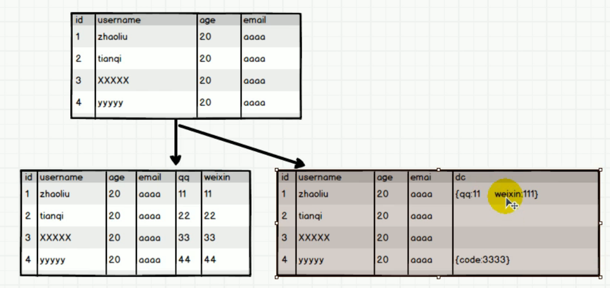
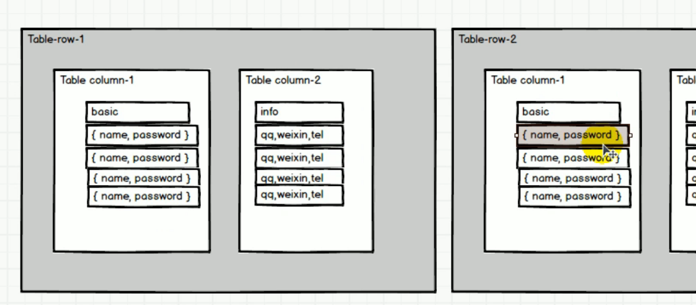
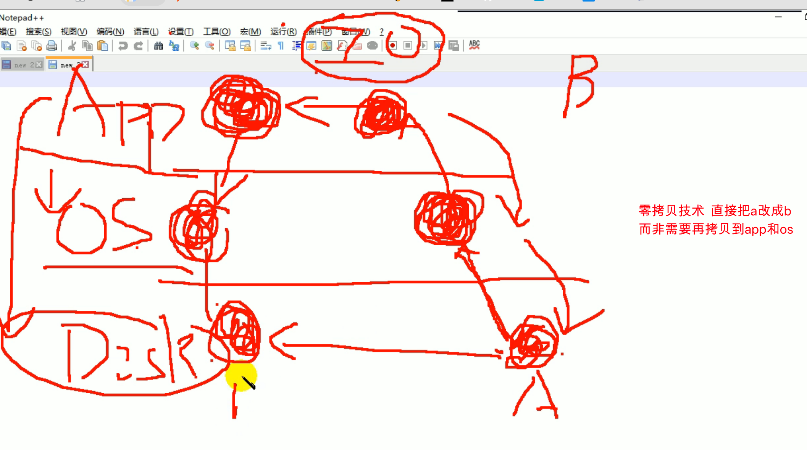
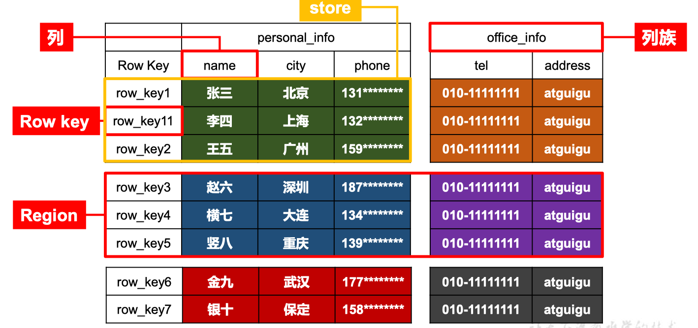
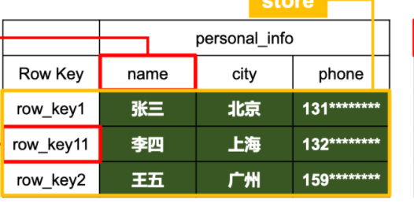
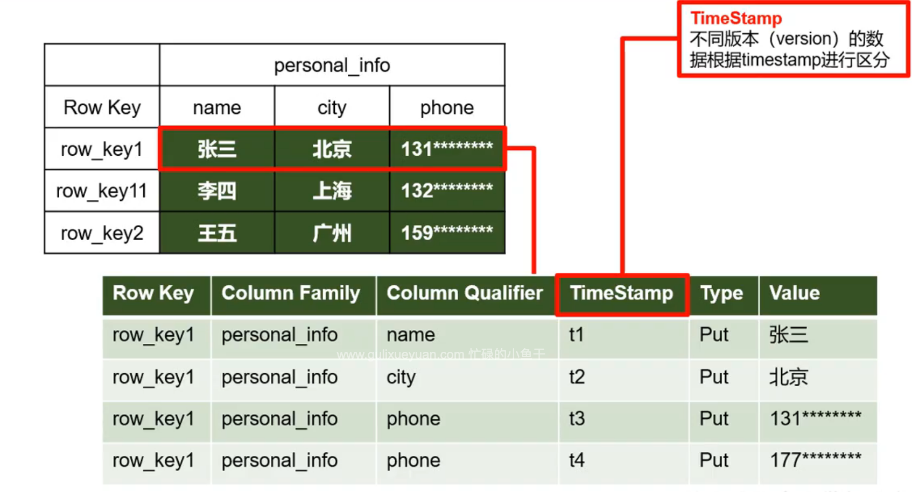
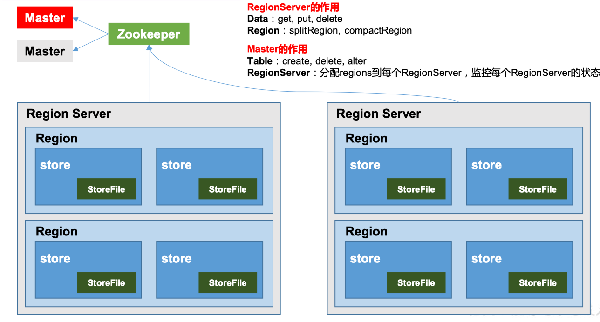
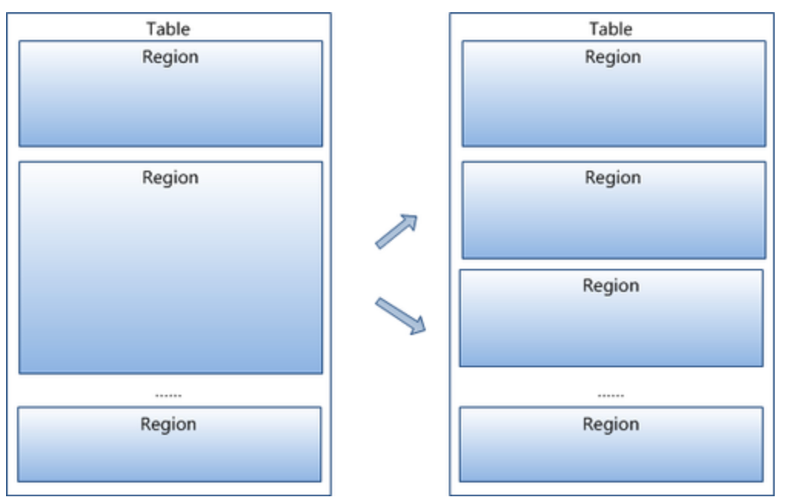
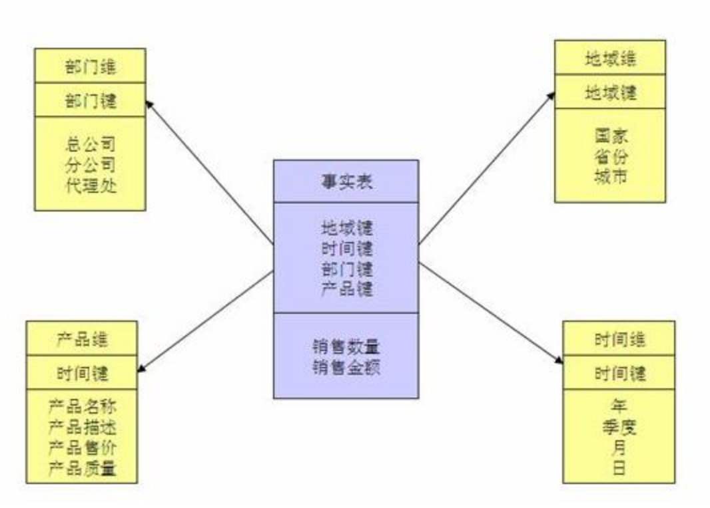
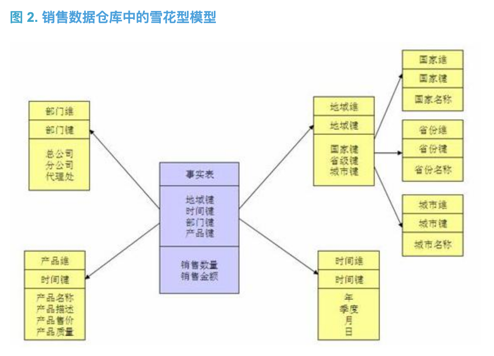

<!-- TOC -->

- [Hbase基础](#hbase基础)
    - [分布式知识](#分布式知识)
        - [负载均衡](#负载均衡)
            - [负载均衡-客户端决定访问机器](#负载均衡-客户端决定访问机器)
            - [负载均衡-去中心化](#负载均衡-去中心化)
    - [Hbase的特点](#hbase的特点)
    - [Hbase存储设计与mysql对比](#hbase存储设计与mysql对比)
        - [mysql的水平垂直切分  与 列的动态扩展](#mysql的水平垂直切分--与-列的动态扩展)
            - [一条查询语句,mysql是从左向右查,oracle是从右向左查.](#一条查询语句mysql是从左向右查oracle是从右向左查)
            - [宽表与高表](#宽表与高表)
            - [列的动态扩展](#列的动态扩展)
            - [mysql的弊端](#mysql的弊端)
        - [Hbase的解决方法](#hbase的解决方法)
            - [列拆分:](#列拆分)
            - [行拆分:](#行拆分)
            - [加缓存:](#加缓存)
            - [零拷贝:](#零拷贝)
            - [Kafka的吞吐量高的原因:顺序写入+零拷贝+分段日志](#kafka的吞吐量高的原因顺序写入零拷贝分段日志)
- [Hbase存储结构](#hbase存储结构)
    - [逻辑结构](#逻辑结构)
        - [Name Space](#name-space)
        - [Row](#row)
        - [Row Key](#row-key)
        - [列族](#列族)
            - [Region](#region)
            - [Store](#store)
    - [物理存储(store的实际存储方式)](#物理存储store的实际存储方式)
        - [Type](#type)
        - [时间戳](#时间戳)
        - [Cell](#cell)
    - [Hbase基本结构(不完整版)](#hbase基本结构不完整版)
        - [1）Region Server(数据操作DML)](#1region-server数据操作dml)
        - [2）Master(表操作DDL)](#2master表操作ddl)
        - [3）Zookeeper](#3zookeeper)
        - [4）HDFS](#4hdfs)
    - [存储架构](#存储架构)
        - [Table](#table)

<!-- /TOC -->

# Hbase基础

## 分布式知识

### 负载均衡

#### 负载均衡-客户端决定访问机器

客户端访问注册中心,拿到所有节点信息,由客户端决定访问那一个实例

#### 负载均衡-去中心化

redis中不存在注册中心,访问redis的任意节点就可以知道其他节点的信息,

## Hbase的特点

**1海量存储**

Hbase适合存储PB级别的海量数据，在PB级别的数据以及采用廉价PC存储的情况下，能在几十到百毫秒内返回数据。这与Hbase的极易扩展性息息相关。正式因为Hbase良好的扩展性，才为海量数据的存储提供了便利。

**2列式存储**

这里的列式存储其实说的是列族存储，Hbase是根据列族来存储数据的。列族下面可以有非常多的列，列族在创建表的时候就必须指定。

**3极易扩展**

Hbase的扩展性主要体现在两个方面，一个是基于上层处理能力（RegionServer）的扩展，一个是基于存储的扩展（HDFS）。
 通过横向添加RegionSever的机器，进行水平扩展，提升Hbase上层的处理能力，提升Hbsae服务更多Region的能力。

备注：RegionServer的作用是管理region、承接业务的访问，这个后面会详细的介绍通过横向添加Datanode的机器，进行存储层扩容，提升Hbase的数据存储能力和提升后端存储的读写能力。

**4高并发**

由于目前大部分使用Hbase的架构，都是采用的廉价PC，因此单个IO的延迟其实并不小，一般在几十到上百ms之间。这里说的高并发，主要是在并发的情况下，Hbase的单个IO延迟下降并不多。能获得高并发、低延迟的服务。

**5稀疏**

稀疏主要是针对Hbase列的灵活性，在列族中，你可以指定任意多的列，在列数据为空的情况下，是不会占用存储空间的。相对应的是密集表,比如mysql的表,即使某个cell内容为空,它依然占内存,但hbase为空的地方不占内存.

## Hbase存储设计与mysql对比

### mysql的水平垂直切分  与 列的动态扩展

#### 一条查询语句,mysql是从左向右查,oracle是从右向左查.

如果是select * from user_info where sex = "女" and old = 20;从左向右查的效率低,因为性别属性的区分度不高,会筛选出一半的数据来,再筛选年龄.

#### 宽表与高表

mysql是以行为单位,所以面临属性较多的宽表,应该做水平拆分

日志类的高表,应该做水平拆分.

#### 列的动态扩展

列动态扩展可以用某一列存json数据,再解析的办法:

#### mysql的弊端

mysql的存储引擎InnoDB ,当命名空间中所有表的数据上限达到64T,性能将大幅度下降

Isam 单表256T后 性能大幅度下降

### Hbase的解决方法

#### 列拆分:

列族信息用json来存储,然后把列拆成很多列族,比如basic列族下几个列,info下几个列

#### 行拆分:

水平拆分

#### 加缓存:

(**读写都放入缓存,交给缓存来异步入库**,因为写入的数据极大可能马上读取,所以不写入hbase,而是写入缓存)

为了防止缓存宕机,写入数据丢失,还要使用**顺序写入**来做**持久化**

#### 零拷贝:

#### Kafka的吞吐量高的原因:顺序写入+零拷贝+分段日志

00001.log  00001.index

01000.log   00010.index  log是分段日志,index对应日志文件里面,某一条数据所在的位置. 第1256条数据在01000.log里面,index则告诉了它在01000.log的哪个位置上.

# Hbase存储结构

## 逻辑结构

### Name Space

命名空间，类似于关系型数据库的 DatabBase 概念，每个命名空间下有多个表。HBase 有两个自带的命名空间，分别是 hbase 和 default，hbase 中存放的是 HBase 内置的表，

default 表是用户默认使用的命名空间。

### Row

HBase 表中的每行数据都由一个 RowKey 和多个 Column（列）组成，数据是按照 RowKey的字典顺序存储的，并且查询数据时只能根据 RowKey 进行检索，所以 RowKey 的设计十分重 要。

### Row Key

与nosql数据库们一样,row key是用来检索记录的主键。访问Hbase table中的行，只有三种方式：

1. 通过单个row key访问

2. 通过row key的range

3. 全表扫描

Row key行键 (Row key)可以是任意字符串(最大长度是 64KB，实际应用中长度一般为 10-100bytes)，在Hbase内部，row key保存为字节数组。

存储时，数据按照Row key的字典序(byte order)排序存储。设计key时，要充分排序存储这个特性，将经常一起读取的行存储放到一起。(位置相关性)

注意：

字典序对int排序的结果是1,10,100,11,12,13,14,15,16,17,18,19,2,20,21,…,9,91,92,93,94,95,96,97,98,99。要保持整形的自然序，行键必须用0作左填充。

行的一次读写是原子操作 (不论一次读写多少列)。这个设计决策能够使用户很容易的理解程序在对同一个行进行并发更新操作时的行为。

### 列族

　　Hbase表中的每个列，都归属与某个列族。列族是表的chema的一部分(而列不是)，必须在使用表之前定义。列名都以列族作为前缀。例如courses:history，courses:math 都属于courses 这个列族。

　　访问控制、磁盘和内存的使用统计都是在列族层面进行的。实际应用中，列族上的控制权限能帮助我们管理不同类型的应用：我们允许一些应用可以添加 新的基本数据、一些应用可以读取基本数据并创建继承的列族、一些应用则只允许浏览数据(甚至可能因为隐私的原因不能浏览所有数据)。

#### Region 

水平切分

类似于关系型数据库的表概念。不同的是，HBase 定义表时**只需要声明列族即可，不需要声明具体的列。**这意味着，往 HBase 写入数据时，字段可以动态、按需指定。因此，和关系型数据库相比，HBase 能够轻松应对字段变更的场景。

#### Store

水平+垂直切分

## 物理存储(store的实际存储方式)

store是一个逻辑结构,他的物理存储方式如下:

因为有时间戳的存在,所以数据的删除更新会在之后进行,用户读的时候返回最新时间戳数据即可,所以hbase的读写效率很快.

### Type

操作类型,增删查改

### 时间戳

windows和linux的时间要统一,不然会出错.

Hbase中通过row和columns确定的为一个存贮单元称为cell。每个 cell都保存着同一份数据的多个版本。版本通过时间戳来索引。时间戳的类型是 64位整型。时间戳可以由Hbase(在数据写入时自动 )赋值，此时时间戳是精确到毫秒的当前系统时间。时间戳也可以由客户显式赋值。如果应用程序要避免数据版本冲突，就必须自己生成具有唯一性的时间戳。每个 cell中，不同版本的数据按照时间倒序排序，即最新的数据排在最前面。

为了避免数据存在过多版本造成的的管理 (包括存贮和索引)负担，Hbase提供了两种数据版本回收方式。一是保存数据的最后n个版本，二是保存最近一段时间内的版本(比如最近七天)。用户可以针对每个列族进行设置。

### Cell

由{**rowkey, column Family：column Qualifier, time Stamp} 唯一确定的单元。**cell 中的数 据是没有类型的，**全部是字节码形式存贮。**

在HBase每个cell存储单元对同一份数据有多个版本，根据唯一的时间戳来区分每个版本之间的差异，时间戳可以由HBase(在数据写入时自动)赋值，此时时间戳是精确到毫秒的当前系统时间，也可以由自己显示指定，按照时间戳倒序排序，最新的数据排在最前面。

## Hbase基本结构(不完整版)

架构角色：

### 1）Region Server(数据操作DML)

Region Server 为 Region 的管理者，其实现类为 HRegionServer，主要作用如下:

对于数据的操作：get, put, delete；

对于 Region 的操作：splitRegion、compactRegion。

### 2）Master(表操作DDL)

Master 是所有 Region Server 的管理者，其实现类为 HMaster，主要作用如下：

对于表的操作：create, delete, alter

对于 RegionServer 的操作：分配 regions 到每个 RegionServer，监控每个 RegionServer 的状态，负载均衡和故障转移。

Hbase的master不需要配置,开多少台服务,就有多少个master高可用

### 3）Zookeeper

HBase 通过 Zookeeper 来做 Master 的高可用、RegionServer 的监控、元数据的入口以及

集群配置的维护等工作。

### 4）HDFS

HDFS 为 HBase 提供最终的底层数据存储服务，同时为 HBase 提供高可用的支持。

## 存储架构

### Table

Table中的所有行都按照row key的字典序排列，Table 在行的方向上分割为多个Hregion。

region按大小分割的，每个表一开始只有一个region，随着数据不断插入表，region不断增大，当增大到一个阀值的时候，Hregion就会等分会两个新的Hregion。当table中的行不断增多，就会有越来越多的Hregion。

# Mongodb与Hbase的区别

- 1.Mongodb bson文档型数据库，整个数据都存在磁盘中，hbase是列式数据库，集群部署时每个familycolumn保存在单独的hdfs文件中。
- 2.Mongodb 主键是“_id”,主键上面可以不建索引,记录插入的顺序和存放的顺序一样，hbase的主键就是row key，可以是任意字符串(最大长度是 64KB，实际应用中长度一般为 10-100bytes)，在hbase内部，**row key保存为字节数组。存储时，数据按照Row key的字典序(byte order)排序存储。设计key时，要充分排序存储这个特性，将经常一起读取的行存储放到一起。字典序对int排序的结果是1,10,100,11,12,13,14,15,16,17,18,19,2,20,21,…,9,91,92,93,94,95,96,97,98,99。要保持整形的自然序，行键必须用0作左填充。**
- 3.Mongodb支持二级索引，而hbase本身不支持二级索引
- 4.Mongodb支持集合查找，正则查找，范围查找，支持skip和limit等等，是**最像mysql的nosql数据库**，而hbase只支持三种查找：**通过单个row key访问，通过row key的range，全表扫描**
- 5.mongodb的update是update-in-place，也就是原地更新，除非原地容纳不下更新后的数据记录。而hbase的修改和添加都是同一个命令：put，如果put传入的row key已经存在就更新原记录,实际上hbase内部也不是更新，它只是将这一份数据已不同的版本保存下来而已，hbase默认的保存版本的历史数量是3。
- 6.mongodb的delete会将该行的数据标示为已删除，因为mongodb在删除记录时并不是真把记录从内存或文件中remove，而是将该删除记录数据置空（写0或特殊数字加以标识）同时将该记录所在地址放到一个list列表“释放列表”中，这样做的好就是就是如果有用户要执行插入记录操作时，mongodb会首先从该“释放列表”中获取size合适的“已删除记录”地址返回，这种方法会提升性能（避免了malloc内存操作），同时mongodb也使用了bucket size数组来定义多个大小size不同的列表，用于将要删除的记录根据其size大小放到合适的“释放列表”中。Hbase的delete是先新建一个tombstonemarkers，然后读的时候会和tombstonemarkers做merge，在 发生major compaction时delete的数据记录才会真真删除。
- 7.mongodb和hbase都支持mapreduce，不过mongodb的mapreduce支持不够强大，如果没有使用mongodb分片，mapreduce实际上不是并行执行的
- 8.mongodb支持shard分片，hbase根据row key自动负载均衡，这里shard key和row key的选取尽量用非递增的字段，尽量用分布均衡的字段，因为分片都是根据范围来选择对应的存取server的，如果用递增字段很容易热点server的产生，由于是根据key的范围来自动分片的，如果key分布不均衡就会导致有些key根本就没法切分，从而产生负载不均衡。
- 9.mongodb的读效率比写高，hbase默认适合写多读少的情况，可以通过hfile.block.cache.size配置，该配置storefile的读缓存占用Heap的大小百分比，0.2表示20%。该值直接影响数据读的性能。如果写比读少很多，开到0.4-0.5也没问题。如果读写较均衡，0.3左右。如果写比读多，果断默认0.2吧。设置这个值的时候，你同时要参考hbase.regionserver.global.memstore.upperLimit，该值是memstore占heap的最大百分比，两个参数一个影响读，一个影响写。如果两值加起来超过80-90%，会有OOM的风险，谨慎设置。
- 10.hbase采用的LSM思想(Log-Structured Merge-Tree)，就是将对数据的更改hold在内存中，达到指定的threadhold后将该批更改merge后批量写入到磁盘，这样将单个写变成了批量写，大大提高了写入速度，不过这样的话读的时候就费劲了，需要merge disk上的数据和memory中的修改数据，这显然降低了读的性能。mongodb采用的是mapfile+Journal思想，如果记录不在内存，先加载到内存，然后在内存中更改后记录日志，然后隔一段时间批量的写入data文件，这样对内存的要求较高，至少需要容纳下热点数据和索引。

# OLAP与OLTP

mysql是oltp的sql数据库，是行存储。

hbase是oltp的nosql数据库，不是列存储而是KV存储。

但hbase的分析是行分析，所以并不满足olap的性能要求，所以用oss最为列存储的基石。

# 星型模型和雪花型模型比较

https://blog.csdn.net/nisjlvhudy/article/details/7889422

星型有冗余和数据重复，但效率高，用来做指标分析更适合，比如“给定的一个客户他们的收入是多少?”

雪花型拆分较细，效率低；但适合维度分析，比如“针对特定的广告主，有哪些客户或者公司是在线的?”

***\*星型架构是一种非正规化的结构，多维数据集的每一个维度都直接与事实表相连接，不存在渐变维度，所以数据有一定的冗余\****，如在地域维度表中，存在国家 A 省 B 的城市 C 以及国家 A 省 B 的城市 D 两条记录，那么国家 A 和省 B 的信息分别存储了两次，即存在冗余。

它的优点是 : ***\*通过最大限度地减少数据存储量以及联合较小的维表来改善查询性能\****

# 数据湖与数据仓库

## 数据湖与数据仓库的区别？

- 数据湖：数据湖存储OSS：允许您以任意规模存储所有结构化和非结构化数据。数据湖分析DLA：按原样存储数据（无需先对数据进行结构化处理），并运行不同类型的分析 – 从控制面板和可视化到大数据处理、实时分析和机器学习，以指导做出更好的决策。
- 数据仓库：是结构化的，借助索引提供更高性能的服务；一般情况下，数据湖分析DLA会跟 数据仓库 ADB 搭配，DLA会把分析与计算的数据写入到 ADB之中，以提供更高性能的实时分析的能力，客户会为此额外支付一笔费用；

