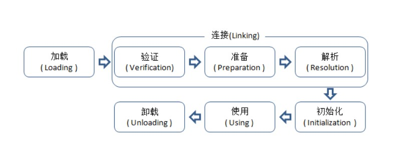

# JVM类生命周期概述：加载时机与加载过程
原文链接：https://blog.csdn.net/justloveyou_/article/details/72466105

一个.java文件在编译后会形成相应的一个或多个Class文件，这些Class文件中描述了类的各种信息，并且它们最终都需要被加载到虚拟机中才能被运行和使用。

虚拟机把描述类的数据从Class文件**加载到内存**，并对数据进行校验，转换解析和**初始化**，最终形成可以被虚拟机直接使用的Java类型的过程就是虚拟机的**类加载机制**。

JVM类加载机制主要包括两个问题：类加载的时机与步骤 和 类加载的方式。

## 类加载的时机与步骤
**运行时动态链接**  
类型的加载和连接都是在程序运行期间完成，这样会在类加载时稍微增加一些性能开销，但是却能为Java应用程序提供高度的灵活性，Java中天生可以动态扩展的语言特性多态就是依赖运行期动态加载和动态链接这个特点实现的。例如，如果编写一个使用接口的应用程序，可以等到运行时再指定其实际的实现。这种组装应用程序的方式广泛应用于Java程序之中。
### 加载步骤

Java类从被加载到虚拟机内存中开始，到卸载出内存为止，它的整个生命周期包括：加载（Loading）、验证（Verification）、准备(Preparation)、解析(Resolution)、初始化(Initialization)、使用(Using) 和 卸载(Unloading)七个阶段。其中准备、验证、解析3个部分统称为连接（Linking）
<div align="center">  </div><br>

加载、验证、准备、初始化和卸载这5个阶段的顺序是确定的，类的加载过程必须按照这种顺序按部就班地开始，而解析阶段则不一定：它在某些情况下可以在初始化阶段之后再开始，这是为了支持Java语言的运行时绑定（也称为动态绑定或晚期绑定）。

这些阶段通常都是相互交叉地混合式进行的，也就是说通常会在一个阶段执行的过程中调用或激活另外一个阶段。

## 加载时机与初始化时机
### 类加载时机

什么情况下虚拟机需要开始加载一个类呢？虚拟机规范中并没有对此进行强制约束，这点可以交给虚拟机的具体实现来自由把握。

### 类初始化时机(五种主动引用)
**虚拟机规范指明 有且只有 五种情况必须立即对类进行初始化（而这一过程自然发生在加载、验证、准备之后）：**

1) 遇到new、getstatic、putstatic或invokestatic这四条字节码指令时，如果类没有进行过初始化，则需要先对其进行初始化。生成这四条指令的最常见的Java代码场景是：

使用new关键字实例化对象的时候；

读取或设置一个类的静态字段（被final修饰，已在编译器把结果放入常量池的静态字段除外）的时候；

调用一个类的静态方法的时候。

（注意，newarray指令触发的只是数组类型本身的初始化，而不会导致其相关类型的初始化，比如，new String[]只会直接触发String[]类的初始化，也就是触发对类[Ljava.lang.String的初始化，而直接不会触发String类的初始化）

2) 使用java.lang.reflect包的方法对类进行反射调用的时候，如果类没有进行过初始化，则需要先触发其初始化。

3) 当初始化一个类的时候，如果发现其父类还没有进行过初始化，则需要先触发其父类的初始化。

4) 当虚拟机启动时，用户需要指定一个要执行的主类（包含main()方法的那个类），虚拟机会先初始化这个主类。

5) 当使用jdk1.7动态语言支持时，如果一个java.lang.invoke.MethodHandle实例最后的解析结果REF_getstatic,REF_putstatic,REF_invokeStatic的方法句柄，并且这个方法句柄所对应的类没有进行初始化，则需要先出触发其初始化。


注意，对于这五种会触发类进行初始化的场景，虚拟机规范中使用了一个很强烈的限定语：“有且只有”，这五种场景中的行为称为对一个类进行** 主动引用**。除此之外，所有引用类的方式，都不会触发初始化，称为 **被动引用**。


特别需要指出的是，类的实例化与类的初始化是两个完全不同的概念：  
类的实例化是指创建一个类的实例(对象)的过程；
类的初始化是指为类中各个类成员(被static修饰的成员变量)赋初始值的过程，是类生命周期中的一个阶段。
### 类的被动引用(不触发初始化)
1)、通过子类引用父类的静态字段，不会导致子类初始化
```java
public class SSClass{
    static{
        System.out.println("SSClass");
    }
}  

public class SClass extends SSClass{
    static{
        System.out.println("SClass init!");
    }

    public static int value = 123;

    public SClass(){
        System.out.println("init SClass");
    }
}

public class SubClass extends SClass{
    static{
        System.out.println("SubClass init");
    }

    static int a;

    public SubClass(){
        System.out.println("init SubClass");
    }
}

public class NotInitialization{
    public static void main(String[] args){
        System.out.println(SubClass.value);
    }
}/* Output: 
        SSClass
        SClass init!
        123     
 *///:~
 ```
子类引用父类的静态字段只会出发父类的初始化

在本例中，由于value字段是在类SClass中定义的，因此该类会被初始化；此外，在初始化类SClass时，虚拟机会发现其父类SSClass还未被初始化，因此虚拟机将先初始化父类SSClass，然后初始化子类SClass，而SubClass始终不会被初始化。


　2)、通过数组定义来引用类，不会触发此类的初始化

```java
public class NotInitialization{
    public static void main(String[] args){
        SClass[] sca = new SClass[10];
    }
}
```
　上述案例运行之后并没有任何输出

虚拟机没有初始化数组内的类,而是初始化了一个元素类型为SClass的一维数组,它是由虚拟机自动生成的，直接继承于Object的子类，创建动作由字节码指令newarray触发。

3)、常量在编译阶段会存入调用类的常量池中，本质上并没有直接引用到定义常量的类，因此不会触发定义常量的类的初始化
```java
public class ConstClass{

    static{
        System.out.println("ConstClass init!");
    }

    public static  final String CONSTANT = "hello world";
}

public class NotInitialization{
    public static void main(String[] args){
        System.out.println(ConstClass.CONSTANT);
    }
}/* Output: 
        hello world
 *///:~


```
　　上述代码运行之后，只输出 “hello world”，这是因为虽然在Java源码中引用了ConstClass类中的常量CONSTANT，但是编译阶段将此常量的值“hello world”存储到了NotInitialization常量池中，对常量ConstClass.CONSTANT的引用实际都被转化为NotInitialization类对自身常量池的引用了。也就是说，实际上NotInitialization的Class文件之中并没有ConstClass类的符号引用入口，这两个类在编译为Class文件之后就不存在关系了


## 类加载的过程(每一步做了啥)
<div align="center">  </div><br>
1、加载（Loading）

　　在加载阶段（可以参考java.lang.ClassLoader的loadClass()方法），虚拟机需要完成以下三件事情：

　　(1). 由加载器通过一个类的全限定名来获取定义此类的二进制字节流（并没有指明要从一个Class文件中获取，可以从其他渠道，譬如：网络、动态生成、数据库等）；

　　(2). 将这个字节流所代表的静态存储结构转化为方法区的运行时数据结构；

　　(3). 在内存中(对于HotSpot虚拟就而言就是方法区)生成一个代表这个类的java.lang.Class对象，作为方法区这个类的各种数据的访问入口；

　　加载阶段和连接阶段（Linking）的部分内容（如一部分字节码文件格式验证动作）是交叉进行的，加载阶段尚未完成，连接阶段可能已经开始，但这些夹在加载阶段之中进行的动作，仍然属于连接阶段的内容，这两个阶段的开始时间仍然保持着固定的先后顺序。

2、验证（Verification）

　　验证是连接阶段的第一步，这一阶段的目的是为了确保Class文件的字节流中包含的信息符合当前虚拟机的要求，并且不会危害虚拟机自身的安全。
文件格式验证：验证字节流是否符合Class文件格式的规范(例如，是否以魔术0xCAFEBABE开头、主次版本号是否在当前虚拟机的处理范围之内、常量池中的常量是否有不被支持的类型)

元数据验证：对字节码描述的信息进行语义分析，以保证其描述的信息符合Java语言规范的要求(例如：这个类是否有父类，除了java.lang.Object之外)；

字节码验证：通过数据流和控制流分析，确定程序语义是合法的、符合逻辑的;

符号引用验证：确保解析动作能正确执行。

　　验证阶段是非常重要的，但不是必须的，它对程序运行期没有影响。如果所引用的类经过反复验证，那么可以考虑采用-Xverifynone参数来关闭大部分的类验证措施，以缩短虚拟机类加载的时间

3、准备(Preparation)
为static变量在方法区分配内存,并设置类变量初始值(一般为0)

这时候内存分配的变量只有类变量,没有实例变量,实例变量会在对象实例化的时候跟随对象实例化一起分配进堆内存.

其次，这里所说的初始值“通常情况”下是数据类型的零值，假设一个类变量的定义为：
```java
 public static int value = 123;
 ```
 那么，变量value在准备阶段过后的值为0而不是123。因为这时候尚未开始执行任何java方法，而把value赋值为123的putstatic指令是程序被编译后，存放于类构造器方法`<clinit>()`之中，所以把value赋值为123的动作将在初始化阶段才会执行。

 至于“特殊情况”是指：当类字段的字段属性是ConstantValue时，会在准备阶段初始化为指定的值，所以标注为final之后，value的值在准备阶段初始化为123而非0。

 ```java
 　public static final int value = 123;
 ```

4、 解析(Resolution)

　　解析阶段是虚拟机将常量池内的符号引用替换为直接引用的过程。解析动作主要针对类或接口、字段、类方法、接口方法、方法类型、方法句柄和调用点限定符7类符号引用进行。

5、初始化(Initialization)

　　类初始化阶段是类加载过程的最后一步。在前面的类加载过程中，除了在加载阶段用户应用程序可以通过自定义类加载器参与之外，其余动作完全由虚拟机主导和控制。到了初始化阶段，才真正开始执行类中定义的java程序代码(字节码)。

在准备阶段，变量已经赋过一次系统要求的初始值(零值)；而在初始化阶段，则根据程序猿通过程序制定的主观计划去初始化类变量和其他资源，或者更直接地说：初始化阶段是执行类构造器`<clinit>()`方法的过程。`<clinit>()`方法是由编译器自动收集类中的所有类变量的赋值动作和静态语句块static{}中的语句合并产生的，编译器收集的顺序是由语句在源文件中出现的顺序所决定的，静态语句块只能访问到定义在静态语句块之前的变量，定义在它之后的变量，在前面的静态语句块可以赋值，但是不能访问。如下：

```java
public class Test{
    static{
        i=0;
        System.out.println(i);//Error：Cannot reference a field before it is defined（非法向前应用）
    }
    static int i=1;
}

```
修改为下面就可以正常运行了：
```java
public class Test{
    static{
        i=0;
        //System.out.println(i);
    }

    static int i=1;

    public static void main(String args[]){
        System.out.println(i);
    }
}/* Output: 
        1
 *///:~
 ```


 类构造器`<clinit>()`与实例构造器`<init>()`不同，它不需要程序员进行显式调用
 
 虚拟机会保证在子类类构造器`<clinit>()`执行之前，父类的类构造`<clinit>()`执行完毕。由于父类的构造器`<clinit>()`先执行，也就意味着父类中定义的静态语句块/静态变量的初始化要优先于子类的静态语句块/静态变量的初始化执行。
 
 特别地，类构造器`<clinit>()`对于类或者接口来说并不是必需的，如果一个类中没有静态语句块，也没有对类变量的赋值操作，那么编译器可以不为这个类生产类构造器`<clinit>()`。

　虚拟机会保证一个类的类构造器<clinit>()在多线程环境中被正确的加锁、同步，如果多个线程同时去初始化一个类，那么只会有一个线程去执行这个类的类构造器<clinit>()，其他线程都需要阻塞等待，直到活动线程执行<clinit>()方法完毕。

当执行的线程初始化完成后，其他阻塞线程不会再执行初始化，因为**在同一个类加载器下，一个类型只会被初始化一次**'
```java
public class DealLoopTest {
    static{
        System.out.println("DealLoopTest...");
    }
    static class DeadLoopClass {
        static {
            if (true) {
                System.out.println(Thread.currentThread()
                        + "init DeadLoopClass");
                while (true) {      // 模拟耗时很长的操作
                }
            }
        }
    }

    public static void main(String[] args) {
        Runnable script = new Runnable() {   // 匿名内部类
            public void run() {
                System.out.println(Thread.currentThread() + " start");
                DeadLoopClass dlc = new DeadLoopClass();
                System.out.println(Thread.currentThread() + " run over");
            }
        };

        Thread thread1 = new Thread(script);
        Thread thread2 = new Thread(script);
        thread1.start();
        thread2.start();
    }
}/* Output: 
        DealLoopTest...
        Thread[Thread-1,5,main] start
        Thread[Thread-0,5,main] start
        Thread[Thread-1,5,main]init DeadLoopClass
 *///:~
 ```
 如上述代码所示，在初始化DeadLoopClass类时，线程Thread-1得到执行并在执行这个类的类构造器`<clinit>()` 时，由于该方法包含一个死循环，因此久久不能退出。


**创建一个对象常常需要经历如下几个过程：父类的类构造器`<clinit>() `-> 子类的类构造器`<clinit>() `-> 父类的成员变量和实例代码块 -> 父类的构造函数 -> 子类的成员变量和实例代码块 -> 子类的构造函数。**

举例：
```java 
public class StaticTest {
    public static void main(String[] args) {
        staticFunction();
    }

    static StaticTest st = new StaticTest();

    static {   //静态代码块
        System.out.println("1");
    }

    {       // 实例代码块
        System.out.println("2");
    }

    StaticTest() {    // 实例构造器
        System.out.println("3");
        System.out.println("a=" + a + ",b=" + b);
    }

    public static void staticFunction() {   // 静态方法
        System.out.println("4");
    }

    int a = 110;    // 实例变量
    static int b = 112;     // 静态变量
    //static final int b=112
    //那么，在准备阶段b的值就是112，而不再是0了。
}/* Output: 
        2
        3
        a=110,b=0
        1
        4
 *///:~
 ```
解释：

一般思路是：  
准备阶段   
先常量直接赋值（准备阶段转移到常量类），再 静态变量，静态代码（赋默认值0）

初始化阶段  
父类的类构造器`<clinit>()` -> 子类的类构造器`<clinit>() `-> 父类的成员变量和实例代码块 -> 父类的构造函数 -> 子类的成员变量和实例代码块 -> 子类的构造函数。

`<clinit>()`方法是由编译器自动收集类中的所有类变量的赋值动作和静态语句块static{}中的语句合并产生的，编译器收集的顺序是由语句在源文件中出现的顺序所决定的，静态语句块只能访问到定义在静态语句块之前的变量，定义在它之后的变量，在前面的静态语句块可以赋值，但是不能访问。


此题需要注意：   
在初始化阶段，当JVM对类StaticTest进行初始化时，首先会执行下面的语句：
```java
static StaticTest st = new StaticTest();
```
也就是实例化StaticTest对象，但这个时候类都没有初始化完毕啊，能直接进行实例化吗？事实上，这涉及到一个根本问题就是：实例初始化不一定要在类初始化结束之后才开始初始化。 下面我们结合类的加载过程说明这个问题。


此时，就碰到了笔者上面的疑惑，即“在类都没有初始化完毕之前，能直接进行实例化相应的对象吗？”。事实上，从Java角度看，我们知道一个类初始化的基本常识，那就是：在同一个类加载器下，一个类型只会被初始化一次。所以，一旦开始初始化一个类型，无论是否完成，后续都不会再重新触发该类型的初始化阶段了(只考虑在同一个类加载器下的情形)。因此，在实例化上述程序中的st变量时，实际上是把实例初始化嵌入到了静态初始化流程中，并且在上面的程序中，嵌入到了静态初始化的起始位置。这就导致了实例初始化完全发生在静态初始化之前，当然，这也是导致a为110b为0的原因。

因此，上述程序的StaticTest类构造器`<clinit>()`的实现等价于：
```java
public class StaticTest {
    <clinit>(){
        a = 110;    // 实例变量
        System.out.println("2");        // 实例代码块
        System.out.println("3");     // 实例构造器中代码的执行
        System.out.println("a=" + a + ",b=" + b);  // 实例构造器中代码的执行
        类变量st被初始化
        System.out.println("1");        //静态代码块
        类变量b被初始化为112
    }
}
```
下面，我们对上述程序稍作改动，如下所示：

```java
public class StaticTest {
    public static void main(String[] args) {
        staticFunction();
    }

    static StaticTest st = new StaticTest();

    static {
        System.out.println("1");
    }

    {
        System.out.println("2");
    }

    StaticTest() {
        System.out.println("3");
        System.out.println("a=" + a + ",b=" + b);
    }

    public static void staticFunction() {
        System.out.println("4");
    }

    int a = 110;
    static int b = 112;
    static StaticTest st1 = new StaticTest();
}
```
在程序最后的一行，增加代码行：static StaticTest st1 = new StaticTest();

```
输出变成了
2
3
a=110,b=0
1
2
3
a=110,b=112
4
```

关于方法的重写：
```java

class Foo {
    int i = 1;

    Foo() {
        System.out.println(i);             
        int x = getValue();
        System.out.println(x);            
    }

    {
        i = 2;
    }

    protected int getValue() {
        return i;
    }
}

//子类
class Bar extends Foo {
    int j = 1;

    Bar() {
        j = 2;
    }

    {
        j = 3;
    }

    @Override
    protected int getValue() {
        return j;
    }
}

public class ConstructorExample {
    public static void main(String... args) {
        Bar bar = new Bar();
        System.out.println(bar.getValue());        
    }
}
输出结果是 

2
0
2
这样程序就好看多了，我们一眼就可以观察出程序的输出结果。在通过使用Bar类的构造方法new一个Bar类的实例时，首先会调用Foo类构造函数，因此(1)处输出是2，这从Foo类构造函数的等价变换中可以直接看出。

(2)处输出是0，为什么呢？因为在执行Foo的构造函数的过程中，由于Bar重载了Foo中的getValue方法，所以根据Java的多态特性可以知道，其调用的getValue方法是被Bar重载的那个getValue方法。但由于这时Bar的构造函数还没有被执行，因此此时j的值还是默认值0，因此(2)处输出是0。

最后，在执行(3)处的代码时，由于bar对象已经创建完成，所以此时再访问j的值时，就得到了其初始化后的值2，这一点可以从Bar类构造函数的等价变换中直接看出。
```

## 加载后 类的实例化与初始化
一个Java对象的创建过程往往包括 类初始化 和 类实例化 两个阶段。

实例化对象之前需要先加载类并通过类构造器进行初始化

### 创建对象的5种方式,两种不需要构造器
1). 使用new关键字创建对象

这是我们最常见的也是最简单的创建对象的方式，通过这种方式我们可以调用任意的构造函数（无参的和有参的）去创建对象。比如：

使用new关键字来调用一个类的构造函数显式地创建对象，这种方式在Java规范中被称为 : 由执行类实例创建表达式而引起的对象创建。

```java
　Student student = new Student();
```
2). 使用Class类的newInstance方法(反射机制)

其实newinstance调用的是无参构造器

```java
　　Student student2 = (Student)Class.forName("Student类全限定名").newInstance();　
或者：
　　Student stu = Student.class.newInstance();
```

3). 使用Constructor类的newInstance方法(反射机制)

　java.lang.relect.Constructor类里也有一个newInstance方法可以创建对象，该方法和Class类中的newInstance方法很像，但是相比之下，Constructor类的newInstance方法更加强大些，我们可以通过这个newInstance方法调用有参数的和私有的构造函数

```java
public class Student {

    private int id;

    public Student(Integer id) {
        this.id = id;
    }

    public static void main(String[] args) throws Exception {

        Constructor<Student> constructor = Student.class
                .getConstructor(Integer.class);
        Student stu3 = constructor.newInstance(123);
    }
}
```

使用newInstance方法的这两种方式创建对象使用的就是Java的反射机制，事实上Class的newInstance方法内部调用的也是Constructor的newInstance方法。
4). 使用Clone方法创建对象

　无论何时我们调用一个对象的clone方法，JVM都会帮我们创建一个新的、一样的对象，特别需要说明的是，用clone方法创建对象的过程中并不会调用任何构造函数。

简单而言，要想使用clone方法，我们就必须先实现Cloneable接口并实现其定义的clone方法，这也是原型模式的应用。比如：
```java
public class Student implements Cloneable{

    private int id;

    public Student(Integer id) {
        this.id = id;
    }

    @Override
    protected Object clone() throws CloneNotSupportedException {
        // TODO Auto-generated method stub
        return super.clone();
    }

    public static void main(String[] args) throws Exception {

        Constructor<Student> constructor = Student.class
                .getConstructor(Integer.class);
        Student stu3 = constructor.newInstance(123);
        Student stu4 = (Student) stu3.clone();
    }
}
```

5). 使用(反)序列化机制创建对象

VM并不会调用任何构造函数。为了反序列化一个对象，我们需要让我们的类实现Serializable接口，比如：
```java
public class Student implements Cloneable, Serializable {

    private int id;

    public Student(Integer id) {
        this.id = id;
    }

    @Override
    public String toString() {
        return "Student [id=" + id + "]";
    }

    public static void main(String[] args) throws Exception {

        Constructor<Student> constructor = Student.class
                .getConstructor(Integer.class);
        Student stu3 = constructor.newInstance(123);

        // 写对象
        ObjectOutputStream output = new ObjectOutputStream(
                new FileOutputStream("student.bin"));
        output.writeObject(stu3);
        output.close();

        // 读对象
        ObjectInputStream input = new ObjectInputStream(new FileInputStream(
                "student.bin"));
        Student stu5 = (Student) input.readObject();
        System.out.println(stu5);
    }
}
```

综合上述

```java
public class Student implements Cloneable, Serializable {

    private int id;

    public Student() {

    }

    public Student(Integer id) {
        this.id = id;
    }

    @Override
    protected Object clone() throws CloneNotSupportedException {
        // TODO Auto-generated method stub
        return super.clone();
    }

    @Override
    public String toString() {
        return "Student [id=" + id + "]";
    }

    public static void main(String[] args) throws Exception {

        System.out.println("使用new关键字创建对象：");
        Student stu1 = new Student(123);
        System.out.println(stu1);
        System.out.println("\n---------------------------\n");


        System.out.println("使用Class类的newInstance方法创建对象：");
        Student stu2 = Student.class.newInstance();    //对应类必须具有无参构造方法，且只有这一种创建方式
        System.out.println(stu2);
        System.out.println("\n---------------------------\n");

        System.out.println("使用Constructor类的newInstance方法创建对象：");
        Constructor<Student> constructor = Student.class
                .getConstructor(Integer.class);   // 调用有参构造方法
        Student stu3 = constructor.newInstance(123);   
        System.out.println(stu3);
        System.out.println("\n---------------------------\n");

        System.out.println("使用Clone方法创建对象：");
        Student stu4 = (Student) stu3.clone();
        System.out.println(stu4);
        System.out.println("\n---------------------------\n");

        System.out.println("使用(反)序列化机制创建对象：");
        // 写对象
        ObjectOutputStream output = new ObjectOutputStream(
                new FileOutputStream("student.bin"));
        output.writeObject(stu4);
        output.close();

        // 读取对象
        ObjectInputStream input = new ObjectInputStream(new FileInputStream(
                "student.bin"));
        Student stu5 = (Student) input.readObject();
        System.out.println(stu5);

    }
}/* Output: 
        使用new关键字创建对象：
        Student [id=123]

        ---------------------------

        使用Class类的newInstance方法创建对象：
        Student [id=0]

        ---------------------------

        使用Constructor类的newInstance方法创建对象：
        Student [id=123]

        ---------------------------

        使用Clone方法创建对象：
        Student [id=123]

        ---------------------------

        使用(反)序列化机制创建对象：
        Student [id=123]
*///:~
```
　从Java虚拟机层面看，除了使用new关键字创建对象的方式外，其他方式全部都是通过转变为invokevirtual指令直接创建对象的。

### 创建对象的过程
分配内存  
对象被创建时,虚拟机就会为其分配内存来存放对象自己的实例变量及其从父类继承过来的实例变量(即使这些从超类继承过来的实例变量有可能被隐藏也会被分配空间)。在为这些实例变量分配内存的同时，这些实例变量也会被赋予默认值(零值)。

初始化   
在内存分配完成之后，Java虚拟机就会开始对新创建的对象按照程序猿的意志进行初始化。在Java对象初始化过程中，主要涉及三种执行对象初始化的结构，分别是 实例变量初始化、实例代码块初始化 以及 构造函数初始化。

1、实例变量初始化与实例代码块初始化

我们在定义（声明）实例变量的同时，还可以直接对实例变量进行赋值或者使用实例代码块对其进行赋值。如果我们以这两种方式为实例变量进行初始化，那么它们将**在构造函数执行之前**完成这些初始化操作。

实际上，如果我们对实例变量直接赋值或者使用实例代码块赋值，那么编译器会将其中的代码放到类的构造函数中去，**并且这些代码会被放在对超类构造函数的调用语句之后(还记得吗？Java要求构造函数的第一条语句必须是超类构造函数的调用语句)，构造函数本身的代码之前**。

```java
public class InstanceVariableInitializer {  

    private int i = 1;  
    private int j = i + 1;  

    public InstanceVariableInitializer(int var){
        System.out.println(i);
        System.out.println(j);
        this.i = var;
        System.out.println(i);
        System.out.println(j);
    }

    {               // 实例代码块
        j += 3; 

    }

    public static void main(String[] args) {
        new InstanceVariableInitializer(8);
    }
}/* Output: 
            1
            5
            8
            5
 *///:~
 ```

 　上面的例子正好印证了上面的结论。特别需要注意的是，Java是按照编程顺序来执行实例变量初始化器和实例初始化器中的代码的，并且**不允许顺序靠前的实例代码块初始化在其后面定义的实例变量**，比如：

```java
public class InstanceInitializer {  
    {  
        j = i;  
    }  

    private int i = 1;  
    private int j;  
}  

public class InstanceInitializer {  
    private int j = i;  
    private int i = 1;  
}  
```
上面的这些代码都是无法通过编译的，编译器会抱怨说我们使用了一个未经定义的变量。之所以要这么做是为了保证一个变量在被使用之前已经被正确地初始化。

但是我们仍然有办法绕过这种检查，比如：

```java
public class InstanceInitializer {  
    private int j = getI();  
    private int i = 1;  

    public InstanceInitializer() {  
        i = 2;  
    }  

    private int getI() {  
        return i;  
    }  

    public static void main(String[] args) {  
        InstanceInitializer ii = new InstanceInitializer();  
        System.out.println(ii.j);  
    }  
}  
```
如果我们执行上面这段代码，那么会发现打印的结果是0。因此我们可以确信，变量j被赋予了i的默认值0，这一动作发生在实例变量i初始化之前和构造函数调用之前。


2、构造函数初始化

实例变量初始化与实例代码块初始化总是发生在构造函数初始化之前

众所周知，每一个Java中的对象都至少会有一个构造函数，如果我们没有显式定义构造函数，那么它将会有一个默认无参的构造函数。在编译生成的字节码中，这些**构造函数**会被命名成`<init>()`方法，参数列表与Java语言书写的构造函数的参数列表相同。 

 而**类构造器**的名字是`<clinit>()`;

Java要求在实例化类之前，必须先实例化其超类，以保证所创建实例的完整性。事实上，这一点是在构造函数中保证的：Java强制要求Object对象(Object是Java的顶层对象，没有超类)之外的所有对象构造函数的第一条语句必须是超类构造函数的调用语句或者是类中定义的其他的构造函数，如果我们既没有调用其他的构造函数，也没有显式调用超类的构造函数，那么编译器会为我们自动生成一个对超类构造函数的调用
```java
public class ConstructorExample {  

} 
```
对于上面代码中定义的类，我们观察编译之后的字节码，我们会发现编译器为我们生成一个构造函数，如下，

```java
aload_0  
invokespecial   #8; //Method java/lang/Object."<init>":()V  
return  
```
上面代码的第二行就是调用Object类的默认构造函数的指令。也就是说，如果我们显式调用超类的构造函数，那么该调用必须放在构造函数所有代码的最前面，也就是必须是构造函数的第一条指令。正因为如此，Java才可以使得一个对象在初始化之前其所有的超类都被初始化完成，并保证创建一个完整的对象出来。

如果我们在一个构造函数中调用另外一个构造函数，如下所示，

```java
public class ConstructorExample {  
    private int i;  

    ConstructorExample() {  
        this(1);  
        ....  
    }  

    ConstructorExample(int i) {  
        ....  
        this.i = i;  
        ....  
    }  
}  
```
对于这种情况，Java只允许在ConstructorExample(int i)内调用超类的构造函数，也就是说，下面两种情形的代码编译是无法通过的：

```java
public class ConstructorExample {  
    private int i;  

    ConstructorExample() {  
        super();  
        this(1);  // Error:Constructor call must be the first statement in a constructor
        ....  
    }  

    ConstructorExample(int i) {  
        ....  
        this.i = i;  
        ....  
    }  
}  


public class ConstructorExample {  
    private int i;  

    ConstructorExample() {  
        this(1);  
        super();  //Error: Constructor call must be the first statement in a constructor
        ....  
    }  

    ConstructorExample(int i) {  
        this.i = i;  
    }  
}   


```

Java通过对构造函数作出这种限制以便保证一个类的实例能够在被使用之前正确地初始化。

### 实例化小结: 实例化就是对象实例变量,代码,构造器的初始化,字节码中是init函数(要与静态变量,代码的初始化区分开,字节码中是clinit函数)

实例化一个类的对象的过程是一个典型的递归过程

在准备实例化一个类的对象前，首先准备实例化该类的父类，如果该类的父类还有父类，那么准备实例化该类的父类的父类，依次递归直到递归到Object类。此时，首先实例化Object类，再依次对以下各类进行实例化，直到完成对目标类的实例化。具体而言，在实例化每个类时，都遵循如下顺序：先依次执行实例变量初始化和实例代码块初始化，再执行构造函数初始化。也就是说，编译器会将实例变量初始化和实例代码块初始化相关代码放到类的构造函数中去，并且这些代码会被放在对超类构造函数的调用语句之后，构造函数本身的代码之前。


## 准备阶段,初始化阶段,实例化阶段
在类加载过程中，准备阶段是正式为类变量(static 成员变量)分配内存并设置类变量初始值（零值）的阶段，

而初始化阶段是真正开始执行类中定义的java程序代码(字节码)并按程序猿的意图去初始化类变量的过程。更直接地说，初始化阶段就是执行类构造器`<clinit>()`方法的过程。`<clinit>()`方法是由编译器自动收集类中的所有类变量的赋值动作和静态代码块static{}中的语句合并产生的，其中编译器收集的顺序是由语句在源文件中出现的顺序所决定。


初始化阶段完成后,当创建一个对象的时候(new,class.instance,反射的constructor.newinstance,clone,反序列化)会触发对象的实例化`<init>()`


类构造器`<clinit>()`与实例构造器`<init>()`不同，它不需要程序员进行显式调用，虚拟机会保证在子类类构造器`<clinit>`()执行之前，父类的类构造`<clinit>()`执行完毕。由于父类的构造器`<clinit>()`先执行，也就意味着父类中定义的静态代码块/静态变量的初始化要优先于子类的静态代码块/静态变量的初始化执行。

特别地，**类构造器`<clinit>()`对于类或者接口来说并不是必需的**，如果一个类中没有静态代码块，也没有对类变量的赋值操作，那么编译器可以不为这个类生产类构造器`<clinit>()`。此外，在同一个类加载器下，一个类只会被初始化一次，但是一个类可以任意地实例化对象。也就是说，**在一个类的生命周期中，类构造器`<clinit>()`最多会被虚拟机调用一次，而实例构造器`<init>()`则会被虚拟机调用多次，只要程序员还在创建对象。**

### 常见考题

    一个实例变量在对象初始化的过程中会被赋值几次？

　　我们知道，JVM在为一个对象分配完内存之后，会给每一个实例变量赋予默认值，这个时候实例变量被第一次赋值，这个赋值过程是没有办法避免的。如果我们在声明实例变量x的同时对其进行了赋值操作，那么这个时候，这个实例变量就被第二次赋值了。如果我们在实例代码块中，又对变量x做了初始化操作，那么这个时候，这个实例变量就被第三次赋值了。如果我们在构造函数中，也对变量x做了初始化操作，那么这个时候，变量x就被第四次赋值。也就是说，在Java的对象初始化过程中，一个实例变量最多可以被初始化4次。

　2、类的初始化过程与类的实例化过程的异同？

　　函数  clinit init  
    一次   多次  
    静态   实例  
    非必须  必须  

　　3、假如一个类还未加载到内存中，那么在创建一个该类的实例时，具体过程是怎样的？

　　我们知道，要想创建一个类的实例，必须先将该类加载到内存并进行初始化，也就是说，类初始化操作是在类实例化操作之前进行的，但并不意味着：**只有类初始化操作结束后才能进行类实例化操作。**

上文提到过的经典案例
```java

public class StaticTest {
    public static void main(String[] args) {
        staticFunction();
    }

    static StaticTest st = new StaticTest();

    static {   //静态代码块
        System.out.println("1");
    }

    {       // 实例代码块
        System.out.println("2");
    }

    StaticTest() {    // 实例构造器
        System.out.println("3");
        System.out.println("a=" + a + ",b=" + b);
    }

    public static void staticFunction() {   // 静态方法
        System.out.println("4");
    }

    int a = 110;    // 实例变量
    static int b = 112;     // 静态变量
}/* Output: 
        2
        3
        a=110,b=0
        1
        4
 *///:~
 ```
 参考博文: https://blog.csdn.net/justloveyou_/article/details/72466416

 