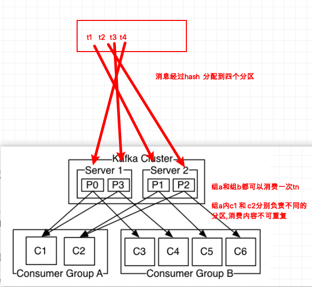

<!-- TOC -->

- [基本概念](#基本概念)
    - [Broker](#broker)
    - [Topic](#topic)
    - [Partition](#partition)
    - [Consumer Group 即 User Group](#consumer-group-即-user-group)
    - [Offset](#offset)
- [Kafka和RocketMq的不同](#kafka和rocketmq的不同)
- [kafka消息的同步机制](#kafka消息的同步机制)
    - [Producer的三种保证](#producer的三种保证)
    - [Consumer的三种保证](#consumer的三种保证)
    - [消息传递过程](#消息传递过程)
- [Kafka的offset与提交关系](#kafka的offset与提交关系)
    - [自动提交](#自动提交)
    - [手动提交](#手动提交)
        - [手动提交的三种方式 同步 异步 混合(针对提交失败的处理方式)](#手动提交的三种方式-同步-异步-混合针对提交失败的处理方式)

<!-- /TOC -->

# 基本概念

同一个topic的消息,有多个分区,会被平均分配(不是复制)到这几个分区,  
同一个组的多个消费者,会分别负责一个分区,来取他们中的消息消费;如果是多个消费者负责一个分区,会有offset来控制消费顺序.

<div align="center">  </div>

## Broker
物理概念，Kafka集群包含一个或多个服务器，这种服务器被称为broker。


## Topic
是Kafka下消息的类别，类似于RabbitMQ中的Exchange的概念。这是逻辑上的概念，用来区分、隔离不同的消息数据，屏蔽了底层复杂的存储方式。对于大多数人来说，在开发的时候只需要关注数据写入到了哪个topic、从哪个topic取出数据。 

## Partition
是Kafka下数据存储的基本单元，这个是物理上的概念。**同一个topic的数据，会被分散的存储到多个partition中**，其优势在于：有利于水平扩展，避免单台机器在磁盘空间和性能上的限制，为了做到均匀分布，通常partition的数量通常是Broker Server数量的整数倍。

## Consumer Group 即 User Group
是Kafka实现单播和广播两种消息模型的手段。同一个topic的数据，会广播给不同的group；同一个group中的worker，只有一个worker能拿到这个数据。换句话说，对于同一个topic，每个group都可以拿到同样的所有数据，但是数据进入group后只能被其中的一个worker消费。

group内的worker可以使用多线程或多进程来实现，也可以将进程分散在多台机器上，**worker的数量通常不超过partition的数量，且二者最好保持整数倍关系**，因为Kafka在设计时假定了一个partition只能被一个worker消费（同一group内）。User group是为了便于实现MQ中的多播，重复消费等引入的概念。如果ConsumerA以及ConsumerB同在一个UserGroup，那么ConsumerA消费的数据ConsumerB就无法消费了。usergroup中的consumer使用一套offset。组内必然可以有多个消费者或消费者实例(consumer instance)，它们共享一个公共的ID，即group ID。

组内的所有消费者协调在一起来消费订阅主题(subscribed topics)的所有分区(partition)。当然，每个分区只能由同一个消费组内的一个consumer来消费。
1）consumer group下可以有一个或多个consumer instance，consumer instance可以是一个进程，也可以是一个线程
2）group.id是一个字符串，唯一标识一个consumer group
3）consumer group下订阅的topic下的每个分区只能分配给某个group下的一个consumer(当然该分区还可以被分配给其他group)

**一个topic有多个分区,每个group可以订阅多个topic,group中的 每个consumer instance都可以消费同一个topic下每个分区的数据,但是group存有每个分区的offset,所以保证一个topic 多个分区下的每个数据都只被 一个group 消费一次**

## Offset
Offset专指Partition以及User Group而言，记录某个user group在某个partiton中当前已经消费到达的位置。

# Kafka和RocketMq的不同

https://www.jianshu.com/p/c474ca9f9430

# kafka消息的同步机制

producer与consumer的delivery guarantee有三种：

At most once 消息可能会丢，但绝不会重复传输

At least one 消息绝不会丢，但可能会重复传输

Exactly once 每条消息肯定会被传输一次且仅传输一次，很多时候这是用户所想要的

## Producer的三种保证

producer 的deliver guarantee 可以通过request.required.acks参数的设置来进行调整：

0 ，相当于异步发送，消息发送完毕即offset增加，继续生产；相当于At most once

1，leader收到leader replica 对一个消息的接受ack才增加offset，然后继续生产；

-1，leader收到所有replica 对一个消息的接受ack才增加offset，然后继续生产

当producer向broker发送消息时，一旦这条消息被commit，因数replication的存在，它就不会丢。但是如果producer发送数据给broker后，遇到的网络问题而造成通信中断，那producer就无法判断该条消息是否已经commit。这一点有点像向一个自动生成primary key的数据库表中插入数据。虽然Kafka无法确定网络故障期间发生了什么，但是producer可以生成一种类似于primary key的东西，发生故障时幂等性的retry多次，这样就做到了Exactly one。截止到目前(Kafka 0.8.2版本，2015-01-25)，这一feature还并未实现，有希望在Kafka未来的版本中实现。（所以目前默认情况下一条消息从producer和broker是确保了At least once，但可通过设置producer异步发送实现At most once）。

## Consumer的三种保证

　　consumer在从broker读取消息后，可以选择commit，该操作会在Zookeeper中存下该consumer在该partition下读取的消息的offset。该consumer下一次再读该partition时会从下一条开始读取。如未commit，下一次读取的开始位置会跟上一次commit之后的开始位置相同。当然可以将consumer设置为autocommit，即consumer一旦读到数据立即自动commit。如果只讨论这一读取消息的过程，那Kafka是确保了Exactly once。但实际上实际使用中consumer并非读取完数据就结束了，而是要进行进一步处理，而数据处理与commit的顺序在很大程度上决定了消息从broker和consumer的delivery guarantee semantic。

读完消息先commit再处理消息。这种模式下，如果consumer在commit后还没来得及处理消息就crash了，下次重新开始工作后就无法读到刚刚已提交而未处理的消息，这就对应于At most once

读完消息先处理再commit。这种模式下，如果处理完了消息在commit之前consumer crash了，下次重新开始工作时还会处理刚刚未commit的消息，实际上该消息已经被处理过了。这就对应于At least once（默认）
如果一定要做到Exactly once，就需要协调offset和实际操作的输出。精典的做法是引入两阶段提交。如果能让offset和操作输入存在同一个地方，会更简洁和通用。这种方式可能更好，因为许多输出系统可能不支持两阶段提交。比如，consumer拿到数据后可能把数据放到HDFS，如果把最新的offset和数据本身一起写到HDFS，那就可以保证数据的输出和offset的更新要么都完成，要么都不完成，间接实现Exactly once。（目前就high level API而言，offset是存于Zookeeper中的，无法存于HDFS，而low level API的offset是由自己去维护的，可以将之存于HDFS中）

## 消息传递过程

　　Producer在发布消息到某个Partition时，先通过Zookeeper找到该Partition的Leader，然后无论该Topic的Replication Factor为多少（也即该Partition有多少个Replica），Producer只将该消息发送到该Partition的Leader。Leader会将该消息写入其本地Log。每个Follower都从Leader pull数据。这种方式上，Follower存储的数据顺序与Leader保持一致。Follower在收到该消息并写入其Log后，向Leader发送ACK。一旦Leader收到了ISR中的所有Replica的ACK，该消息就被认为已经commit了，Leader将增加HW（即offset）并且向Producer发送ACK。

为了提高性能，每个Follower在接收到数据后就立马向Leader发送ACK，而非等到数据写入Log中。因此，对于已经commit的消息，Kafka只能保证它被存于多个Replica的内存中，而不能保证它们被持久化到磁盘中，也就不能完全保证异常发生后该条消息一定能被Consumer消费。但考虑到这种场景非常少见，可以认为这种方式在性能和数据持久化上做了一个比较好的平衡。在将来的版本中，Kafka会考虑提供更高的持久性。

Consumer读消息也是从Leader读取，只有被commit过的消息（offset低于HW的消息）才会暴露给Consumer。

# Kafka的offset与提交关系

//设置不自动提交，手动更新offset:`properties.put("enable.auto.commit", "false");`

## 自动提交

Kafka中偏移量的自动提交是由参数enable_auto_commit和auto_commit_interval_ms控制的，当enable_auto_commit=True时，Kafka在消费的过程中会以频率为auto_commit_interval_ms向Kafka自带的topic(__consumer_offsets)进行偏移量提交，具体提交到哪个Partation是以算法：partation=hash(group_id)%50来计算的。

调用consumer.close()时候也会触发自动提交，因为它默认autocommit=True

对于自动提交偏移量，如果auto_commit_interval_ms的值设置的过大，当消费者在自动提交偏移量之前异常退出，将导致kafka未提交偏移量，进而出现重复消费的问题，所以建议auto_commit_interval_ms的值越小越好。

如果让kafka自动去维护offset，消费者拉到消息还没消费完成,它就会认为这条数据已经被消费了，那么会造成**数据丢失**.

## 手动提交

[关于Kafka 的 consumer 消费者手动提交详解](https://www.cnblogs.com/xuwujing/p/8432984.html)

consumer端手动提交offset之后,该offset之前的消息都会被当成已经消费,之后的数据即使消费了也会被当成没消费.比如:服务端有10条数据,consumer消费到第5条,commit了,消费到第10条没有commit程序退出,下次consumer重启之后,会从第6条开始消费.

如果让消费者手动提交，如果在上面的场景中，那么需要我们手动commit，如果comsumer挂了,程序就不会执行commit,其他同group的消费者又可以消费这条数据，保证数据不丢.但可能会导致**重复消费**,

### 手动提交的三种方式 同步 异步 混合(针对提交失败的处理方式)

[Kafka提交offset机制](https://www.cnblogs.com/FG123/p/10091599.html)

1.同步手动提交偏移量

同步模式下提交失败的时候一直尝试提交，直到遇到无法重试的情况下才会结束，同时同步方式下消费者线程在拉取消息会被阻塞，在broker对提交的请求做出响应之前，会一直阻塞直到偏移量提交操作成功或者在提交过程中发生异常，限制了消息的吞吐量。

consumer.commit()

2.异步手动提交偏移量+回调函数

 异步手动提交offset时，消费者线程不会阻塞，提交失败的时候也不会进行重试，并且可以配合回调函数在broker做出响应的时候记录错误信息。

对于异步提交，由于不会进行失败重试，当消费者异常关闭或者触发了再均衡前，如果偏移量还未提交就会造成偏移量丢失。

consumer.commit_async(callback=_on_send_response)

 3.异步+同步 组合的方式提交偏移量

针对异步提交偏移量丢失的问题，通过对消费者进行异步批次提交并且在关闭时同步提交的方式，这样即使上一次的异步提交失败，通过同步提交还能够进行补救，同步会一直重试，直到提交成功。

通过finally在最后不管是否异常都会触发consumer.commit()来同步补救一次，确保偏移量不会丢失

```python
"""
同步和异步组合的方式提交偏移量
"""

import pickle
import uuid
import time
from kafka import KafkaConsumer

consumer = KafkaConsumer(
    bootstrap_servers=['192.168.33.11:9092'],
    group_id="test_group_1",
    client_id="{}".format(str(uuid.uuid4())),
    enable_auto_commit=False,  # 设置为手动提交偏移量.
    key_deserializer=lambda k: pickle.loads(k),
    value_deserializer=lambda v: pickle.loads(v)
)

# 订阅消费round_topic这个主题
consumer.subscribe(topics=('round_topic',))


def _on_send_response(*args, **kwargs):
    """
    提交偏移量涉及的回调函数
    :param args:
    :param kwargs:
    :return:
    """
    if isinstance(args[1], Exception):
        print('偏移量提交异常. {}'.format(args[1]))
    else:
        print('偏移量提交成功')


try:
    start_time = time.time()
    while True:
        consumer_records_dict = consumer.poll(timeout_ms=100)

        record_num = 0
        for key, record_list in consumer_records_dict.items():
            for record in record_list:
                record_num += 1
        print("---->当前批次获取到的消息个数是:<----".format(record_num))
        record_num = 0

        for k, record_list in consumer_records_dict.items():
            print(k)
            for record in record_list:
                print("topic = {},partition = {},offset = {},key = {},value = {}".format(
                    record.topic, record.partition, record.offset, record.key, record.value)
                )

        try:
            # 轮询一个batch 手动提交一次
            consumer.commit_async(callback=_on_send_response)
            end_time = time.time()
            time_counts = end_time - start_time
            print(time_counts)
        except Exception as e:
            print('commit failed', str(e))

except Exception as e:
    print(str(e))
finally:
    try:
        # 同步提交偏移量,在消费者异常退出的时候再次提交偏移量,确保偏移量的提交.
        consumer.commit()
        print("同步补救提交成功")
    except Exception as e:
        consumer.close()
```

