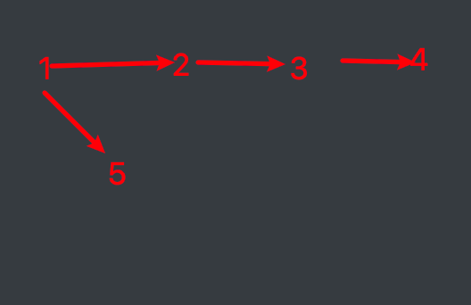

<!-- TOC -->

- [动态规划和贪心算法的区别](#动态规划和贪心算法的区别)
- [[@@@@72. 编辑距离](https://leetcode-cn.com/problems/edit-distance/)](#72-编辑距离httpsleetcode-cncomproblemsedit-distance)
- [[@1143. 最长公共子序列](https://leetcode-cn.com/problems/longest-common-subsequence/)](#1143-最长公共子序列httpsleetcode-cncomproblemslongest-common-subsequence)
- [@删除最少字符变成回文串](#删除最少字符变成回文串)
- [[@@647. 回文子串](https://leetcode-cn.com/problems/palindromic-substrings/)(数量)](#647-回文子串httpsleetcode-cncomproblemspalindromic-substrings数量)
- [[5. 最长回文子串](https://leetcode-cn.com/problems/longest-palindromic-substring/)(长度)](#5-最长回文子串httpsleetcode-cncomproblemslongest-palindromic-substring长度)
- [用少来表示多](#用少来表示多)
- [@[253. 会议室 II](https://leetcode-cn.com/problems/meeting-rooms-ii/)](#253-会议室-iihttpsleetcode-cncomproblemsmeeting-rooms-ii)
- [@[435. 无重叠区间](https://leetcode-cn.com/problems/non-overlapping-intervals/)](#435-无重叠区间httpsleetcode-cncomproblemsnon-overlapping-intervals)
- [[443. 压缩字符串](https://leetcode-cn.com/problems/string-compression/)](#443-压缩字符串httpsleetcode-cncomproblemsstring-compression)
- [@@@[43. 字符串相乘](https://leetcode-cn.com/problems/multiply-strings/)](#43-字符串相乘httpsleetcode-cncomproblemsmultiply-strings)
- [字符移位](#字符移位)
- [[295. 数据流的中位数](https://leetcode-cn.com/problems/find-median-from-data-stream/)](#295-数据流的中位数httpsleetcode-cncomproblemsfind-median-from-data-stream)
- [@@@@图的m着色问题(dfs)](#图的m着色问题dfs)
- [](#)
- [100亿数字排序,求中位数,平均数,求和](#100亿数字排序求中位数平均数求和)
- [[113. 路径总和 II](https://leetcode-cn.com/problems/path-sum-ii/)](#113-路径总和-iihttpsleetcode-cncomproblemspath-sum-ii)
- [[@@@547. 朋友圈](https://leetcode-cn.com/problems/friend-circles/)](#547-朋友圈httpsleetcode-cncomproblemsfriend-circles)
- [[@@@200. 岛屿数量](https://leetcode-cn.com/problems/number-of-islands/)](#200-岛屿数量httpsleetcode-cncomproblemsnumber-of-islands)
- [找到二叉搜索树中与target之差的绝对值最小的node](#找到二叉搜索树中与target之差的绝对值最小的node)
- [@@@@二叉树的非递归后序遍历](#二叉树的非递归后序遍历)
- [@@@有序数组重建平衡二叉树](#有序数组重建平衡二叉树)
- [一个数组里找任意两个数之和的绝对值最小值](#一个数组里找任意两个数之和的绝对值最小值)
- [一个整数数组找任意两数的最小差](#一个整数数组找任意两数的最小差)
- [[@@208. 实现 Trie (前缀树)](https://leetcode-cn.com/problems/implement-trie-prefix-tree/)](#208-实现-trie-前缀树httpsleetcode-cncomproblemsimplement-trie-prefix-tree)
- [[@@@209. 长度最小的子数组](https://leetcode-cn.com/problems/minimum-size-subarray-sum/)](#209-长度最小的子数组httpsleetcode-cncomproblemsminimum-size-subarray-sum)
- [[@@@@60. 第k个排列](https://leetcode-cn.com/problems/permutation-sequence/)](#60-第k个排列httpsleetcode-cncomproblemspermutation-sequence)
- [[@162. 寻找峰值](https://leetcode-cn.com/problems/find-peak-element/)](#162-寻找峰值httpsleetcode-cncomproblemsfind-peak-element)
- [[@@127. 单词接龙](https://leetcode-cn.com/problems/word-ladder/)](#127-单词接龙httpsleetcode-cncomproblemsword-ladder)
- [IP重复攻击](#ip重复攻击)
- [ab替换成c,b替换成ef](#ab替换成cb替换成ef)
- [[@@@4. 寻找两个有序数组的中位数](https://leetcode-cn.com/problems/median-of-two-sorted-arrays/)](#4-寻找两个有序数组的中位数httpsleetcode-cncomproblemsmedian-of-two-sorted-arrays)
- [[@@@@@701. 二叉搜索树中的插入操作](https://leetcode-cn.com/problems/insert-into-a-binary-search-tree/)](#701-二叉搜索树中的插入操作httpsleetcode-cncomproblemsinsert-into-a-binary-search-tree)
- [[@@@@@@@@@@450. 删除二叉搜索树中的节点](https://leetcode-cn.com/problems/delete-node-in-a-bst/)](#450-删除二叉搜索树中的节点httpsleetcode-cncomproblemsdelete-node-in-a-bst)
- [[@654. 最大二叉树](https://leetcode-cn.com/problems/maximum-binary-tree/)](#654-最大二叉树httpsleetcode-cncomproblemsmaximum-binary-tree)
- [[@@@273. 整数转换英文表示](https://leetcode-cn.com/problems/integer-to-english-words/)](#273-整数转换英文表示httpsleetcode-cncomproblemsinteger-to-english-words)
- [[272. 最接近的二叉搜索树值 II](https://leetcode-cn.com/problems/closest-binary-search-tree-value-ii/)](#272-最接近的二叉搜索树值-iihttpsleetcode-cncomproblemsclosest-binary-search-tree-value-ii)
- [[@@210. 课程表 II](https://leetcode-cn.com/problems/course-schedule-ii/)](#210-课程表-iihttpsleetcode-cncomproblemscourse-schedule-ii)
- [[@207. 课程表](https://leetcode-cn.com/problems/course-schedule/)](#207-课程表httpsleetcode-cncomproblemscourse-schedule)

<!-- /TOC -->


#### 动态规划和贪心算法的区别

动态规划和贪心算法都是一种递推算法 
均有局部最优解来推导全局最优解 

不同点： 
贪心算法： 
1.贪心算法中，作出的每步贪心决策都无法改变，因为贪心策略是由上一步的最优解推导下一步的最优解，而上一部之前的最优解则不作保留。 
2.由（1）中的介绍，可以知道贪心法正确的条件是：每一步的最优解一定包含上一步的最优解。 


#### [@@@@72. 编辑距离](https://leetcode-cn.com/problems/edit-distance/)

@如果有一个字符串长度为0

@初始化边界的方式

@如果i和j相等,取的不是 `math.min(dp[i][j],dp[i-1][j-1])`;而是直接取`dp[i-1][j-1],因为dp[i][j]此时为0`

@@@@@@@删除 插入 替换都是针对word1而言的

```prolog
讲一下我自己对状态转移方程的理解,麻烦大家看看我说得对不对有没有道理:
(一)、当word1[i]==word2[j]时,由于遍历到了i和j,说明word1的0~i-1和word2的0~j-1的匹配结果已经生成,
由于当前两个字符相同,因此无需做任何操作,dp[i][j]=dp[i-1][j-1]
(二)、当word1[i]!=word2[j]时,可以进行的操作有3个:
      ① 替换操作:可能word1的0~i-1位置与word2的0~j-1位置的字符都相同,
           只是当前位置的字符不匹配,进行替换操作后两者变得相同,
           所以此时dp[i][j]=dp[i-1][j-1]+1(这个加1代表执行替换操作)
      ②删除操作:若此时word1的0~i-1位置与word2的0~j位置已经匹配了,
         此时多出了word1的i位置字符,应把它删除掉,才能使此时word1的0~i(这个i是执行了删除操作后新的i)
         和word2的0~j位置匹配,因此此时dp[i][j]=dp[i-1][j]+1(这个加1代表执行删除操作)
      ③插入操作:若此时word1的0~i位置只是和word2的0~j-1位置匹配,
          此时只需要在原来的i位置后面插入一个和word2的j位置相同的字符使得
          此时的word1的0~i(这个i是执行了插入操作后新的i)和word2的0~j匹配得上,
          所以此时dp[i][j]=dp[i][j-1]+1(这个加1代表执行插入操作)
      ④由于题目所要求的是要最少的操作数:所以当word1[i] != word2[j] 时,
          需要在这三个操作中选取一个最小的值赋格当前的dp[i][j]
```


```JAVA
public int minDistance(String word1, String word2) {
    if (word1 == null || word2 == null) {
        return 0;
    }
    int len1 = word1.length();
    int len2 = word2.length();
    //如果其中有一个字符串长度为0
    if (len1 * len2 == 0) {
        return len1 + len2;
    }
    int[][] dp = new int[len1 + 1][len2 + 1];
    //边界的初始化
    for (int i = 0; i <= len1; i++) {
        dp[i][0] = i;
    }
    for (int j = 0; j <= len2; j++) {
        dp[0][j] = j;
    }
    //如果i和j的字符相等,则ij的编辑距离等于 i-1 j-1
    //如果i j的字符不等,则ij的编辑距离取决于删除i-1 还是删除 j-1的字符会让编辑距离小一点
    for (int i = 1; i <= len1; i++) {
        for (int j = 1; j <= len2; j++) {
            if (word1.charAt(i - 1) == word2.charAt(j - 1)) {
                dp[i][j] = dp[i - 1][j - 1];
            } else {
                dp[i][j] = Math.min(Math.min(dp[i - 1][j - 1], dp[i][j - 1]), dp[i - 1][j]) + 1;
            }
        }
    }
    return dp[len1][len2];
}
```

#### [@1143. 最长公共子序列](https://leetcode-cn.com/problems/longest-common-subsequence/)

```java
public int longestCommonSubsequence(String text1, String text2) {
        if (text1 == null || text2 == null) {
            return 0;
        }
        int len1 = text1.length();
        int len2 = text2.length();
        int[][] dp = new int[len1 + 1][len2 + 1];
        for (int i = 1; i <= len1; i++) {
            for (int j = 1; j <= len2; j++) {
                if (text1.charAt(i - 1) == text2.charAt(j - 1)) {
                    dp[i][j] = dp[i - 1][j - 1] + 1;
                } else {
                    dp[i][j] = Math.max(dp[i][j - 1], dp[i - 1][j]);
                }
            }
        }
        return dp[len1][len2];
    }
```


#### @删除最少字符变成回文串


题目描述：给定一字符串s,求最少删除多少个字符可以使得s成为回文串。例如：s="abca",答案是1.

思路:把自身翻转, 自身和翻转的lcs,就是最大回文长度,str.length()-lcs 即为要删除的字符.

```java
public int minChange(String str) {
        int lcs = longestCommonSubsequence(str, null);
        return str.length() - lcs;
    }

    public int longestCommonSubsequence(String text1, String text2) {
        int len1 = text1.length();
        StringBuffer stringBuffer = new StringBuffer(text1);
        text2 = stringBuffer.reverse().toString();
        int len2 = text2.length();
        int[][] dp = new int[len1 + 1][len2 + 1];
        for (int i = 0; i <= len1; i++) {
            for (int j = 0; j <= len2; j++) {
                if (j == 0 || i == 0) {
                    dp[i][j] = 0;
                    continue;
                }
                if (text1.charAt(i - 1) == text2.charAt(j - 1)) {
                    dp[i][j] = dp[i - 1][j - 1] + 1;
                } else {
                    dp[i][j] = Math.max(dp[i - 1][j], dp[i][j - 1]);
                }
            }
        }
        return dp[len1][len2];
    }
```


#### [@@647. 回文子串](https://leetcode-cn.com/problems/palindromic-substrings/)(数量)

本题可以看成是字符串类的动态规划

中心扩展法比动态规划效率高.

因为动态规划是从短串到长串都要判断,不好剪枝

中心扩展从短串到长串的过程中,如果短串不成立,则长串终止.

```java
改进:动态规划的做法
     i-j<2  在i-j为0的时候,i和j为同一个值;i-j为1的时候由于前面的
     s.charAt(i)==s.charAt(j)也决定了它们是相等的
public int countSubstrings(String s) {
    int len = s.length();
    boolean[][] dp = new boolean[len][len];
    int ret = 0;
    for (int i = 0; i < len; i++) {
        for (int j = i; j >= 0; j--) {
            //i-j<2  在i-j为0的时候,i和j为同一个值;i-j为1的时候由于前面的
            //s.charAt(i)==s.charAt(j)也决定了它们是相等的
            if (s.charAt(i) == s.charAt(j) && ((i - j < 2) || dp[i - 1][j + 1])) {
                dp[i][j] = true;
                ret++;
            }
        }
    }
    return ret;
}
改进: 从中间往两边扩展,注意拓展方式有两种,  aba 以b为对称线  和 aa以两个a之间为对称线
    对应的代码是  int left = i;
           		 int right = left;
				left = i;
           		 right = left + 1;
	
     public int countSubstrings(String s) {
        int len = s.length();
        int res = 0;
        for (int i = 0; i < len; i++) {
            int left = i;
            int right = left;
            while (left >= 0 && right < len && s.charAt(left) == s.charAt(right)) {
                left--;
                right++;
                res++;
            }
            left = i;
            right = left + 1;
            while (left >= 0 && right < len && s.charAt(left) == s.charAt(right)) {
                left--;
                right++;
                res++;
            }

        }
        return res;
    }
```


#### [5. 最长回文子串](https://leetcode-cn.com/problems/longest-palindromic-substring/)(长度)

```java
改进:利用动规:dp[i][j] = dp[i-1][j+1] +1 (如果len>2的情况下,并且char[i] == char[j])
    dp[i][j]的含义是 以为i终点,j为起点的字符串中对称字符的长度.

public String longestPalindrome(String s) {
    if (s == null || s.length() == 0) {
        return "";
    }
    int maxLen = 0;
    int maxRow = 0;
    int maxCol = 0;
    int len = s.length();
    int[][] dp = new int[len][len];
    for (int i = 0; i < len; i++) {
        for (int j = i; j >= 0; j--) {

            if (s.charAt(i) == s.charAt(j)) {
                if (i == j) {//长度为1
                    dp[i][j] = 1;
                } else if (i == j + 1) {//长度为2
                    dp[i][j] = 2;
                } else { //长度大于2
                    if (dp[i - 1][j + 1] != 0) {
                        dp[i][j] = dp[i - 1][j + 1] + 2;

                    } else {
                        dp[i][j] = 0;
                    }
                }
                if (maxLen < dp[i][j]) {
                    maxLen = dp[i][j];
                    maxRow = i;
                    maxCol = j;
                }
            } else {
                //char i  与 char j 不相等
                dp[i][j] = 0;
            }
        }
    }
    return s.substring(maxCol, maxRow + 1);
}
```

#### 用少来表示多


给一串只包含0~9的数字串，每个数字出现的概率相同（比如32978417506），现在告诉你（1,3,5,7）这四个数字不可用，即只能用（0,2,4,6,8,9）这6个数，如何表示原数字串？

* **00表示0**, 02表示1, 04表示3， 06表示5， 08表示7

* 15位表示以前的10位，所以存储多出来0.5倍

    

#### @[253. 会议室 II](https://leetcode-cn.com/problems/meeting-rooms-ii/)


```java
思路:startTime排序,每到一个startTime,usedRoom就+1.如果在该时间之前有结束的会议室(endTime[endPointer]<=startTime[startPointer]).usedRoom就-1;
public int minMeetingRooms(int[][] intervals) {
        int len = intervals.length;

        int max = 0;
        int[] startTime = new int[len];
        int[] endTime = new int[len];
        for (int i = 0; i < len; i++) {
            startTime[i] = intervals[i][0];
            endTime[i] = intervals[i][1];
        }
        Arrays.sort(startTime);
        Arrays.sort(endTime);
        int usedRooms = 0;
        int endPointer = 0;
        for (int startPointer = 0; startPointer < len; ) {
            if (endTime[endPointer] <= startTime[startPointer]) {
                usedRooms--;
                endPointer++;
            }
            usedRooms++;
            startPointer++;
        }
        return usedRooms;
    }
```


#### @[435. 无重叠区间](https://leetcode-cn.com/problems/non-overlapping-intervals/)

求无重叠区间cnt,然后用len-ret就是需要移除的最少区间数

把区间按照endTime从小到大排序. 然后往后找,如果后面的区间的startTime<该endTime,则有重叠.

如果endTIme>=startTime无重叠,此时endTime更新到下个区间,cnt++


```java
public int eraseOverlapIntervals(int[][] intervals) {
        if (intervals == null || intervals.length == 0) {
            return 0;
        }
        Comparator<int[]> c = new Comparator<int[]>() {
            public int compare(int[] a, int[] b) {
                return a[1] - b[1];
            }
        };
        int len = intervals.length;
        Arrays.sort(intervals, c);
        int cnt = 1;
        int endTime = intervals[0][1];
        for (int i = 1; i < intervals.length; i++) {
            int startTime = intervals[i][0];
            if (endTime > startTime) {
                continue;
            } else if (endTime <= startTime) {
                cnt++;
                endTime = intervals[i][1];
            }
        }
        return len - cnt;
    }
```


#### [443. 压缩字符串](https://leetcode-cn.com/problems/string-compression/)


write read,chBegin的妙用

if (read == chars.length - 1 || chars[read] != chars[read + 1])  这两个条件很重要

```java
 public int compress(char[] chars) {
        if (chars == null) {
            return 0;
        }
        int left = 0;
        int write = 0;
        int len = chars.length;
        for (int right = 0; right < len; ) {
            char cur = chars[left];
            while (right + 1 < len && chars[right] == chars[right + 1]) {
                right++;
            }
            chars[write++] = cur;
            int cnt = right - left + 1;
            if (cnt > 1) {
                String temp = cnt + "";
                for (int i = 0; i < temp.length(); i++) {
                    chars[write++] = temp.charAt(i);
                }
            }
            left = right + 1;
            right++;
        }
        return write;
    }
```


#### @@@[43. 字符串相乘](https://leetcode-cn.com/problems/multiply-strings/)


@i 和 j长的数字 乘出来的最大长度是 i+j 所以创建数组 new int[i+j]

@i和 j 都是从len1-1   len2-1 开始往小走, 乘出来的数据放在i+j+1的地方

```java
 public String multiply(String num1, String num2) {
        if (num1.equals("0") || num2.equals("0")) {
            return "0";
        }
        int[] ret = new int[num1.length() + num2.length()];
        for (int i = num1.length() - 1; i >= 0; i--) {
            int a = num1.charAt(i) - '0';
            for (int j = num2.length() - 1; j >= 0; j--) {
                
                int b = num2.charAt(j) - '0';
                int sum = a * b + ret[i + j + 1];
                
                ret[i + j + 1] = sum % 10;
                ret[i + j] += sum / 10;
            }
        }
        StringBuilder retStr = new StringBuilder();
        for (int i = 0; i < ret.length; i++) {
            if (i == 0 && ret[i] == 0) {
                while (ret[i] == 0) {
                    i++;
                }
            }
            retStr.append(ret[i] + "");
        }
        return retStr.toString();
    }
```


#### 字符移位

链接：https://www.nowcoder.com/questionTerminal/7e8aa3f9873046d08899e0b44dac5e43
来源：牛客网

小Q最近遇到了一个难题：把一个字符串的大写字母放到字符串的后面，各个字符的相对位置不变，且不能申请额外的空间。
  你能帮帮小Q吗？ 

**输入描述:**

```
输入数据有多组，每组包含一个字符串s，且保证:1<=s.length<=1000.
  
```

**输出描述:**

```
对于每组数据，输出移位后的字符串。
```

```java
思路1
冒泡:
@@@@@@@@@@@@@@@
@要交换 i 0~len-1次
@每次  j从 len-1  到  i进行扫描;逐渐冒泡,把一个小写字母冒到i的位置上.

 public String func(String str) {
        char[] chars = str.toCharArray();
        for (int i = 0; i < chars.length; i++) {
            for (int j = chars.length - 2; j >= i; j--) {
                if (chars[j] >= 'A' && chars[j] <= 'Z' && chars[j + 1] >= 'a' && chars[j + 1] <= 'z') {
                    char temp = chars[j];
                    chars[j] = chars[j + 1];
                    chars[j + 1] = temp;
                }
            }
        }
        return new String(chars);
    }


思路2:
选择排序:
@@@@@@@@@@@@@@@@@@@
@littleIndex代表下一个要插入小写字母的位置
@i往后找,找到一个小写字母. 然后从littleIndex 到 i之间的字母往后移一位
@然后把i处的字母插入到littleIndex处.

 public String func(String str) {
        char[] chars = str.toCharArray();
        int littleIndex = 0;
        for (int i = 0; i < chars.length; i++) {
            if (chars[i] >= 'a' && chars[i] <= 'z') {
                char temp = chars[i];
                for (int j = i; j >= littleIndex + 1; j--) {
                    chars[j] = chars[j - 1];
                }
                chars[littleIndex] = temp;
                littleIndex++;
            }
        }
        return new String(chars);
    }

思路3:

public static String getResult(String str) {
        return str.replaceAll("[A-Z]", "") + str.replaceAll("[a-z]", "");
    }
```


#### [295. 数据流的中位数](https://leetcode-cn.com/problems/find-median-from-data-stream/)

@优先队列是log(n)的复杂度.

```java

class MedianFinder {
    PriorityQueue<Integer> leftNums = null;
    PriorityQueue<Integer> rightNums = null;

    public MedianFinder() {
        leftNums = new PriorityQueue<Integer>(10, (o2, o1) -> (o1 - o2));
        rightNums = new PriorityQueue<Integer>(10, (o1, o2) -> (o1 - o2));

    }

    public void addNum(int num) {
        if (leftNums.size() > rightNums.size()) {
            rightNums.add(num);
        } else {
            leftNums.add(num);
        }
        if (!rightNums.isEmpty() && rightNums.peek() < leftNums.peek()) {
            int leftNum = leftNums.poll();
            int rightNum = rightNums.poll();
            leftNums.add(rightNum);
            rightNums.add(leftNum);
        }
    }

    public double findMedian() {
        if (leftNums.size() == rightNums.size()) {
            return (double) (leftNums.peek() + rightNums.peek()) / 2;
        }
        return leftNums.peek();
    }
}
```


#### @@@@图的m着色问题(dfs)

@color数组,0代表还未染色,并且可以用来当visited数组

@先染色,染色后找到第一个未访问的point进行dfs.

@如果图中任意两点都是连通的，那么图被称作连通图。 如果有图如下,5那里在我的代码里不适用原因是

1.我用回溯的cnt作为ret++的条件,应该改成cnt为全量,并且1节点每换一次颜色,cnt置零

2.backtracing往下走的时候,只会选择第一个联通point,后续point会被抛弃,比如图中5



[问题描述]

给定无向连通图G和m种不同的颜色，用这些颜色给图的各个顶点着一种颜色，若某种方案使得图中每条边的2个顶点的颜色都不相同，则是一个满足的方案，找出所有的方案。

输入格式
 第一行有3个正整数n，k和m，分别表示n个顶点，k条边，m种颜色
接下来k行，每行2个正整数，保送一条边的两个顶点

所有不同的着色方案数
输入样例】
5 8 4 
1 2
1 3 
1 4
2 3
2 4
2 5
3 4
4 5
输出样例
48

```java
  public class Main {
    static int[][] matrix = null;
    int[] pointColor = null;
    int len = 0;
    int numPoint = 0;
    int numEdge = 0;
    int ret = 0;
    int numColor = 0;

    public int getResult(int numPoint, int numEdge, int numColor) {
        len = numPoint;
        this.numColor = numColor;
        this.numEdge = numEdge;
        this.numPoint = numPoint;
//        this.matrix = new int[numPoint + 1][numPoint + 1];
        pointColor = new int[numPoint + 1];
        backtracing(1, 1);
        return ret;
    }

    private boolean uniqueColor(int index) {
        for (int i = 1; i <= numPoint; i++) {
            if (matrix[index][i] == 1 && pointColor[index] == pointColor[i]) {
                return false;
            }
        }
        return true;
    }

    private void backtracing(int index, int cnt) {
        if (cnt >= numPoint + 1) {
            return;
        }
        //先染色
        for (int j = 1; j <= numColor; j++) {
            pointColor[index] = j;
            //如果颜色符合要求
            if (uniqueColor(index)) {
                if (cnt == numPoint) {
                    ret++;
                }
                //从与index相连的  第一个没有被访问过的 顶点开始染色
                //为什么是第一个,假设1与2,3相连,我给1染颜色1,2染颜色2,3染颜色3.
                //1->2->3  和  1->3->2  其实是同一种颜色组合.
                for (int k = 1; k <= numPoint; k++) {
                    if (matrix[index][k] == 1 && pointColor[k] == 0) {
                        backtracing(k, cnt + 1);
                        break;
                    }
                }
            }
            pointColor[index] = 0;
        }
    }

    private void initialMatrix(String str) {
        for (int i = 0; i < str.length(); i = i + 2) {
            int x = str.charAt(i) - '0';
            int y = str.charAt(i + 1) - '0';
            matrix[x][y] = 1;
            matrix[y][x] = 1;
        }
    }

    public static void main(String[] args) {
        Main main = new Main();
        String str = "1213142324253445";
        matrix = new int[6][6];
        main.initialMatrix(str);

        int func = main.getResult(5, 8, 4);
        System.out.println(func);

    }
}
```


```java
 下面的做法错误的原因是  
 1->2->3和
 1->3->2 假设1涂红,2涂蓝,3涂绿,这被认为是两种情况了.
 
 static int[][] matrix = null;
    int[] pointColor = null;
    int len = 0;
    int numPoint = 0;
    int numEdge = 0;
    int ret = 0;
    int numColor = 0;

    public int func(int numPoint, int numEdge, int numColor) {
        len = numPoint;
        this.numColor = numColor;
        this.numEdge = numEdge;
        this.numPoint = numPoint;
//        this.matrix = new int[numPoint + 1][numPoint + 1];
        pointColor = new int[numPoint + 1];
        backtracing(1, 1);
        return ret;
    }

    private boolean uniqueColor(int index) {
        for (int i = 1; i <= numPoint; i++) {
            if (matrix[index][i] == 1 && pointColor[index] == pointColor[i]) {
                return false;
            }
        }
        return true;
    }

    private void backtracing(int index, int cnt) {
        if (cnt >= numPoint + 1) {
            return;
        }
        for (int j = 1; j <= numColor; j++) {
            pointColor[index] = j;
            if (uniqueColor(index)) {
                if (cnt == numPoint) {
                    ret++;
                }
                for (int k = 1; k <= numPoint; k++) {
                    if (matrix[index][k] == 1 && pointColor[k] == 0) {
                        backtracing(k, cnt + 1);
                    }
                }
            }
            pointColor[index] = 0;
        }
    }
```


#### 

#### 100亿数字排序,求中位数,平均数,求和

今天要给100亿个数字排序，100亿个 int 型数字放在文件里面大概有 37.2GB，非常大，内存一次装不下了。那么肯定是要拆分成小的文件一个一个来处理，最终在合并成一个排好序的大文件。

实现思路

1.把这个37GB的大文件，用哈希分成1000个小文件，每个小文件平均38MB左右（理想情况），把100亿个数字对1000取模，模出来的结果在0到999之间，每个结果对应一个文件，所以我这里取的哈希函数是 h = x % 1000，哈希函数取得"好"，能使冲突减小，结果分布均匀。

2.拆分完了之后，得到一些几十MB的小文件，那么就可以放进内存里排序了，可以用快速排序，归并排序，堆排序等等。

3.1000个小文件内部排好序之后，就要把这些内部有序的小文件，合并成一个大的文件，可以用**二叉堆**来做1000路合并的操作，每个小文件是一路，合并后的大文件仍然有序。

- 首先遍历1000个文件，每个文件里面取第一个数字，组成 (数字, 文件号) 这样的组合加入到堆里（假设是从小到大排序，用小顶堆），遍历完后堆里有1000个 (数字，文件号) 这样的元素
- 然后不断从堆顶拿元素出来，每拿出一个元素，把它的文件号读取出来，然后去对应的文件里，加一个元素进入堆，直到那个文件被读取完。拿出来的元素当然追加到最终结果的文件里。
- 按照上面的操作，直到堆被取空了，此时最终结果文件里的全部数字就是有序的了。

最后我用c++写了个实验程序，具体代码在[这里](https://link.jianshu.com?t=https://github.com/hehe520/Data-structure-and-algorithm/blob/master/海量数据处理/外部归并排序 - 分治.cpp)可以看到。

思维拓展

类似的100亿个数字求和，求中位数，求平均数，套路就是一样的了。
 求和：统计每个小文件的和，返回给master再求和就可以了。
 求平均数：上面能求和了，再除以100亿就是平均数了
 求中位数：在排序的基础上，遍历到中间的那个数就是中位数了

#### [113. 路径总和 II](https://leetcode-cn.com/problems/path-sum-ii/)

```java
List<List<Integer>> ret = new ArrayList<>();

    public List<List<Integer>> pathSum(TreeNode root, int sum) {
        preOrder(root, sum, 0, new ArrayList<Integer>());
        return ret;
    }

    public void preOrder(TreeNode root, int sum, int pathSum, List<Integer> path) {
        if (root == null) {
            return;
        }
        path.add(root.val);
        pathSum += root.val;
        if (root.left == null && root.right == null && pathSum == sum) {
            ret.add(new ArrayList<Integer>(path));
            path.remove(path.size() - 1);
            return;
        }
        preOrder(root.left, sum, pathSum, path);
        preOrder(root.right, sum, pathSum, path);
        path.remove(path.size() - 1);
    }
```


#### [@@@547. 朋友圈](https://leetcode-cn.com/problems/friend-circles/)

@count,parent[],size[]

@union ,getParent;

@union的时候往根节点上union

```
if (size[rootP] > size[rootQ]) {
            parent[rootQ] = rootP;
            size[rootP] += size[rootQ];
            count--;
        } else {
            parent[rootP] = rootQ;
            size[rootQ] += size[rootP];
            count--;
        }
```

代码:

```java

public class Solution {
    public int findCircleNum(int[][] M) {
        if (M == null || M.length == 0) {
            return 0;
        }
        int len = M.length;
        UF u = new UF(len);
        for (int i = 0; i < len; i++) {
            for (int j = 0; j < len; j++) {
                if (M[i][j] == 1) {
                    u.union(i, j);
                }
            }
        }
        return u.getCount();
    }
}

class UF {
    private int count;
    private int[] parent;
    private int[] size;

    public UF(int len) {
        this.count = len;
        this.parent = new int[len];
        this.size = new int[len];
        for (int i = 0; i < len; i++) {
            size[i] = 1;
            parent[i] = i;
        }
    }
    public void union(int p, int q) {
        int rootP = findParent(p);
        int rootQ = findParent(q);
        if (rootP == rootQ)
            return;
        if (size[rootP] > size[rootQ]) {
            parent[rootQ] = rootP;
            size[rootP] += size[rootQ];
            count--;
        } else {
            parent[rootP] = rootQ;
            size[rootQ] += size[rootP];
            count--;
        }
    }
    //路径压缩+寻找根节点
    public int findParent(int p) {
        while (parent[p] != p) {
            //把 p的爷爷 替换成  p的爸爸
            parent[p] = parent[parent[p]];
            //把p变成p的爷爷
            p = parent[p];
        }
        return p;
    }

    public int getCount() {
        return count;
    }
     public boolean connected(int p, int q) {
        int rootP = findParent(p);
        int rootQ = findParent(q);
        return rootP == rootQ;
    }

}
```


#### [@@@200. 岛屿数量](https://leetcode-cn.com/problems/number-of-islands/)

@uf的初始化  

i*col + j

如果`gird[i][j]=='0'` 那`parent[i*col][j]=0 和 size[i*col][j]=0`

@小岛的合并 

如果`grid[i][j]=='1',先设为'0',然后跟右方和下方的岛合并`


@@查并集做法

```java
class Solution {
    public int numIslands(char[][] grid) {
        if (grid == null || grid.length == 0) {
            return 0;
        }
        int row = grid.length;
        int col = grid[0].length;
        UF uf = new UF(grid, grid.length, grid[0].length);
        for (int i = 0; i < row; i++) {
            for (int j = 0; j < col; j++) {
                //如果某个坐标是一座岛,就把这座岛与右边或者下边的连接岛 合并
                //为什么没有左和上的岛,i,j是按照从左上往右下的顺序移动
                // 合并前会把grid[i][j]置为0,所以左上的岛永远是空的
                if (grid[i][j] == '1') {
                    grid[i][j] = '0';
                    if (j + 1 < col && grid[i][j + 1] == '1') {
                        uf.union(i * col + j, i * col + j + 1);
                    }
                    if (i + 1 < row && grid[i + 1][j] == '1') {
                        uf.union(i * col + j, (i + 1) * col + j);
                    }
                }
            }
        }
        return uf.getCount();
    }
}

class UF {
    int count;
    int[] parent;
    int[] size;

    public UF(char[][] grid, int row, int col) {
        this.parent = new int[row * col];
        this.size = new int[row * col];
        for (int i = 0; i < row; i++) {
            for (int j = 0; j < col; j++) {
                //如果某个坐标是导,就count++, parent初始化成自己,size初始化为1.
                if (grid[i][j] == '1') {
                    parent[i * col + j] = i * col + j;
                    ++count;
                    size[i * col + j] = 1;
                }
            }
        }
    }

    public int getCount() {
        return this.count;
    }

    public boolean connected(int p, int q) {
        int rootP = findParent(p);
        int rootQ = findParent(q);
        if (rootP == rootQ) {
            return true;
        }
        return false;
    }

    public int findParent(int p) {
        while (p != parent[p]) {
            parent[p] = parent[parent[p]];
            p = parent[p];
        }
        return p;
    }

    public void union(int p, int q) {
        int rootP = findParent(p);
        int rootQ = findParent(q);
        if (rootQ == rootP) {
            return;
        }
        if (size[rootP] > size[rootQ]) {
            size[rootP] += size[rootQ];
            parent[rootQ] = rootP;
        } else {
            size[rootQ] += size[rootP];
            parent[rootP] = rootQ;
        }
        count--;
    }

}
```


#### 找到二叉搜索树中与target之差的绝对值最小的node

@如果node处的值小于target,则node左边的值跟target的差距只会越来越大

比如target是10,如果node=9,则node左边的值,跟10的差距只会越来越大


在二叉查找树中，[查找与目标值最接近的节点并返回](https://www.geeksforgeeks.org/find-closest-element-binary-search-tree/)。如果有多个节点都符合要求，返回其中一个即可

```java
 private int minDiff = Integer.MAX_VALUE;
    public void maxDiffUtil(TreeNode root, int target) {
        if (root == null) {
            return;
        }
        if (root.val == target) {
            minDiff = 0;
            return;
        }
        int abs = Math.abs(root.val - target);

        minDiff = Math.min(minDiff, abs);
        if (target > root.val) {
            maxDiffUtil(root.right, target);
        } else {
            maxDiffUtil(root.left, target);
        }
    }
```


#### @@@@二叉树的非递归后序遍历


```java
private void lastOrder(TreeNode root) {
        if (root == null) {
            return;
        }
        TreeNode lastVisited = null;
        TreeNode nodeCur = root;
        Stack<TreeNode> stack = new Stack<>();
        while (nodeCur != null) {
            stack.add(nodeCur);
            nodeCur = nodeCur.left;
        }
        while (!stack.isEmpty()) {
            nodeCur = stack.pop();
            if (nodeCur.right == null || lastVisited == nodeCur.right) {
                System.out.println(nodeCur.val);
                lastVisited = nodeCur;
            } else if (lastVisited == nodeCur.left) {
                stack.add(nodeCur);
                nodeCur = nodeCur.right;
                while (nodeCur != null) {
                    stack.add(nodeCur);
                    nodeCur = nodeCur.left;
                }
            }
        }
    }
```


#### @@@有序数组重建平衡二叉树

```java
public TreeNode rebuildBST(int[] nums, int start, int end) {
        if (start > end || start < 0 || end > nums.length - 1) {
            return null;
        }
        int mid = start + (end - start) / 2;
        TreeNode treeNode = new TreeNode(nums[mid]);
        treeNode.left = rebuildBST(nums, start, mid - 1);
        treeNode.right = rebuildBST(nums, mid + 1, end);
        return treeNode;
    }
```

#### 一个数组里找任意两个数之和的绝对值最小值

```
排序,left= 0,right = len-1, sum>0 right--,sum<0,left++.
```

#### 一个整数数组找任意两数的最小差

```
排序,相邻的数的差最小
```

#### [@@208. 实现 Trie (前缀树)](https://leetcode-cn.com/problems/implement-trie-prefix-tree/)

```java

class Trie {
    private TreeNode root = null;

    /**
     * Initialize your data structure here.
     */
    public Trie() {
        root = new TreeNode();
    }

    public TreeNode getPrefixEnd(String word) {
        TreeNode node = root;
        for (int i = 0; i < word.length(); i++) {
            char ch = word.charAt(i);
            if (node.containsKey(ch)) {
                node = node.get(ch);
            } else {
                return null;
            }
        }
        return node;
    }

    /**
     * Inserts a word into the trie.
     */
    public void insert(String word) {
        TreeNode node = root;
        for (int i = 0; i < word.length(); i++) {
            char ch = word.charAt(i);
            if (!node.containsKey(ch)) {
                node.put(ch, new TreeNode());
            }
            node = node.get(ch);
        }
        node.setEnd();
    }


    /**
     * Returns if the word is in the trie.
     */
    public boolean search(String word) {
        TreeNode node = getPrefixEnd(word);
        return node != null && node.isEnd();
    }

    /**
     * Returns if there is any word in the trie that starts with the given prefix.
     */
    public boolean startsWith(String prefix) {
        TreeNode node = getPrefixEnd(prefix);
        return node != null;
    }
}

class TreeNode {
    private int len = 26;
    private TreeNode[] links = null;
    private boolean isEnd = false;

    public TreeNode() {
        links = new TreeNode[len];
    }

    public void put(char ch, TreeNode node) {
        links[ch - 'a'] = node;
    }

    public TreeNode get(char ch) {
        return links[ch - 'a'];
    }

    public boolean containsKey(char ch) {
        return links[ch - 'a'] != null;
    }

    public boolean isEnd() {
        return isEnd;
    }

    public void setEnd() {
        isEnd = true;
    }

}
```


#### [@@@209. 长度最小的子数组](https://leetcode-cn.com/problems/minimum-size-subarray-sum/)


思路一:滑动窗口  复杂度 O(n)

@@@思路二:二分长度法   len = 8 先搜len=4,如果sum>s,搜len=2,如果sum<s,搜len=6.  在长度上用二分法.


#### [@@@@60. 第k个排列](https://leetcode-cn.com/problems/permutation-sequence/)

@@特别注意使用  

k-1来除以factor        而不是   k/factor[index]    因为 1/1  =  1. 而我这时候想要的是0位上的数

k =k - numIndex*factor  而不是  k = k%factor[index]   因为   1%1 = 0   而我这时候想要的是 k=1.方便下一步 (k-1)/1 =0.

```java
 public String getPermutation(int n, int k) {
        int[] factor = new int[n];
        StringBuilder ret = new StringBuilder();
        ArrayList<Integer> numList = new ArrayList<Integer>();
        //k以0为初始
        k = k - 1;
        //n=5,k=11
        //factor为[0,1,2,0,0]
        //位次是 0*4!+ 1*3!+2*2!+0*1!+0*0! = 10.
        //  4   3   2   1   0
        //  4!  3!  2!  1!  0!

        //从后往前计算每一位的位次
        for (int i = n - 1, weight = 1; i >= 0; i--, weight++) {
            factor[i] = k % weight;
            k = k / weight;
        }
        for (int i = 1; i <= n; i++) {
            numList.add(i);
        }
        //从前往后构造排列
        for (int i = 0; i < n; i++) {
            int num = numList.get(factor[i]);
            ret.append(num);
            numList.remove(factor[i]);
        }
        return ret.toString();
    }
```


#### [@162. 寻找峰值](https://leetcode-cn.com/problems/find-peak-element/)

迭代法:

@@@mid和mid+1的比较是很有水平的.因为while里面是left<right.所以mid求出来之后,mid+1不会越界,但mid-1会越界

所以可以

```java
 if (nums[mid] > nums[mid + 1]) {
            right = mid;
        } else if (nums[mid] <= nums[mid + 1]) {
            left = mid + 1;
        }
```

但是不能用

```java
if(nums[mid-1]<nums[mid]){
    left = mid;
}else if(nums[mid-1]>=nums[mid]){
    right = mid-1;
}
```

```java
public int findPeakElement(int[] nums) {
    int left = 0;
    int right = nums.length - 1;
    while (left < right) {
        int mid = left + (right - left) / 2;
        if (nums[mid] > nums[mid + 1]) {
            right = mid;
        } else if (nums[mid] <= nums[mid + 1]) {
            left = mid + 1;
        }
    }
    return left;
}
```

递归法:边界的判断.

```java
 public int findPeakElement(int[] nums) {
        return func(nums, 0, nums.length - 1);
    }

    private int func(int[] nums, int left, int right) {
        if (left == right) {
            return left;
        }
        int mid = left + (right - left) / 2;
        if (nums[mid] > nums[mid + 1]) {
            right = mid;
            return func(nums, left, right);
        } else {
            left = mid + 1;
            return func(nums, left, right);
        }
    }
```


#### [@@127. 单词接龙](https://leetcode-cn.com/problems/word-ladder/)

这个题不能用dfs来做,假设dict是100.那么dfs要遍历所有的路径,复杂度是100的100次方,大概就是1*10的200次方,复杂度是指数级别的


用BFS来做,就可以找到最少的转换次数,因为有level层来控制.复杂度变成了  dict表长*字符串的len


```java
   boolean[] visited = null;
    String target = null;
    List<String> wordList = null;

    public int ladderLength(String beginWord, String endWord, List<String> wordList) {
        target = endWord;
        this.wordList = wordList;
        visited = new boolean[wordList.size()];

        if (!wordList.contains(endWord)) {
            return 0;
        }

        for (int i = 0; i < wordList.size(); i++) {
            if (beginWord.equals(wordList.get(i))) {
                visited[i] = true;
            }
        }

        LinkedList<Pair<String, Integer>> queue = new LinkedList<>();
        queue.add(new Pair(beginWord, 1));
        while (!queue.isEmpty()) {
            //每一层
            for (int queueIndex = 0; queueIndex < queue.size(); queueIndex++) {
                String curStr = queue.peek().getKey();
                int level = queue.poll().getValue();
                //每一层的某个string,能否往下转换
                for (int i = 0; i < wordList.size(); i++) {
                    String nextStr = wordList.get(i);
                    if (visited[i] == false && canTrans(curStr, nextStr)) {
                        if (nextStr.equals(endWord)) {
                            return level + 1;
                        }
                        queue.add(new Pair<>(nextStr, level + 1));
                        visited[i] = true;
                    }
                }
            }

        }

        return 0;
    }


    private boolean canTrans(String curStr, String nextStr) {
        int diffCount = 0;
        if (curStr.equals(nextStr)) {
            return false;
        }
        for (int i = 0; i < curStr.length(); i++) {
            if (curStr.charAt(i) != nextStr.charAt(i)) {
                diffCount++;
            }
            if (diffCount > 1) {
                return false;
            }
        }
        return diffCount == 1;
    }
```


#### IP重复攻击

实现一个数据结构，判断某个IP是否在1秒内请求了>=100次，用来在服务器上防止拒绝服务攻击

```
用循环数组，只需要长度为100，后来的请求覆盖掉之前的请求，然后判断最新的一个请求和队列中最早的请求时间差是否>=1。
```


#### ab替换成c,b替换成ef

输入一个char\[\] str，要求把str中所有的"ab"都替换成"c"，把所有单个的"b"都替换成"ef"。要求in-place，并且保证str中"ab"的个数 &gt;"b"的个数（也就是str的长度足够放下替换后的结果）

```java
//ab替换成c
//b替换成ef

private String handleStr(char[] chars) {
    int fillIndex = 0;
    int countB = 0;
    for (int i = 0; i < chars.length; ) {
        char ch = chars[i];
        if (ch == 'a') {
            if (i + 1 < chars.length && chars[i + 1] == 'b') {
                i++;
                chars[fillIndex++] = 'c';
            }
            i++;
        } else {
            if (ch == 'b') {
                countB++;
            }
            chars[fillIndex++] = chars[i++];
        }
    }
    for (int j = fillIndex; j < chars.length; j++) {
        chars[j] = 0;

    }
    int rightIndex = fillIndex + countB - 1;
    for (int i = fillIndex - 1; i >= 0; ) {
        char ch = chars[i];
        if (ch == 'b') {
            chars[rightIndex--] = 'f';
            chars[rightIndex--] = 'e';
            i--;
        } else {
            chars[rightIndex--] = chars[i--];
        }
    }
    return new String(chars);
}
```


#### [@@@4. 寻找两个有序数组的中位数](https://leetcode-cn.com/problems/median-of-two-sorted-arrays/)

@@@各种边界 非常麻烦

```java
public double findMedianSortedArrays(int[] nums1, int[] nums2) {
    int len1 = nums1.length;
    int len2 = nums2.length;
    int sum = len1 + len2;
    if (sum % 2 == 1) {
        return findKth(nums1, 0, len1 - 1, nums2, 0, len2 - 1, sum / 2 + 1);
    } else {
        return (findKth(nums1, 0, len1 - 1, nums2, 0, len2 - 1, sum / 2) + findKth(nums1, 0, len1 - 1, nums2, 0, len2 - 1, sum / 2 + 1)) * 0.5;
    }
}

public int findKth(int[] nums1, int left1, int right1, int[] nums2, int left2, int right2, int k) {
    int len1 = right1 - left1 + 1;
    int len2 = right2 - left2 + 1;
    if (len1 > len2) {
        return findKth(nums2, left2, right2, nums1, left1, right1, k);
    }
    if (len1 == 0) {
        return nums2[left2 + k - 1];
    }
    if (k == 1) {
        return Math.min(nums1[left1], nums2[left2]);
    }
    int index1 = left1 + Math.min(len1, k / 2) - 1;
    int index2 = left2 + Math.min(len2, k / 2) - 1;
    if (nums1[index1] < nums2[index2]) {
        return findKth(nums1, index1 + 1, right1, nums2, left2, right2, k - (index1 - left1 + 1));
    } else {
        return findKth(nums1, left1, right1, nums2, index2 + 1, right2, k - (index2 - left2 + 1));
    }
}
```

#### [@@@@@701. 二叉搜索树中的插入操作](https://leetcode-cn.com/problems/insert-into-a-binary-search-tree/)

@插入操作的思想:

找到null,就创建并返回

修改左子树或者右子树,就通过返回值来做更新

最后把整个root返回回去,更新root的root.

```java
递归写法:

public TreeNode insertIntoBST(TreeNode root, int val) {
    if (root == null) {
        return new TreeNode(val);
    }
    if(root.val==val){
            return root;
    }else if (root.val < val) {
        root.right = insertIntoBST(root.right, val);
    } else {
        root.left = insertIntoBST(root.left, val);
    }
    return root;
}


迭代写法:

 public TreeNode insertIntoBST(TreeNode root, int val) {
        if (root == null) {
            return new TreeNode(val);
        }
        TreeNode node = root;
        while (node != null) {
            if (node.val == val) {
                return root;
            } else if (node.val > val) {
                if (node.left == null) {
                    node.left = new TreeNode(val);
                    return root;
                }
                node = node.left;
            } else {
                if (node.right == null) {
                    node.right = new TreeNode(val);
                    return root;
                }
                node = node.right;
            }
        }

        return root;
    }
```


#### [@@@@@@@@@@450. 删除二叉搜索树中的节点](https://leetcode-cn.com/problems/delete-node-in-a-bst/)


@@@最难的部分 (换了一下两个if else的顺序,变得好理解多了)

```java
private TreeNode delLeftMaxChild(TreeNode node) {
    if( node.right !=null){
         node.right = delLeftMaxChild(node.right);
   		 return node;
    }else if (node.right == null) {
        TreeNode left = node.left;
        node.left = null;
        return left;
    }
}
```


```java
public TreeNode deleteNode(TreeNode root, int key) {
        if (root == null) {
            return null;
        }
        if (root.val == key) {
            root = getDeletedLeftMaxChildTree(root, key);
        } else if (root.val > key) {
            root.left = deleteNode(root.left, key);
        } else {
            root.right = deleteNode(root.right, key);
        }
        return root;
    }

    private TreeNode getDeletedLeftMaxChildTree(TreeNode root) {
        if (root.left == null && root.right == null) {
            return null;
        } else if (root.left != null && root.right == null) {
            TreeNode left = root.left;
            root.left = null;
            return left;
        } else if (root.left == null && root.right != null) {
            TreeNode right = root.right;
            root.right = null;
            return right;
        } else {
            TreeNode leftMaxChild = findMaxLeftChild(root);
            TreeNode copyRootTree = new TreeNode(leftMaxChild.val);
            copyRootTree.left = delLeftMaxTree(root.left);
            copyRootTree.right = root.right;
            return copyRootTree;
        }
    }

    private TreeNode delLeftMaxTree(TreeNode root) {
        if (root.right != null) {
            root.right = delLeftMaxTree(root.right);
            return root;
        } else {
            TreeNode left = root.left;
            root.left = null;
            return left;
        }
    }

 	//仅用于左右子树都存在的情况
    private TreeNode findMaxChild(TreeNode root){

        TreeNode left = root.left;
        while(left.right!=null){
            left = left.right;
        }
        return left;
    }
```


#### [@654. 最大二叉树](https://leetcode-cn.com/problems/maximum-binary-tree/)


@inOrder  +   数组递归建树的诀窍: left,maxIndex-1   和  maxIndex+1,right

```java
public TreeNode constructMaximumBinaryTree(int[] nums) {
    if (nums == null || nums.length == 0) {
        return null;
    }
    return construct(nums, 0, nums.length - 1);
}

private TreeNode construct(int[] nums, int left, int right) {
    if (left > right) {
        return null;
    }
    int[] ret = findMax(nums, left, right);
    TreeNode node = new TreeNode(ret[0]);
    node.left = construct(nums, left, ret[1] - 1);
    node.right = construct(nums, ret[1] + 1, right);
    return node;
}

private int[] findMax(int[] nums, int left, int right) {
    if (left > right) {
        return new int[]{};
    }
    int max = Integer.MIN_VALUE;
    int maxIndex = -1;
    for (int i = left; i <= right; i++) {
        if (nums[i] > max) {
            max = nums[i];
            maxIndex = i;
        }
    }
    return new int[]{max, maxIndex};
}
```


#### [@@@273. 整数转换英文表示](https://leetcode-cn.com/problems/integer-to-english-words/)


@one里面没有0的返回

```java
class Solution {
    public String numberToWords(int num) {
        if (num == 0) {
            return "Zero";
        }
        int billion = num / 1000000000;
        int million = (num % 1000000000) / 1000000;
        int thousand = (num % 1000000) / 1000;
        int rest = num % 1000;

        String ret = "";
        if (billion != 0) {
            ret = three(billion) + " " + "Billion";
        }
        if (million != 0) {
            if (!ret.isEmpty()) {
                ret += " ";
            }
            ret += three(million) + " " + "Million";
        }
        if (thousand != 0) {
            if (!ret.isEmpty()) {
                ret += " ";
            }
            ret += three(thousand) + " " + "Thousand";
        }
        if (rest != 0) {
            if (!ret.isEmpty()) {
                ret += " ";
            }
            ret += three(rest);
        }
        return ret;
    }

    public String one(int num) {
        switch (num) {
            case 1:
                return "One";
            case 2:
                return "Two";
            case 3:
                return "Three";
            case 4:
                return "Four";
            case 5:
                return "Five";
            case 6:
                return "Six";
            case 7:
                return "Seven";
            case 8:
                return "Eight";
            case 9:
                return "Nine";
        }
        return "";
    }

    public String twoLessThan20(int num) {
        switch (num) {
            case 10:
                return "Ten";
            case 11:
                return "Eleven";
            case 12:
                return "Twelve";
            case 13:
                return "Thirteen";
            case 14:
                return "Fourteen";
            case 15:
                return "Fifteen";
            case 16:
                return "Sixteen";
            case 17:
                return "Seventeen";
            case 18:
                return "Eighteen";
            case 19:
                return "Nineteen";
        }
        return "";
    }

    public String ten(int num) {
        switch (num) {
            case 2:
                return "Twenty";
            case 3:
                return "Thirty";
            case 4:
                return "Forty";
            case 5:
                return "Fifty";
            case 6:
                return "Sixty";
            case 7:
                return "Seventy";
            case 8:
                return "Eighty";
            case 9:
                return "Ninety";
        }
        return "";
    }

    public String two(int num) {
        if (num == 0) {
            return "";
        }
        int two = num / 10;
        int rest = num % 10;
        if (num < 10) {
            return one(num);
        } else if (num < 20) {
            return twoLessThan20(num);
        } else {
            if (two != 0 && rest != 0) {
                return ten(two) + " " + one(rest);
            } else if (two != 0 && rest == 0) {
                return ten(two);
            } 
        }
        return "";
    }

    public String three(int num) {
        if (num == 0) {
            return "";
        }
        int hundred = num / 100;
        int rest = num % 100;
        String ret = "";
        if (rest != 0 && hundred != 0) {
            return one(hundred) + " " + "Hundred" + " " + two(rest);
        } else if (hundred != 0) {
            return one(hundred) + " " + "Hundred";
        } else if (rest != 0) {
            return two(rest);
        }
        return "";
    }

    public static void main(String[] args) {
        Solution solution = new Solution();
        String s = solution.numberToWords(10);
        System.out.println(s);
    }
}
```


#### [272. 最接近的二叉搜索树值 II](https://leetcode-cn.com/problems/closest-binary-search-tree-value-ii/)

```java
private PriorityQueue<Pair<Double, Integer>> queue = null;
int k = 0;
public List<Integer> closestKValues(TreeNode root, double target, int k) {
    Comparator<Pair<Double, Integer>> c = new Comparator<Pair<Double, Integer>>() {
        public int compare(Pair<Double, Integer> p1, Pair<Double, Integer> p2) {
            if ((p1.getKey() - p2.getKey()) < 0) {
                return 1;
            }
            return -1;
        }
    };
    queue = new PriorityQueue<Pair<Double, Integer>>(10, c);
    this.k = k;
    inOrder(root, target);
    ArrayList<Integer> ret = new ArrayList<Integer>();
    while (!queue.isEmpty()) {
        ret.add(queue.poll().getValue());
    }
    return ret;
}

public void inOrder(TreeNode root, double target) {

    if (root == null) {
        return;
    }
    inOrder(root.left, target);
    double diff = Math.abs((double) root.val - target);
    if (queue.size() < k) {
        queue.add(new Pair(diff, root.val));
    } else {
        if (queue.peek().getKey() > diff) {
            queue.poll();
            queue.add(new Pair(diff, root.val));
        }
    }
    inOrder(root.right, target);
}
```


#### [@@210. 课程表 II](https://leetcode-cn.com/problems/course-schedule-ii/)


@思路1 拓扑排序(BFS)
建立一个**入度表**  和 一个**邻接矩阵**.

如果不涉及权值,为了节省空间和提升遍历效率,**邻接矩阵可以用 set数组代替,HashSet<Integer>[]**    

```java


int[] inCount = null;
int[][] grid = null;
int[] ret = null;
ArrayList<Integer> retList = null;
Queue<Integer> queue = new LinkedList<Integer>();

public int[] findOrder(int numCourses, int[][] prerequisites) {
    if (numCourses <= 0) {
        return new int[]{};
    }
    int len = numCourses;
    inCount = new int[len];
    grid = new int[len][len];
    retList = new ArrayList<>();
    ret = new int[len];

    for (int i = 0; i < prerequisites.length; i++) {
        int to = prerequisites[i][0];
        int from = prerequisites[i][1];
        grid[from][to] = 1;
        inCount[to]++;
    }

    for (int i = 0; i < len; i++) {
        if (inCount[i] == 0) {
            queue.add(i);
            retList.add(i);
        }
    }
    while (!queue.isEmpty()) {
        Integer node = queue.poll();
        for (int i = 0; i < len; i++) {
            if (grid[node][i] == 1) {
                grid[node][i] = 0;
                inCount[i]--;
                if (inCount[i] == 0) {
                    queue.add(i);
                    retList.add(i);
                }
            }
        }
    }
    System.out.println(retList);
    if (retList.size() == len) {
        for (int i = 0; i < len; i++) {
            ret[i] = retList.get(i);
        }
        return ret;
    }
    return new int[]{};
}
```


#### [@207. 课程表](https://leetcode-cn.com/problems/course-schedule/)

@思路1 


@思路2  DFS  这不是排序,而是用flags的0,-1,1代表三种状态,来判断是否有环,如果没有环的话,那一定能满足拓扑排序.

```java
private int[] flags = null;
private int[][] grid = null;
int len = 0;

public boolean canFinish(int numCourses, int[][] prerequisites) {
    this.len = numCourses;
    grid = new int[len][len];
    flags = new int[len];
    for (int i = 0; i < prerequisites.length; i++) {
        int to = prerequisites[i][0];
        int from = prerequisites[i][1];
        grid[from][to] = 1;
    }
    for (int i = 0; i < len; i++) {
        if (!dfs(grid, flags, i)) {
            return false;
        }
    }
    return true;
}

private boolean dfs(int[][] grid, int[] flags, int start) {
    if (flags[start] == 1) {
        return false;
    }
    if (flags[start] == -1) {
        return true;
    }
    flags[start] = 1;
    for (int i = 0; i < len; i++) {
        if (grid[start][i] == 1) {
            if (!dfs(grid, flags, i)) {
                return false;
            }
        }
    }
    flags[start] = -1;
    return true;
}
```


