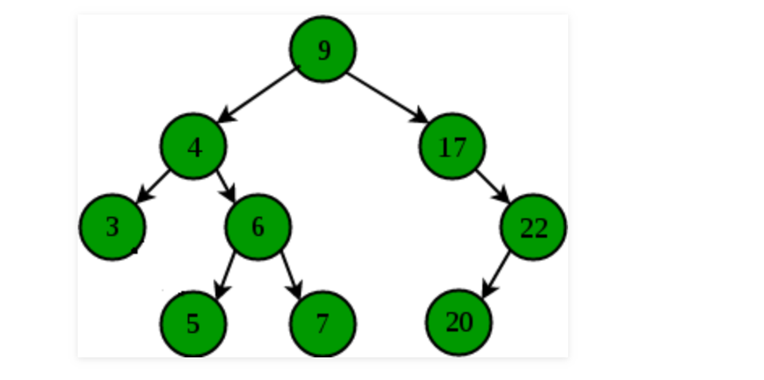

[@@@@1143. 最长公共子序列](https://leetcode-cn.com/problems/longest-common-subsequence/)

```java
 public int longestCommonSubsequence(String text1, String text2) {
        int len1 = text1.length();
        int len2 = text2.length();
        int[][] dp = new int[len1 + 1][len2 + 1];
        for (int i = 0; i <= len1; i++) {
            for (int j = 0; j <= len2; j++) {
                if (j == 0 || i == 0) {
                    dp[i][j] = 0;
                    continue;
                }
                if (text1.charAt(i - 1) == text2.charAt(j - 1)) {
                    dp[i][j] = dp[i - 1][j - 1] + 1;
                } else {
                    dp[i][j] = Math.max(dp[i - 1][j], dp[i][j - 1]);
                }
            }
        }
        return dp[len1][len2];
    }
```


#### @@@删除最少字符变成回文串

题目描述：给定一字符串s,求最少删除多少个字符可以使得s成为回文串。例如：s="abca",答案是1.

思路:把自身翻转, 自身和翻转的lcs,就是最大回文长度,str.length()-lcs 即为要删除的字符.

```java
public int minChange(String str) {
        int lcs = longestCommonSubsequence(str, null);
        return str.length() - lcs;
    }

    public int longestCommonSubsequence(String text1, String text2) {
        int len1 = text1.length();
        StringBuffer stringBuffer = new StringBuffer(text1);
        text2 = stringBuffer.reverse().toString();
        int len2 = text2.length();
        int[][] dp = new int[len1 + 1][len2 + 1];
        for (int i = 0; i <= len1; i++) {
            for (int j = 0; j <= len2; j++) {
                if (j == 0 || i == 0) {
                    dp[i][j] = 0;
                    continue;
                }
                if (text1.charAt(i - 1) == text2.charAt(j - 1)) {
                    dp[i][j] = dp[i - 1][j - 1] + 1;
                } else {
                    dp[i][j] = Math.max(dp[i - 1][j], dp[i][j - 1]);
                }
            }
        }
        return dp[len1][len2];
    }
```


#### [@647. 回文子串](https://leetcode-cn.com/problems/palindromic-substrings/)(数量)

本题可以看成是字符串类的动态规划


中心扩展法比动态规划效率高.

因为动态规划是从短串到长串都要判断,不好剪枝

中心扩展从短串到长串的过程中,如果短串不成立,则长串终止.

```java
改进:动态规划的做法
     i-j<2  在i-j为0的时候,i和j为同一个值;i-j为1的时候由于前面的
     s.charAt(i)==s.charAt(j)也决定了它们是相等的
public int countSubstrings(String s) {
    int len = s.length();
    boolean[][] dp = new boolean[len][len];
    int ret = 0;
    for (int i = 0; i < len; i++) {
        for (int j = i; j >= 0; j--) {
            //i-j<2  在i-j为0的时候,i和j为同一个值;i-j为1的时候由于前面的
            //s.charAt(i)==s.charAt(j)也决定了它们是相等的
            if (s.charAt(i) == s.charAt(j) && ((i - j < 2) || dp[i - 1][j + 1])) {
                dp[i][j] = true;
                ret++;
            }
        }
    }
    return ret;
}
改进: 从中间往两边扩展,注意拓展方式有两种,  aba 以b为对称线  和 aa以两个a之间为对称线
    对应的代码是  int left = i;
           		 int right = left;
				left = i;
           		 right = left + 1;
	
     public int countSubstrings(String s) {
        int len = s.length();
        int res = 0;
        for (int i = 0; i < len; i++) {
            int left = i;
            int right = left;
            while (left >= 0 && right < len && s.charAt(left) == s.charAt(right)) {
                left--;
                right++;
                res++;
            }
            left = i;
            right = left + 1;
            while (left >= 0 && right < len && s.charAt(left) == s.charAt(right)) {
                left--;
                right++;
                res++;
            }

        }
        return res;
    }
```


#### [5. 最长回文子串](https://leetcode-cn.com/problems/longest-palindromic-substring/)(长度)

```java
改进:利用动规:dp[i][j] = dp[i-1][j+1] +1 (如果len>2的情况下,并且char[i] == char[j])
    dp[i][j]的含义是 以为i终点,j为起点的字符串中对称字符的长度.

public String longestPalindrome(String s) {
    if (s == null || s.length() == 0) {
        return "";
    }
    int maxLen = 0;
    int maxRow = 0;
    int maxCol = 0;
    int len = s.length();
    int[][] dp = new int[len][len];
    for (int i = 0; i < len; i++) {
        for (int j = i; j >= 0; j--) {

            if (s.charAt(i) == s.charAt(j)) {
                if (i == j) {//长度为1
                    dp[i][j] = 1;
                } else if (i == j + 1) {//长度为2
                    dp[i][j] = 2;
                } else { //长度大于2
                    if (dp[i - 1][j + 1] != 0) {
                        dp[i][j] = dp[i - 1][j + 1] + 2;

                    } else {
                        dp[i][j] = 0;
                    }
                }
                if (maxLen < dp[i][j]) {
                    maxLen = dp[i][j];
                    maxRow = i;
                    maxCol = j;
                }
            } else {
                //char i  与 char j 不相等
                dp[i][j] = 0;
            }
        }
    }
    return s.substring(maxCol, maxRow + 1);
}
```

#### 用少来表示多


给一串只包含0~9的数字串，每个数字出现的概率相同（比如32978417506），现在告诉你（1,3,5,7）这四个数字不可用，即只能用（0,2,4,6,8,9）这6个数，如何表示原数字串？

* **00表示0**, 02表示1, 04表示3， 06表示5， 08表示7

* 15位表示以前的10位，所以存储多出来0.5倍

    

#### @253. 会议室 II](https://leetcode-cn.com/problems/meeting-rooms-ii/)


```java

思路:startTime排序,每到一个startTime,usedRoom就+1.如果在该时间之前有结束的会议室(endTime[endPointer]<=startTime[startPointer]).usedRoom就-1;
public int minMeetingRooms(int[][] intervals) {
        int len = intervals.length;

        int max = 0;
        int[] startTime = new int[len];
        int[] endTime = new int[len];
        for (int i = 0; i < len; i++) {
            startTime[i] = intervals[i][0];
            endTime[i] = intervals[i][1];
        }
        Arrays.sort(startTime);
        Arrays.sort(endTime);
        int usedRooms = 0;
        int endPointer = 0;
        for (int startPointer = 0; startPointer < len; ) {
            if (endTime[endPointer] <= startTime[startPointer]) {
                usedRooms--;
                endPointer++;
            }
            usedRooms++;
            startPointer++;
        }
        return usedRooms;
    }
```


#### [@443. 压缩字符串](https://leetcode-cn.com/problems/string-compression/)


write read,chBegin的妙用

if (read == chars.length - 1 || chars[read] != chars[read + 1])  这两个条件很重要

```java
 public int compress(char[] chars) {
        int read = 0;
        int write = 0;
        int chBegin = 0;
        for (read = 0; read < chars.length; read++) {
            if (read == chars.length - 1 || chars[read] != chars[read + 1]) {
                int count = read - chBegin + 1;
                chars[write++] = chars[read];
                if (count >= 2) {
                    String temp = count + "";
                    for (int i = 0; i < temp.length(); i++) {
                        chars[write++] = temp.charAt(i);
                    }
                }
                chBegin = read + 1;
            }
        }
        return write;
    }
```


#### [@253. 会议室 II](https://leetcode-cn.com/problems/meeting-rooms-ii/)


```java

思路:startTime排序,每到一个startTime,usedRoom就+1.如果在该时间之前有结束的会议室(endTime[endPointer]<=startTime[startPointer]).usedRoom就-1;
public int minMeetingRooms(int[][] intervals) {
        int len = intervals.length;

        int max = 0;
        int[] startTime = new int[len];
        int[] endTime = new int[len];
        for (int i = 0; i < len; i++) {
            startTime[i] = intervals[i][0];
            endTime[i] = intervals[i][1];
        }
        Arrays.sort(startTime);
        Arrays.sort(endTime);
        int usedRooms = 0;
        int endPointer = 0;
        for (int startPointer = 0; startPointer < len; ) {
            if (endTime[endPointer] <= startTime[startPointer]) {
                usedRooms--;
                endPointer++;
            }
            usedRooms++;
            startPointer++;
        }
        return usedRooms;
    }
```


#### @@@[435. 无重叠区间](https://leetcode-cn.com/problems/non-overlapping-intervals/)

求无重叠区间cnt,然后用len-ret就是需要移除的最少区间数

把区间按照endTime从小到大排序. 然后往后找,如果后面的区间的startTime<该endTime,则有重叠.

如果endTIme>=startTime无重叠,此时endTime更新到下个区间,cnt++


```java
public int eraseOverlapIntervals(int[][] intervals) {
        if (intervals == null || intervals.length == 0) {
            return 0;
        }
        Comparator<int[]> c = new Comparator<int[]>() {
            public int compare(int[] a, int[] b) {
                return a[1] - b[1];
            }
        };
        int len = intervals.length;
        Arrays.sort(intervals, c);
        int cnt = 1;
        int endTime = intervals[0][1];
        for (int i = 1; i < intervals.length; i++) {
            int startTime = intervals[i][0];
            if (endTime > startTime) {
                continue;
            } else if (endTime <= startTime) {
                cnt++;
                endTime = intervals[i][1];
            }
        }
        return len - cnt;
    }
```


#### @@[43. 字符串相乘](https://leetcode-cn.com/problems/multiply-strings/)

```java
 public String multiply(String num1, String num2) {
        if (num1.equals("0") || num2.equals("0")) {
            return "0";
        }
        int[] ret = new int[num1.length() + num2.length()];
        for (int i = num1.length() - 1; i >= 0; i--) {
            int a = num1.charAt(i) - '0';
            for (int j = num2.length() - 1; j >= 0; j--) {
                
                int b = num2.charAt(j) - '0';
                int sum = a * b + ret[i + j + 1];
                
                ret[i + j + 1] = sum % 10;
                ret[i + j] += sum / 10;
            }
        }
        StringBuilder retStr = new StringBuilder();
        for (int i = 0; i < ret.length; i++) {
            if (i == 0 && ret[i] == 0) {
                while (ret[i] == 0) {
                    i++;
                }
            }
            retStr.append(ret[i] + "");
        }
        return retStr.toString();
    }
```


#### @@@字符移位

链接：https://www.nowcoder.com/questionTerminal/7e8aa3f9873046d08899e0b44dac5e43
来源：牛客网

小Q最近遇到了一个难题：把一个字符串的大写字母放到字符串的后面，各个字符的相对位置不变，且不能申请额外的空间。
  你能帮帮小Q吗？ 

##### **输入描述:**

```
输入数据有多组，每组包含一个字符串s，且保证:1<=s.length<=1000.
  
```

##### **输出描述:**

```
对于每组数据，输出移位后的字符串。
```

```java
思路1
冒泡:
@@@@@@@@@@@@@@@
@要交换 i 0~len-1次
@每次  j从 len-1  到  i进行扫描;逐渐冒泡,把一个小写字母冒到i的位置上.

 public String func(String str) {
        char[] chars = str.toCharArray();
        for (int i = 0; i < chars.length; i++) {
            for (int j = chars.length - 2; j >= i; j--) {
                if (chars[j] >= 'A' && chars[j] <= 'Z' && chars[j + 1] >= 'a' && chars[j + 1] <= 'z') {
                    char temp = chars[j];
                    chars[j] = chars[j + 1];
                    chars[j + 1] = temp;
                }
            }
        }
        return new String(chars);
    }


思路2:
选择排序:
@@@@@@@@@@@@@@@@@@@
@littleIndex代表下一个要插入小写字母的位置
@i往后找,找到一个小写字母. 然后从littleIndex 到 i之间的字母往后移一位
@然后把i处的字母插入到littleIndex处.

 public String func(String str) {
        char[] chars = str.toCharArray();
        int littleIndex = 0;
        for (int i = 0; i < chars.length; i++) {
            if (chars[i] >= 'a' && chars[i] <= 'z') {
                char temp = chars[i];
                for (int j = i; j >= littleIndex + 1; j--) {
                    chars[j] = chars[j - 1];
                }
                chars[littleIndex] = temp;
                littleIndex++;
            }
        }
        return new String(chars);
    }

思路3:

public static String getResult(String str) {
        return str.replaceAll("[A-Z]", "") + str.replaceAll("[a-z]", "");
    }
```


#### [295. 数据流的中位数](https://leetcode-cn.com/problems/find-median-from-data-stream/)

@优先队列是log(n)的复杂度.

```java

class MedianFinder {
    PriorityQueue<Integer> leftNums = null;
    PriorityQueue<Integer> rightNums = null;

    public MedianFinder() {
        leftNums = new PriorityQueue<Integer>(10, (o2, o1) -> (o1 - o2));
        rightNums = new PriorityQueue<Integer>(10, (o1, o2) -> (o1 - o2));

    }

    public void addNum(int num) {
        if (leftNums.size() > rightNums.size()) {
            rightNums.add(num);
        } else {
            leftNums.add(num);
        }
        if (!rightNums.isEmpty() && rightNums.peek() < leftNums.peek()) {
            int leftNum = leftNums.poll();
            int rightNum = rightNums.poll();
            leftNums.add(rightNum);
            rightNums.add(leftNum);
        }
    }

    public double findMedian() {
        if (leftNums.size() == rightNums.size()) {
            return (double) (leftNums.peek() + rightNums.peek()) / 2;
        }
        return leftNums.peek();
    }
}
```


#### 图的m着色问题(dfs)

[问题描述]

给定无向连通图G和m种不同的颜色，用这些颜色给图的各个顶点着一种颜色，若某种方案使得图中每条边的2个顶点的颜色都不相同，则是一个满足的方案，找出所有的方案。

输入格式
 第一行有3个正整数n，k和m，分别表示n个顶点，k条边，m种颜色
接下来k行，每行2个正整数，保送一条边的两个顶点

所有不同的着色方案数
输入样例】
5 8 4 
1 2
1 3 
1 4
2 3
2 4
2 5
3 4
4 5
输出样例
48

```java
  public class Main {
    static int[][] matrix = null;
    int[] pointColor = null;
    int len = 0;
    int numPoint = 0;
    int numEdge = 0;
    int ret = 0;
    int numColor = 0;

    public int getResult(int numPoint, int numEdge, int numColor) {
        len = numPoint;
        this.numColor = numColor;
        this.numEdge = numEdge;
        this.numPoint = numPoint;
//        this.matrix = new int[numPoint + 1][numPoint + 1];
        pointColor = new int[numPoint + 1];
        backtracing(1, 1);
        return ret;
    }

    private boolean uniqueColor(int index) {
        for (int i = 1; i <= numPoint; i++) {
            if (matrix[index][i] == 1 && pointColor[index] == pointColor[i]) {
                return false;
            }
        }
        return true;
    }

    private void backtracing(int index, int cnt) {
        if (cnt >= numPoint + 1) {
            return;
        }
        //先染色
        for (int j = 1; j <= numColor; j++) {
            pointColor[index] = j;
            //如果颜色符合要求
            if (uniqueColor(index)) {
                if (cnt == numPoint) {
                    ret++;
                }
                //从与index相连的  第一个没有被访问过的 顶点开始染色
                //为什么是第一个,假设1与2,3相连,我给1染颜色1,2染颜色2,3染颜色3.
                //1->2->3  和  1->3->2  其实是同一种颜色组合.
                for (int k = 1; k <= numPoint; k++) {
                    if (matrix[index][k] == 1 && pointColor[k] == 0) {
                        backtracing(k, cnt + 1);
                        break;
                    }
                }
            }
            pointColor[index] = 0;
        }
    }

    private void initialMatrix(String str) {
        for (int i = 0; i < str.length(); i = i + 2) {
            int x = str.charAt(i) - '0';
            int y = str.charAt(i + 1) - '0';
            matrix[x][y] = 1;
            matrix[y][x] = 1;
        }
    }

    public static void main(String[] args) {
        Main main = new Main();
        String str = "1213142324253445";
        matrix = new int[6][6];
        main.initialMatrix(str);

        int func = main.getResult(5, 8, 4);
        System.out.println(func);

    }
}
```


```java
 下面的做法错误的原因是  
 1->2->3和
 1->3->2 假设1涂红,2涂蓝,3涂绿,这被认为是两种情况了.
 
 static int[][] matrix = null;
    int[] pointColor = null;
    int len = 0;
    int numPoint = 0;
    int numEdge = 0;
    int ret = 0;
    int numColor = 0;

    public int func(int numPoint, int numEdge, int numColor) {
        len = numPoint;
        this.numColor = numColor;
        this.numEdge = numEdge;
        this.numPoint = numPoint;
//        this.matrix = new int[numPoint + 1][numPoint + 1];
        pointColor = new int[numPoint + 1];
        backtracing(1, 1);
        return ret;
    }

    private boolean uniqueColor(int index) {
        for (int i = 1; i <= numPoint; i++) {
            if (matrix[index][i] == 1 && pointColor[index] == pointColor[i]) {
                return false;
            }
        }
        return true;
    }

    private void backtracing(int index, int cnt) {
        if (cnt >= numPoint + 1) {
            return;
        }
        for (int j = 1; j <= numColor; j++) {
            pointColor[index] = j;
            if (uniqueColor(index)) {
                if (cnt == numPoint) {
                    ret++;
                }
                for (int k = 1; k <= numPoint; k++) {
                    if (matrix[index][k] == 1 && pointColor[k] == 0) {
                        backtracing(k, cnt + 1);
                    }
                }
            }
            pointColor[index] = 0;
        }
    }
```


#### 

#### 100亿数字排序,求中位数,平均数,求和

今天要给100亿个数字排序，100亿个 int 型数字放在文件里面大概有 37.2GB，非常大，内存一次装不下了。那么肯定是要拆分成小的文件一个一个来处理，最终在合并成一个排好序的大文件。

##### 实现思路

1.把这个37GB的大文件，用哈希分成1000个小文件，每个小文件平均38MB左右（理想情况），把100亿个数字对1000取模，模出来的结果在0到999之间，每个结果对应一个文件，所以我这里取的哈希函数是 h = x % 1000，哈希函数取得"好"，能使冲突减小，结果分布均匀。

2.拆分完了之后，得到一些几十MB的小文件，那么就可以放进内存里排序了，可以用快速排序，归并排序，堆排序等等。

3.1000个小文件内部排好序之后，就要把这些内部有序的小文件，合并成一个大的文件，可以用**二叉堆**来做1000路合并的操作，每个小文件是一路，合并后的大文件仍然有序。

- 首先遍历1000个文件，每个文件里面取第一个数字，组成 (数字, 文件号) 这样的组合加入到堆里（假设是从小到大排序，用小顶堆），遍历完后堆里有1000个 (数字，文件号) 这样的元素
- 然后不断从堆顶拿元素出来，每拿出一个元素，把它的文件号读取出来，然后去对应的文件里，加一个元素进入堆，直到那个文件被读取完。拿出来的元素当然追加到最终结果的文件里。
- 按照上面的操作，直到堆被取空了，此时最终结果文件里的全部数字就是有序的了。

最后我用c++写了个实验程序，具体代码在[这里](https://link.jianshu.com?t=https://github.com/hehe520/Data-structure-and-algorithm/blob/master/海量数据处理/外部归并排序 - 分治.cpp)可以看到。

##### 思维拓展

类似的100亿个数字求和，求中位数，求平均数，套路就是一样的了。
 求和：统计每个小文件的和，返回给master再求和就可以了。
 求平均数：上面能求和了，再除以100亿就是平均数了
 求中位数：在排序的基础上，遍历到中间的那个数就是中位数了

#### [113. 路径总和 II](https://leetcode-cn.com/problems/path-sum-ii/)

```java
List<List<Integer>> ret = new ArrayList<>();

    public List<List<Integer>> pathSum(TreeNode root, int sum) {
        preOrder(root, sum, 0, new ArrayList<Integer>());
        return ret;
    }

    public void preOrder(TreeNode root, int sum, int pathSum, List<Integer> path) {
        if (root == null) {
            return;
        }
        path.add(root.val);
        pathSum += root.val;
        if (root.left == null && root.right == null && pathSum == sum) {
            ret.add(new ArrayList<Integer>(path));
            path.remove(path.size() - 1);
            return;
        }
        preOrder(root.left, sum, pathSum, path);
        preOrder(root.right, sum, pathSum, path);
        path.remove(path.size() - 1);
    }
```


#### [@@@547. 朋友圈](https://leetcode-cn.com/problems/friend-circles/)

```java

public class Solution {
    public int findCircleNum(int[][] M) {
        if (M == null || M.length == 0) {
            return 0;
        }
        int len = M.length;
        UF u = new UF(len);
        for (int i = 0; i < len; i++) {
            for (int j = 0; j < len; j++) {
                if (M[i][j] == 1) {
                    u.union(i, j);
                }
            }
        }
        return u.getCount();
    }
}

class UF {
    private int count;
    private int[] parent;
    private int[] size;

    public UF(int len) {
        this.count = len;
        this.parent = new int[len];
        this.size = new int[len];
        for (int i = 0; i < len; i++) {
            size[i] = 1;
            parent[i] = i;
        }
    }
    public void union(int p, int q) {
        int rootP = findParent(p);
        int rootQ = findParent(q);
        if (rootP == rootQ)
            return;
        if (size[rootP] > size[rootQ]) {
            parent[rootQ] = rootP;
            size[rootP] += size[rootQ];
        } else {
            parent[rootP] = rootQ;
            size[rootQ] += size[rootP];
        }
        count--;
    }
    //路径压缩+寻找根节点
    public int findParent(int p) {
        while (parent[p] != p) {
            //把 p的爷爷 替换成  p的爸爸
            parent[p] = parent[parent[p]];
            //把p变成p的爷爷
            p = parent[p];
        }
        return p;
    }

    public int getCount() {
        return count;
    }
     public boolean connected(int p, int q) {
        int rootP = findParent(p);
        int rootQ = findParent(q);
        return rootP == rootQ;
    }

}
```


#### [@@@200. 岛屿数量](https://leetcode-cn.com/problems/number-of-islands/)


@@查并集做法

```java
class Solution {
    public int numIslands(char[][] grid) {
        if (grid == null || grid.length == 0) {
            return 0;
        }
        int row = grid.length;
        int col = grid[0].length;
        UF uf = new UF(grid, grid.length, grid[0].length);
        for (int i = 0; i < row; i++) {
            for (int j = 0; j < col; j++) {
                //如果某个坐标是一座岛,就把这座岛与右边或者下边的连接岛 合并
                //为什么没有左和上的岛,i,j是按照从左上往右下的顺序移动
                // 合并前会把grid[i][j]置为0,所以左上的岛永远是空的
                if (grid[i][j] == '1') {
                    grid[i][j] = '0';
                    if (j + 1 < col && grid[i][j + 1] == '1') {
                        uf.union(i * col + j, i * col + j + 1);
                    }
                    if (i + 1 < row && grid[i + 1][j] == '1') {
                        uf.union(i * col + j, (i + 1) * col + j);
                    }
                }
            }
        }
        return uf.getCount();
    }
}

class UF {
    int count;
    int[] parent;
    int[] size;

    public UF(char[][] grid, int row, int col) {
        this.parent = new int[row * col];
        this.size = new int[row * col];
        for (int i = 0; i < row; i++) {
            for (int j = 0; j < col; j++) {
                //如果某个坐标是导,就count++, parent初始化成自己,size初始化为1.
                if (grid[i][j] == '1') {
                    parent[i * col + j] = i * col + j;
                    ++count;
                    size[i * col + j] = 1;
                }
            }
        }
    }

    public int getCount() {
        return this.count;
    }

    public boolean connected(int p, int q) {
        int rootP = findParent(p);
        int rootQ = findParent(q);
        if (rootP == rootQ) {
            return true;
        }
        return false;
    }

    public int findParent(int p) {
        while (p != parent[p]) {
            parent[p] = parent[parent[p]];
            p = parent[p];
        }
        return p;
    }

    public void union(int p, int q) {
        int rootP = findParent(p);
        int rootQ = findParent(q);
        if (rootQ == rootP) {
            return;
        }
        if (size[rootP] > size[rootQ]) {
            size[rootP] += size[rootQ];
            parent[rootQ] = rootP;
        } else {
            size[rootQ] += size[rootP];
            parent[rootP] = rootQ;
        }
        count--;
    }

}
```


#### 找到二叉树中与target之差的绝对值最小的node

@如果node处的值小于target,则node左边的值跟target的差距只会越来越大

比如target是10,如果node=9,则node左边的值,跟10的差距只会越来越大



在二叉查找树中，[查找与目标值最接近的节点并返回](https://www.geeksforgeeks.org/find-closest-element-binary-search-tree/)。如果有多个节点都符合要求，返回其中一个即可

```java
 public void maxDiffUtil(Node  ptr, int k)
    {
        if (ptr == null)
            return ;

        // If k itself is present 
        if (ptr.key == k)
        {
            min_diff_key = k;
            return;
        }

        // update min_diff and min_diff_key by checking 
        // current node value 
        if (min_diff > Math.abs(ptr.key - k))
        {
            min_diff = Math.abs(ptr.key - k);
            min_diff_key = ptr.key;
        }

        // if k is less than ptr.key then move in 
        // left subtree else in right subtree 
        if (k < ptr.key)
            maxDiffUtil(ptr.left, k);
        else
            maxDiffUtil(ptr.right, k);
    }
```


#### @@@@二叉树的非递归后序遍历

```java
private void lastOrder(TreeNode root) {
        if (root == null) {
            return;
        }
        TreeNode lastVisited = null;
        TreeNode nodeCur = root;
        Stack<TreeNode> stack = new Stack<>();
        while (nodeCur != null) {
            stack.add(nodeCur);
            nodeCur = nodeCur.left;
        }
        while (!stack.isEmpty()) {
            nodeCur = stack.pop();
            if (nodeCur.right == null || lastVisited == nodeCur.right) {
                System.out.println(nodeCur.val);
                lastVisited = nodeCur;
            } else if (lastVisited == nodeCur.left) {
                stack.add(nodeCur);
                nodeCur = nodeCur.right;
                while (nodeCur != null) {
                    stack.add(nodeCur);
                    nodeCur = nodeCur.left;
                }
            }
        }
    }
```


#### 有序数组重建平衡二叉树

```java
public TreeNode rebuildBST(int[] nums, int start, int end) {
        if (start > end || start < 0 || end > nums.length - 1) {
            return null;
        }
        int mid = start + (end - start) / 2;
        TreeNode treeNode = new TreeNode(nums[mid]);
        treeNode.left = rebuildBST(nums, start, mid - 1);
        treeNode.right = rebuildBST(nums, mid + 1, end);
        return treeNode;
    }
```

#### 一个数组里找任意两个数之和的绝对值最小值

```
排序,left= 0,right = len-1, sum>0 right--,sum<0,left++.
```

#### 一个整数数组找任意两数的最小之差

```
排序,相邻的数的差最小
```

