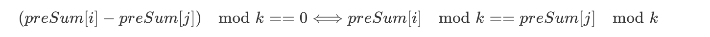

<!-- TOC -->

- [[@@@@523. 连续的子数组和](https://leetcode-cn.com/problems/continuous-subarray-sum/)](#523-连续的子数组和httpsleetcode-cncomproblemscontinuous-subarray-sum)
- [[@@@@974. 和可被 K 整除的子数组](https://leetcode-cn.com/problems/subarray-sums-divisible-by-k/)](#974-和可被-k-整除的子数组httpsleetcode-cncomproblemssubarray-sums-divisible-by-k)
- [剔除k个数求最长连续区间](#剔除k个数求最长连续区间)

<!-- /TOC -->


#### [@@@@523. 连续的子数组和](https://leetcode-cn.com/problems/continuous-subarray-sum/)

@@@map存前缀和(map.get(i) 拿到的是-1~i的sum,-1的sum为0)的思路,可以用来解决求区间和的问题.

另外还有如下性质, 举例  i=1处,对5取模为3   j= 4处对5取模为3.则 index在2~4处的和可以整除5




@@为了处理case  [0,0]  k=0.而设置的map.put(0,-1)  这个哨兵太厉害了!

@@ i-map.get(sum)>=2  当前sum的index  减去之前sum的index是区间的长度.而非长度-1.

@@为了处理k=0,而设置的  if(k!=0)sum = sum%k;   这样的话,在k为0的时候,sum就是求阶梯和,如果存在map.contains(sum).则这段区间和为0

@@在k!=0的情况下,map记录sum的取余之后的值,找到map里包含sum,而且index比当前i小0以上的坐标


```java
public boolean checkSubarraySum(int[] nums, int k) {
    HashMap<Integer, Integer> map = new HashMap<>();
    int sum = 0;
    map.put(0, -1);
    for (int i = 0; i < nums.length; i++) {
        sum += nums[i];
        if (k != 0) {
            sum = sum % k;
        }
        if (map.containsKey(sum)) {
            if (i - map.get(sum) > 1) {
                return true;
            }
        } else {
            map.put(sum, i);
        }
    }
    return false;
}
```


#### [@@@@974. 和可被 K 整除的子数组](https://leetcode-cn.com/problems/subarray-sums-divisible-by-k/)

```java
思路1 : 错误的思路: 因为n过大,二维数组dp[i][j]存i~j的和会内存超出,而且时间复杂度也很高.

思路2:前缀和
    @@ 和为0的哨兵
    @@ nums[i]可能是过于大的整数或者负数, 所以要 先取余k,再加k,再取余sum = (sum % k + k) % k;
	@@故若想(sum[j]−sum[i])%K=0，则必有sum[j]%K = sum[i]%K .所以中途记录之前的sum和sum出现的次数.
        (如果要求得是区间长度等信息,则记录sum和sum出现的最早index)
        

public int subarraysDivByK(int[] nums, int k) {
        HashMap<Integer, Integer> map = new HashMap<>();
        map.put(0, 1);
        int sum = 0;
        int ret = 0;
        for (int i = 0; i < nums.length; i++) {
            sum += nums[i];
            sum = (sum % k + k) % k;
            if (map.containsKey(sum)) {
                ret += map.get(sum);
            }
            map.put(sum, map.getOrDefault(sum, 0) + 1);
        }
        return ret;
    }


```


#### @@@抽奖

题目:有1000人参与抽奖,10个奖品,每个人的抽奖次数可能是1到80次,设计一个抽奖算法,最后要把奖品抽完

假设一共抽奖n次，当前还剩k个奖品，第i次调用时，中奖概率 k/(n+1-i)

1.可以保证每个人的概率相等(第一个人的中奖概率是 10/1000,第二个人的中奖概率分两部分,第一个人中奖和不中奖)

2.可以保证最后抽完(k过大,会让中奖概率大于1)


#### @@完全二叉树的节点个数

完全二叉树

O

|\
OO

|\ |\

OO OO

|\ |\ |\ |\

OO Ox xx xx

\----------

求总的节点数？


```java

public class Main {

    private int func(TreeNode root) {
        if (root == null) {
            return 0;
        }
        TreeNode node = root;
        int maxLevel = 0;
        int sum = 0;
        while (node != null) {
            node = node.left;
            maxLevel++;
        }

        Node rootNode = new Node(1, root, 1);
        Node tempNode = null;
        while (rootNode.level <= maxLevel - 1) {
            tempNode = findMid(rootNode);
            if (maxLevel > tempNode.level) {
                rootNode = new Node(rootNode.position * 2 - 1, rootNode.node.left, rootNode.level + 1);
            } else if (maxLevel == tempNode.level) {
                rootNode = new Node(rootNode.position * 2, rootNode.node.right, rootNode.level + 1);
            }
        }
        sum = (int) Math.pow(2, maxLevel - 1) - 1 + tempNode.position;
        return sum;
    }

    private Node findMid(Node root) {
        if (root == null) {
            return null;
        }
        TreeNode treeNode = root.node.left;
        int level = root.level;
        int position = root.position;

        if (treeNode == null) {
            return root;
        }
        while (treeNode.right != null) {
            treeNode = treeNode.right;
            level++;
            position = position * 2;
        }
        return new Node(position, treeNode, level);
    }
}

class Node {
    int position;
    TreeNode node;
    int level;

    public Node(int positon, TreeNode node, int level) {
        this.position = position;
        this.node = node;
        this.level = level;
    }
}

class TreeNode {
    int val;
    TreeNode left;
    TreeNode right;
}
```


#### 寻找最左边的1

给出01矩阵，每一行左边是0，右边是1，找到起始1的位置在最左边的1的下标。


如题

0000111

0000011

0001111

0111111

000001

返回第四行，下标为1.


思路1：逐列遍历，

思路2：利用类似于跳表的性质

第一行，折半查找，找到最左边的1所在的位置（colIndex = 4），然后跳到下一行

第二行，如果第二行的colIndex=4的地方为0，则往第三行跳。如果为1，则利用折半查找，找到第二行最左边1的坐标，再往第三行跳


#### 牛奶试毒

1000桶牛奶，1桶有毒，用10只小白鼠试出来。其实就是二进制，网上有答案，提示：2^10 = 1024.

```
链接：https://www.nowcoder.com/questionTerminal/84726a200b4a4a0d95b9565b4c6eb216
来源：牛客网

每个老鼠只有死或活2种状态，因此每个老鼠可以看作一个bit，取0或1
N个老鼠可以看作N个bit，可以表达2^N种状态（其中第i个状态代表第i个瓶子有毒）


例如：当N＝2时，可以表达4种状态
0，0（ 一号老鼠活，二号老鼠活）
0，1（ 一号老鼠活，二号老鼠死）
1，0（ 一号老鼠死，二号老鼠活）
1，1（ 一号老鼠死，二号老鼠死）
具体来说，有A、B、C、D这4个瓶子，一号老鼠喝C和D(因为第一位为1的两个状态时CD)， 二号老鼠喝B和D(因为第二位为1的两个状态是BD)
如果 0，0 （ 一号老鼠活，二号老鼠活），说明是A有毒
如果 0，1 （ 一号老鼠活，二号老鼠死） ，说明是B有毒 
如果 1，0 （ 一号老鼠死，二号老鼠活） ，说明是C有毒 
如果 1，1 （ 一号老鼠死，二号老鼠死） ，说明是D有毒 


解析：

给1000个瓶分别标上如下标签（10位长度）：
0000000001 （第1瓶）
0000000010 （第2瓶）
0000000011 （第3瓶）
.
1111101000 （第1000瓶）
从编号最后1位是1的所有的瓶子里面取出1滴混在一起（比如从第一瓶,第三瓶,.里分别取出一滴混在一起）并标上记号为1.给第一个小白鼠喝。
从编号倒数第2位是1的所有的瓶子里面取出1滴混在一起并标上记号为2.给第2个小白鼠喝。
从编号倒数第3位是1的所有的瓶子里面取出1滴混在一起并标上记号为3.给第3个小白鼠喝。
从编号倒数第4位是1的所有的瓶子里面取出1滴混在一起并标上记号为4.给第4个小白鼠喝。
从编号倒数第5位是1的所有的瓶子里面取出1滴混在一起并标上记号为5.给第5个小白鼠喝。
从编号倒数第6位是1的所有的瓶子里面取出1滴混在一起并标上记号为6.给第6个小白鼠喝。
以此类推。。。。
24小时过去了：
如果只有第一个小白鼠死了。即00000 00001，则第1瓶有毒。
如果只有第1,4个小白鼠死了。即00000 01001，则第9瓶有毒。

```


#### @@@剔除k个数求最长连续区间

最大剔除K个数，使得连续相同数最长。

输入

6  1

1 2 3 2 2 3

输出

3（k=1，移除3，则3个2可以连在一起，长度最长）


```java

class Solution {
    public static void main(String[] args) {
        Scanner scanner = new Scanner(System.in);
//        int n = scanner.nextInt();
//        int k = scanner.nextInt();
//        int[] nums = new int[n];
//        int maxLen = 0;
//        for (int i = 0; i < k; i++) {
//            nums[i] = scanner.nextInt();
//        }
//
        int k = 2;
        int[] nums = {1, 2, 3, 3, 2, 2, 2, 2, 3};
        int n = nums.length;
        int maxLen = 0;
        maxLen = func(nums, n, k);
        System.out.println(maxLen);
    }

    private static int func(int[] nums, int n, int k) {
        ArrayList[] visited = new ArrayList[10];
        int maxLen = 0;
        for (int i = 0; i < n; i++) {
            if (visited[nums[i]] != null) {
                visited[nums[i]].add(i);
            } else {
                ArrayList<Integer> list = new ArrayList<>();
                list.add(i);
                visited[nums[i]] = list;
            }
        }
        for (int i = 0; i < 10; i++) {
            ArrayList<Integer> temp = visited[i];
            ArrayList<Integer> distance = new ArrayList<>();
            if (temp == null) {
                continue;
            }
            for (int j = 1; j < temp.size(); j++) {
                distance.add(temp.get(j) - temp.get(j - 1) - 1);
            }
            int tempLen = getMaxLen(distance, k) + 1;
            maxLen = Math.max(tempLen, maxLen);
        }
        return maxLen;
    }

    private static int getMaxLen(ArrayList<Integer> distance, int k) {
        int ret = 0;
        int total = 0;
        int left = 0;
        for (int i = 0; i < distance.size(); i++) {
            total += distance.get(i);
            while (total > k) {
                total -= distance.get(left);
                left++;
            }
            ret = Math.max(ret, i - left + 1);
        }
        return ret;
    }
}
```


#### [LeetCode-624：Maximum Distance in Arrays (多数组找元素最大距离)](https://blog.csdn.net/Koala_Tree/article/details/78317657)

Question
Given m arrays, and each array is sorted in ascending order. Now you can pick up two integers from two different arrays (each array picks one) and calculate the distance. We define the distance between two integers a and b to be their absolute difference |a-b|. Your task is to find the maximum distance.

给定 m 个数组， 每个数组都已经按照升序排好序了。现在你需要从两个不同的数组中选择两个整数 （每个数组选一个） 并且计算它们的距离。 两个整数 a 和 b 之间的距离定义为它们差的绝对值 |a-b| 。 你的任务就是去找到最大距离

Example 1:

Input: 
[[1,2,3],
 [4,5],
 [1,2,3]]

Output: 4

Explanation: 
One way to reach the maximum distance 4 is to pick 1 in the first or third array and pick 5 in the second array.

Note:

+ Each given array will have at least 1 number. There will be at least two non-empty arrays；
+ The total number of the integers in all the m arrays will be in the range of [2, 10000]；
+ The integers in the m arrays will be in the range of [-10000, 10000].

```java
思路:
给定的多个（至少两个，且非空）按升序排序好的数组，从其中任意两个数组中各选择一个元素，计算两个元素的距离，找到最大距离。

class Solution {
    public int maxDistance(List<List<Integer>> arrays) {  
        int res = 0;  
        int min = arrays.get(0).get(0);  
        int max = arrays.get(0).get(arrays.get(0).size() - 1);  
        for (int i = 1; i < arrays.size(); i++) {  
            List<Integer> array = arrays.get(i);  
            res = Math.max(Math.abs(min - array.get(array.size() - 1)), Math.max(Math.abs(array.get(0) - max), res));  
            min = Math.min(min, array.get(0));  
            max = Math.max(max, array.get(array.size() - 1));  
        }
        return res;  
    }
}

```


#### @@@[移除子串](https://www.jianshu.com/p/067f2f150a49)


描述

> 给出一个字符串 s 以及 n 个子串。你可以从字符串 s 中移除 n 个子串中的任意一个，使得剩下来 s 的长度最小，输出这个最小长度。

样例

> 给出 s = ccdaabcdbb，子串为 ["ab","cd"]
>  返回 2.

解释

> ccdaabcdbb -> ccdacdbb -> cabb -> cb (长度为 2)


```java
  public int minLength(String s, Set<String> dict) {
        Queue<String> queue = new LinkedList<String>();
        Set<String> visited = new HashSet<String>();
        int min = s.length();
        queue.add(s);
        visited.add(s);

        while (!queue.isEmpty()) {
            String string = queue.poll();

            for (String sub : dict) {
                int found = string.indexOf(sub);

                while (found != -1) {
                    String tempStr = string.substring(0, found) + string.substring(found + sub.length(), string.length());
                    if (!visited.contains(tempStr)) {
                        if (tempStr.length() < min) {
                            min = tempStr.length();
                        }
                        queue.add(tempStr);
                        visited.add(tempStr);
                    }
                    found = string.indexOf(sub, found + 1);
                }

            }
        }
        return min;
    }
```


#### Java跳出多层循环

```java

public static void main(String[] args) {
        labelA:
        for (int i = 0; i < 10; i++) {
            for (int j = 0; j < 10; j++) {
                System.out.print(i + "" + j + " ");
                if (i == 3 && j == 8) {
                    break labelA;
                }
            }
            System.out.println();
        }
    }
```


