# Spark基础

## spark来历

1. MapReduce有很多弊端

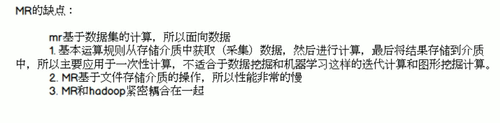

2. yarn使得资源调度（RM）和任务调度（Driver）解耦。通过AM连接。当task在NM中运行，当task需要更多资源的时候，driver通过AM中介，来跟RM交互，拿到资源，最后RM指挥NM来拿到资源给task用

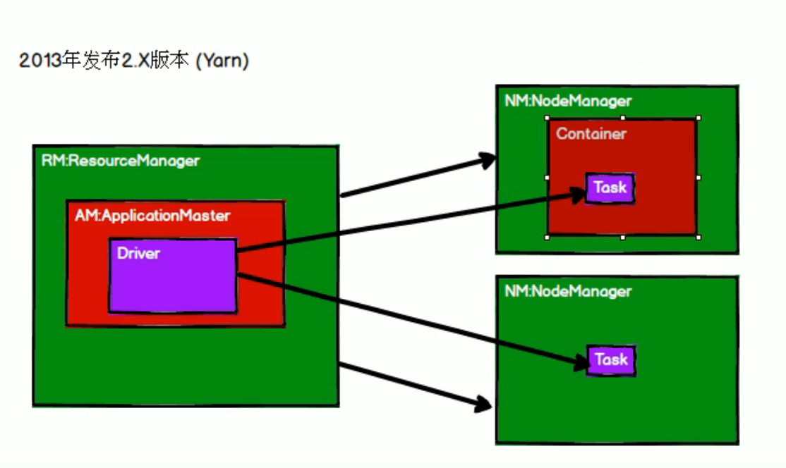

3.spark基于hadoop1.X来做，当时没有yarn，yarn是在hadoop2.X问世的

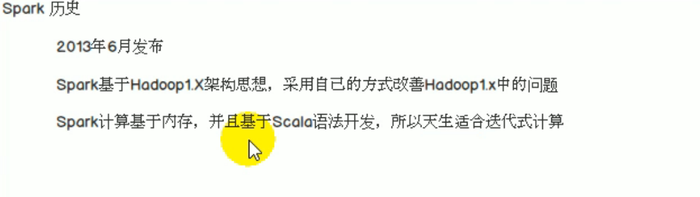

适合迭代式计算是因为scala是函数式编程，可以不断地调用函数。

中间结果放在内存中。

spark改进hadoop1.0中MapReduce缺点的方案是：

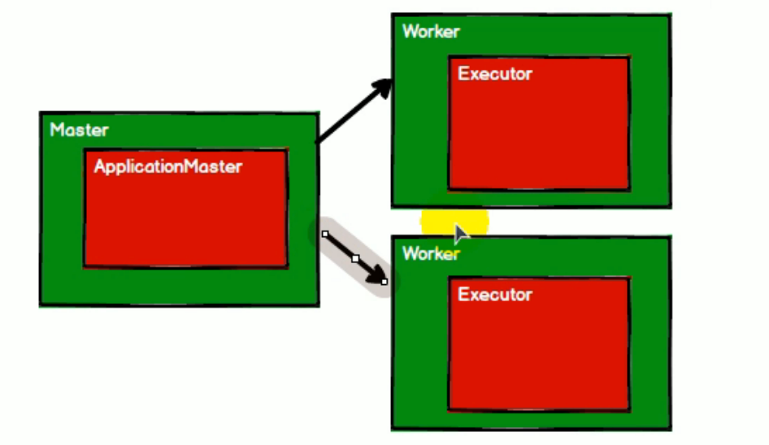

Worker是资源管理，Executor是计算。

Worker可以被yarn的NodeManager代替（资源管理可以被替代）但是计算框架spark比MapReduce要好用，所以当hadoop2.X实现yarn的资源调度+计算可插拔之后，大数据框架组合变成了hadoopHDFS存储+yarn资源调度+spark计算

## Spark内置模块

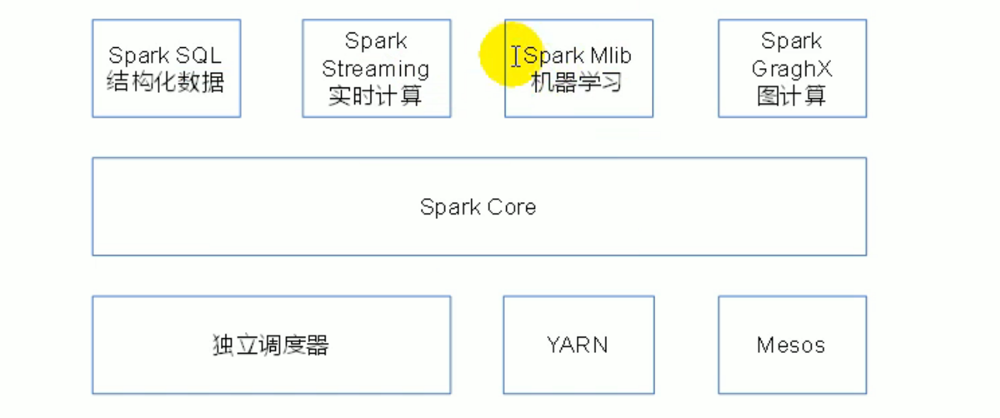

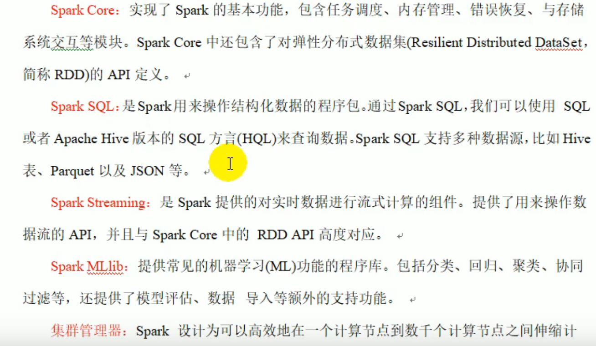

## Spark特点

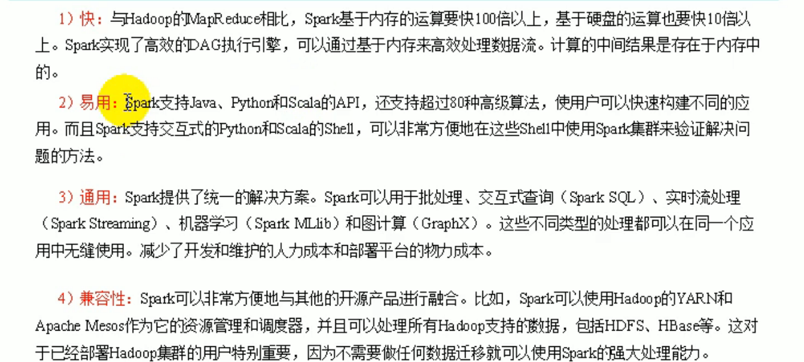

## Driver与Excetor

todo

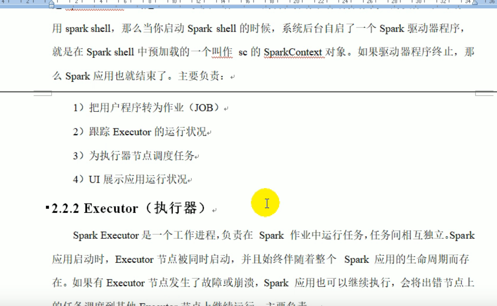

## WordCount思路

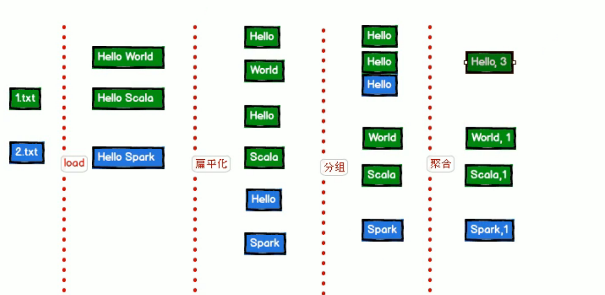

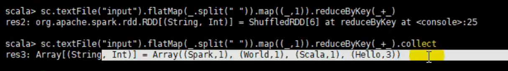

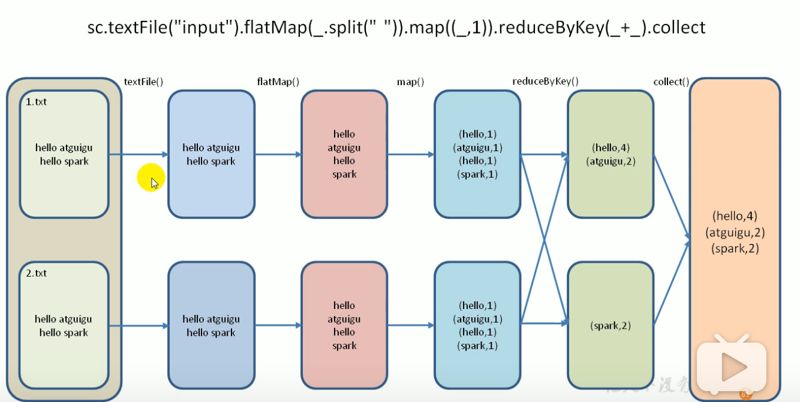

## Spark在Yarn下运行

## 使用yarn

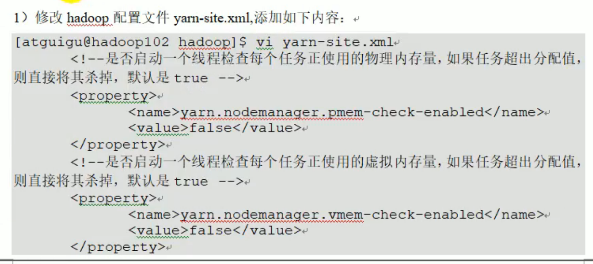

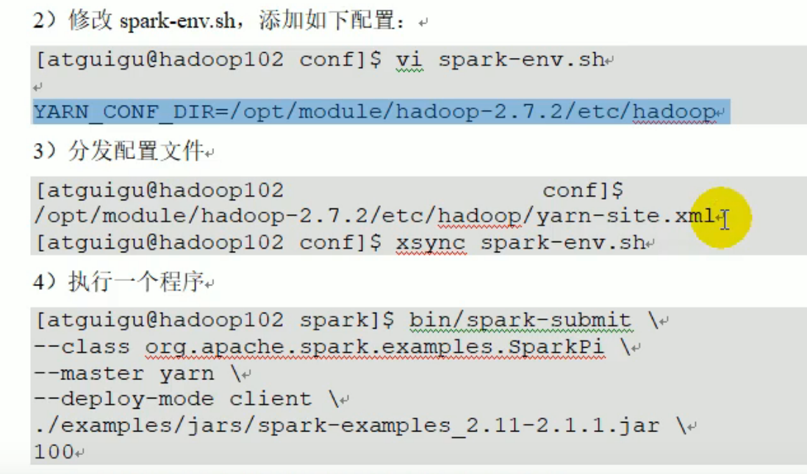

## 原理

### Yarn的架构

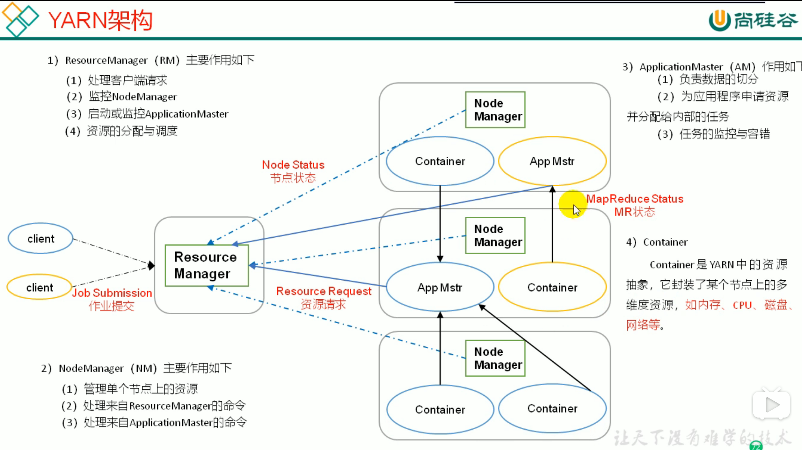

### Spark向Yarn提交任务的过程

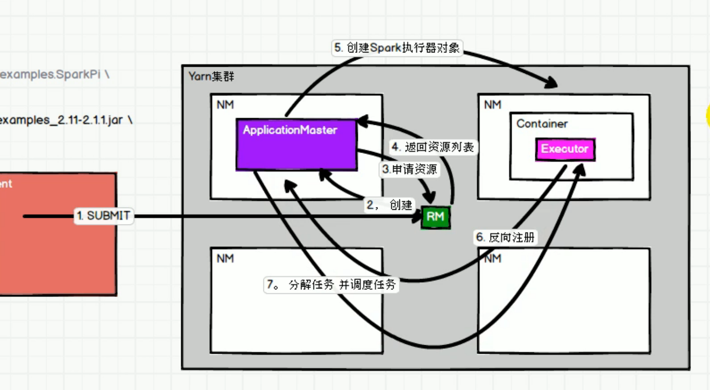

# RDD

## RDD介绍

RDD(Resilient Distributed Dataset) 叫着 弹性分布式数据集 ，是Spark 中最基本的抽象，它代表一个不可变、可分区、里面元素可以并行计算的集合。

RDD 具有数据流模型特点：自动容错、位置感知性调度和可伸缩。

RDD 允许用户在执行多个查询时，显示地将工作集缓存在内存中，后续的查询能够重用工作集，这将会极大的提升查询的效率。

我们可以认为 RDD 就是一个代理，我们操作这个代理就像操作本地集合一样，不需去关心任务调度、容错等问题。

## RDD 的属性

**一组分片（Partition），即数据集的基本组成单位**。 对于RDD来说，每个分片都会被一个计算任务处理，并决定并行计算的粒度。用户可以在创建RDD 的时候指定RDD的分片个数，如果没有指定，那么就会采用默认值。默认值就是程序所分配到的CPU Cores 的数目；

**对于RDD来说，每个分片都会被一个计算任务处理，并决定并行计算的粒度**。用户可以在创建RDD 的时候指定RDD的分片个数，如果没有指定，那么就会采用默认值。默认值就是程序所分配到的CPU Cores 的数目；

**RDD 之间互相存在依赖关系**。 RDD 的每次转换都会生成一个新的 RDD ,所以 RDD 之前就会形成类似于流水线一样的前后依赖关系。在部分分区数据丢失时，Spark 可以通过这个依赖关系重新计算丢失部分的分区数据，而不是对 RDD 的所有分区进行重新计算。

**一个Partitioner ，即 RDD 的分片函数** 。当前Spark 中实现了两种类型的分片函数，一个是基于哈希的 HashPartitioner ，另外一个是基于范围的 RangePartitioner。只有对于key-value的RDD ,才会有 Partitioner,非 key-value 的RDD 的 Partitioner 的值是None。Partitioner 函数不但决定了RDD 本身的分片数量，也决定了 Parent RDD Shuffle 输出时的分片数量。

**一个列表，存储存取每个Partition 的优先位置（preferred location）**。 对于一个HDFS 文件来说，这个列表保存的就是每个 Partition 所在的块位置。安装“移动数据不如移动计算”的理念，Spark 在进行任务调度的时候，会尽可能地将计算任务分配到其所要处理数据块的存储位置。

## 创建 RDD

## 依赖关系

RDD 和它依赖的 父 RDD(可能有多个) 的关系有两种不同的类型，即 窄依赖（narrow dependency）和宽依赖（wide dependency）。

**窄依赖**：窄依赖指的是每一个父 RDD 的 Partition 最多被子 RDD 的一个分区使用。可以比喻为独生子女。 **宽依赖**：宽依赖是多个字 RDD 的Partition 会依赖同一个父 RDD 的 Partition

## RDD 的持久化

### RDD 的 cache(持久化)

Spark中最重要的功能之一是跨操作在内存中持久化（或缓存）数据集。当您持久保存RDD时，每个节点都会存储它在内存中计算的任何分区，并在该数据集（或从中派生的数据集）的其他操作中重用它们。这使得未来的行动更快（通常超过10倍）。缓存是迭代算法和快速交互使用的关键工具。

您可以使用persist()或cache()方法标记要保留的RDD 。第一次在动作中计算它，它将保留在节点的内存中。Spark的缓存是容错的 - 如果丢失了RDD的任何分区，它将使用最初创建它的转换自动重新计算。

### 持久化需求

1. 要求的计算速度快
2. 集群的资源要足够大
3. 重要: cache 的数据会多次触发Action
4. 建议先进行数据过滤,然后将缩小范围后的数据再cache 到内存中.

