<!-- TOC -->

- [Spark基础](#spark%e5%9f%ba%e7%a1%80)
  - [spark来历](#spark%e6%9d%a5%e5%8e%86)
  - [Spark内置模块](#spark%e5%86%85%e7%bd%ae%e6%a8%a1%e5%9d%97)
  - [Spark特点](#spark%e7%89%b9%e7%82%b9)
  - [Driver与Excetor](#driver%e4%b8%8eexcetor)
  - [WordCount思路](#wordcount%e6%80%9d%e8%b7%af)
    - [代码TODO](#%e4%bb%a3%e7%a0%81todo)
  - [Spark在Yarn下运行](#spark%e5%9c%a8yarn%e4%b8%8b%e8%bf%90%e8%a1%8c)
  - [使用yarn](#%e4%bd%bf%e7%94%a8yarn)
  - [原理](#%e5%8e%9f%e7%90%86)
    - [Yarn的架构](#yarn%e7%9a%84%e6%9e%b6%e6%9e%84)
    - [Spark向Yarn提交任务的过程](#spark%e5%90%91yarn%e6%8f%90%e4%ba%a4%e4%bb%bb%e5%8a%a1%e7%9a%84%e8%bf%87%e7%a8%8b)
- [RDD](#rdd)
  - [JavaIO](#javaio)
    - [字符流的读取](#%e5%ad%97%e7%ac%a6%e6%b5%81%e7%9a%84%e8%af%bb%e5%8f%96)
  - [RDD介绍](#rdd%e4%bb%8b%e7%bb%8d)
    - [RDD的原理](#rdd%e7%9a%84%e5%8e%9f%e7%90%86)
  - [RDD 的属性](#rdd-%e7%9a%84%e5%b1%9e%e6%80%a7)
  - [RDD的特点](#rdd%e7%9a%84%e7%89%b9%e7%82%b9)
    - [分区](#%e5%88%86%e5%8c%ba)
    - [只读](#%e5%8f%aa%e8%af%bb)
    - [依赖](#%e4%be%9d%e8%b5%96)
    - [缓存](#%e7%bc%93%e5%ad%98)
    - [CheckPoint](#checkpoint)
    - [依赖关系](#%e4%be%9d%e8%b5%96%e5%85%b3%e7%b3%bb)
  - [RDD编程](#rdd%e7%bc%96%e7%a8%8b)
    - [RDD创建](#rdd%e5%88%9b%e5%bb%ba)
      - [从集合创建](#%e4%bb%8e%e9%9b%86%e5%90%88%e5%88%9b%e5%bb%ba)
      - [从外部存储系统创建](#%e4%bb%8e%e5%a4%96%e9%83%a8%e5%ad%98%e5%82%a8%e7%b3%bb%e7%bb%9f%e5%88%9b%e5%bb%ba)
    - [分区原理](#%e5%88%86%e5%8c%ba%e5%8e%9f%e7%90%86)
  - [RDD的转换](#rdd%e7%9a%84%e8%bd%ac%e6%8d%a2)
    - [Value类型](#value%e7%b1%bb%e5%9e%8b)
      - [map(func)案例](#mapfunc%e6%a1%88%e4%be%8b)
      - [mapPartitions(func) 案例](#mappartitionsfunc-%e6%a1%88%e4%be%8b)
      - [mapPartitionsWithIndex(func) 案例](#mappartitionswithindexfunc-%e6%a1%88%e4%be%8b)
    - [Driver与Excetor之间数据的传递](#driver%e4%b8%8eexcetor%e4%b9%8b%e9%97%b4%e6%95%b0%e6%8d%ae%e7%9a%84%e4%bc%a0%e9%80%92)
      - [latMap(func) 案例](#latmapfunc-%e6%a1%88%e4%be%8b)
      - [map()和mapPartition()的区别](#map%e5%92%8cmappartition%e7%9a%84%e5%8c%ba%e5%88%ab)
      - [glom案例](#glom%e6%a1%88%e4%be%8b)
      - [groupBy(func)案例](#groupbyfunc%e6%a1%88%e4%be%8b)
      - [filter(func) 案例](#filterfunc-%e6%a1%88%e4%be%8b)
      - [sample(withReplacement, fraction, seed) 案例](#samplewithreplacement-fraction-seed-%e6%a1%88%e4%be%8b)
      - [distinct([numTasks])) 案例](#distinctnumtasks-%e6%a1%88%e4%be%8b)
      - [coalesce(numPartitions) 案例](#coalescenumpartitions-%e6%a1%88%e4%be%8b)
      - [repartition(numPartitions) 案例](#repartitionnumpartitions-%e6%a1%88%e4%be%8b)
      - [coalesce和repartition的区别](#coalesce%e5%92%8crepartition%e7%9a%84%e5%8c%ba%e5%88%ab)
      - [sortBy(func,[ascending], [numTasks]) 案例](#sortbyfuncascending-numtasks-%e6%a1%88%e4%be%8b)
      - [pipe(command, [envVars]) 案例](#pipecommand-envvars-%e6%a1%88%e4%be%8b)
    - [双Value类型交互](#%e5%8f%8cvalue%e7%b1%bb%e5%9e%8b%e4%ba%a4%e4%ba%92)
      - [2.3.2.1 union(otherDataset) 案例](#2321-unionotherdataset-%e6%a1%88%e4%be%8b)
      - [2.3.2.2 subtract (otherDataset) 案例](#2322-subtract-otherdataset-%e6%a1%88%e4%be%8b)
      - [2.3.2.3 intersection(otherDataset) 案例](#2323-intersectionotherdataset-%e6%a1%88%e4%be%8b)
      - [2.3.2.4 cartesian(otherDataset) 案例](#2324-cartesianotherdataset-%e6%a1%88%e4%be%8b)
      - [2.3.2.5 zip(otherDataset)案例](#2325-zipotherdataset%e6%a1%88%e4%be%8b)
    - [2.3.3 Key-Value类型](#233-key-value%e7%b1%bb%e5%9e%8b)
      - [2.3.3.1 partitionBy案例](#2331-partitionby%e6%a1%88%e4%be%8b)
      - [2.3.3.2 groupByKey案例](#2332-groupbykey%e6%a1%88%e4%be%8b)
      - [2.3.3.3 reduceByKey(func, [numTasks]) 案例](#2333-reducebykeyfunc-numtasks-%e6%a1%88%e4%be%8b)
      - [2.3.3.4 reduceByKey和groupByKey的区别](#2334-reducebykey%e5%92%8cgroupbykey%e7%9a%84%e5%8c%ba%e5%88%ab)
      - [2.3.3.5 aggregateByKey案例](#2335-aggregatebykey%e6%a1%88%e4%be%8b)
      - [2.3.3.6 foldByKey案例](#2336-foldbykey%e6%a1%88%e4%be%8b)
      - [2.3.3.7 combineByKey[C] 案例](#2337-combinebykeyc-%e6%a1%88%e4%be%8b)
      - [2.3.3.8 sortByKey([ascending], [numTasks]) 案例](#2338-sortbykeyascending-numtasks-%e6%a1%88%e4%be%8b)
      - [2.3.3.9 mapValues案例](#2339-mapvalues%e6%a1%88%e4%be%8b)
      - [2.3.3.10 join(otherDataset, [numTasks]) 案例](#23310-joinotherdataset-numtasks-%e6%a1%88%e4%be%8b)
      - [2.3.3.11 cogroup(otherDataset, [numTasks]) 案例](#23311-cogroupotherdataset-numtasks-%e6%a1%88%e4%be%8b)
    - [2.3.4 案例实操](#234-%e6%a1%88%e4%be%8b%e5%ae%9e%e6%93%8d)
  - [2.4 Action](#24-action)
    - [2.4.1 reduce(func)案例](#241-reducefunc%e6%a1%88%e4%be%8b)
    - [2.4.2 collect()案例](#242-collect%e6%a1%88%e4%be%8b)
    - [2.4.3 count()案例](#243-count%e6%a1%88%e4%be%8b)
    - [2.4.4 first()案例](#244-first%e6%a1%88%e4%be%8b)
    - [2.4.5 take(n)案例](#245-taken%e6%a1%88%e4%be%8b)
    - [2.4.6 takeOrdered(n)案例](#246-takeorderedn%e6%a1%88%e4%be%8b)
    - [2.4.7 aggregate案例](#247-aggregate%e6%a1%88%e4%be%8b)
    - [2.4.8 fold(num)(func)案例](#248-foldnumfunc%e6%a1%88%e4%be%8b)
    - [2.4.9 saveAsTextFile(path)](#249-saveastextfilepath)
    - [2.4.10 saveAsSequenceFile(path)](#2410-saveassequencefilepath)
    - [2.4.11 saveAsObjectFile(path)](#2411-saveasobjectfilepath)
    - [2.4.12 countByKey()案例](#2412-countbykey%e6%a1%88%e4%be%8b)
    - [2.4.13 foreach(func)案例](#2413-foreachfunc%e6%a1%88%e4%be%8b)
  - [RDD中的函数传递](#rdd%e4%b8%ad%e7%9a%84%e5%87%bd%e6%95%b0%e4%bc%a0%e9%80%92)
    - [传递一个方法](#%e4%bc%a0%e9%80%92%e4%b8%80%e4%b8%aa%e6%96%b9%e6%b3%95)
    - [2.5.2 传递一个属性](#252-%e4%bc%a0%e9%80%92%e4%b8%80%e4%b8%aa%e5%b1%9e%e6%80%a7)
  - [RDD依赖关系](#rdd%e4%be%9d%e8%b5%96%e5%85%b3%e7%b3%bb)
    - [Lineage](#lineage)
    - [窄依赖](#%e7%aa%84%e4%be%9d%e8%b5%96)
    - [宽依赖](#%e5%ae%bd%e4%be%9d%e8%b5%96)
    - [DAG](#dag)
    - [任务划分（面试重点）](#%e4%bb%bb%e5%8a%a1%e5%88%92%e5%88%86%e9%9d%a2%e8%af%95%e9%87%8d%e7%82%b9)
  - [RDD缓存](#rdd%e7%bc%93%e5%ad%98)
    - [RDD CheckPoint](#rdd-checkpoint)
  - [键值对RDD数据分区器](#%e9%94%ae%e5%80%bc%e5%af%b9rdd%e6%95%b0%e6%8d%ae%e5%88%86%e5%8c%ba%e5%99%a8)
    - [Hash分区](#hash%e5%88%86%e5%8c%ba)
    - [Ranger分区](#ranger%e5%88%86%e5%8c%ba)
    - [自定义分区](#%e8%87%aa%e5%ae%9a%e4%b9%89%e5%88%86%e5%8c%ba)
  - [数据读取与保存](#%e6%95%b0%e6%8d%ae%e8%af%bb%e5%8f%96%e4%b8%8e%e4%bf%9d%e5%ad%98)
    - [文件类数据读取与保存](#%e6%96%87%e4%bb%b6%e7%b1%bb%e6%95%b0%e6%8d%ae%e8%af%bb%e5%8f%96%e4%b8%8e%e4%bf%9d%e5%ad%98)
      - [Text文件](#text%e6%96%87%e4%bb%b6)
      - [Json文件](#json%e6%96%87%e4%bb%b6)
      - [对象文件](#%e5%af%b9%e8%b1%a1%e6%96%87%e4%bb%b6)
    - [文件系统类数据读取与保存](#%e6%96%87%e4%bb%b6%e7%b3%bb%e7%bb%9f%e7%b1%bb%e6%95%b0%e6%8d%ae%e8%af%bb%e5%8f%96%e4%b8%8e%e4%bf%9d%e5%ad%98)
      - [HDFS](#hdfs)
      - [MySQL数据库连接](#mysql%e6%95%b0%e6%8d%ae%e5%ba%93%e8%bf%9e%e6%8e%a5)
    - [HBase数据库](#hbase%e6%95%b0%e6%8d%ae%e5%ba%93)
  - [RDD 的持久化](#rdd-%e7%9a%84%e6%8c%81%e4%b9%85%e5%8c%96)
    - [RDD 的 cache(持久化)](#rdd-%e7%9a%84-cache%e6%8c%81%e4%b9%85%e5%8c%96)
    - [持久化需求](#%e6%8c%81%e4%b9%85%e5%8c%96%e9%9c%80%e6%b1%82)

<!-- /TOC -->
# Spark基础

## spark来历


1. MapReduce有很多弊端


2. yarn使得资源调度（RM）和任务调度（Driver）解耦。通过AM连接。当task在NM中运行，当task需要更多资源的时候，driver通过AM中介，来跟RM交互，拿到资源，最后RM指挥NM来拿到资源给task用


3.spark基于hadoop1.X来做，当时没有yarn，yarn是在hadoop2.X问世的


适合迭代式计算是因为scala是函数式编程，可以不断地调用函数。

中间结果放在内存中。

spark改进hadoop1.0中MapReduce缺点的方案是：


Worker是资源管理，Executor是计算。

Worker可以被yarn的NodeManager代替（资源管理可以被替代）但是计算框架spark比MapReduce要好用，所以当hadoop2.X实现yarn的资源调度+计算可插拔之后，大数据框架组合变成了hadoopHDFS存储+yarn资源调度+spark计算


## Spark内置模块


## Spark特点


## Driver与Excetor

todo


## WordCount思路


### 代码TODO


## Spark在Yarn下运行

## 使用yarn


## 原理

### Yarn的架构


### Spark向Yarn提交任务的过程

提交代码

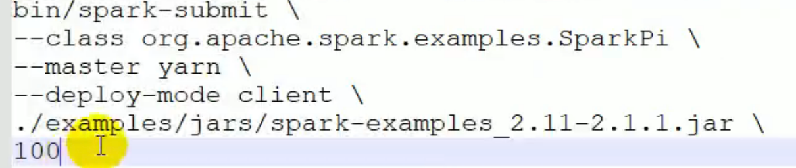


# RDD

## JavaIO

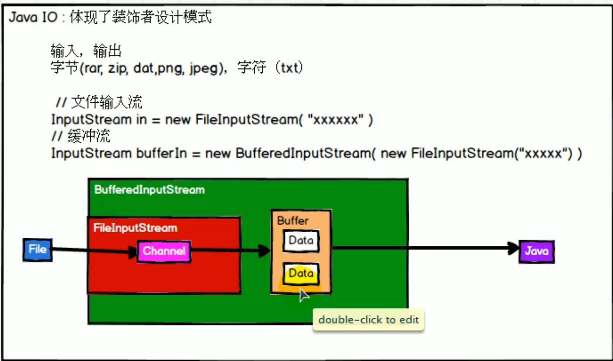

BufferedInputStream是一个缓冲区

FileInputStream是实际读取文件者

### 字符流的读取

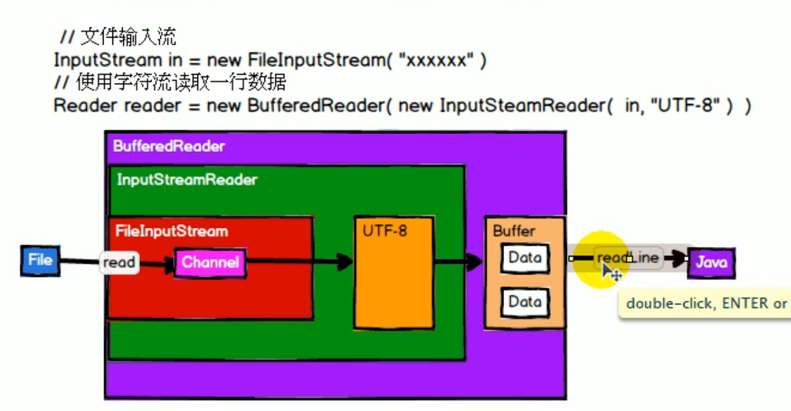


FileInputStream是实际读取文件者

InputStreamReader（new FileInputStream（“xx”），“UTF-8”）；负责把FileInputStream的读取转换成UTF-8的格式

BufferedReader是一个字符缓冲区，把UTF-8的数据放入缓冲区，存满后发给java程序

最后的readline的时候才是真正的java读取


## RDD介绍

RDD(Resilient Distributed Dataset) 叫着 弹性分布式数据集 ，是Spark 中最基本的抽象，它代表一个不可变、可分区、里面元素可以并行计算的集合。

**不可变的意思是内部不提供改变数据的方法，类似于string类型不同改变string的方法，substring之类的函数其实是创建一个新的字符串，不可变是因为rdd的数据要给很多程序来用。**

RDD 具有数据流模型特点：自动容错、位置感知性调度和可伸缩。

RDD 允许用户在执行多个查询时，显示地将工作集缓存在内存中，后续的查询能够重用工作集，这将会极大的提升查询的效率。

我们可以认为 RDD 就是一个代理，我们操作这个代理就像操作本地集合一样，不需去关心任务调度、容错等问题。

### RDD的原理

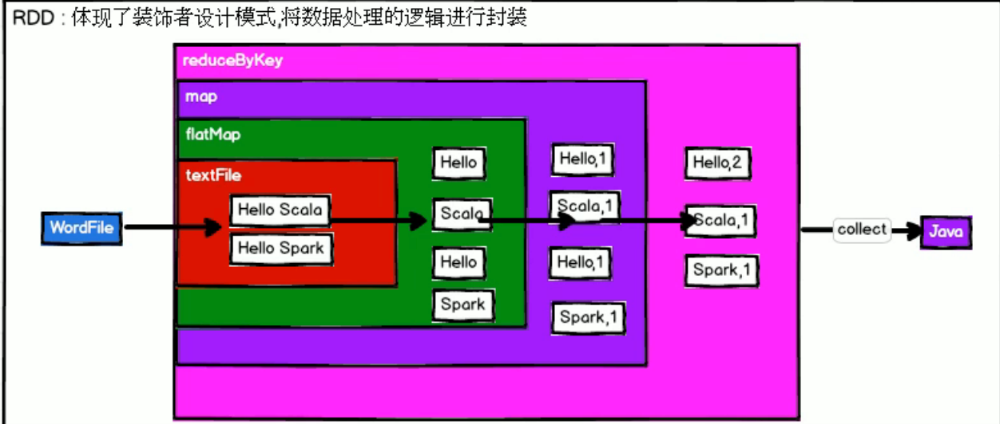

当触发collect的时候才会执行图中的逻辑。在此之前知识数据处理逻辑的封装。

RDD里面封装的是数据处理逻辑，而非数据。


## RDD 的属性

**一组分片（Partition），即数据集的基本组成单位**。 对于RDD来说，每个分片都会被一个计算任务处理，并决定并行计算的粒度。用户可以在创建RDD 的时候指定RDD的分片个数，如果没有指定，那么就会采用默认值。默认值就是程序所分配到的CPU Cores 的数目；

**对于RDD来说，每个分片都会被一个计算任务处理，并决定并行计算的粒度**。用户可以在创建RDD 的时候指定RDD的分片个数，如果没有指定，那么就会采用默认值。默认值就是程序所分配到的CPU Cores 的数目；

**RDD 之间互相存在依赖关系**。 RDD 的每次转换都会生成一个新的 RDD ,所以 RDD 之前就会形成类似于流水线一样的前后依赖关系。在部分分区数据丢失时，Spark 可以通过这个依赖关系重新计算丢失部分的分区数据，而不是对 RDD 的所有分区进行重新计算。

**一个Partitioner ，即 RDD 的分片函数** 。当前Spark 中实现了两种类型的分片函数，一个是基于哈希的 HashPartitioner ，另外一个是基于范围的 RangePartitioner。只有对于key-value的RDD ,才会有 Partitioner,非 key-value 的RDD 的 Partitioner 的值是None。Partitioner 函数不但决定了RDD 本身的分片数量，也决定了 Parent RDD Shuffle 输出时的分片数量。

**一个列表，存储存取每个Partition 的优先位置（preferred location）**。 对于一个HDFS 文件来说，这个列表保存的就是每个 Partition 所在的块位置。安装“移动数据不如移动计算”的理念，Spark 在进行任务调度的时候，会尽可能地将计算任务分配到其所要处理数据块的存储位置。

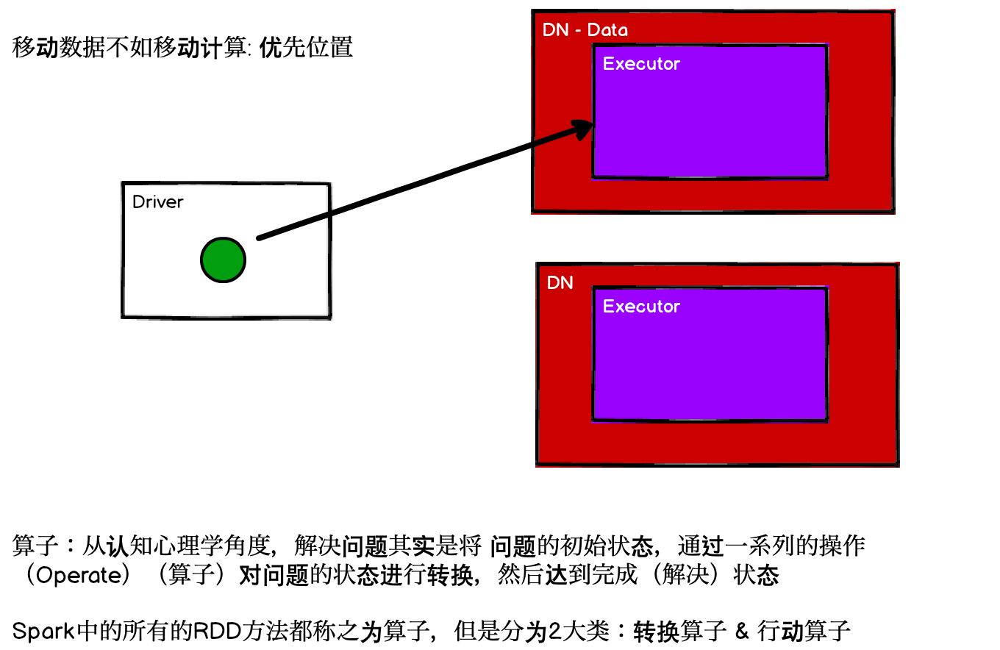


## RDD的特点

RDD表示只读的分区的数据集，对RDD进行改动，只能通过RDD的转换操作，由一个RDD得到一个新的RDD，新的RDD包含了从其他RDD衍生所必需的信息。RDDs之间存在依赖，RDD的执行是按照血缘关系延时计算的。如果血缘关系较长，可以通过持久化RDD来切断血缘关系。

### 分区

RDD逻辑上是分区的，每个分区的数据是抽象存在的，计算的时候会通过一个compute函数得到每个分区的数据。如果RDD是通过已有的文件系统构建，则compute函数是读取指定文件系统中的数据，如果RDD是通过其他RDD转换而来，则compute函数是执行转换逻辑将其他RDD的数据进行转换。

### 只读

RDD是只读的，要想改变RDD中的数据，只能在现有的RDD基础上创建新的RDD。

由一个RDD转换到另一个RDD，可以通过丰富的操作算子实现，不再像MapReduce那样只能写map和reduce了

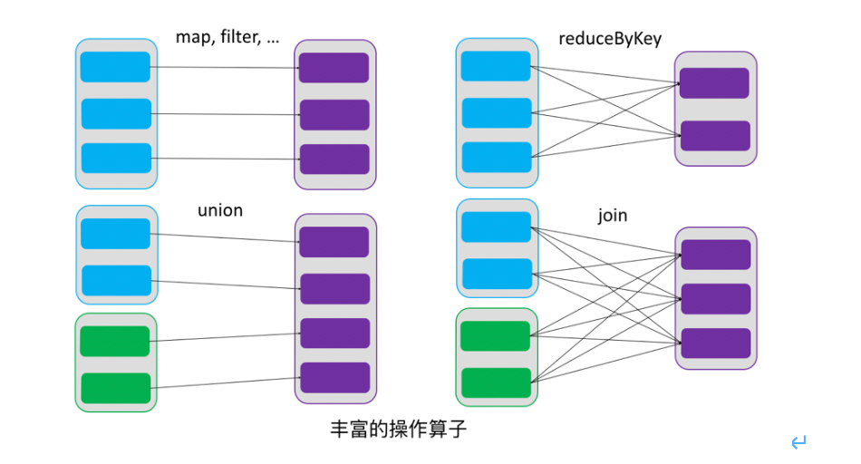


RDD的操作算子包括两类，一类叫做transformations，它是用来将RDD进行转化，构建RDD的血缘关系；另一类叫做actions，它是用来触发RDD的计算，得到RDD的相关计算结果或者将RDD保存的文件系统中。下图是RDD所支持的操作算子列表。

### 依赖

RDDs通过操作算子进行转换，转换得到的新RDD包含了从其他RDDs衍生所必需的信息，RDDs之间维护着这种血缘关系，也称之为依赖。如下图所示，依赖包括两种，一种是窄依赖，RDDs之间分区是一一对应的，另一种是宽依赖，下游RDD的每个分区与上游RDD(也称之为父RDD)的每个分区都有关，是多对多的关系。

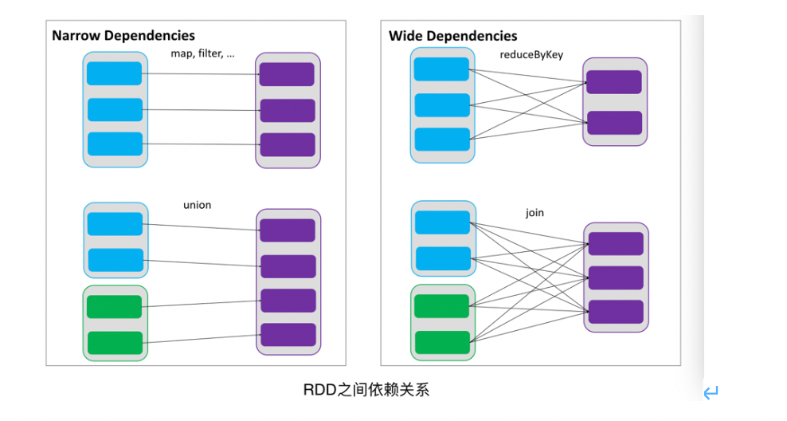                               

### 缓存

如果在应用程序中多次使用同一个RDD，可以将该RDD缓存起来，该RDD只有在第一次计算的时候会根据血缘关系得到分区的数据，在后续其他地方用到该RDD的时候，会直接从缓存处取而不用再根据血缘关系计算，这样就加速后期的重用。如下图所示，RDD-1经过一系列的转换后得到RDD-n并保存到hdfs，RDD-1在这一过程中会有个中间结果，如果将其缓存到内存，那么在随后的RDD-1转换到RDD-m这一过程中，就不会计算其之前的RDD-0了。

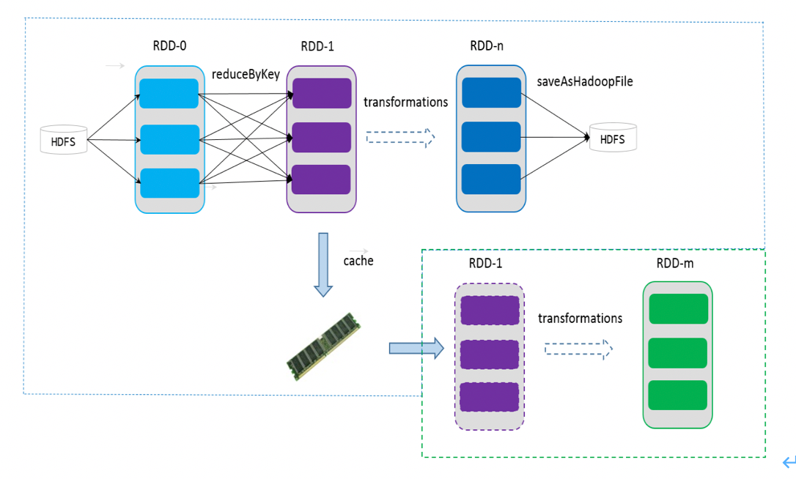 

### CheckPoint

虽然RDD的血缘关系天然地可以实现容错，当RDD的某个分区数据失败或丢失，可以通过血缘关系重建。但是对于长时间迭代型应用来说，随着迭代的进行，RDDs之间的血缘关系会越来越长，一旦在后续迭代过程中出错，则需要通过非常长的血缘关系去重建，势必影响性能。为此，RDD支持checkpoint将数据保存到持久化的存储中，这样就可以切断之前的血缘关系，因为checkpoint后的RDD不需要知道它的父RDDs了，它可以从checkpoint处拿到数据。


### 依赖关系

RDD 和它依赖的 父 RDD(可能有多个) 的关系有两种不同的类型，即 窄依赖（narrow dependency）和宽依赖（wide dependency）。

**窄依赖**：窄依赖指的是每一个父 RDD 的 Partition 最多被子 RDD 的一个分区使用。可以比喻为独生子女。 **宽依赖**：宽依赖是多个字 RDD 的Partition 会依赖同一个父 RDD 的 Partition


## RDD编程

### RDD创建

在Spark中创建RDD的创建方式可以分为三种：从集合中创建RDD；从外部存储创建RDD；从其他RDD创建。

#### 从集合创建

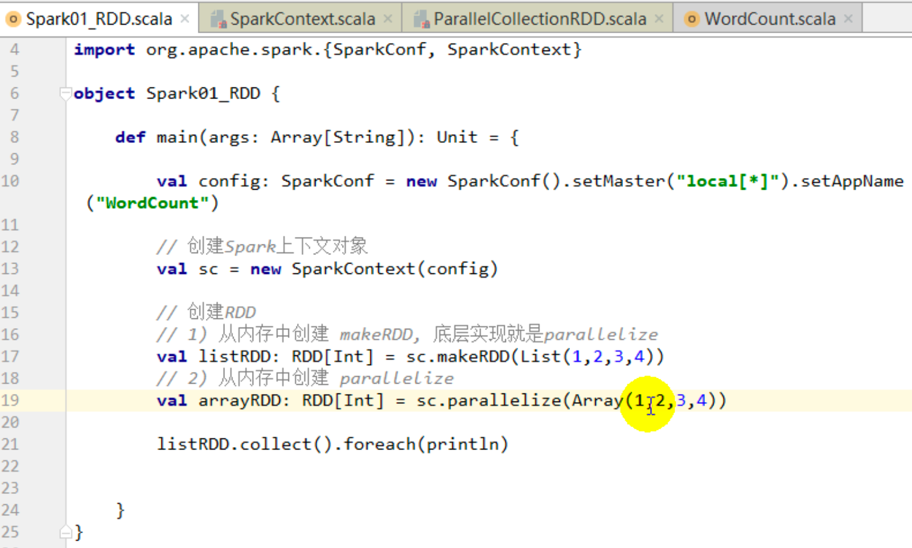

#### 从外部存储系统创建

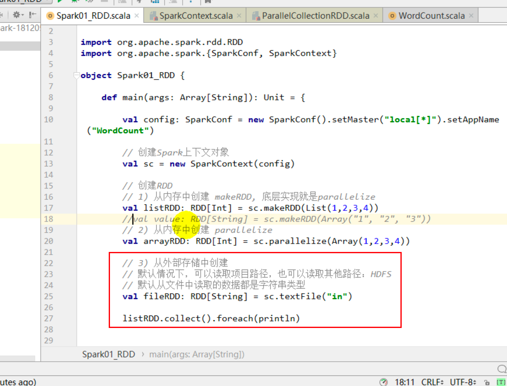

**分区问题**

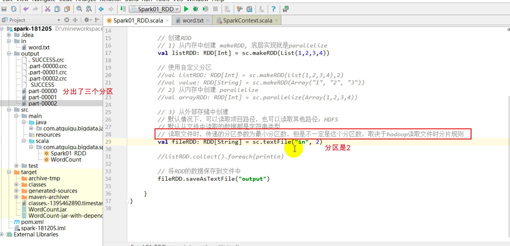


### 分区原理

文件分区的分区数是最小分区数，内存分区的分区数是最大分区数。

**最小分区数**

根据读入文件的字节数大小假设是13KB，分区数为2，则分区为

13/2= 6...1

所以分区为

6   6  1 

最终有三个分区

**最大分区数**

13被拆分为  6  和 6+1

## RDD的转换

RDD整体上分为Value类型和Key-Value类型

### Value类型

#### map(func)案例

1. 作用：返回一个新的RDD，该RDD由每一个输入元素经过func函数转换后组成

2. 需求：创建一个1-10数组的RDD，将所有元素*2形成新的RDD

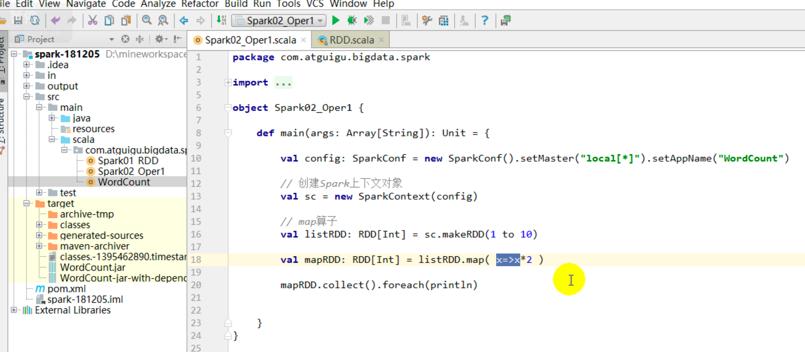

####  mapPartitions(func) 案例

作用：类似于map，但独立地在RDD的每一个分片上运行，因此在类型为T的RDD上运行时，func的函数类型必须是Iterator[T] => Iterator[U]。假设有N个元素，有M个分区，那么map的函数的将被调用N次,而mapPartitions被调用M次,一个函数一次处理所有分区。

#### mapPartitionsWithIndex(func) 案例

作用：类似于mapPartitions，但func带有一个整数参数表示分片的索引值，因此在类型为T的RDD上运行时，func的函数类型必须是(Int, Interator[T]) => Iterator[U]；

### Driver与Excetor之间数据的传递

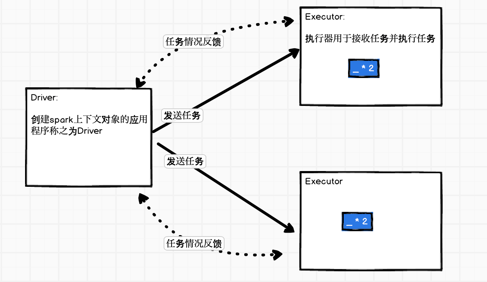

Driver和Executor分别执行不同的代码：

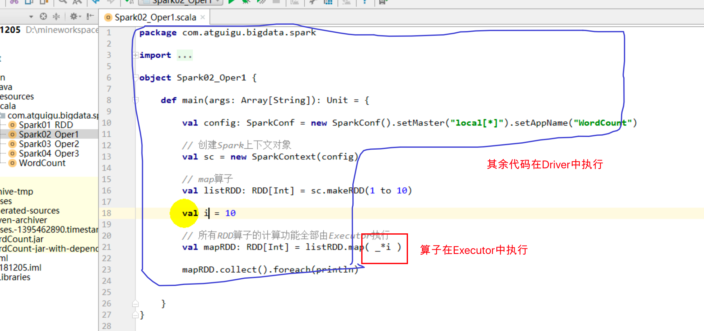

这就会涉及到如果Driver和Executor不在同一台机器，i的传播问题，如果i不能被序列化，则i无法在不同机器间传播，则会报错。


#### latMap(func) 案例

 作用：类似于map，但是每一个输入元素可以被映射为0或多个输出元素（所以func应该返回一个序列，而不是单一元素）

#### map()和mapPartition()的区别

1. map()：每次处理一条数据。

2. mapPartition()：每次处理一个分区的数据，这个分区的数据处理完后，原RDD中分区的数据才能释放，**可能导致OOM。**

3. 开发指导：当内存空间较大的时候建议使用mapPartition()，以提高处理效率。

####  glom案例

作用：将每一个分区形成一个数组，形成新的RDD类型时RDD[Array[T]]

####  groupBy(func)案例

作用：分组，按照传入函数的返回值进行分组。将相同的key对应的值放入一个迭代器。

需求：创建一个RDD，按照元素模以2的值进行分组。

（1）创建

scala> val rdd = sc.parallelize(1 to 4)

rdd: org.apache.spark.rdd.RDD[Int] = ParallelCollectionRDD[65] at parallelize at <console>:24

（2）按照元素模以2的值进行分组

scala> val group = rdd.groupBy(_%2)

group: org.apache.spark.rdd.RDD[(Int, Iterable[Int])] = ShuffledRDD[2] at groupBy at <console>:26

（3）打印结果

scala> group.collect

res0: Array[(Int, Iterable[Int])] = Array((0,CompactBuffer(2, 4)), (1,CompactBuffer(1, 3)))

#### filter(func) 案例

作用：过滤。返回一个新的RDD，该RDD由经过func函数计算后返回值为true的输入元素组成。

需求：创建一个RDD（由字符串组成），过滤出一个新RDD（包含”xiao”子串）

（1）创建

scala> var sourceFilter = sc.parallelize(Array("xiaoming","xiaojiang","xiaohe","dazhi"))

sourceFilter: org.apache.spark.rdd.RDD[String] = ParallelCollectionRDD[10] at parallelize at <console>:24

（2）打印

scala> sourceFilter.collect()

res9: Array[String] = Array(xiaoming, xiaojiang, xiaohe, dazhi)

（3）过滤出含” xiao”子串的形成一个新的RDD

scala> val filter = sourceFilter.filter(_.contains("xiao"))

filter: org.apache.spark.rdd.RDD[String] = MapPartitionsRDD[11] at filter at <console>:26

（4）打印新RDD

scala> filter.collect()

res10: Array[String] = Array(xiaoming, xiaojiang, xiaohe)

#### sample(withReplacement, fraction, seed) 案例

作用：以指定的随机种子随机抽样出数量为fraction的数据，withReplacement表示是抽出的数据是否放回，true为有放回的抽样，false为无放回的抽样，seed用于指定随机数生成器种子。

需求：创建一个RDD（1-10），从中选择放回和不放回抽样

（1）创建RDD

scala> val rdd = sc.parallelize(1 to 10)

rdd: org.apache.spark.rdd.RDD[Int] = ParallelCollectionRDD[20] at parallelize at <console>:24

（2）打印

scala> rdd.collect()

res15: Array[Int] = Array(1, 2, 3, 4, 5, 6, 7, 8, 9, 10)

（3）放回抽样

scala> var sample1 = rdd.sample(true,0.4,2)

sample1: org.apache.spark.rdd.RDD[Int] = PartitionwiseSampledRDD[21] at sample at <console>:26

（4）打印放回抽样结果

scala> sample1.collect()

res16: Array[Int] = Array(1, 2, 2, 7, 7, 8, 9)

（5）不放回抽样

scala> var sample2 = rdd.sample(false,0.2,3)

sample2: org.apache.spark.rdd.RDD[Int] = PartitionwiseSampledRDD[22] at sample at <console>:26

（6）打印不放回抽样结果

scala> sample2.collect()

res17: Array[Int] = Array(1, 9)

#### distinct([numTasks])) 案例

作用：对源RDD进行去重后返回一个新的RDD。默认情况下，只有8个并行任务来操作，但是可以传入一个可选的numTasks参数改变它。

需求：创建一个RDD，使用distinct()对其去重。

（1）创建一个RDD

scala> val distinctRdd = sc.parallelize(List(1,2,1,5,2,9,6,1))

distinctRdd: org.apache.spark.rdd.RDD[Int] = ParallelCollectionRDD[34] at parallelize at <console>:24

（2）对RDD进行去重（不指定并行度）

scala> val unionRDD = distinctRdd.distinct()

unionRDD: org.apache.spark.rdd.RDD[Int] = MapPartitionsRDD[37] at distinct at <console>:26

（3）打印去重后生成的新RDD

scala> unionRDD.collect()

res20: Array[Int] = Array(1, 9, 5, 6, 2)

（4）对RDD（指定并行度为2）

scala> val unionRDD = distinctRdd.distinct(2)

unionRDD: org.apache.spark.rdd.RDD[Int] = MapPartitionsRDD[40] at distinct at <console>:26

（5）打印去重后生成的新RDD

scala> unionRDD.collect()

res21: Array[Int] = Array(6, 2, 1, 9, 5)

#### coalesce(numPartitions) 案例

作用：缩减分区数，用于大数据集过滤后，提高小数据集的执行效率。

需求：创建一个4个分区的RDD，对其缩减分区

（1）创建一个RDD

scala> val rdd = sc.parallelize(1 to 16,4)

rdd: org.apache.spark.rdd.RDD[Int] = ParallelCollectionRDD[54] at parallelize at <console>:24

（2）查看RDD的分区数

scala> rdd.partitions.size

res20: Int = 4

（3）对RDD重新分区

scala> val coalesceRDD = rdd.coalesce(3)

coalesceRDD: org.apache.spark.rdd.RDD[Int] = CoalescedRDD[55] at coalesce at <console>:26

（4）查看新RDD的分区数

scala> coalesceRDD.partitions.size

res21: Int = 3

#### repartition(numPartitions) 案例

作用：根据分区数，重新通过网络随机洗牌所有数据。

需求：创建一个4个分区的RDD，对其重新分区

（1）创建一个RDD

scala> val rdd = sc.parallelize(1 to 16,4)

rdd: org.apache.spark.rdd.RDD[Int] = ParallelCollectionRDD[56] at parallelize at <console>:24

（2）查看RDD的分区数

scala> rdd.partitions.size

res22: Int = 4

（3）对RDD重新分区

scala> val rerdd = rdd.repartition(2)

rerdd: org.apache.spark.rdd.RDD[Int] = MapPartitionsRDD[60] at repartition at <console>:26

（4）查看新RDD的分区数

scala> rerdd.partitions.size

res23: Int = 2

####  coalesce和repartition的区别

coalesce重新分区，可以选择是否进行shuffle过程。由参数shuffle: Boolean = false/true决定。

repartition实际上是调用的coalesce，默认是进行shuffle的。源码如下：

def repartition(numPartitions: Int)(implicit ord: Ordering[T] = null): RDD[T] = withScope {
  coalesce(numPartitions, shuffle = true)
 }

#### sortBy(func,[ascending], [numTasks]) 案例

作用；使用func先对数据进行处理，按照处理后的数据比较结果排序，默认为正序。

需求：创建一个RDD，按照不同的规则进行排序

（1）创建一个RDD

scala> val rdd = sc.parallelize(List(2,1,3,4))

rdd: org.apache.spark.rdd.RDD[Int] = ParallelCollectionRDD[21] at parallelize at <console>:24

（2）按照自身大小排序

scala> rdd.sortBy(x => x).collect()

res11: Array[Int] = Array(1, 2, 3, 4)

（3）按照与3余数的大小排序

scala> rdd.sortBy(x => x%3).collect()

res12: Array[Int] = Array(3, 4, 1, 2)


#### pipe(command, [envVars]) 案例

作用：管道，针对每个分区，都执行一个shell脚本，返回输出的RDD。

注意：脚本需要放在Worker节点可以访问到的位置

需求：编写一个脚本，使用管道将脚本作用于RDD上。

（1）编写一个脚本

Shell脚本

\#!/bin/sh

echo "AA"

while read LINE; do

  echo ">>>"${LINE}

done

（2）创建一个只有一个分区的RDD

scala> val rdd = sc.parallelize(List("hi","Hello","how","are","you"),1)

rdd: org.apache.spark.rdd.RDD[String] = ParallelCollectionRDD[50] at parallelize at <console>:24

（3）将脚本作用该RDD并打印

scala> rdd.pipe("/opt/module/spark/pipe.sh").collect()

res18: Array[String] = Array(AA, >>>hi, >>>Hello, >>>how, >>>are, >>>you)

（4）创建一个有两个分区的RDD

scala> val rdd = sc.parallelize(List("hi","Hello","how","are","you"),2)

rdd: org.apache.spark.rdd.RDD[String] = ParallelCollectionRDD[52] at parallelize at <console>:24

（5）将脚本作用该RDD并打印

scala> rdd.pipe("/opt/module/spark/pipe.sh").collect()

res19: Array[String] = Array(AA, >>>hi, >>>Hello, AA, >>>how, >>>are, >>>you)

###  双Value类型交互

#### 2.3.2.1 union(otherDataset) 案例

\1. 作用：对源RDD和参数RDD求并集后返回一个新的RDD

\2. 需求：创建两个RDD，求并集

（1）创建第一个RDD

scala> val rdd1 = sc.parallelize(1 to 5)

rdd1: org.apache.spark.rdd.RDD[Int] = ParallelCollectionRDD[23] at parallelize at <console>:24

（2）创建第二个RDD

scala> val rdd2 = sc.parallelize(5 to 10)

rdd2: org.apache.spark.rdd.RDD[Int] = ParallelCollectionRDD[24] at parallelize at <console>:24

（3）计算两个RDD的并集

scala> val rdd3 = rdd1.union(rdd2)

rdd3: org.apache.spark.rdd.RDD[Int] = UnionRDD[25] at union at <console>:28

（4）打印并集结果

scala> rdd3.collect()

res18: Array[Int] = Array(1, 2, 3, 4, 5, 5, 6, 7, 8, 9, 10)

#### 2.3.2.2 subtract (otherDataset) 案例

\1. 作用：计算差的一种函数，去除两个RDD中相同的元素，不同的RDD将保留下来

\2. 需求：创建两个RDD，求第一个RDD与第二个RDD的差集

（1）创建第一个RDD

scala> val rdd = sc.parallelize(3 to 8)

rdd: org.apache.spark.rdd.RDD[Int] = ParallelCollectionRDD[70] at parallelize at <console>:24

（2）创建第二个RDD

scala> val rdd1 = sc.parallelize(1 to 5)

rdd1: org.apache.spark.rdd.RDD[Int] = ParallelCollectionRDD[71] at parallelize at <console>:24

（3）计算第一个RDD与第二个RDD的差集并打印

scala> rdd.subtract(rdd1).collect()

res27: Array[Int] = Array(8, 6, 7)

#### 2.3.2.3 intersection(otherDataset) 案例

\1. 作用：对源RDD和参数RDD求交集后返回一个新的RDD

\2. 需求：创建两个RDD，求两个RDD的交集

（1）创建第一个RDD

scala> val rdd1 = sc.parallelize(1 to 7)

rdd1: org.apache.spark.rdd.RDD[Int] = ParallelCollectionRDD[26] at parallelize at <console>:24

（2）创建第二个RDD

scala> val rdd2 = sc.parallelize(5 to 10)

rdd2: org.apache.spark.rdd.RDD[Int] = ParallelCollectionRDD[27] at parallelize at <console>:24

（3）计算两个RDD的交集

scala> val rdd3 = rdd1.intersection(rdd2)

rdd3: org.apache.spark.rdd.RDD[Int] = MapPartitionsRDD[33] at intersection at <console>:28

（4）打印计算结果

scala> rdd3.collect()

res19: Array[Int] = Array(5, 6, 7)

#### 2.3.2.4 cartesian(otherDataset) 案例

\1. 作用：笛卡尔积（尽量避免使用）

\2. 需求：创建两个RDD，计算两个RDD的笛卡尔积

（1）创建第一个RDD

scala> val rdd1 = sc.parallelize(1 to 3)

rdd1: org.apache.spark.rdd.RDD[Int] = ParallelCollectionRDD[47] at parallelize at <console>:24

（2）创建第二个RDD

scala> val rdd2 = sc.parallelize(2 to 5)

rdd2: org.apache.spark.rdd.RDD[Int] = ParallelCollectionRDD[48] at parallelize at <console>:24

（3）计算两个RDD的笛卡尔积并打印

scala> rdd1.cartesian(rdd2).collect()

res17: Array[(Int, Int)] = Array((1,2), (1,3), (1,4), (1,5), (2,2), (2,3), (2,4), (2,5), (3,2), (3,3), (3,4), (3,5))

#### 2.3.2.5 zip(otherDataset)案例

\1. 作用：将两个RDD组合成Key/Value形式的RDD,这里默认两个RDD的partition数量以及元素数量都相同，否则会抛出异常。

\2. 需求：创建两个RDD，并将两个RDD组合到一起形成一个(k,v)RDD

（1）创建第一个RDD

scala> val rdd1 = sc.parallelize(Array(1,2,3),3)

rdd1: org.apache.spark.rdd.RDD[Int] = ParallelCollectionRDD[1] at parallelize at <console>:24

（2）创建第二个RDD（与1分区数相同）

scala> val rdd2 = sc.parallelize(Array("a","b","c"),3)

rdd2: org.apache.spark.rdd.RDD[String] = ParallelCollectionRDD[2] at parallelize at <console>:24

（3）第一个RDD组合第二个RDD并打印

scala> rdd1.zip(rdd2).collect

res1: Array[(Int, String)] = Array((1,a), (2,b), (3,c))

（4）第二个RDD组合第一个RDD并打印

scala> rdd2.zip(rdd1).collect

res2: Array[(String, Int)] = Array((a,1), (b,2), (c,3))

（5）创建第三个RDD（与1,2分区数不同）

scala> val rdd3 = sc.parallelize(Array("a","b","c"),2)

rdd3: org.apache.spark.rdd.RDD[String] = ParallelCollectionRDD[5] at parallelize at <console>:24

（6）第一个RDD组合第三个RDD并打印

scala> rdd1.zip(rdd3).collect

java.lang.IllegalArgumentException: Can't zip RDDs with unequal numbers of partitions: List(3, 2)

 at org.apache.spark.rdd.ZippedPartitionsBaseRDD.getPartitions(ZippedPartitionsRDD.scala:57)

 at org.apache.spark.rdd.RDD$$anonfun$partitions$2.apply(RDD.scala:252)

 at org.apache.spark.rdd.RDD$$anonfun$partitions$2.apply(RDD.scala:250)

 at scala.Option.getOrElse(Option.scala:121)

 at org.apache.spark.rdd.RDD.partitions(RDD.scala:250)

 at org.apache.spark.SparkContext.runJob(SparkContext.scala:1965)

 at org.apache.spark.rdd.RDD$$anonfun$collect$1.apply(RDD.scala:936)

 at org.apache.spark.rdd.RDDOperationScope$.withScope(RDDOperationScope.scala:151)

 at org.apache.spark.rdd.RDDOperationScope$.withScope(RDDOperationScope.scala:112)

 at org.apache.spark.rdd.RDD.withScope(RDD.scala:362)

 at org.apache.spark.rdd.RDD.collect(RDD.scala:935)

 ... 48 elided

### 2.3.3 Key-Value类型

#### 2.3.3.1 partitionBy案例

\1. 作用：对pairRDD进行分区操作，如果原有的partionRDD和现有的partionRDD是一致的话就不进行分区， 否则会生成ShuffleRDD，即会产生shuffle过程。

\2. 需求：创建一个4个分区的RDD，对其重新分区

（1）创建一个RDD

scala> val rdd = sc.parallelize(Array((1,"aaa"),(2,"bbb"),(3,"ccc"),(4,"ddd")),4)

rdd: org.apache.spark.rdd.RDD[(Int, String)] = ParallelCollectionRDD[44] at parallelize at <console>:24

（2）查看RDD的分区数

scala> rdd.partitions.size

res24: Int = 4

（3）对RDD重新分区

scala> var rdd2 = rdd.partitionBy(new org.apache.spark.HashPartitioner(2))

rdd2: org.apache.spark.rdd.RDD[(Int, String)] = ShuffledRDD[45] at partitionBy at <console>:26

（4）查看新RDD的分区数

scala> rdd2.partitions.size

res25: Int = 2

#### 2.3.3.2 groupByKey案例

\1. 作用：groupByKey也是对每个key进行操作，但只生成一个sequence。

\2. 需求：创建一个pairRDD，将相同key对应值聚合到一个sequence中，并计算相同key对应值的相加结果。

（1）创建一个pairRDD

scala> val words = Array("one", "two", "two", "three", "three", "three")

words: Array[String] = Array(one, two, two, three, three, three)

 

scala> val wordPairsRDD = sc.parallelize(words).map(word => (word, 1))

wordPairsRDD: org.apache.spark.rdd.RDD[(String, Int)] = MapPartitionsRDD[4] at map at <console>:26

（2）将相同key对应值聚合到一个sequence中

scala> val group = wordPairsRDD.groupByKey()

group: org.apache.spark.rdd.RDD[(String, Iterable[Int])] = ShuffledRDD[5] at groupByKey at <console>:28

（3）打印结果

scala> group.collect()

res1: Array[(String, Iterable[Int])] = Array((two,CompactBuffer(1, 1)), (one,CompactBuffer(1)), (three,CompactBuffer(1, 1, 1)))

（4）计算相同key对应值的相加结果

scala> group.map(t => (t._1, t._2.sum))

res2: org.apache.spark.rdd.RDD[(String, Int)] = MapPartitionsRDD[6] at map at <console>:31

（5）打印结果

scala> res2.collect()

res3: Array[(String, Int)] = Array((two,2), (one,1), (three,3))

#### 2.3.3.3 reduceByKey(func, [numTasks]) 案例

\1. 在一个(K,V)的RDD上调用，返回一个(K,V)的RDD，使用指定的reduce函数，将相同key的值聚合到一起，reduce任务的个数可以通过第二个可选的参数来设置。

\2. 需求：创建一个pairRDD，计算相同key对应值的相加结果

（1）创建一个pairRDD

scala> val rdd = sc.parallelize(List(("female",1),("male",5),("female",5),("male",2)))

rdd: org.apache.spark.rdd.RDD[(String, Int)] = ParallelCollectionRDD[46] at parallelize at <console>:24

（2）计算相同key对应值的相加结果

scala> val reduce = rdd.reduceByKey((x,y) => x+y)

reduce: org.apache.spark.rdd.RDD[(String, Int)] = ShuffledRDD[47] at reduceByKey at <console>:26

（3）打印结果

scala> reduce.collect()

res29: Array[(String, Int)] = Array((female,6), (male,7))

#### 2.3.3.4 reduceByKey和groupByKey的区别

\1. reduceByKey：按照key进行聚合，在shuffle之前有combine（预聚合）操作，返回结果是RDD[k,v].

\2. groupByKey：按照key进行分组，直接进行shuffle。

\3. 开发指导：reduceByKey比groupByKey，建议使用。但是需要注意是否会影响业务逻辑。

#### 2.3.3.5 aggregateByKey案例

参数：(zeroValue:U,[partitioner: Partitioner]) (seqOp: (U, V) => U,combOp: (U, U) => U)

\1. 作用：在kv对的RDD中，，按key将value进行分组合并，合并时，将每个value和初始值作为seq函数的参数，进行计算，返回的结果作为一个新的kv对，然后再将结果按照key进行合并，最后将每个分组的value传递给combine函数进行计算（先将前两个value进行计算，将返回结果和下一个value传给combine函数，以此类推），将key与计算结果作为一个新的kv对输出。

\2. 参数描述：

（1）zeroValue：给每一个分区中的每一个key一个初始值；

（2）seqOp：函数用于在每一个分区中用初始值逐步迭代value；

（3）combOp：函数用于合并每个分区中的结果。

\3. 需求：创建一个pairRDD，取出每个分区相同key对应值的最大值，然后相加

\4. 需求分析

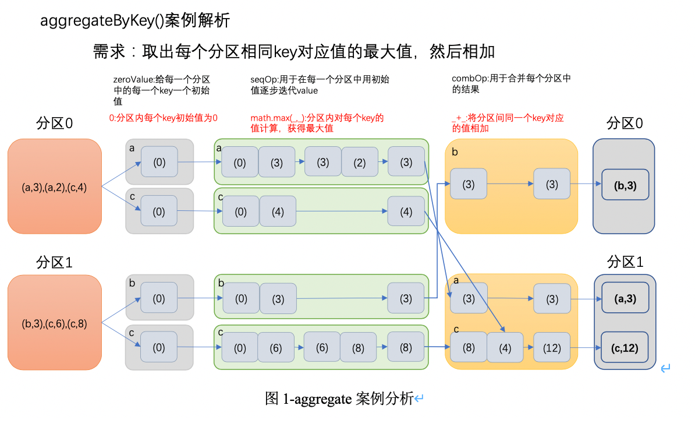

（1）创建一个pairRDD

scala> val rdd = sc.parallelize(List(("a",3),("a",2),("c",4),("b",3),("c",6),("c",8)),2)

rdd: org.apache.spark.rdd.RDD[(String, Int)] = ParallelCollectionRDD[0] at parallelize at <console>:24

（2）取出每个分区相同key对应值的最大值，然后相加

scala> val agg = rdd.aggregateByKey(0)(math.max(_,_),_+_)

agg: org.apache.spark.rdd.RDD[(String, Int)] = ShuffledRDD[1] at aggregateByKey at <console>:26

（3）打印结果

scala> agg.collect()

res0: Array[(String, Int)] = Array((b,3), (a,3), (c,12))

#### 2.3.3.6 foldByKey案例

参数：(zeroValue: V)(func: (V, V) => V): RDD[(K, V)]

\1.   作用：aggregateByKey的简化操作，seqop和combop相同

\2.   需求：创建一个pairRDD，计算相同key对应值的相加结果

（1）创建一个pairRDD

scala> val rdd = sc.parallelize(List((1,3),(1,2),(1,4),(2,3),(3,6),(3,8)),3)

rdd: org.apache.spark.rdd.RDD[(Int, Int)] = ParallelCollectionRDD[91] at parallelize at <console>:24

（2）计算相同key对应值的相加结果

scala> val agg = rdd.foldByKey(0)(_+_)

agg: org.apache.spark.rdd.RDD[(Int, Int)] = ShuffledRDD[92] at foldByKey at <console>:26

（3）打印结果

scala> agg.collect()

res61: Array[(Int, Int)] = Array((3,14), (1,9), (2,3))

#### 2.3.3.7 combineByKey[C] 案例

参数：(createCombiner: V => C, mergeValue: (C, V) => C, mergeCombiners: (C, C) => C)

\1.   作用：对相同K，把V合并成一个集合。

\2.   参数描述：

（1）createCombiner: combineByKey() 会遍历分区中的所有元素，因此每个元素的键要么还没有遇到过，要么就和之前的某个元素的键相同。如果这是一个新的元素,combineByKey()会使用一个叫作createCombiner()的函数来创建那个键对应的累加器的初始值

（2）mergeValue: 如果这是一个在处理当前分区之前已经遇到的键，它会使用mergeValue()方法将该键的累加器对应的当前值与这个新的值进行合并

（3）mergeCombiners: 由于每个分区都是独立处理的， 因此对于同一个键可以有多个累加器。如果有两个或者更多的分区都有对应同一个键的累加器， 就需要使用用户提供的 mergeCombiners() 方法将各个分区的结果进行合并。

\3.   需求：创建一个pairRDD，根据key计算每种key的均值。（先计算每个key出现的次数以及可以对应值的总和，再相除得到结果）

\4.   需求分析：

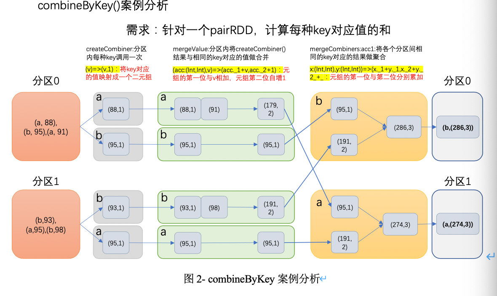


（1）创建一个pairRDD

scala> val input = sc.parallelize(Array(("a", 88), ("b", 95), ("a", 91), ("b", 93), ("a", 95), ("b", 98)),2)

input: org.apache.spark.rdd.RDD[(String, Int)] = ParallelCollectionRDD[52] at parallelize at <console>:26

（2）将相同key对应的值相加，同时记录该key出现的次数，放入一个二元组

scala> val combine = input.combineByKey((_,1),(acc:(Int,Int),v)=>(acc._1+v,acc._2+1),(acc1:(Int,Int),acc2:(Int,Int))=>(acc1._1+acc2._1,acc1._2+acc2._2))

combine: org.apache.spark.rdd.RDD[(String, (Int, Int))] = ShuffledRDD[5] at combineByKey at <console>:28

（3）打印合并后的结果

scala> combine.collect

res5: Array[(String, (Int, Int))] = Array((b,(286,3)), (a,(274,3)))

（4）计算平均值

scala> val result = combine.map{case (key,value) => (key,value._1/value._2.toDouble)}

result: org.apache.spark.rdd.RDD[(String, Double)] = MapPartitionsRDD[54] at map at <console>:30

（5）打印结果

scala> result.collect()

res33: Array[(String, Double)] = Array((b,95.33333333333333), (a,91.33333333333333))

#### 2.3.3.8 sortByKey([ascending], [numTasks]) 案例

\1. 作用：在一个(K,V)的RDD上调用，K必须实现Ordered接口，返回一个按照key进行排序的(K,V)的RDD

\2. 需求：创建一个pairRDD，按照key的正序和倒序进行排序

（1）创建一个pairRDD

scala> val rdd = sc.parallelize(Array((3,"aa"),(6,"cc"),(2,"bb"),(1,"dd")))

rdd: org.apache.spark.rdd.RDD[(Int, String)] = ParallelCollectionRDD[14] at parallelize at <console>:24

（2）按照key的正序

scala> rdd.sortByKey(true).collect()

res9: Array[(Int, String)] = Array((1,dd), (2,bb), (3,aa), (6,cc))

（3）按照key的倒序

scala> rdd.sortByKey(false).collect()

res10: Array[(Int, String)] = Array((6,cc), (3,aa), (2,bb), (1,dd))

#### 2.3.3.9 mapValues案例

\1. 针对于(K,V)形式的类型只对V进行操作

\2. 需求：创建一个pairRDD，并将value添加字符串"|||"

（1）创建一个pairRDD

scala> val rdd3 = sc.parallelize(Array((1,"a"),(1,"d"),(2,"b"),(3,"c")))

rdd3: org.apache.spark.rdd.RDD[(Int, String)] = ParallelCollectionRDD[67] at parallelize at <console>:24

（2）对value添加字符串"|||"

scala> rdd3.mapValues(_+"|||").collect()

res26: Array[(Int, String)] = Array((1,a|||), (1,d|||), (2,b|||), (3,c|||))

#### 2.3.3.10 join(otherDataset, [numTasks]) 案例

\1. 作用：在类型为(K,V)和(K,W)的RDD上调用，返回一个相同key对应的所有元素对在一起的(K,(V,W))的RDD

\2. 需求：创建两个pairRDD，并将key相同的数据聚合到一个元组。

（1）创建第一个pairRDD

scala> val rdd = sc.parallelize(Array((1,"a"),(2,"b"),(3,"c")))

rdd: org.apache.spark.rdd.RDD[(Int, String)] = ParallelCollectionRDD[32] at parallelize at <console>:24

（2）创建第二个pairRDD

scala> val rdd1 = sc.parallelize(Array((1,4),(2,5),(3,6)))

rdd1: org.apache.spark.rdd.RDD[(Int, Int)] = ParallelCollectionRDD[33] at parallelize at <console>:24

（3）join操作并打印结果

scala> rdd.join(rdd1).collect()

res13: Array[(Int, (String, Int))] = Array((1,(a,4)), (2,(b,5)), (3,(c,6)))

#### 2.3.3.11 cogroup(otherDataset, [numTasks]) 案例

\1. 作用：在类型为(K,V)和(K,W)的RDD上调用，返回一个(K,(Iterable<V>,Iterable<W>))类型的RDD

\2. 需求：创建两个pairRDD，并将key相同的数据聚合到一个迭代器。

（1）创建第一个pairRDD

scala> val rdd = sc.parallelize(Array((1,"a"),(2,"b"),(3,"c")))

rdd: org.apache.spark.rdd.RDD[(Int, String)] = ParallelCollectionRDD[37] at parallelize at <console>:24

（2）创建第二个pairRDD

scala> val rdd1 = sc.parallelize(Array((1,4),(2,5),(3,6)))

rdd1: org.apache.spark.rdd.RDD[(Int, Int)] = ParallelCollectionRDD[38] at parallelize at <console>:24

（3）cogroup两个RDD并打印结果

scala> rdd.cogroup(rdd1).collect()

res14: Array[(Int, (Iterable[String], Iterable[Int]))] = Array((1,(CompactBuffer(a),CompactBuffer(4))), (2,(CompactBuffer(b),CompactBuffer(5))), (3,(CompactBuffer(c),CompactBuffer(6))))

### 2.3.4 案例实操

\1. 数据结构：时间戳，省份，城市，用户，广告，中间字段使用空格分割。

​                               

样本如下： 

1516609143867 6 7 64 16

1516609143869 9 4 75 18

1516609143869 1 7 87 12

\2. 需求：统计出每一个省份广告被点击次数的TOP3

\3. 实现过程：

package com.package.practice

 

import org.apache.spark.rdd.RDD

import org.apache.spark.{SparkConf, SparkContext}

 

//需求：统计出每一个省份广告被点击次数的TOP3

object Practice {

 

 def main(args: Array[String]): Unit = {

 

  //1.初始化spark配置信息并建立与spark的连接

  val sparkConf = new SparkConf().setMaster("local[*]").setAppName("Practice")

  val sc = new SparkContext(sparkConf)

 

  //2.读取数据生成RDD：TS，Province，City，User，AD

  val line = sc.textFile("E:\\IDEAWorkSpace\\SparkTest\\src\\main\\resources\\agent.log")

 

  //3.按照最小粒度聚合：((Province,AD),1)

  val provinceAdToOne = line.map { x =>

   val fields: Array[String] = x.split(" ")

   ((fields(1), fields(4)), 1)

  }

 

  //4.计算每个省中每个广告被点击的总数：((Province,AD),sum)

  val provinceAdToSum = provinceAdToOne.reduceByKey(_ + _)

 

  //5.将省份作为key，广告加点击数为value：(Province,(AD,sum))

  val provinceToAdSum = provinceAdToSum.map(x => (x._1._1, (x._1._2, x._2)))

 

  //6.将同一个省份的所有广告进行聚合(Province,List((AD1,sum1),(AD2,sum2)...))

  val provinceGroup = provinceToAdSum.groupByKey()

 

  //7.对同一个省份所有广告的集合进行排序并取前3条，排序规则为广告点击总数

  val provinceAdTop3 = provinceGroup.mapValues { x =>

   x.toList.sortWith((x, y) => x._2 > y._2).take(3)

  }

 

  //8.将数据拉取到Driver端并打印

  provinceAdTop3.collect().foreach(println)

 

  //9.关闭与spark的连接

  sc.stop()

 }

}

## 2.4 Action

### 2.4.1 reduce(func)案例

\1. 作用：通过func函数聚集RDD中的所有元素，先聚合分区内数据，再聚合分区间数据。

\2. 需求：创建一个RDD，将所有元素聚合得到结果。

（1）创建一个RDD[Int]

scala> val rdd1 = sc.makeRDD(1 to 10,2)

rdd1: org.apache.spark.rdd.RDD[Int] = ParallelCollectionRDD[85] at makeRDD at <console>:24

（2）聚合RDD[Int]所有元素

scala> rdd1.reduce(_+_)

res50: Int = 55

（3）创建一个RDD[String]

scala> val rdd2 = sc.makeRDD(Array(("a",1),("a",3),("c",3),("d",5)))

rdd2: org.apache.spark.rdd.RDD[(String, Int)] = ParallelCollectionRDD[86] at makeRDD at <console>:24

（4）聚合RDD[String]所有数据

**key与key拼凑，value与value拼凑**

scala> rdd2.reduce((x,y)=>(x._1 + y._1,x._2 + y._2))

res51: (String, Int) = (adca,12)

### 2.4.2 collect()案例

\1. 作用：在驱动程序中，以数组的形式返回数据集的所有元素。

\2. 需求：创建一个RDD，并将RDD内容收集到Driver端打印

（1）创建一个RDD

scala> val rdd = sc.parallelize(1 to 10)

rdd: org.apache.spark.rdd.RDD[Int] = ParallelCollectionRDD[0] at parallelize at <console>:24

（2）将结果收集到Driver端

scala> rdd.collect

res0: Array[Int] = Array(1, 2, 3, 4, 5, 6, 7, 8, 9, 10)  

### 2.4.3 count()案例

\1. 作用：返回RDD中元素的个数

\2. 需求：创建一个RDD，统计该RDD的条数

（1）创建一个RDD

scala> val rdd = sc.parallelize(1 to 10)

rdd: org.apache.spark.rdd.RDD[Int] = ParallelCollectionRDD[0] at parallelize at <console>:24

（2）统计该RDD的条数

scala> rdd.count

res1: Long = 10

### 2.4.4 first()案例

\1. 作用：返回RDD中的第一个元素

\2. 需求：创建一个RDD，返回该RDD中的第一个元素

（1）创建一个RDD

scala> val rdd = sc.parallelize(1 to 10)

rdd: org.apache.spark.rdd.RDD[Int] = ParallelCollectionRDD[0] at parallelize at <console>:24

（2）统计该RDD的条数

scala> rdd.first

res2: Int = 1

### 2.4.5 take(n)案例

\1. 作用：返回一个由RDD的前n个元素组成的数组

\2. 需求：创建一个RDD，统计该RDD的条数

（1）创建一个RDD

scala> val rdd = sc.parallelize(Array(2,5,4,6,8,3))

rdd: org.apache.spark.rdd.RDD[Int] = ParallelCollectionRDD[2] at parallelize at <console>:24

（2）统计该RDD的条数

scala> rdd.take(3)

res10: Array[Int] = Array(2, 5, 4)

### 2.4.6 takeOrdered(n)案例

\1. 作用：返回该RDD排序后的前n个元素组成的数组

\2. 需求：创建一个RDD，统计该RDD的条数

（1）创建一个RDD

scala> val rdd = sc.parallelize(Array(2,5,4,6,8,3))

rdd: org.apache.spark.rdd.RDD[Int] = ParallelCollectionRDD[2] at parallelize at <console>:24

（2）统计该RDD的条数

scala> rdd.takeOrdered(3)

res18: Array[Int] = Array(2, 3, 4)

### 2.4.7 aggregate案例

\1. 参数：(zeroValue: U)(seqOp: (U, T) ⇒ U, combOp: (U, U) ⇒ U)

\2. 作用：aggregate函数将每个分区里面的元素通过seqOp和初始值进行聚合，然后用combine函数将每个分区的结果和初始值(zeroValue)进行combine操作。这个函数最终返回的类型不需要和RDD中元素类型一致。

\3. 需求：创建一个RDD，将所有元素相加得到结果

（1）创建一个RDD

scala> var rdd1 = sc.makeRDD(1 to 10,2)

rdd1: org.apache.spark.rdd.RDD[Int] = ParallelCollectionRDD[88] at makeRDD at <console>:24

（2）将该RDD所有元素相加得到结果

scala> rdd.aggregate(0)(_+_,_+_)

res22: Int = 55

### 2.4.8 fold(num)(func)案例

\1. 作用：折叠操作，aggregate的简化操作，seqop和combop一样。

\2. 需求：创建一个RDD，将所有元素相加得到结果

（1）创建一个RDD

scala> var rdd1 = sc.makeRDD(1 to 10,2)

rdd1: org.apache.spark.rdd.RDD[Int] = ParallelCollectionRDD[88] at makeRDD at <console>:24

（2）将该RDD所有元素相加得到结果

scala> rdd.fold(0)(_+_)

res24: Int = 55

### 2.4.9 saveAsTextFile(path)

作用：将数据集的元素以textfile的形式保存到HDFS文件系统或者其他支持的文件系统，对于每个元素，Spark将会调用toString方法，将它装换为文件中的文本

### 2.4.10 saveAsSequenceFile(path) 

作用：将数据集中的元素以Hadoop sequencefile的格式保存到指定的目录下，可以使HDFS或者其他Hadoop支持的文件系统。

### 2.4.11 saveAsObjectFile(path) 

作用：用于将RDD中的元素序列化成对象，存储到文件中。

### 2.4.12 countByKey()案例

\1. 作用：针对(K,V)类型的RDD，返回一个(K,Int)的map，表示每一个key对应的元素个数。

\2. 需求：创建一个PairRDD，统计每种key的个数

（1）创建一个PairRDD

scala> val rdd = sc.parallelize(List((1,3),(1,2),(1,4),(2,3),(3,6),(3,8)),3)

rdd: org.apache.spark.rdd.RDD[(Int, Int)] = ParallelCollectionRDD[95] at parallelize at <console>:24

（2）统计每种key的个数

scala> rdd.countByKey

res63: scala.collection.Map[Int,Long] = Map(3 -> 2, 1 -> 3, 2 -> 1)

### 2.4.13 foreach(func)案例

\1. 作用：在数据集的每一个元素上，运行函数func进行更新。

\2. 需求：创建一个RDD，对每个元素进行打印

（1）创建一个RDD

scala> var rdd = sc.makeRDD(1 to 5,2)

rdd: org.apache.spark.rdd.RDD[Int] = ParallelCollectionRDD[107] at makeRDD at <console>:24

（2）对该RDD每个元素进行打印

scala> rdd.foreach(println(_))

3

4

5

1

2


## RDD中的函数传递

在实际开发中我们往往需要自己定义一些对于RDD的操作，那么此时需要主要的是，初始化工作是在Driver端进行的，而实际运行程序是在Executor端进行的，这就涉及到了跨进程通信，是需要序列化的。下面我们看几个例子：

### 传递一个方法

1．创建一个类

```scala
class Search(s:String){

 //过滤出包含字符串的数据

 def isMatch(s: String): Boolean = {

  s.contains(query)

 }

//过滤出包含字符串的RDD

 def getMatch1 (rdd: RDD[String]): RDD[String] = {

  rdd.filter(isMatch)

 }

 //过滤出包含字符串的RDD

 def getMatche2(rdd: RDD[String]): RDD[String] = {
  rdd.filter(x => x.contains(query))
 }
}
```

2．创建Spark主程序

```scala
object SeriTest {

 

 def main(args: Array[String]): Unit = {

 

  //1.初始化配置信息及SparkContext

  val sparkConf: SparkConf = new SparkConf().setAppName("WordCount").setMaster("local[*]")

  val sc = new SparkContext(sparkConf)

 

//2.创建一个RDD

  val rdd: RDD[String] = sc.parallelize(Array("hadoop", "spark", "hive", "atguigu"))

 

//3.创建一个Search对象

  val search = new Search()

 

//4.运用第一个过滤函数并打印结果

  val match1: RDD[String] = search.getMatche1(rdd)

  match1.collect().foreach(println)

  }

}
```

3．运行程序

```


Exception in thread "main" org.apache.spark.SparkException: Task not serializable

  at org.apache.spark.util.ClosureCleaner$.ensureSerializable(ClosureCleaner.scala:298)

  at org.apache.spark.util.ClosureCleaner$.org$apache$spark$util$ClosureCleaner$$clean(ClosureCleaner.scala:288)

  at org.apache.spark.util.ClosureCleaner$.clean(ClosureCleaner.scala:108)

  at org.apache.spark.SparkContext.clean(SparkContext.scala:2101)

  at org.apache.spark.rdd.RDD$$anonfun$filter$1.apply(RDD.scala:387)

  at org.apache.spark.rdd.RDD$$anonfun$filter$1.apply(RDD.scala:386)

  at org.apache.spark.rdd.RDDOperationScope$.withScope(RDDOperationScope.scala:151)

  at org.apache.spark.rdd.RDDOperationScope$.withScope(RDDOperationScope.scala:112)

  at org.apache.spark.rdd.RDD.withScope(RDD.scala:362)

  at org.apache.spark.rdd.RDD.filter(RDD.scala:386)

  at com.atguigu.Search.getMatche1(SeriTest.scala:39)

  at com.atguigu.SeriTest$.main(SeriTest.scala:18)

  at com.atguigu.SeriTest.main(SeriTest.scala)

Caused by: java.io.NotSerializableException: com.atguigu.Search
```

4．问题说明

//过滤出包含字符串的RDD

 def getMatch1 (rdd: RDD[String]): RDD[String] = {

  rdd.filter(isMatch)

 }

**在这个方法中所调用的方法isMatch()是定义在Search这个类中的，实际上调用的是this. isMatch()，this表示Search这个类的对象，程序在运行过程中需要将Search对象序列化以后传递到Executor端。**

5．解决方案

使类继承scala.Serializable即可。

class Search() extends Serializable{...}


### 2.5.2 传递一个属性

1．创建Spark主程序

```scala
object TransmitTest {

 def main(args: Array[String]): Unit = {

  //1.初始化配置信息及SparkContext

  val sparkConf: SparkConf = new SparkConf().setAppName("WordCount").setMaster("local[*]")

  val sc = new SparkContext(sparkConf)

//2.创建一个RDD

  val rdd: RDD[String] = sc.parallelize(Array("hadoop", "spark", "hive", "atguigu"))

//3.创建一个Search对象

  val search = new Search()

//4.运用第一个过滤函数并打印结果

  val match1: RDD[String] = search.getMatche2(rdd)

  match1.collect().foreach(println)

  }
}
```

2．运行程序

```
Exception in thread "main" org.apache.spark.SparkException: Task not serializable

  at org.apache.spark.util.ClosureCleaner$.ensureSerializable(ClosureCleaner.scala:298)

  at org.apache.spark.util.ClosureCleaner$.org$apache$spark$util$ClosureCleaner$$clean(ClosureCleaner.scala:288)

  at org.apache.spark.util.ClosureCleaner$.clean(ClosureCleaner.scala:108)

  at org.apache.spark.SparkContext.clean(SparkContext.scala:2101)

  at org.apache.spark.rdd.RDD$$anonfun$filter$1.apply(RDD.scala:387)

  at org.apache.spark.rdd.RDD$$anonfun$filter$1.apply(RDD.scala:386)

  at org.apache.spark.rdd.RDDOperationScope$.withScope(RDDOperationScope.scala:151)

  at org.apache.spark.rdd.RDDOperationScope$.withScope(RDDOperationScope.scala:112)

  at org.apache.spark.rdd.RDD.withScope(RDD.scala:362)

  at org.apache.spark.rdd.RDD.filter(RDD.scala:386)

  at com.atguigu.Search.getMatche1(SeriTest.scala:39)

  at com.atguigu.SeriTest$.main(SeriTest.scala:18)

  at com.atguigu.SeriTest.main(SeriTest.scala)

Caused by: java.io.NotSerializableException: com.atguigu.Search
```

3．问题说明

 //过滤出包含字符串的RDD

 def getMatche2(rdd: RDD[String]): RDD[String] = {

  rdd.filter(x => x.contains(query))

 }

**在这个方法中所调用的方法query是定义在Search这个类中的字段，实际上调用的是this. query，this表示Search这个类的对象，程序在运行过程中需要将Search对象序列化以后传递到Executor端。**

4．解决方案

1）使类继承scala.Serializable即可。

class Search() extends Serializable{...}

2）将类变量query赋值给局部变量

修改getMatche2为

 //过滤出包含字符串的RDD

 def getMatche2(rdd: RDD[String]): RDD[String] = {

  val query_ : String = this.query//将类变量赋值给局部变量

  rdd.filter(x => x.contains(query_))

 }

**第二种方法，`val query_ : String = this.query//将类变量赋值给局部变量`在Driver中运行，然后把`query_`传入到Executor里面，`query_`是字符串,字符串自带序列化.**

## RDD依赖关系

###  Lineage

RDD只支持粗粒度转换，即在大量记录上执行的单个操作。将创建RDD的一系列Lineage（血统）记录下来，以便恢复丢失的分区。RDD的Lineage会记录RDD的元数据信息和转换行为，当该RDD的部分分区数据丢失时，它可以根据这些信息来重新运算和恢复丢失的数据分区。

​                               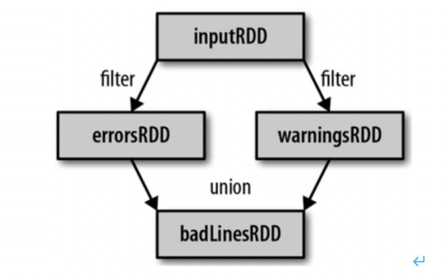

（1）读取一个HDFS文件并将其中内容映射成一个个元组

scala> val wordAndOne = sc.textFile("/fruit.tsv").flatMap(_.split("\t")).map((_,1))

wordAndOne: org.apache.spark.rdd.RDD[(String, Int)] = MapPartitionsRDD[22] at map at <console>:24

（2）统计每一种key对应的个数

scala> val wordAndCount = wordAndOne.reduceByKey(_+_)

wordAndCount: org.apache.spark.rdd.RDD[(String, Int)] = ShuffledRDD[23] at reduceByKey at <console>:26

（3）查看“wordAndOne”的Lineage

scala> wordAndOne.toDebugString

res5: String =

(2) MapPartitionsRDD[22] at map at <console>:24 []

 | MapPartitionsRDD[21] at flatMap at <console>:24 []

 | /fruit.tsv MapPartitionsRDD[20] at textFile at <console>:24 []

 | /fruit.tsv HadoopRDD[19] at textFile at <console>:24 []

（4）查看“wordAndCount”的Lineage

scala> wordAndCount.toDebugString

res6: String =

(2) ShuffledRDD[23] at reduceByKey at <console>:26 []

 +-(2) MapPartitionsRDD[22] at map at <console>:24 []

  | MapPartitionsRDD[21] at flatMap at <console>:24 []

  | /fruit.tsv MapPartitionsRDD[20] at textFile at <console>:24 []

  | /fruit.tsv HadoopRDD[19] at textFile at <console>:24 []

（5）查看“wordAndOne”的依赖类型

scala> wordAndOne.dependencies

res7: Seq[org.apache.spark.Dependency[_]] = List(org.apache.spark.OneToOneDependency@5d5db92b)

（6）查看“wordAndCount”的依赖类型

scala> wordAndCount.dependencies

res8: Seq[org.apache.spark.Dependency[_]] = List(org.apache.spark.ShuffleDependency@63f3e6a8)

注意：RDD和它依赖的父RDD（s）的关系有两种不同的类型，即窄依赖（narrow dependency）和宽依赖（wide dependency）。


### 窄依赖                  

窄依赖指的是每一个父RDD的Partition最多被子RDD的一个Partition使用,窄依赖我们形象的比喻为独生子女

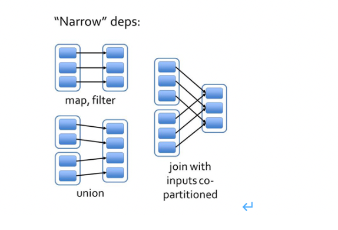


### 宽依赖

宽依赖指的是多个子RDD的Partition会依赖同一个父RDD的Partition，会引起shuffle,总结：宽依赖我们形象的比喻为超生

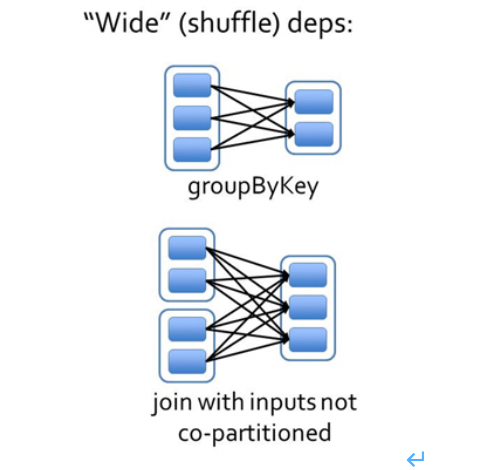


###  DAG

DAG(Directed Acyclic Graph)叫做有向无环图，原始的RDD通过一系列的转换就就形成了DAG，根据RDD之间的依赖关系的不同将DAG划分成不同的Stage，对于窄依赖，partition的转换处理在Stage中完成计算。对于宽依赖，由于有Shuffle的存在，只能在parent RDD处理完成后，才能开始接下来的计算，因此**宽依赖是划分****Stage****的依据**。

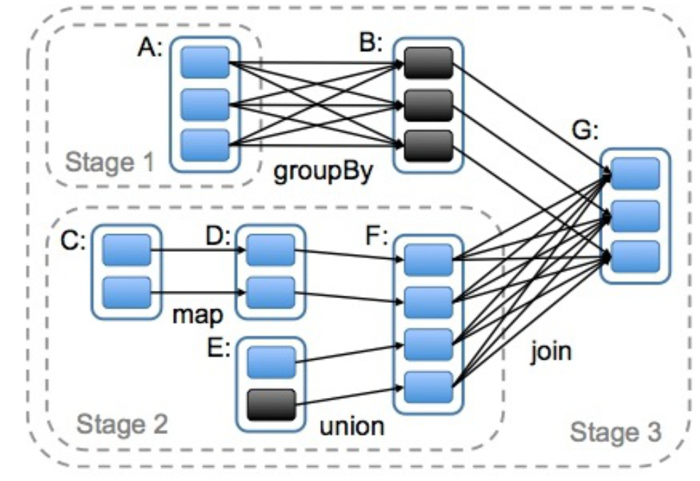


### 任务划分（面试重点）

RDD任务切分中间分为：Application、Job、Stage和Task

1）Application：初始化一个SparkContext即生成一个Application

2）Job：一个**Action算子**就会生成一个Job

3）Stage：根据RDD之间的依赖关系的不同将Job划分成不同的Stage，遇到一个宽依赖则划分一个Stage。


4）Task：Stage是一个TaskSet，将Stage划分的结果发送到不同的Executor执行即为一个Task。

注意：Application->Job->Stage-> Task每一层都是1对n的关系。


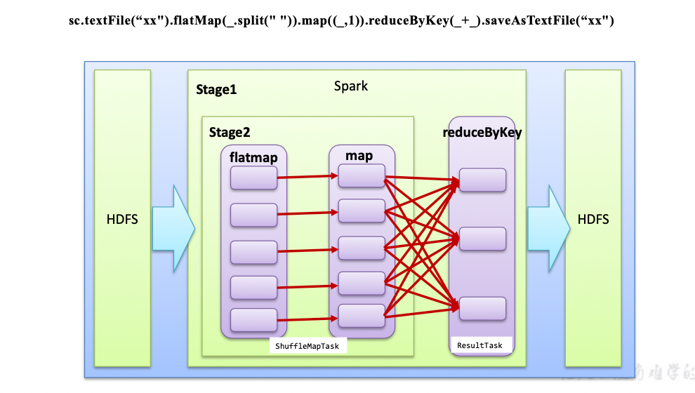


**分析**

**比如该图，初始化了一个sc，则有一个application。**

**每有一个action算子，就有一个job，上图有一个action算子，故有一个job**

**一个job中，根据宽依赖和窄依赖（或者说shuffle出现的次数+1）划分成多个stage**

**每个stage中，有多个partition，比如stage2，由于flatmap到map没有shuffle，所以该分区的flatmap和map是串行的，放在一个task里面就可以。**


##  RDD缓存

RDD通过persist方法或cache方法可以将前面的计算结果缓存，默认情况下 persist() 会把数据以序列化的形式缓存在 JVM 的堆空间中。 

但是并不是这两个方法被调用时立即缓存，而是触发后面的action时，该RDD将会被缓存在计算节点的内存中，并供后面重用。

通过查看源码发现cache最终也是调用了persist方法，默认的存储级别都是仅在内存存储一份，Spark的存储级别还有好多种，存储级别在object StorageLevel中定义的。

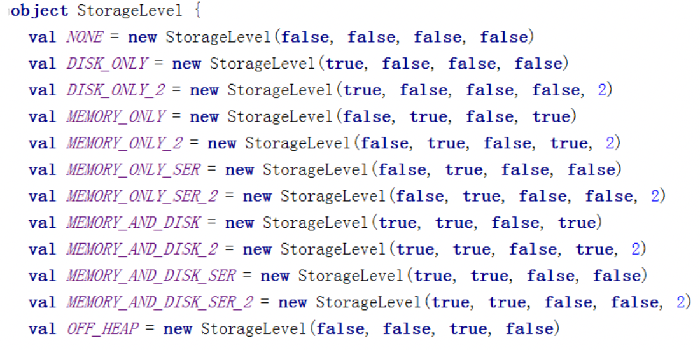

缓存有可能丢失，或者存储存储于内存的数据由于内存不足而被删除，RDD的缓存容错机制保证了即使缓存丢失也能保证计算的正确执行。通过基于RDD的一系列转换，丢失的数据会被重算，由于RDD的各个Partition是相对独立的，因此只需要计算丢失的部分即可，并不需要重算全部Partition。

**关于OFF_HEAP，指的是堆外内存（jvm外面的内存，属于用户向操作系统申请），因为堆内内存的gc是由垃圾收集器自动控制的，不能切换手动，如果在堆内存储数据，无法跟随用户心意马上gc。所以为了实现用户可以对存储数据有强控制，所以在堆外申请一块内存，当用户想清除该内存的数据时，操作系统便会立马清除数据。**

###  RDD CheckPoint

Spark中对于数据的保存除了持久化操作之外，还提供了一种检查点的机制，检查点（本质是通过将RDD写入Disk做检查点）是为了通过lineage做容错的辅助，lineage过长会造成容错成本过高，这样就不如在中间阶段做检查点容错，如果之后有节点出现问题而丢失分区，从做检查点的RDD开始重做Lineage，就会减少开销。检查点通过将数据写入到HDFS文件系统实现了RDD的检查点功能。

为当前RDD设置检查点。该函数将会创建一个二进制的文件，并存储到checkpoint目录中，该目录是用[Spark](https://www.iteblog.com/archives/tag/spark/)Context.setCheckpointDir()设置的。

**在checkpoint的过程中，该RDD的所有依赖于父RDD中的信息将全部被移除。对RDD进行checkpoint操作并不会马上被执行，必须执行Action操作才能触发。**

**但是缓存不会让依赖移除，因为缓存不可靠，会失效。但checkpoint存在hdfs上，并且hdfs有高可用，是可靠的**

案例实操：

（1）设置检查点

```
scala> sc.setCheckpointDir("hdfs://hadoop102:9000/checkpoint")
```

（2）创建一个RDD

```
scala> val rdd = sc.parallelize(Array("atguigu"))

rdd: org.apache.spark.rdd.RDD[String] = ParallelCollectionRDD[14] at parallelize at <console>:24
```

（3）将RDD转换为携带当前时间戳并做checkpoint

```
scala> val ch = rdd.map(_+System.currentTimeMillis)

ch: org.apache.spark.rdd.RDD[String] = MapPartitionsRDD[16] at map at <console>:26
```

 

scala> ch.checkpoint

（4）多次打印结果

```
scala> ch.collect

res55: Array[String] = Array(atguigu1538981860336)

scala> ch.collect

res56: Array[String] = Array(atguigu1538981860504)

scala> ch.collect

res57: Array[String] = Array(atguigu1538981860504)

scala> ch.collect

res58: Array[String] = Array(atguigu1538981860504)
```


## 键值对RDD数据分区器


Spark目前支持Hash分区和Range分区，用户也可以自定义分区，Hash分区为当前的默认分区，Spark中分区器直接决定了RDD中分区的个数、RDD中每条数据经过Shuffle过程属于哪个分区和Reduce的个数

注意：

**(1)只有Key-Value类型的RDD才有分区器的，非Key-Value类型的RDD分区器的值是None
 (2)每个RDD的分区ID范围：0~numPartitions-1，决定这个值是属于那个分区的。**

### Hash分区

HashPartitioner分区的原理：对于给定的key，计算其hashCode，并除以分区的个数取余，如果余数小于0，则用余数+分区的个数（否则加0），最后返回的值就是这个key所属的分区ID。

使用Hash分区的实操

```
scala> nopar.partitioner

res20: Option[org.apache.spark.Partitioner] = None
scala> val nopar = sc.parallelize(List((1,3),(1,2),(2,4),(2,3),(3,6),(3,8)),8)

nopar: org.apache.spark.rdd.RDD[(Int, Int)] = ParallelCollectionRDD[10] at parallelize at <console>:24

scala>nopar.mapPartitionsWithIndex((index,iter)=>{ Iterator(index.toString+" : "+iter.mkString("|")) }).collect

res0: Array[String] = Array("0 : ", 1 : (1,3), 2 : (1,2), 3 : (2,4), "4 : ", 5 : (2,3), 6 : (3,6), 7 : (3,8)) 

scala> val hashpar = nopar.partitionBy(new org.apache.spark.HashPartitioner(7))

hashpar: org.apache.spark.rdd.RDD[(Int, Int)] = ShuffledRDD[12] at partitionBy at <console>:26

scala> hashpar.count

res18: Long = 6

scala> hashpar.partitioner

res21: Option[org.apache.spark.Partitioner] = Some(org.apache.spark.HashPartitioner@7)

 

scala> hashpar.mapPartitions(iter => Iterator(iter.length)).collect()

res19: Array[Int] = Array(0, 3, 1, 2, 0, 0, 0)
```


### Ranger分区

HashPartitioner分区弊端：可能导致每个分区中数据量的不均匀，极端情况下会导致某些分区拥有RDD的全部数据。

RangePartitioner作用：将一定范围内的数映射到某一个分区内，尽量保证每个分区中数据量的均匀，而且分区与分区之间是有序的，一个分区中的元素肯定都是比另一个分区内的元素小或者大，但是分区内的元素是不能保证顺序的。简单的说就是将一定范围内的数映射到某一个分区内。实现过程为：

第一步：先重整个RDD中抽取出样本数据，将样本数据排序，计算出每个分区的最大key值，形成一个Array[KEY]类型的数组变量rangeBounds；

第二步：判断key在rangeBounds中所处的范围，给出该key值在下一个RDD中的分区id下标；该分区器要求RDD中的KEY类型必须是可以排序的

### 自定义分区

要实现自定义的分区器，你需要继承 org.apache.spark.Partitioner 类并实现下面三个方法。 

（1）numPartitions: Int:返回创建出来的分区数。

（2）getPartition(key: Any): Int:返回给定键的分区编号(0到numPartitions-1)。 

（3）equals():Java 判断相等性的标准方法。这个方法的实现非常重要，Spark 需要用这个方法来检查你的分区器对象是否和其他分区器实例相同，这样 Spark 才可以判断两个 RDD 的分区方式是否相同。

需求：将相同后缀的数据写入相同的文件，通过将相同后缀的数据分区到相同的分区并保存输出来实现。

## 数据读取与保存

   Spark的数据读取及数据保存可以从两个维度来作区分：文件格式以及文件系统。

文件格式分为：Text文件、Json文件、Csv文件、Sequence文件以及Object文件；

文件系统分为：本地文件系统、HDFS、HBASE以及数据库

### 文件类数据读取与保存

#### Text文件

```
1）数据读取:textFile(String)

scala> val hdfsFile = sc.textFile("hdfs://hadoop102:9000/fruit.txt")

hdfsFile: org.apache.spark.rdd.RDD[String] = hdfs://hadoop102:9000/fruit.txt MapPartitionsRDD[21] at textFile at <console>:24

2）数据保存: saveAsTextFile(String)

scala> hdfsFile.saveAsTextFile("/fruitOut")
```

​                               

#### Json文件

如果JSON文件中每一行就是一个JSON记录，那么可以通过将JSON文件当做文本文件来读取，然后利用相关的JSON库对每一条数据进行JSON解析。

注意：使用RDD读取JSON文件处理很复杂，同时SparkSQL集成了很好的处理JSON文件的方式，所以应用中多是采用SparkSQL处理JSON文件。

```
（1）导入解析json所需的包

scala> import scala.util.parsing.json.JSON

（2）上传json文件到HDFS

[atguigu@hadoop102 spark]$ hadoop fs -put ./examples/src/main/resources/people.json /

（3）读取文件

scala> val json = sc.textFile("/people.json")

json: org.apache.spark.rdd.RDD[String] = /people.json MapPartitionsRDD[8] at textFile at <console>:24

（4）解析json数据

scala> val result = json.map(JSON.parseFull)

result: org.apache.spark.rdd.RDD[Option[Any]] = MapPartitionsRDD[10] at map at <console>:27

（5）打印

scala> result.collect

res11: Array[Option[Any]] = Array(Some(Map(name -> Michael)), Some(Map(name -> Andy, age -> 30.0)), Some(Map(name -> Justin, age -> 19.0)))
```


#### 对象文件

对象文件是将对象序列化后保存的文件，采用Java的序列化机制。可以通过objectFile[k,v](path) 函数接收一个路径，读取对象文件，返回对应的 RDD，也可以通过调用saveAsObjectFile() 实现对对象文件的输出。因为是序列化所以要指定类型。

```
（1）创建一个RDD

scala> val rdd = sc.parallelize(Array(1,2,3,4))

rdd: org.apache.spark.rdd.RDD[Int] = ParallelCollectionRDD[19] at parallelize at <console>:24

（2）将RDD保存为Object文件

scala> rdd.saveAsObjectFile("file:///opt/module/spark/objectFile")

（3）查看该文件

[atguigu@hadoop102 objectFile]$ pwd

/opt/module/spark/objectFile

[atguigu@hadoop102 objectFile]$ ll

总用量 8

-rw-r--r-- 1 atguigu atguigu 142 10月 9 10:37 part-00000

-rw-r--r-- 1 atguigu atguigu 142 10月 9 10:37 part-00001

-rw-r--r-- 1 atguigu atguigu  0 10月 9 10:37 _SUCCESS

[atguigu@hadoop102 objectFile]$ cat part-00000 

SEQ!org.apache.hadoop.io.NullWritable"org.apache.hadoop.io.BytesWritableW@`l

（4）读取Object文件

scala> val objFile = sc.objectFile[Int]("file:///opt/module/spark/objectFile")

objFile: org.apache.spark.rdd.RDD[Int] = MapPartitionsRDD[31] at objectFile at <console>:24

（5）打印读取后的Sequence文件

scala> objFile.collect

res19: Array[Int] = Array(1, 2, 3, 4)
```


### 文件系统类数据读取与保存

####  HDFS

Spark的整个生态系统与Hadoop是完全兼容的,所以对于Hadoop所支持的文件类型或者数据库类型,Spark也同样支持.另外,由于Hadoop的API有新旧两个版本,所以Spark为了能够兼容Hadoop所有的版本,也提供了两套创建操作接口.对于外部存储创建操作而言,hadoopRDD和newHadoopRDD是最为抽象的两个函数接口,主要包含以下四个参数.

1）输入格式(InputFormat): 制定数据输入的类型,如TextInputFormat等,新旧两个版本所引用的版本分别是org.apache.hadoop.mapred.InputFormat和org.apache.hadoop.mapreduce.InputFormat(NewInputFormat)

2）键类型: 指定[K,V]键值对中K的类型

3）值类型: 指定[K,V]键值对中V的类型

4）分区值: 指定由外部存储生成的RDD的partition数量的最小值,如果没有指定,系统会使用默认值defaultMinSplits

**注意:**其他创建操作的API接口都是为了方便最终的Spark程序开发者而设置的,是这两个接口的高效实现版本.例如,对于textFile而言,只有path这个指定文件路径的参数,其他参数在系统内部指定了默认值。

1.在Hadoop中以压缩形式存储的数据,不需要指定解压方式就能够进行读取,因为Hadoop本身有一个解压器会根据压缩文件的后缀推断解压算法进行解压.

2.如果用Spark从Hadoop中读取某种类型的数据不知道怎么读取的时候,上网查找一个使用map-reduce的时候是怎么读取这种这种数据的,然后再将对应的读取方式改写成上面的hadoopRDD和newAPIHadoopRDD两个类就行了

#### MySQL数据库连接

支持通过Java JDBC访问关系型数据库。需要通过JdbcRDD进行，示例如下:

```scala
（1）添加依赖
<dependency>
   <groupId>mysql</groupId>
   <artifactId>mysql-connector-java</artifactId>
   <version>5.1.27</version>
 </dependency>

（2）Mysql读取：
package com.atguigu

import java.sql.DriverManager

import org.apache.spark.rdd.JdbcRDD

import org.apache.spark.{SparkConf, SparkContext}

object MysqlRDD {

 def main(args: Array[String]): Unit = {
  //1.创建spark配置信息
  val sparkConf: SparkConf = new SparkConf().setMaster("local[*]").setAppName("JdbcRDD")

  //2.创建SparkContext

  val sc = new SparkContext(sparkConf)

  //3.定义连接mysql的参数

  val driver = "com.mysql.jdbc.Driver"

  val url = "jdbc:mysql://hadoop102:3306/rdd"

  val userName = "root"

  val passWd = "000000"

  //创建JdbcRDD

  val rdd = new JdbcRDD(sc, () => {

   Class.forName(driver)

   DriverManager.getConnection(url, userName, passWd)

  },

   "select * from `rddtable` where `id`>=?;",
   1,
   10,
   1,
   r => (r.getInt(1), r.getString(2))

  )

  //打印最后结果
  println(rdd.count())
  rdd.foreach(println
  sc.stop()

 }
}
Mysql写入：

def main(args: Array[String]) {
  val sparkConf = new SparkConf().setMaster("local[2]").setAppName("HBaseApp")
  val sc = new SparkContext(sparkConf)
  val data = sc.parallelize(List("Female", "Male","Female"))
 
  data.foreachPartition(insertData)
 }
 
 def insertData(iterator: Iterator[String]): Unit = {

Class.forName ("com.mysql.jdbc.Driver").newInstance()
  val conn = java.sql.DriverManager.getConnection("jdbc:mysql://hadoop102:3306/rdd", "root", "000000")
  iterator.foreach(data => {
   val ps = conn.prepareStatement("insert into rddtable(name) values (?)")
   ps.setString(1, data) 
   ps.executeUpdate()
  })
 }
```


#### HBase数据库

由于 org.apache.hadoop.hbase.mapreduce.TableInputFormat 类的实现，Spark 可以通过Hadoop输入格式访问HBase。这个输入格式会返回键值对数据，其中键的类型为org. apache.hadoop.hbase.io.ImmutableBytesWritable，而值的类型为org.apache.hadoop.hbase.client.

Result。

```scala
（1）添加依赖
<dependency>
	<groupId>org.apache.hbase</groupId>
	<artifactId>hbase-server</artifactId>
	<version>1.3.1</version>
</dependency>

<dependency>
	<groupId>org.apache.hbase</groupId>
	<artifactId>hbase-client</artifactId>
	<version>1.3.1</version>
</dependency>
（2）从HBase读取数据
package com.atguigu

import org.apache.hadoop.conf.Configuration
import org.apache.hadoop.hbase.HBaseConfiguration
import org.apache.hadoop.hbase.client.Result
import org.apache.hadoop.hbase.io.ImmutableBytesWritable
import org.apache.hadoop.hbase.mapreduce.TableInputFormat
import org.apache.spark.rdd.RDD
import org.apache.spark.{SparkConf, SparkContext}
import org.apache.hadoop.hbase.util.Bytes

object HBaseSpark {

  def main(args: Array[String]): Unit = {

    //创建spark配置信息
    val sparkConf: SparkConf = new SparkConf().setMaster("local[*]").setAppName("JdbcRDD")

    //创建SparkContext
    val sc = new SparkContext(sparkConf)

    //构建HBase配置信息
    val conf: Configuration = HBaseConfiguration.create()
    conf.set("hbase.zookeeper.quorum", "hadoop102,hadoop103,hadoop104")
    conf.set(TableInputFormat.INPUT_TABLE, "rddtable")

    //从HBase读取数据形成RDD
    val hbaseRDD: RDD[(ImmutableBytesWritable, Result)] = sc.newAPIHadoopRDD(
      conf,
      classOf[TableInputFormat],
      classOf[ImmutableBytesWritable],
      classOf[Result])

    val count: Long = hbaseRDD.count()
    println(count)

    //对hbaseRDD进行处理
    hbaseRDD.foreach {
      case (_, result) =>
        val key: String = Bytes.toString(result.getRow)
        val name: String = Bytes.toString(result.getValue(Bytes.toBytes("info"), Bytes.toBytes("name")))
        val color: String = Bytes.toString(result.getValue(Bytes.toBytes("info"), Bytes.toBytes("color")))
        println("RowKey:" + key + ",Name:" + name + ",Color:" + color)
    }

    //关闭连接
    sc.stop()
  }

}
3）往HBase写入


def main(args: Array[String]) {
//获取Spark配置信息并创建与spark的连接
  val sparkConf = new SparkConf().setMaster("local[*]").setAppName("HBaseApp")
  val sc = new SparkContext(sparkConf)

//创建HBaseConf
  val conf = HBaseConfiguration.create()
  val jobConf = new JobConf(conf)
  jobConf.setOutputFormat(classOf[TableOutputFormat])
  jobConf.set(TableOutputFormat.OUTPUT_TABLE, "fruit_spark")

//构建Hbase表描述器
  val fruitTable = TableName.valueOf("fruit_spark")
  val tableDescr = new HTableDescriptor(fruitTable)
  tableDescr.addFamily(new HColumnDescriptor("info".getBytes))

//创建Hbase表
  val admin = new HBaseAdmin(conf)
  if (admin.tableExists(fruitTable)) {
    admin.disableTable(fruitTable)
    admin.deleteTable(fruitTable)
  }
  admin.createTable(tableDescr)

//定义往Hbase插入数据的方法
  def convert(triple: (Int, String, Int)) = {
    val put = new Put(Bytes.toBytes(triple._1))
    put.addImmutable(Bytes.toBytes("info"), Bytes.toBytes("name"), Bytes.toBytes(triple._2))
    put.addImmutable(Bytes.toBytes("info"), Bytes.toBytes("price"), Bytes.toBytes(triple._3))
    (new ImmutableBytesWritable, put)
  }

//创建一个RDD
  val initialRDD = sc.parallelize(List((1,"apple",11), (2,"banana",12), (3,"pear",13)))

//将RDD内容写到HBase
  val localData = initialRDD.map(convert)

  localData.saveAsHadoopDataset(jobConf)
}

```


## RDD 的持久化

### RDD 的 cache(持久化)

Spark中最重要的功能之一是跨操作在内存中持久化（或缓存）数据集。当您持久保存RDD时，每个节点都会存储它在内存中计算的任何分区，并在该数据集（或从中派生的数据集）的其他操作中重用它们。这使得未来的行动更快（通常超过10倍）。缓存是迭代算法和快速交互使用的关键工具。

您可以使用persist()或cache()方法标记要保留的RDD 。第一次在动作中计算它，它将保留在节点的内存中。Spark的缓存是容错的 - 如果丢失了RDD的任何分区，它将使用最初创建它的转换自动重新计算。

### 持久化需求

1. 要求的计算速度快
2. 集群的资源要足够大
3. 重要: cache 的数据会多次触发Action
4. 建议先进行数据过滤,然后将缩小范围后的数据再cache 到内存中.


