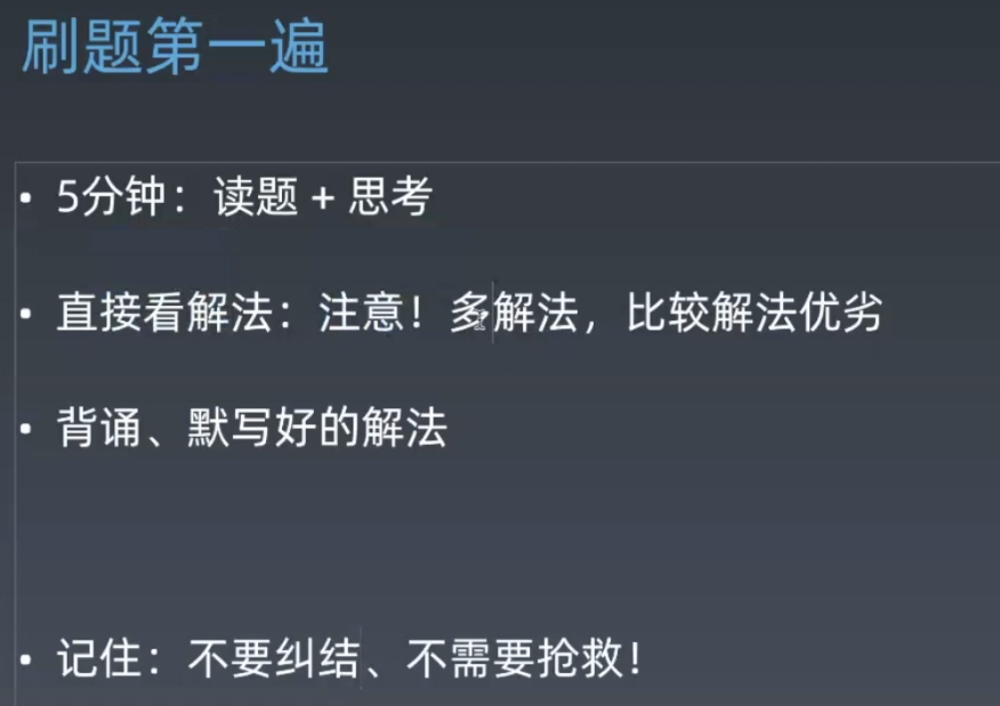
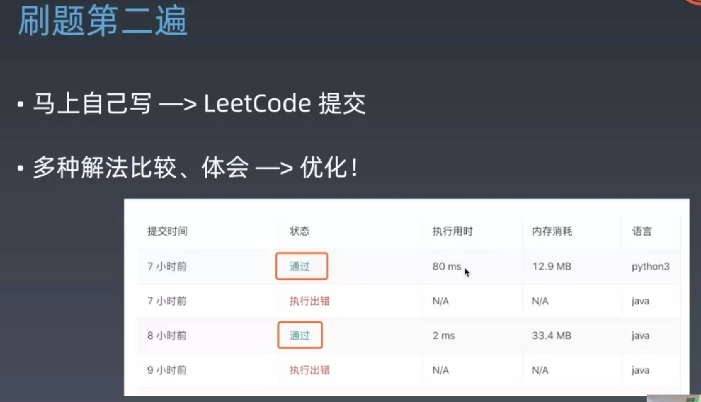

>借鉴CyC大佬复习框架,**代码原创,思路更新**

<!-- TOC -->

- [3. 数组中重复的数字](#3-数组中重复的数字)
    - [题目描述](#题目描述)
    - [解题思路](#解题思路)
- [4. 二维数组中的查找](#4-二维数组中的查找)
    - [题目描述](#题目描述-1)
    - [解题思路](#解题思路-1)
- [5. 替换空格](#5-替换空格)
    - [题目描述](#题目描述-2)
    - [解题思路](#解题思路-2)
- [6. 从尾到头打印链表](#6-从尾到头打印链表)
    - [题目描述](#题目描述-3)
    - [解题思路](#解题思路-3)
        - [使用递归](#使用递归)
        - [使用头插法](#使用头插法)
        - [使用栈](#使用栈)
- [7. 重建二叉树](#7-重建二叉树)
    - [题目描述](#题目描述-4)
    - [解题思路](#解题思路-4)
- [8. 二叉树的下一个结点](#8-二叉树的下一个结点)
    - [题目描述](#题目描述-5)
    - [解题思路](#解题思路-5)
- [9. 用两个栈实现队列](#9-用两个栈实现队列)
    - [题目描述](#题目描述-6)
    - [解题思路](#解题思路-6)
- [10.1 斐波那契数列](#101-斐波那契数列)
    - [题目描述](#题目描述-7)
    - [解题思路](#解题思路-7)
- [10.2 矩形覆盖](#102-矩形覆盖)
    - [题目描述](#题目描述-8)
    - [解题思路](#解题思路-8)
- [10.3 跳台阶](#103-跳台阶)
    - [题目描述](#题目描述-9)
    - [解题思路](#解题思路-9)

<!-- /TOC -->


# 如何写算法

## 职业选手的培养方法

1.知识体系(链表数组栈队列,树图,bitmap,动态规划,排序...)

2.刻意练习(那里不熟练哪里,每道题五遍以上)

3.注意反馈(主动反馈:算法选手直播,代码范例   被动反馈:codereview)

## 面试五步

1.搞清楚问题是什么,跟面试官复述一遍,确定一些边界(空,格式错误,百万以上的大数)

2.可能的解法有多种,都跟面试官说明一下,分析他们的时间空间复杂度.

3.确定整体思路

4.着手写代码

5.自己写testCase来做测试

## 五遍刷题

第一遍,没有思路就直接看解法







第三遍一天后再刷

第四遍一周后再刷

第五遍考前适应性训练


# 常见的数据结构的用法


```
map:
HashMap<Integer,Integer> hm = new HashMap<Integer,Integer>();

遍历:
Set<Map.Entry<Integer,Integer>> entrySet = hm.entrySet();
Iterator<Map.Entry<Integer,Integer>> it = entrySet.iterator();
while(it.hasNext()){
	Map.Entry<Integer,Integer> entry =it.next();
	entry.getKey();
	entry.getValue();
}
遍历2:
for(Map.Entry<Integer,Integer> temp:hm.entrySet()){
	temp.getKey();
	temp.getValue();
}

队列和链表

链表
LinkedList<Integer> list = new LinkedList<Integer>();

list.add(1111);
list.add(0,111);//头插
list.peek();//返回头结点,不删除
list.poll(); //返回头结点,删除
list.get(0);//获取0处的节点

遍历1:
Iterator<Integer> it = list.iterator();
while(it.hasNext()){
	int i = (int)it.next();
}
遍历2:
for(Integer temp:list){
	int a  =temp;
}


队列:
Queue<Integer> queue = new LinkedList<Integer>();
q.poll();
q.remove();

q.add(1);
q.offer(1);

q.peek();

q.isEmpty();

栈

Stack<Integer> stack1 = new Stack<Integer>();
stack1.pop();
stack1.push(1);
stack1.peek();
stack1.isEmpty();

ArrayList<Integer> list = new ArrayList<Integer>(Arrays.asList(integers));


ArrayList

        ArrayList<Integer> list = new ArrayList<Integer>();

        list.add(0);
        list.add(0, 1);

        list.get(0);

        list.remove(1);
        list.remove(new Integer(1));

list转array
        Object[] objects = list.toArray();
        Integer[] integers = list.toArray(new Integer[list.size()]);
        
        
array转list
方法1.  ArrayList<Integer> integers1 = new ArrayList<>(Arrays.asList(1,2,3,4,5));
	但是缺点如下:
	此处asList里面放的是 不定数量的数字,而不是array数组   public static <T> List<T> asList(T... a) 
	而且无法对int[] array这种数组进行转换,只能转换Integer
	
方法2.   	String[] strArray = new String[2];
        ArrayList< String> arrayList = new ArrayList<String>(strArray.length);
        Collections.addAll(arrayList, strArray);
        arrayList.add("1");
        System.out.println(arrayList);
     注意:无法对int[] array这种数组进行转换,只能转换Integer
     
  
  
Collections.sort();
Collections.binarySearch();
Collections.addAll();

Arrays.sort();
Arrays.asList();
Arrays.toString();
Arrays.binarySearch();

String 转 char[]   str.toCharArray()
str.substring();
str.charAt();
ch1.equals(ch2);

双端队列
ArrayDeque<Integer> deque = New ArrayDeque<Integer>();
deque.getFirst();deque.getLast();
deque.removeFirst();deque.removeLast();
deque.addFirst();deque.addLast();

数组是引用传递,函数内部修改后,函数外部也会收到变化.

```


# 3. 数组中重复的数字

[NowCoder](https://www.nowcoder.com/practice/623a5ac0ea5b4e5f95552655361ae0a8?tpId=13&tqId=11203&tPage=1&rp=1&ru=/ta/coding-interviews&qru=/ta/coding-interviews/question-ranking)

**题目描述**

在一个长度为 n 的数组里的所有数字都在 0 到 n-1 的范围内。数组中某些数字是重复的，但不知道有几个数字是重复的，也不知道每个数字重复几次。请找出数组中任意一个重复的数字。

```html
Input:
{2, 3, 1, 0, 2, 5}

Output:
2
```

**解题思路**

要求时间复杂度 O(N)，空间复杂度 O(1)。因此不能使用排序的方法，也不能使用额外的标记数组。

对于这种数组元素在 [0, n-1] 范围内的问题，可以将值为 i 的元素调整到第 i 个位置上进行求解。

以 (2, 3, 1, 0, 2, 5) 为例，遍历到位置 4 时，该位置上的数为 2，但是第 2 个位置上已经有一个 2 的值了，因此可以知道 2 重复：


```java
  public class Solution {
            // Parameters:
            //    numbers:     an array of integers
            //    length:      the length of array numbers
            //    duplication: (Output) the duplicated number in the array number,length of duplication array is 1,so using duplication[0] = ? in implementation;
            //                  Here duplication like pointor in C/C++, duplication[0] equal *duplication in C/C++
            //    这里要特别注意~返回任意重复的一个，赋值duplication[0]
            // Return value:       true if the input is valid, and there are some duplications in the array number
            //                     otherwise false
            public boolean duplicate(int numbers[], int length, int[] duplication) {
                if (numbers == null || length < 0) {
                    return false;
                }
                for (int i = 0; i < length; i++) {
                    while (i != numbers[i]) {
                        if (numbers[i] == numbers[numbers[i]]) {
                            duplication[0] = numbers[i];
                            return true;
                        }
                        swap(i, numbers[i], numbers);
                    }

                }
                return false;
            }

            private void swap(int index1, int index2, int[] numbers) {
                int c = numbers[index1];
                numbers[index1] = numbers[index2];
                numbers[index2] = c;
            }
        }
```


改进

1.数组判空

2.for循环改成while更符合逻辑

```java
    public boolean duplicate(int numbers[], int length, int[] duplication) {
         if (numbers == null || length < 0) {
                    return false;
         }
        //遍历数组
        //数字放到对应下标处
        //做交换
        //如果该出已有与下标相同,则返回
        //如果下标不同,则放入后,重复此过程
        int idx;
        int temp;
        for (int i = 0; i < length; ) {
            if (numbers[i] != i) {
                idx = numbers[i];
                if (numbers[idx] == idx) {
                    duplication[0] = idx;
                    return true;
                }
                temp = numbers[idx];
                numbers[idx] = numbers[i];
                numbers[i] = temp;
                //再循环,不后移
            } else {
                i++;
            }
        }
        return false;
    }
```


# 4. 二维数组中的查找

[NowCoder](https://www.nowcoder.com/practice/abc3fe2ce8e146608e868a70efebf62e?tpId=13&tqId=11154&tPage=1&rp=1&ru=/ta/coding-interviews&qru=/ta/coding-interviews/question-ranking)

**题目描述**

给定一个二维数组，其每一行从左到右递增排序，从上到下也是递增排序。给定一个数，判断这个数是否在该二维数组中。

```html
Consider the following matrix:
[
  [1,   4,  7, 11, 15],
  [2,   5,  8, 12, 19],
  [3,   6,  9, 16, 22],
  [10, 13, 14, 17, 24],
  [18, 21, 23, 26, 30]
]

Given target = 5, return true.
Given target = 20, return false.
```

**解题思路**

要求时间复杂度 O(M + N)，空间复杂度 O(1)。其中 M 为行数，N 为 列数。
从左下角开始查找.

如果只是每一层使用快排,那么其实只利用了每一行有序的条件,没有使用每一列也有序,复杂度为O(nlgn)

```java 
  public boolean Find(int target, int[][] array) {
        //rows和cols的命名方式
        int rows = array.length;
        int cols = array[0].length;
        //从左下角开始
        int i = rows - 1;
        int j = 0;
        //此处使用while比使用for要简洁
        while (i >= 0 && j < cols) {
            if (target == array[i][j])
                return true;
            else if (target > array[i][j])
                j++;
            else
                i--;
        }
        return  false;
    }
```


改进

1.row--后,col不用从零开始,因为`target>array[row][col]>array[row--][col]>array[row--][0到col-1]`

2.注意判断数组越界

```java

public class Solution {
    public boolean Find(int target, int[][] array) {
        //先画图

        //判空
        //从左下角开始
        //比上面大  行--
        //比左边大  列++
        //到头了没找到就退出
        int row = array.length - 1, col = 0;
        int rowSize = array.length;
        int colSize = array[0].length;
        while (row >= 0 && col < colSize) {
            while (row >= 0 && col < colSize && target < array[row][0]) {
                row--;
            }
            while (row >= 0 && col < colSize && target > array[row][col]) {
                col++;
            }
            if (row >= 0 && col < colSize && target == array[row][col]) {
                return true;
            }
            row--;
        }
        return false;
    }
}
```


# 5. 替换空格

[NowCoder](https://www.nowcoder.com/practice/4060ac7e3e404ad1a894ef3e17650423?tpId=13&tqId=11155&tPage=1&rp=1&ru=/ta/coding-interviews&qru=/ta/coding-interviews/question-ranking)

**题目描述**


将一个字符串中的空格替换成 "%20"。

```text
Input:
"A B"

Output:
"A%20B"
```

**解题思路**
时间O(n) 空间O(n)
新创建一个StringBuffer来存储结果
```java
public class Solution {
    public String replaceSpace(StringBuffer str) {
    	StringBuilder  sb  = new StringBuilder();
        for(int i =0;i<str.length();i++){
            char c = str.charAt(i);
            if(c==' '){
                sb.append("%20");
            }else{
                sb.append(c);
            }
        }
        return sb.toString();
    }
}

```


改进:

时间O(n) 空间O(1)

**提前遍历一遍字符串,可以确定里面空格的个数,复杂度依然保持O(n)**

```java
public class Solution {
    public String replaceSpace(StringBuffer str) {
        //遍历,寻找空格个数,设置长度是空格数+2
        //倒序遍历,空格处给str设置为%20
        int oldPointer = str.length() - 1;
        int newPointer;
        for (int i = 0; i <= oldPointer; i++) {
            if (str.charAt(i) == ' ') {
                str.append("  ");
            }
        }
        newPointer = str.length() - 1;
        for (; oldPointer >= 0; oldPointer--) {
            if (str.charAt(oldPointer) == ' ') {
                str.setCharAt(newPointer--, '0');
                str.setCharAt(newPointer--, '2');
                str.setCharAt(newPointer--, '%');
            } else {
                str.setCharAt(newPointer--, str.charAt(oldPointer));
            }
        }
        return str.toString();
    }
}
```

# 6. 从尾到头打印链表

[NowCoder](https://www.nowcoder.com/practice/d0267f7f55b3412ba93bd35cfa8e8035?tpId=13&tqId=11156&tPage=1&rp=1&ru=/ta/coding-interviews&qru=/ta/coding-interviews/question-ranking)

**题目描述**

从尾到头反过来打印出每个结点的值。

时间复杂度一般是O(n),空间复杂度可以是O(1)或者O(n),另外还要注意是否可以改变输入的数据结构


**解题思路**

**使用递归**

要逆序打印链表 1->2->3（3,2,1)，可以先逆序打印链表 2->3(3,2)，最后再打印第一个节点 1。而链表 2->3 可以看成一个新的链表，要逆序打印该链表可以继续使用求解函数，也就是在求解函数中调用自己，这就是递归函数。

```java
public ArrayList<Integer> printListFromTailToHead(ListNode listNode) {
    ArrayList<Integer> ret = new ArrayList<>();
    if (listNode != null) {
        ret.addAll(printListFromTailToHead(listNode.next));
        ret.add(listNode.val);
    }
    return ret;
}


改进:
从头到尾的逆序 考虑用递归或者栈
2N的复杂度依然是O(N)
ArrayList的addAll函数
前面写了接收类型,后面可不写:
ArrayList<Integer> reverseList = new ArrayList<>();
在本层判断本层的listNode!=null;而不是判断下一层 if (listNode.next != null) 
    

public class Solution {
    public ArrayList<Integer> printListFromTailToHead(ListNode listNode) {
        //创建一个链表
        //如果还有后续节点,就调用后续,并把结果放到当前链表上
        //返回当前链表
        if (listNode == null) {
            return new ArrayList<Integer>();
        }
        ArrayList<Integer> reverseList = new ArrayList<>();

        if (listNode.next != null) {
            ArrayList<Integer> ret = printListFromTailToHead(listNode.next);
            reverseList.addAll(ret);
        }
        reverseList.add(listNode.val);
        return reverseList;
    }
}
```

**使用头插法**

使用头插法可以得到一个逆序的链表。

list.add(0,value);//实现头插

头结点和第一个节点的区别：

- 头结点是在头插法中使用的一个额外节点，这个节点不存储值；
- 第一个节点就是链表的第一个真正存储值的节点。


```java

/**
*    public class ListNode {
*        int val;
*        ListNode next = null;
*
*        ListNode(int val) {
*            this.val = val;
*        }
*    }
*
*/
import java.util.ArrayList;
public class Solution {
    public ArrayList<Integer> printListFromTailToHead(ListNode listNode) {
        ArrayList arrayList = new ArrayList();
        while(listNode!=null){
            //头插法的可用函数
            arrayList.add(0,listNode.val);
            listNode = listNode.next;
        }
        return arrayList;
    }
}


改进:
arrayList有add(0,value)的函数,可以实现头插
```
或者
```java
public ArrayList<Integer> printListFromTailToHead(ListNode listNode) {
    ListNode head = new ListNode(-1);
    //头插法构建逆序链表
    while (listNode != null) {
        ListNode memo = listNode.next;
        listNode.next = head.next;
        head.next = listNode;
        listNode = memo;
    }
    //逆序链表放入 ArrayList
    ArrayList<Integer> ret = new ArrayList<>();
    head = head.next;
    while (head != null) {
        ret.add(head.val);
        head = head.next;
    }
    return ret;
}

改进
    头插的链表放到list里面的时候,记得的第一个head节点给跳过	head = head.next;
```

使用栈

栈具有后进先出的特点，在遍历链表时将值按顺序放入栈中，最后出栈的顺序即为逆序。

```java
//注意导入stack包
import java.util.Stack;
import java.util.ArrayList;
public class Solution {
    public ArrayList<Integer> printListFromTailToHead(ListNode listNode) {
         Stack<Integer> stack  = new Stack<>();
        ArrayList<Integer> arrayList = new ArrayList<>();
        while (listNode != null) {
            //stack的add方法来自它继承的List父类,效果与push相同
            stack.push(listNode.val);
            listNode = listNode.next;
        }
        while (!stack.isEmpty()) {
            arrayList.add((Integer) stack.pop());
        }
        return arrayList;
    }
}
```


# 7. 重建二叉树

[NowCoder](https://www.nowcoder.com/practice/8a19cbe657394eeaac2f6ea9b0f6fcf6?tpId=13&tqId=11157&tPage=1&rp=1&ru=/ta/coding-interviews&qru=/ta/coding-interviews/question-ranking)

**题目描述**

根据二叉树的前序遍历和中序遍历的结果，重建出该二叉树。假设输入的前序遍历和中序遍历的结果中都不含重复的数字。


**解题思路**
数组的长度用length而不是size  

本题treenode的构造器没有无参构造器,注意报错  

HashMap<integer,integer> = new HashMap<integer,integer>();等号两遍泛型都填好,防止歧义;注意要导入包`import java.util.HashMap`


前序遍历的第一个值为根节点的值，使用这个值将中序遍历结果分成两部分，左部分为树的左子树中序遍历结果，右部分为树的右子树中序遍历的结果。
```java
/**
 * Definition for binary tree
 * public class TreeNode {
 *     int val;
 *     TreeNode left;
 *     TreeNode right;
 *     TreeNode(int x) { val = x; }
 * }
 */
import java.util.HashMap;
public class Solution {
    HashMap<Integer,Integer> map = new HashMap<Integer,Integer>();
    public TreeNode reConstructBinaryTree(int [] pre,int [] in) {
        if(pre==null||in==null){
            return null;
        }
        for(int i = 0;i<in.length;i++){
            map.put(in[i],i);
        }
        return reConstructBinaryTree(pre,0,pre.length-1,0);
    }
    public TreeNode reConstructBinaryTree(int [] pre,int preL,int preR,int inL){
        if(preL>preR){
            return null;
        }
        int rootVal = pre[preL];
        TreeNode tree = new TreeNode(rootVal);
        int inIndex = map.get(rootVal);
        int leftSize = inIndex-inL;
        tree.left = reConstructBinaryTree(pre,preL+1,preL+leftSize,inL);
        tree.right = reConstructBinaryTree(pre,preL+leftSize+1,preR,inIndex+1);
        return tree;
    }
}


改进点
    命名的规范清晰,为逻辑的编写 和 debug提供了极大的方便,继续保持
    要利用函数重载的技巧,缩减重复写的代码
    利用map记录下了每个点的位置,parentLoc的定位会减少计算量
    
    
    public class Solution {
    public TreeNode reConstructBinaryTree(int[] pre, int[] in) {
        //如果前序数组长度为0,则返回
        //递归
        //前序确定根节点
        //中序拆分左右子树
        //将返回的结果放入左右子树

        //重复上述步骤
        int parentLoc = 0;
        int leftChildLength = 0;
        int rightChildLength = 0;
        int inL = 0;
        int inR = in.length - 1;
        int preL = 0;
        int preR = pre.length - 1;


        if (pre.length <= 0) {
            return null;
        }
        TreeNode parent = new TreeNode(pre[preL]);
        for (int i = inL; i <= inR; i++) {
            if (in[i] == parent.val) {
                parentLoc = i;
                break;
            }
        }
        leftChildLength = parentLoc - inL;
        rightChildLength = inR - parentLoc;

        parent.left = reConstructBinaryTree(pre, preL + 1, preL + leftChildLength, in, inL, inL + leftChildLength);
        parent.right = reConstructBinaryTree(pre, preL + leftChildLength + 1, preR, in, parentLoc + 1, inR);

        parent = reConstructBinaryTree(pre, preL, preR, in, inL, inR);
        return parent;

    }

    private TreeNode reConstructBinaryTree(int[] pre, int preL, int preR, int[] in, int inL, int inR) {
        int parentLoc = 0;
        int leftChildLength = 0;
        int rightChildLength = 0;

        if (preR < preL || inR < inL) {
            return null;
        }
        TreeNode parent = new TreeNode(pre[preL]);
        for (int i = inL; i <= inR; i++) {
            if (in[i] == parent.val) {
                parentLoc = i;
                break;
            }
        }
        leftChildLength = parentLoc - inL;
        rightChildLength = inR - parentLoc;

        parent.left = reConstructBinaryTree(pre, preL + 1, preL + leftChildLength, in, inL, inL + leftChildLength);
        parent.right = reConstructBinaryTree(pre, preL + leftChildLength + 1, preR, in, parentLoc + 1, inR);
        return parent;
    }
}

```

# @@8. 二叉树的下一个结点

[NowCoder](https://www.nowcoder.com/practice/9023a0c988684a53960365b889ceaf5e?tpId=13&tqId=11210&tPage=1&rp=1&ru=/ta/coding-interviews&qru=/ta/coding-interviews/question-ranking)

**题目描述**

给定一个二叉树和其中的一个结点，请找出中序遍历顺序的下一个结点并且返回。注意，树中的结点不仅包含左右子结点，同时包含指向父结点的指针。

**解题思路**

① 如果一个节点的右子树不为空，那么该节点的下一个节点是右子树的最左节点；

<div align="center">  </div><br>
② 否则，向上找第一个左链接指向的树包含该节点的祖先节点。

```java
public class Solution {
    public TreeLinkNode GetNext(TreeLinkNode pNode) {
        if (pNode == null) {
            return null;
        }
        if (pNode.right != null) {
            TreeLinkNode node = pNode.right;
            while (node.left != null) {
                node = node.left;
            }
            return node;
        } else {
            while (pNode.next != null) {
                TreeLinkNode parent = pNode.next;
                if (parent.left == pNode) {
                    return parent;
                }
                pNode = pNode.next;

            }
        }
        return null;
    }
}

class TreeLinkNode {
    int val;
    TreeLinkNode left = null;
    TreeLinkNode right = null;
    TreeLinkNode next = null;

    TreeLinkNode(int val) {
        this.val = val;
    }
}

改进:
思路很重要,如果没有右子树,就找该node作为父亲节点左子节点的父亲节点
```


# @@9. 用两个栈实现队列

[NowCoder](https://www.nowcoder.com/practice/54275ddae22f475981afa2244dd448c6?tpId=13&tqId=11158&tPage=1&rp=1&ru=/ta/coding-interviews&qru=/ta/coding-interviews/question-ranking)

**题目描述**

用两个栈来实现一个队列，完成队列的 Push 和 Pop 操作。

**解题思路**

in 栈用来处理入栈（push）操作，out 栈用来处理出栈（pop）操作。一个元素进入 in 栈之后，出栈的顺序被反转。当元素要出栈时，需要先进入 out 栈，此时元素出栈顺序再一次被反转，因此出栈顺序就和最开始入栈顺序是相同的，先进入的元素先退出，这就是队列的顺序。


```java
Stack<Integer> in = new Stack<Integer>();
Stack<Integer> out = new Stack<Integer>();

public void push(int node) {
    in.push(node);
}

public int pop() throws Exception {
    //要等stack2空了在往里面添加元素,stack1里面的元素会压在
    //stack2内部的元素上面,破坏了先进先出规则
    if (out.isEmpty())
        while (!in.isEmpty())
            out.push(in.pop());

    if (out.isEmpty())
        throw new Exception("queue is empty");

    return out.pop();
}
```


# 10.1 斐波那契数列

[NowCoder](https://www.nowcoder.com/practice/c6c7742f5ba7442aada113136ddea0c3?tpId=13&tqId=11160&tPage=1&rp=1&ru=/ta/coding-interviews&qru=/ta/coding-interviews/question-ranking)

**题目描述**

求斐波那契数列的第 n 项，n <= 39。

<div align="center">1}\end{array}\right." class="mathjax-pic"/></div> <br>
**解题思路**

如果使用递归求解，会重复计算一些子问题。例如，计算 f(4) 需要计算 f(3) 和 f(2)，计算 f(3) 需要计算 f(2) 和 f(1)，可以看到 f(2) 被重复计算了。
<div align="center">  </div><br>
递归是将一个问题划分成多个子问题求解，动态规划也是如此，但是动态规划会把子问题的解缓存起来，从而避免重复求解子问题。

```java
 public int Fibonacci(int n) {
        int[] fibs = calFib();
        return fibs[n];
    }

    //把之前计算的fib数列存储起来,既可以防止重复计算,
    //又可以在取值的时候迅速拿到值
    private int[] calFib() {
        int[] fibs = new int[40];
        fibs[1] = 1;
        for (int i = 2; i < 40; i++) {
            fibs[i] = fibs[i - 1] + fibs[i - 2];
        }
        return fibs;
    }
```

# 10.2 矩形覆盖

[NowCoder](https://www.nowcoder.com/practice/72a5a919508a4251859fb2cfb987a0e6?tpId=13&tqId=11163&tPage=1&rp=1&ru=/ta/coding-interviews&qru=/ta/coding-interviews/question-ranking)

**题目描述**

我们可以用 2\*1 的小矩形横着或者竖着去覆盖更大的矩形。请问用 n 个 2\*1 的小矩形无重叠地覆盖一个 2\*n 的大矩形，总共有多少种方法？

<div align="center">  </div><br>
**解题思路**

当 n 为 1 时，只有一种覆盖方法：

<div align="center">  </div><br>
当 n 为 2 时，有两种覆盖方法：

<div align="center">  </div><br>
要覆盖 2\*n 的大矩形，可以先覆盖 2\*1 的矩形，再覆盖 2\*(n-1) 的矩形；或者先覆盖 2\*2 的矩形，再覆盖 2\*(n-2) 的矩形。

**2\*2有两种覆盖方法,但其中一种和2\*1重合**

而覆盖 2\*(n-1) 和 2\*(n-2) 的矩形可以看成子问题。该问题的递推公式如下：

<!-- <div align="center">1}\end{array}\right." class="mathjax-pic"/></div> <br> -->

<div align="center">  </div><br>
非递归写法:
```java
  public int RectCover(int target) {
        int pre1 = 1;
        int pre2 = 2;
        if (target <= 2) {
            return target;
        }
        int result = -1;
        for (int i = 3; i <= target; i++) {
            result = pre1 + pre2;
            pre1 = pre2;
            pre2 = result;
        }
        return result;
    }
```
递归写法:
```java
public int RectCover2(int target) {
        if (target < 1) {
            return 0;
        } else if (target == 1 || target == 2) {
            return target;
        } else {
            return RectCover(target-1) + RectCover(target-2);
        }
    }
```

# 10.3 跳台阶

[NowCoder](https://www.nowcoder.com/practice/8c82a5b80378478f9484d87d1c5f12a4?tpId=13&tqId=11161&tPage=1&rp=1&ru=/ta/coding-interviews&qru=/ta/coding-interviews/question-ranking)

**题目描述**

一只青蛙一次可以跳上 1 级台阶，也可以跳上 2 级。求该青蛙跳上一个 n 级的台阶总共有多少种跳法。

<div align="center">  </div><br>
**解题思路**

当 n = 1 时，只有一种跳法：

<div align="center">  </div><br>
当 n = 2 时，有两种跳法：

<div align="center">  </div><br>
跳 n 阶台阶，可以先跳 1 阶台阶，再跳 n-1 阶台阶；或者先跳 2 阶台阶，再跳 n-2 阶台阶。而 n-1 和 n-2 阶台阶的跳法可以看成子问题，该问题的递推公式为：

<div align="center">  </div><br>
递归写法:
```java
 public int JumpFloor(int target) {
        if (target == 0) {
            return 0;
        } else if (target == 1 || target == 2) {
            return target;
        } else {
            return JumpFloor(target - 1) + JumpFloor(target - 2);
        }
    }
```
非递归写法
```java
public int JumpFloor(int target) {
        if (target <= 2) {
            return target;
        } else {
            int pre1 = 1;
            int pre2 = 2;
            int result = 0;
            for (int i = 3; i <= target; i++) {
                result = pre1 + pre2;
                pre1 = pre2;
                pre2 = result;
            }
            return result;
        }
    }
```


# 10.4 变态跳台阶

[NowCoder](https://www.nowcoder.com/practice/22243d016f6b47f2a6928b4313c85387?tpId=13&tqId=11162&tPage=1&rp=1&ru=/ta/coding-interviews&qru=/ta/coding-interviews/question-ranking)

**题目描述**

一只青蛙一次可以跳上 1 级台阶，也可以跳上 2 级... 它也可以跳上 n 级。求该青蛙跳上一个 n 级的台阶总共有多少种跳法。

<div align="center">  </div><br>
**解题思路**

动态规划

```java
public int JumpFloorII(int target) {
        if (target <= 0) {
            return 0;
        }
        if (target <= 2) {
            return target;
        }
        int[] array = new int[target + 1];
        array[1] = 1;
        array[2] = 2;

        for (int i = 3; i <= target; i++) {
            for (int j = 1; j < i; j++) {
                array[i] = array[i] + array[j];
            }
            array[i] = array[i] + 1;
        }
        return array[target];
    }
```
数学推导

跳上 n-1 级台阶，可以从 n-2 级跳 1 级上去，也可以从 n-3 级跳 2 级上去...，那么

```
f(n-1) = f(n-2) + f(n-3) + ... + f(0)
```

同样，跳上 n 级台阶，可以从 n-1 级跳 1 级上去，也可以从 n-2 级跳 2 级上去... ，那么

```
f(n) = f(n-1) + f(n-2) + ... + f(0)
```

综上可得

```
f(n) - f(n-1) = f(n-1)
```

即

```
f(n) = 2*f(n-1)
```

所以 f(n) 是一个等比数列

```java
public int JumpFloorII(int target) {
    //返回值强转,底数与指数,不用导包
    return (int) Math.pow(2, target - 1);
}
```


# 11. 旋转数组的最小数字

[NowCoder](https://www.nowcoder.com/practice/9f3231a991af4f55b95579b44b7a01ba?tpId=13&tqId=11159&tPage=1&rp=1&ru=/ta/coding-interviews&qru=/ta/coding-interviews/question-ranking)

**题目描述**

把一个数组最开始的若干个元素搬到数组的末尾，我们称之为数组的旋转。输入一个非递减排序的数组的一个旋转，输出旋转数组的最小元素。


**解题思路**

将旋转数组对半分可以得到一个包含最小元素的新旋转数组，以及一个非递减排序的数组。新的旋转数组的数组元素是原数组的一半，从而将问题规模减少了一半，这种折半性质的算法的时间复杂度为 O(logN)（为了方便，这里将 log<sub>2</sub>N 写为 logN）。


此时问题的关键在于确定对半分得到的两个数组哪一个是旋转数组，哪一个是非递减数组。我们很容易知道非递减数组的第一个元素一定小于等于最后一个元素。

通过修改二分查找算法进行求解（l 代表 low，m 代表 mid，h 代表 high）：

- 当 nums[m] <= nums[h] 时，表示 [m, h] 区间内的数组是非递减数组，[l, m] 区间内的数组是旋转数组，此时令 h = m；
- 否则 [m + 1, h] 区间内的数组是旋转数组，令 l = m + 1。

```java
    public int minNumberInRotateArray(int[] array) {

        if (array.length <= 0) {
            return 0;
        }
        int l = 0;
        int h = array.length - 1;
        while (l < h) {
            int m = l + (h - l) / 2;
            if (array[l] == array[m] && array[m] == array[h]) {
                return orderFind(array, l, h);
            } else if (array[m] <= array[h]) {
                h = m;
            } else {
                l = m + 1;
            }
        }
        return array[l];
    }

    private int orderFind(int[] array, int l, int h) {
        if (array.length <= 0) {
            return 0;
        }
        for (int i = l; i < h; i++) {
            if (array[i] > array[i + 1]) {
                return array[i + 1];
            }
        }
        return array[l];
    }
}


改进:
整体有序要考虑二分查找
针对此题的边界的解决办法:

			为什么要返回array[l];因为int m = l + (h - l) / 2;使得m偏向于l
 			if (array[l] == array[m] && array[m] == array[h]) {
                return orderFind(array, l, h);
            } else if (array[m] <= array[h]) {
                h = m;
            } else {
                l = m + 1;
            }
			 return array[l];


import java.util.ArrayList;
public class Solution {
    public int minNumberInRotateArray(int [] array) {
        if(array.length==0){
            return 0;
        }
        
        for(int i = 0;i<array.length-1;i++){
            if(array[i]>array[i+1]){
                return array[i+1];
            }
        }
        return array[0];
    }
}
```


# 12. 矩阵中的路径

[NowCoder](https://www.nowcoder.com/practice/c61c6999eecb4b8f88a98f66b273a3cc?tpId=13&tqId=11218&tPage=1&rp=1&ru=/ta/coding-interviews&qru=/ta/coding-interviews/question-ranking&from=cyc_github)

**题目描述**

判断在一个矩阵中是否存在一条包含某字符串所有字符的路径。路径可以从矩阵中的任意一个格子开始，每一步可以在矩阵中向上下左右移动一个格子。如果一条路径经过了矩阵中的某一个格子，则该路径不能再进入该格子。

例如下面的矩阵包含了一条 bfce 路径。

<div align="center">  </div><br>
**解题思路**

使用回溯法（backtracking）进行求解，它是一种暴力搜索方法，通过搜索所有可能的结果来求解问题。回溯法在一次搜索结束时需要进行回溯（回退），将这一次搜索过程中设置的状态进行清除，从而开始一次新的搜索过程。例如下图示例中，从 f 开始，下一步有 4 种搜索可能，如果先搜索 b，需要将 b 标记为已经使用，防止重复使用。在这一次搜索结束之后，需要将 b 的已经使用状态清除，并搜索 c。

<div align="center">  </div><br>
本题的输入是数组而不是矩阵（二维数组），因此需要先将数组转换成矩阵。

```java
private final static int[][] next = {{0, -1}, {0, 1}, {-1, 0}, {1, 0}};
private int rows;
private int cols;

public boolean hasPath(char[] array, int rows, int cols, char[] str) {
    if (rows == 0 || cols == 0) return false;
    this.rows = rows;
    this.cols = cols;
    boolean[][] marked = new boolean[rows][cols];
    char[][] matrix = buildMatrix(array);
    for (int i = 0; i < rows; i++)
        for (int j = 0; j < cols; j++)
            if (backtracking(matrix, str, marked, 0, i, j))
                return true;

    return false;
}

private boolean backtracking(char[][] matrix, char[] str,
                             boolean[][] marked, int pathLen, int r, int c) {

    if (pathLen == str.length) return true;
    if (r < 0 || r >= rows || c < 0 || c >= cols
            || matrix[r][c] != str[pathLen] || marked[r][c]) {

        return false;
    }
    marked[r][c] = true;
    for (int[] n : next)
        if (backtracking(matrix, str, marked, pathLen + 1, r + n[0], c + n[1]))
            return true;
    marked[r][c] = false;
    return false;
}

private char[][] buildMatrix(char[] array) {
    char[][] matrix = new char[rows][cols];
    for (int r = 0, idx = 0; r < rows; r++)
        for (int c = 0; c < cols; c++)
            matrix[r][c] = array[idx++];
    return matrix;
}


改进:
backTracing里面,返回的条件是str.length==pathLen;
终止的条件有:row<0,row>rows,col<0,col>cols,matrix[i][j]!=str[pathLen]和marked[i][j]==false
marked记得设置成true和false;

public class Solution {
    private int[][] next = {{-1, 0}, {0, 1}, {1, 0}, {0, -1}};
    private int rows, cols;

    public boolean hasPath(char[] array, int rows, int cols, char[] str) {
        this.rows = rows;
        this.cols = cols;
        //制作矩阵
        boolean[][] marked = new boolean[rows][cols];
        char[][] matrix = buildMatrix(array, rows, cols);

        for (int i = 0; i < rows; i++) {
            for (int j = 0; j < cols; j++) {
                if (backTracing(matrix, marked, i, j, str, 0))
                    return true;
            }
        }
        return false;
        //回溯
    }

    private boolean backTracing(char[][] matrix, boolean[][] marked, int row,
                                int col, char[] str, int pathLen) {
        if (pathLen == str.length) {
            return true;
        }
        if (row < 0 || row >= rows || col < 0 || col >= cols || matrix[row][col] != str[pathLen] || marked[row][col]) {
            return false;
        }
        marked[row][col] = true;
        for (int[] temp : next) {
            if (backTracing(matrix, marked, row + temp[0], col + temp[1], str, pathLen + 1)) {
                return true;
            }
        }
        marked[row][col] = false;
        return false;

    }

    private char[][] buildMatrix(char[] array, int rows, int cols) {
        char[][] matrix = new char[rows][cols];
        for (int i = 0, idx = 0; i < rows; i++) {
            for (int j = 0; j < cols; j++) {
                matrix[i][j] = array[idx++];
            }
        }
        return matrix;
    }


}
```

# 13. 机器人的运动范围

[NowCoder](https://www.nowcoder.com/practice/6e5207314b5241fb83f2329e89fdecc8?tpId=13&tqId=11219&tPage=1&rp=1&ru=/ta/coding-interviews&qru=/ta/coding-interviews/question-ranking&from=cyc_github)

**题目描述**

地上有一个 m 行和 n 列的方格。一个机器人从坐标 (0, 0) 的格子开始移动，每一次只能向左右上下四个方向移动一格，但是不能进入行坐标和列坐标的数位之和大于 k 的格子。

例如，当 k 为 18 时，机器人能够进入方格 (35,37)，因为 3+5+3+7=18。但是，它不能进入方格 (35,38)，因为 3+5+3+8=19。请问该机器人能够达到多少个格子？

**解题思路**

使用深度优先搜索（Depth First Search，DFS）方法进行求解。回溯是深度优先搜索的一种特例，它在一次搜索过程中需要设置一些本次搜索过程的局部状态，并在本次搜索结束之后清除状态。而普通的深度优先搜索并不需要使用这些局部状态，虽然还是有可能设置一些全局状态。

```java
private static final int[][] next = {{0, -1}, {0, 1}, {-1, 0}, {1, 0}};
private int cnt = 0;
private int rows;
private int cols;
private int threshold;
private int[][] digitSum;

public int movingCount(int threshold, int rows, int cols) {
    this.rows = rows;
    this.cols = cols;
    this.threshold = threshold;
    initDigitSum();
    boolean[][] marked = new boolean[rows][cols];
    dfs(marked, 0, 0);
    return cnt;
}

private void dfs(boolean[][] marked, int r, int c) {
    if (r < 0 || r >= rows || c < 0 || c >= cols || marked[r][c])
        return;
    marked[r][c] = true;
    if (this.digitSum[r][c] > this.threshold)
        return;
    cnt++;
    for (int[] n : next)
        dfs(marked, r + n[0], c + n[1]);
}

private void initDigitSum() {
    int[] digitSumOne = new int[Math.max(rows, cols)];
    for (int i = 0; i < digitSumOne.length; i++) {
        int n = i;
        while (n > 0) {
            digitSumOne[i] += n % 10;
            n /= 10;
        }
    }
    this.digitSum = new int[rows][cols];
    for (int i = 0; i < this.rows; i++)
        for (int j = 0; j < this.cols; j++)
            this.digitSum[i][j] = digitSumOne[i] + digitSumOne[j];
}


改进:
制作一个每个坐标的求和矩阵,方便和threshold做比较
marked要传入bfs里面
    
public class Solution {
    private int[][] locationSum;
    private int rows, cols;
    private int threshold;
    private boolean[][] marked;
    private int count = 0;
    private int[][] next = {{0, -1}, {0, 1}, {-1, 0}, {1, 0}};

    public int movingCount(int threshold, int rows, int cols) {
        this.threshold = threshold;
        this.cols = cols;
        this.rows = rows;
        marked = new boolean[rows][cols];
        locationSum = getLocationSum(rows, cols);
         //进入bfs
        bfs(marked, 0, 0);
        return count;
    }

    //bfs  不符合条件就退出,符合就继续往下走,走过的就不能走了(不走回头路)
    private void bfs(boolean[][] marked, int row, int col) {
        if (row < 0 || col < 0 || row >= rows || col >= cols || marked[row][col] || locationSum[row][col] > threshold) {
            return;
        }
        count++;
        marked[row][col] = true;
        for (int[] temp : next) {
            bfs(marked, row + temp[0], col + temp[1]);
        }
        return;
    }
    //制作每个方格的和
    private int[][] getLocationSum(int rows, int cols) {
        int maxLen = Math.max(rows, cols);
        int[] sumOne = new int[maxLen];
        for (int i = 0; i < maxLen; i++) {
            int sum = 0;
            int loc = i;
            while (loc > 0) {
                sum += loc % 10;
                loc = loc / 10;
            }
            sumOne[i] = sum;
        }
        int[][] sumTwo = new int[maxLen][maxLen];
        for (int i = 0; i < rows; i++) {
            for (int j = 0; j < cols; j++) {
                sumTwo[i][j] = sumOne[i] + sumOne[j];
            }
        }
        return sumTwo;
    }
}
```

# @14. 剪绳子

[Leetcode](https://leetcode.com/problems/integer-break/description/)

[NowCode](https://www.nowcoder.com/questionTerminal/57d85990ba5b440ab888fc72b0751bf8?answerType=1&f=discussion)

**题目描述**

把一根绳子剪成多段，并且使得每段的长度乘积最大。

```html
n = 2
return 1 (2 = 1 + 1)

n = 10
return 36 (10 = 3 + 3 + 4)
```

**解题思路**

贪心

尽可能多剪长度为 3 的绳子，并且不允许有长度为 1 的绳子出现。如果出现了，就从已经切好长度为 3 的绳子中拿出一段与长度为 1 的绳子重新组合，把它们切成两段长度为 2 的绳子。

证明：当 n >= 5 时，3(n - 3) - n = 2n - 9 > 0，且 2(n - 2) - n = n - 4 > 0。因此在 n >= 5 的情况下，将绳子剪成一段为 2 或者 3，得到的乘积会更大。又因为 3(n - 3) - 2(n - 2) = n - 5 >= 0，所以剪成一段长度为 3 比长度为 2 得到的乘积更大。

```java
public int integerBreak(int n) {
    if (n < 2)
        return 0;
    if (n == 2)
        return 1;
    if (n == 3)
        return 2;
    int timesOf3 = n / 3;
    if (n - timesOf3 * 3 == 1)
        timesOf3--;
    int timesOf2 = (n - timesOf3 * 3) / 2;
    return (int) (Math.pow(3, timesOf3)) * (int) (Math.pow(2, timesOf2));
}
```

动态规划

```java
public int integerBreak(int n) {
    int[] dp = new int[n + 1];
    dp[1] = 1;
    for (int i = 2; i <= n; i++)
        for (int j = 1; j < i; j++)
            dp[i] = Math.max(dp[i], Math.max(j * (i - j), dp[j] * (i - j)));
    return dp[n];
}

思考:
1.从i=2开始,我要求 dp[i]和dp[j]*(i-j)的乘积哪个更大
  2.  另外dp[j]不包括 j不用分割,当前元素乘积就是最大的情况,因此也需要判断.
    3.因为是从i之前的元素开始找最大值,所以无论j是 j=i-1;j>=0;j--  还是 j=1;j<i;j++都是没有区别的
    
```

# 15. 二进制中 1 的个数

[NowCoder](https://www.nowcoder.com/practice/8ee967e43c2c4ec193b040ea7fbb10b8?tpId=13&tqId=11164&tPage=1&rp=1&ru=/ta/coding-interviews&qru=/ta/coding-interviews/question-ranking&from=cyc_github)

**题目描述**

输入一个整数，输出该数二进制表示中 1 的个数。

**n&(n-1)**

该位运算去除 n 的位级表示中最低的那一位。

```
n       : 10110100
n-1     : 10110011
n&(n-1) : 10110000
```

时间复杂度：O(M)，其中 M 表示 1 的个数。


```java
public int NumberOf1(int n) {
    int cnt = 0;
    while (n != 0) {
        cnt++;
        n &= (n - 1);
    }
    return cnt;
}

思考:
n&(n-1)该位运算去除 n 的位级表示中最低的那一位。
    而且题目中的整数包含负数,所while(里面是n!=0 而不是n>0)
```

**Integer.bitCount()**

```java
public int NumberOf1(int n) {
    return Integer.bitCount(n);
}
```

# @16. 数值的整数次方


@因为 (x\*x)n/2 可以通过递归求解，并且每次递归 n 都减小一半，因此整个算法的时间复杂度为 O(logN)。
    如果for循环来求n遍的话,复杂度为O(N)

@考虑 指数是负数,底数是负数,指数是偶数奇数的情况.

[NowCoder](https://www.nowcoder.com/practice/1a834e5e3e1a4b7ba251417554e07c00?tpId=13&tqId=11165&tPage=1&rp=1&ru=/ta/coding-interviews&qru=/ta/coding-interviews/question-ranking&from=cyc_github)

**题目描述**

给定一个 double 类型的浮点数 base 和 int 类型的整数 exponent，求 base 的 exponent 次方。

**解题思路**

下面的讨论中 x 代表 base，n 代表 exponent。

<!--<div align="center"></div> <br>-->

<div align="center">  </div><br>
因为 (x\*x)<sup>n/2</sup> 可以通过递归求解，并且每次递归 n 都减小一半，因此整个算法的时间复杂度为 O(logN)。

```java
public double Power(double base, int exponent) {
    if (exponent == 0)
        return 1;
    if (exponent == 1)
        return base;
    boolean isNegative = false;
    if (exponent < 0) {
        exponent = -exponent;
        isNegative = true;
    }
    double pow = Power(base * base, exponent / 2);
    if (exponent % 2 != 0)
        pow = pow * base;
    return isNegative ? 1 / pow : pow;
}

改进:

    
```

# @17. 打印从 1 到最大的 n 位数

@回溯而不是从1到n打印.

**题目描述**

输入数字 n，按顺序打印出从 1 到最大的 n 位十进制数。比如输入 3，则打印出 1、2、3 一直到最大的 3 位数即 999。

**解题思路**

由于 n 可能会非常大，因此不能直接用 int 表示数字，而是用 char 数组进行存储。

使用回溯法得到所有的数。

```java
public void print1ToMaxOfNDigits(int n) {
    if (n <= 0)
        return;
    char[] number = new char[n];
    print1ToMaxOfNDigits(number, 0);
}

private void print1ToMaxOfNDigits(char[] number, int digit) {
    if (digit == number.length) {
        printNumber(number);
        return;
    }
    for (int i = 0; i < 10; i++) {
        number[digit] = (char) (i + '0');
        print1ToMaxOfNDigits(number, digit + 1);
    }
}

private void printNumber(char[] number) {
    int index = 0;
    while (index < number.length && number[index] == '0')
        index++;
    while (index < number.length)
        System.out.print(number[index++]);
    System.out.println();
}
```

# 18.1 在 O(1) 时间内删除链表节点

**解题思路**

① 如果该节点不是尾节点，那么可以直接将下一个节点的值赋给该节点，然后令该节点指向下下个节点，再删除下一个节点，时间复杂度为 O(1)。

<div align="center">  </div><br>
② 否则，就需要先遍历链表，找到节点的前一个节点，然后让前一个节点指向 null，时间复杂度为 O(N)。

<div align="center">  </div><br>
综上，如果进行 N 次操作，那么大约需要操作节点的次数为 N-1+N=2N-1，其中 N-1 表示 N-1 个不是尾节点的每个节点以 O(1) 的时间复杂度操作节点的总次数，N 表示 1 个尾节点以 O(N) 的时间复杂度操作节点的总次数。(2N-1)/N \~ 2，因此该算法的平均时间复杂度为 O(1)。

```java
public ListNode deleteNode(ListNode head, ListNode tobeDelete) {
    if (head == null || tobeDelete == null)
        return null;
    if (tobeDelete.next != null) {
        // 要删除的节点不是尾节点
        ListNode next = tobeDelete.next;
        tobeDelete.val = next.val;
        tobeDelete.next = next.next;
    } else {
        if (head == tobeDelete)
             // 只有一个节点
            head = null;
        else {
            ListNode cur = head;
            while (cur.next != tobeDelete)
                cur = cur.next;
            cur.next = null;
        }
    }
    return head;
}
```

# 18.2 删除链表中重复的结点

[NowCoder](https://www.nowcoder.com/practice/fc533c45b73a41b0b44ccba763f866ef?tpId=13&tqId=11209&tPage=1&rp=1&ru=/ta/coding-interviews&qru=/ta/coding-interviews/question-ranking&from=cyc_github)

**题目描述**

<div align="center">  </div><br>
**解题描述**

```java
public ListNode deleteDuplication(ListNode pHead) {
    if (pHead == null || pHead.next == null)
        return pHead;
    ListNode next = pHead.next;
    if (pHead.val == next.val) {
        while (next != null && pHead.val == next.val)
            next = next.next;
        return deleteDuplication(next); //返回的是从next开始的链表,所以pHead如果也是重复值,pHead也会被删掉
    } else {
        pHead.next = deleteDuplication(pHead.next);
        return pHead;
    }
}

改进:
上面递归的方法比较绕,建议用下面的办法,精髓在于创建了一个头结点Head,在pHead也是重复元素的情况下,可以删除Head下的子节点pHead.
    
    各种next比较绕,要重新做几遍
  public ListNode deleteDuplication(ListNode pHead) {
        ListNode Head = new ListNode(0);
        Head.next = pHead;
        ListNode pre = Head;
        ListNode next = pre.next;
        while (next != null) {
            if (next.next != null && next.val == next.next.val) {
                while (next.next != null && next.val == next.next.val) {
                    next = next.next;
                }
                pre.next = next.next;
                next = next.next;
            } else {
                pre = next;
                next = next.next;
            }
        }
        return Head.next;
    }
```

# @@@19. 正则表达式匹配

[NowCoder](https://www.nowcoder.com/practice/45327ae22b7b413ea21df13ee7d6429c?tpId=13&tqId=11205&tPage=1&rp=1&ru=/ta/coding-interviews&qru=/ta/coding-interviews/question-ranking&from=cyc_github)

**题目描述**

请实现一个函数用来匹配包括 '.' 和 '\*' 的正则表达式。模式中的字符 '.' 表示任意一个字符，而 '\*' 表示它前面的字符可以出现任意次（包含 0 次）。

在本题中，匹配是指字符串的所有字符匹配整个模式。例如，字符串 "aaa" 与模式 "a.a" 和 "ab\*ac\*a" 匹配，但是与 "aa.a" 和 "ab\*a" 均不匹配。

**解题思路**

应该注意到，'.' 是用来当做一个任意字符，而 '\*' 是用来重复前面的字符。这两个的作用不同，不能把 '.' 的作用和 '\*' 进行类比，从而把它当成重复前面字符一次。

```java
 public boolean match(char[] str, char[] pattern) {
        String s = new String(str);
        String p = new String(pattern);
        if (s == null || p == null) {
            return false;
        }
        int len1 = s.length();
        int len2 = p.length();
        boolean[][] dp = new boolean[s.length() + 1][p.length() + 1];
        dp[0][0] = true;
        //初始化"" 与p的匹配关系  "" 和 a*a*a*是可以匹配的
        for (int i = 0; i < len2; i++) {
            if (p.charAt(i) == '*' && dp[0][i - 1]) {
                dp[0][i + 1] = true;
            }
        }
        for (int i = 0; i < len1; i++) {
            for (int j = 0; j < len2; j++) {
                // ##s   ##p     与     ##s    ##.
                if (s.charAt(i) == p.charAt(j) || p.charAt(j) == '.') {
                    dp[i + 1][j + 1] = dp[i][j];
                }
                if (p.charAt(j) == '*') {
                    if (p.charAt(j - 1) == s.charAt(i) || p.charAt(j - 1) == '.') {
                        // ##c    ##cp*  i  和 j-2
                        //##p     ##p*    i  和  j-1
                        //##ppp   ##p*    i-1 和  j
                        dp[i + 1][j + 1] = dp[i + 1][j - 1] || dp[i + 1][j] || dp[i][j + 1];
                    } else {
                        // ##b  要和  ##c*匹配   i  和  j-2
                        dp[i + 1][j + 1] = dp[i + 1][j - 1];
                    }
                }
            }
        }
        return dp[len1][len2];
    }

改进:
用下面的思路 比较清晰

当模式中的第二个字符不是“*”时：
1、如果字符串第一个字符和模式中的第一个字符相匹配，那么字符串和模式都后移一个字符，然后匹配剩余的。
2、如果 字符串第一个字符和模式中的第一个字符相不匹配，直接返回false。

而当模式中的第二个字符是“*”时：
如果字符串第一个字符跟模式第一个字符不匹配，则模式后移2个字符，继续匹配。如果字符串第一个字符跟模式第一个字符匹配，可以有3种匹配方式：
1、模式后移2字符，相当于x*被忽略；
2、字符串后移1字符，模式后移2字符；
3、字符串后移1字符，模式不变，即继续匹配字符下一位，因为*可以匹配多位；

这里需要注意的是：Java里，要时刻检验数组是否越界。


链接：https://www.nowcoder.com/questionTerminal/45327ae22b7b413ea21df13ee7d6429c?f=discussion
来源：牛客网

public class Solution {
    public boolean match(char[] str, char[] pattern) {
    if (str == null || pattern == null) {
        return false;
    }
    int strIndex = 0;
    int patternIndex = 0;
    return matchCore(str, strIndex, pattern, patternIndex);
}
  
public boolean matchCore(char[] str, int strIndex, char[] pattern, int patternIndex) {
    //有效性检验：str到尾，pattern到尾，匹配成功
    if (strIndex == str.length && patternIndex == pattern.length) {
        return true;
    }
    //pattern先到尾，匹配失败
    if (strIndex != str.length && patternIndex == pattern.length) {
        return false;
    }
    //模式第2个是*，且字符串第1个跟模式第1个匹配,分3种匹配模式；如不匹配，模式后移2位
    if (patternIndex + 1 < pattern.length && pattern[patternIndex + 1] == '*') {
        if ((strIndex != str.length && pattern[patternIndex] == str[strIndex]) || (pattern[patternIndex] == '.' && strIndex != str.length)) {
            return matchCore(str, strIndex, pattern, patternIndex + 2)//模式后移2，视为x*匹配0个字符
                    || matchCore(str, strIndex + 1, pattern, patternIndex + 2)//视为模式匹配1个字符
                    || matchCore(str, strIndex + 1, pattern, patternIndex);//*匹配1个，再匹配str中的下一个
        } else {
            return matchCore(str, strIndex, pattern, patternIndex + 2);
        }
    }
    //模式第2个不是*，且字符串第1个跟模式第1个匹配，则都后移1位，否则直接返回false
    if ((strIndex != str.length && pattern[patternIndex] == str[strIndex]) || (pattern[patternIndex] == '.' && strIndex != str.length)) {
        return matchCore(str, strIndex + 1, pattern, patternIndex + 1);
    }
    return false;
    }
}
```


# @20. 表示数值的字符串

@index == len

@ otherWord

@分三段判  ` ***.***E***`

@count<=0

@首数字为0(小数部分可以,其他两段不可以,但本题没有这个限制)

[NowCoder](https://www.nowcoder.com/practice/6f8c901d091949a5837e24bb82a731f2?tpId=13&tqId=11206&tPage=1&rp=1&ru=/ta/coding-interviews&qru=/ta/coding-interviews/question-ranking&from=cyc_github)

**题目描述**

```
true

"+100"
"5e2"
"-123"
"3.1416"
"-1E-16"
```

```
false

"12e"
"1a3.14"
"1.2.3"
"+-5"
"12e+4.3"
```


**解题思路**

使用正则表达式进行匹配。

```html
[]  ： 字符集合
()  ： 分组
?   ： 重复 0 ~ 1 次
+   ： 重复 1 ~ n 次
*   ： 重复 0 ~ n 次
.   ： 任意字符
\\. ： 转义后的 .
\\d ： 数字
```

```java
思路1:

	private int index = 0;
    private int len = 0;
    private boolean hasOtherWord = false;

    public boolean isNumeric(char[] str) {
        if (str == null || str.length == 0)
            return false;
        len = str.length;
        int count1 = 0, count2 = 0, count3 = 0;
        count1 = judgeNum(str);
        if (index < len && str[index] == '.') {
            index++;
            count2 = judgeUnsignNum(str);
            if (count2 < 1)
                return false;
        }
        if (index < len && (str[index] == 'E' || str[index] == 'e')) {
            index++;
            count3 = judgeNum(str);
            if (count3 < 1)
                return false;
        }
        return !hasOtherWord && index == len;
    }

    private int judgeNum(char[] str) {
        if (index >= len) {
            return 0;
        }
        if (str[index] == '+' || str[index] == '-') {
            index++;
        }
        return judgeUnsignNum(str);
    }

    private int judgeUnsignNum(char[] str) {
        int start = index;
        while (index < len) {
            if (str[index] >= '0' && str[index] <= '9') {
                index++;
            } else if (str[index] == '.' || str[index] == 'e' || str[index] == 'E') {
                return index - start;
            } else {
                hasOtherWord = true;
                return -1;
            }
        }
        return index - start;
    }


思路2:
public boolean isNumeric(char[] str) {
    if (str == null || str.length == 0)
        return false;
    return new String(str).matches("[+-]?\\d*(\\.\\d+)?([eE][+-]?\\d+)?");
}
```

# @21. 调整数组顺序使奇数位于偶数前面

@创建一个新数组，时间复杂度 O(N)，空间复杂度 O(N)。

[NowCoder](https://www.nowcoder.com/practice/beb5aa231adc45b2a5dcc5b62c93f593?tpId=13&tqId=11166&tPage=1&rp=1&ru=/ta/coding-interviews&qru=/ta/coding-interviews/question-ranking&from=cyc_github)

**题目描述**

需要保证奇数和奇数，偶数和偶数之间的相对位置不变，这和书本不太一样。

<div align="center">  </div><br>
**解题思路**

方法一：创建一个新数组，时间复杂度 O(N)，空间复杂度 O(N)。

```java
public void reOrderArray(int[] nums) {
    // 奇数个数
    int oddCnt = 0;
    for (int x : nums)
        if (!isEven(x))
            oddCnt++;
    int[] copy = nums.clone();
    int i = 0, j = oddCnt;
    for (int num : copy) {
        if (num % 2 == 1)
            nums[i++] = num;
        else
            nums[j++] = num;
    }
}

private boolean isEven(int x) {
    return x % 2 == 0;
}


改进 : 
没改进,熟悉了一下LinkedList而已
    
public void reOrderArray(int[] array) {
        LinkedList<Integer> oddList = new LinkedList<Integer>();
        LinkedList<Integer> evenList = new LinkedList<Integer>();
        for (int i = 0; i < array.length; i++) {
            if (isOdd(array[i])) {
                oddList.add(array[i]);
                continue;
            }
            evenList.add(array[i]);
        }
        int index = 0;
        for (Integer temp : oddList) {
            array[index++] = temp;
        }
        for (Integer temp : evenList) {
            array[index++] = temp;
        }
        return;
    }

    //奇数判断
    private boolean isOdd(int num) {
        if (num % 2 == 1) {
            return true;
        }
        return false;
    }
```

方法二：使用冒泡思想，每次都当前偶数上浮到当前最右边。时间复杂度 O(N<sup>2</sup>)，空间复杂度 O(1)，时间换空间。

```java
public void reOrderArray(int[] nums) {
    int N = nums.length;
    for (int i = N - 1; i > 0; i--) {
        for (int j = 0; j < i; j++) {
            if (isEven(nums[j]) && !isEven(nums[j + 1])) {
                swap(nums, j, j + 1);
            }
        }
    }
}

private boolean isEven(int x) {
    return x % 2 == 0;
}

private void swap(int[] nums, int i, int j) {
    int t = nums[i];
    nums[i] = nums[j];
    nums[j] = t;
}
改进 
    第一个循环是 n-1次循环即可
    第二个循环是  第一次:j为 0~n-2 的array[j]与array[j+1]作比较
        		第二次: j为 0~n-3 的array[j]与array[j+1]作比较


```

# 22. 链表中倒数第 K 个结点

[NowCoder](https://www.nowcoder.com/practice/529d3ae5a407492994ad2a246518148a?tpId=13&tqId=11167&tPage=1&rp=1&ru=/ta/coding-interviews&qru=/ta/coding-interviews/question-ranking&from=cyc_github)

输入一个链表，输出该链表中倒数第k个结点

**解题思路**

设链表的长度为 N。设置两个指针 P1 和 P2，先让 P1 移动 K 个节点，则还有 N - K 个节点可以移动。此时让 P1 和 P2 同时移动，可以知道当 P1 移动到链表结尾时，P2 移动到第 N - K 个节点处，该位置就是倒数第 K 个节点。

<div align="center">  </div><br>
```java
public ListNode FindKthToTail(ListNode head, int k) {
    if (head == null)
        return null;
    ListNode P1 = head;
    while (P1 != null && k-- > 0)
        P1 = P1.next;
    if (k > 0)
        return null;
    ListNode P2 = head;
    while (P1 != null) {
        P1 = P1.next;
        P2 = P2.next;
    }
    return P2;
}

改进:没啥好改进的
public ListNode FindKthToTail(ListNode head, int k) {
        //p1 先走k
        //p2 和 p1 一起走
        //返回p2
        ListNode p1 = head;
        ListNode p2 = head;
        for (int i = 0; i < k; i++) {
            if (p1 == null) {
                return null;
            }
            p1 = p1.next;
        }
        while (p1 != null) {
            p1 = p1.next;
            p2 = p2.next;
        }
        return p2;
    }
```

# 23. 链表中环的入口结点

[NowCoder](https://www.nowcoder.com/practice/253d2c59ec3e4bc68da16833f79a38e4?tpId=13&tqId=11208&tPage=1&rp=1&ru=/ta/coding-interviews&qru=/ta/coding-interviews/question-ranking&from=cyc_github)

**题目描述**

一个链表中包含环，请找出该链表的环的入口结点。要求不能使用额外的空间。

**解题思路**

使用双指针，一个指针 fast 每次移动两个节点，一个指针 slow 每次移动一个节点。因为存在环，所以两个指针必定相遇在环中的某个节点上。假设相遇点在下图的 z1 位置，此时 fast 移动的节点数为 x+y+z+y，slow 为 x+y，由于 fast 速度比 slow 快一倍，因此 x+2y+z=2(x+y)，得到 x=z。

在相遇点，slow 要到环的入口点还需要移动 z 个节点，如果让 fast 重新从头开始移动，并且速度变为每次移动一个节点，那么它到环入口点还需要移动 x 个节点。在上面已经推导出 x=z，因此 fast 和 slow 将在环入口点相遇。

<div align="center">  </div><br>
```java
public ListNode EntryNodeOfLoop(ListNode pHead) {
    if (pHead == null || pHead.next == null)
        return null;
    ListNode slow = pHead, fast = pHead;
    do {
        fast = fast.next.next;
        slow = slow.next;
    } while (slow != fast);
    fast = pHead;
    while (slow != fast) {
        slow = slow.next;
        fast = fast.next;
    }
    return slow;
}

改进: 
	记住环形入口的结论
    记住代码
    本题没有包含不含环的情况,代码鲁棒性不行
```


# 24. 反转链表

[NowCoder](https://www.nowcoder.com/practice/75e878df47f24fdc9dc3e400ec6058ca?tpId=13&tqId=11168&tPage=1&rp=1&ru=/ta/coding-interviews&qru=/ta/coding-interviews/question-ranking&from=cyc_github)

**解题思路**

递归

```java
public ListNode ReverseList(ListNode head) {
    if (head == null || head.next == null)
        return head;
    ListNode next = head.next;
    head.next = null;
    ListNode newHead = ReverseList(next);
    next.next = head;
    return newHead;
}
```

迭代

使用头插法。

```java
public ListNode ReverseList(ListNode head) {
    ListNode newList = new ListNode(-1);
    while (head != null) {
        ListNode next = head.next;
        head.next = newList.next;
        newList.next = head;
        head = next;
    }
    return newList.next;
}

改进:
先判断head==null  来保证  ListNode next = head.next;不会报空指针

    
    
 public ListNode ReverseList(ListNode head) {
        if (head == null) {
            return null;
        }
        ListNode reverseHead = new ListNode(-1);
        ListNode node = head;
        ListNode next = head.next;
        while (node != null) {
            next = node.next;
            node.next = reverseHead.next;
            reverseHead.next = node;
            node = next;
        }
        return reverseHead.next;
    }
```

# 25. 合并两个排序的链表

[NowCoder](https://www.nowcoder.com/practice/d8b6b4358f774294a89de2a6ac4d9337?tpId=13&tqId=11169&tPage=1&rp=1&ru=/ta/coding-interviews&qru=/ta/coding-interviews/question-ranking&from=cyc_github)

**题目描述**

<div align="center">  </div><br>
**解题思路**

递归

```java
public ListNode Merge(ListNode list1, ListNode list2) {
    if (list1 == null)
        return list2;
    if (list2 == null)
        return list1;
    if (list1.val <= list2.val) {
        list1.next = Merge(list1.next, list2);
        return list1;
    } else {
        list2.next = Merge(list1, list2.next);
        return list2;
    }
}
```

迭代

```java
public ListNode Merge(ListNode list1, ListNode list2) {
    ListNode head = new ListNode(-1);
    ListNode cur = head;
    while (list1 != null && list2 != null) {
        if (list1.val <= list2.val) {
            cur.next = list1;
            list1 = list1.next;
        } else {
            cur.next = list2;
            list2 = list2.next;
        }
        cur = cur.next;
    }
    if (list1 != null)
        cur.next = list1;
    if (list2 != null)
        cur.next = list2;
    return head.next;
}
```

# 26. 树的子结构

[NowCoder](https://www.nowcoder.com/practice/6e196c44c7004d15b1610b9afca8bd88?tpId=13&tqId=11170&tPage=1&rp=1&ru=/ta/coding-interviews&qru=/ta/coding-interviews/question-ranking&from=cyc_github)

**题目描述**

<div align="center">  </div><br>
**解题思路**

```java
public boolean HasSubtree(TreeNode root1, TreeNode root2) {
    if (root1 == null || root2 == null)
        return false;
    return isSubtreeWithRoot(root1, root2) || HasSubtree(root1.left, root2) || HasSubtree(root1.right, root2);
}

private boolean isSubtreeWithRoot(TreeNode root1, TreeNode root2) {
    if (root2 == null)
        return true;
    if (root1 == null)
        return false;
    if (root1.val != root2.val)
        return false;
    return isSubtreeWithRoot(root1.left, root2.left) && isSubtreeWithRoot(root1.right, root2.right);
}
```

# 27. 二叉树的镜像

[NowCoder](https://www.nowcoder.com/practice/564f4c26aa584921bc75623e48ca3011?tpId=13&tqId=11171&tPage=1&rp=1&ru=/ta/coding-interviews&qru=/ta/coding-interviews/question-ranking&from=cyc_github)

**题目描述**

操作给定的二叉树，将其变换为源二叉树的镜像。

<div align="center">  </div><br>
**解题思路**

```java
public void Mirror(TreeNode root) {
    if (root == null)
        return;
    swap(root);
    Mirror(root.left);
    Mirror(root.right);
}

private void swap(TreeNode root) {
    TreeNode t = root.left;
    root.left = root.right;
    root.right = t;
}
```

# 28 对称的二叉树

[NowCoder](https://www.nowcoder.com/practice/ff05d44dfdb04e1d83bdbdab320efbcb?tpId=13&tqId=11211&tPage=1&rp=1&ru=/ta/coding-interviews&qru=/ta/coding-interviews/question-ranking&from=cyc_github)

**题目描述**

<div align="center">  </div><br>
**解题思路**

```java
boolean isSymmetrical(TreeNode pRoot) {
    if (pRoot == null)
        return true;
    return isSymmetrical(pRoot.left, pRoot.right);
}

boolean isSymmetrical(TreeNode t1, TreeNode t2) {
    if (t1 == null && t2 == null)
        return true;
    if (t1 == null || t2 == null)
        return false;
    if (t1.val != t2.val)
        return false;
    return isSymmetrical(t1.left, t2.right) && isSymmetrical(t1.right, t2.left);
}
```

# 29. 顺时针打印矩阵

[NowCoder](https://www.nowcoder.com/practice/9b4c81a02cd34f76be2659fa0d54342a?tpId=13&tqId=11172&tPage=1&rp=1&ru=/ta/coding-interviews&qru=/ta/coding-interviews/question-ranking&from=cyc_github)

**题目描述**

下图的矩阵顺时针打印结果为：1, 2, 3, 4, 8, 12, 16, 15, 14, 13, 9, 5, 6, 7, 11, 10

<div align="center">  </div><br>
**解题思路**

```java

改进:
这个思路更好,
用rowStart,rowEnd,colStart,colEnd来控制范围
注意 rowEnd = matrix.length-1;
if (rowEnd != rowStart) {//如果边界只有一行的话,那第一个for循环来打印就好了
    
    
    
public ArrayList<Integer> printMatrix(int[][] matrix) {
        int rowEnd = matrix.length - 1;   //
        int colEnd = matrix[0].length - 1;
        int rowStart = 0;
        int colStart = 0;

        ArrayList<Integer> ret = new ArrayList<>();
        while (rowStart <= rowEnd && colStart <= colEnd) {
            for (int i = colStart; i <= colEnd; i++) {
                ret.add(matrix[rowStart][i]);

            }
            for (int i = rowStart + 1; i <= rowEnd; i++) {
                ret.add(matrix[i][colEnd]);
            }
            if (rowEnd != rowStart) {//如果边界只有一行的话,那第一个for循环来打印就好了.
                for (int i = colEnd - 1; i >= colStart; i--) {
                    ret.add(matrix[rowEnd][i]);
                }
            }
            if (colEnd != colStart) {
                for (int i = rowEnd - 1; i >= rowStart + 1; i--) {
                    ret.add(matrix[i][colStart]);
                }
            }
            rowStart++;
            rowEnd--;
            colStart++;
            colEnd--;
        }
        return ret;
    }

改进:
上面的做法更好.
    
rowLocationBound = matrix.length
colLocationBound = matrix[0].length;
用layer来控制每一层
如果count>sum了,则不要再继续循环

 public ArrayList<Integer> printMatrix(int[][] matrix) {
        int colLocationBound = matrix[0].length;
        int rowLocationBound = matrix.length;
        ArrayList<Integer> ret = new ArrayList<Integer>();
        int layer = 0;//从0开始
        int count = 0;//从1开始
        int sum = rowLocationBound * colLocationBound;
        while (count < rowLocationBound * colLocationBound) {
            for (int i = layer; i < colLocationBound - layer && count < sum; i++) {
                ret.add(matrix[layer][i]);
                count++;
            }
            for (int j = layer + 1; j < rowLocationBound - 1 - layer && count < sum; j++) {
                ret.add(matrix[j][colLocationBound - layer - 1]);
                count++;
            }

            for (int i = colLocationBound - layer - 1; i >= layer && count < sum; i--) {
                ret.add(matrix[rowLocationBound - layer - 1][i]);
                count++;
            }
            for (int i = rowLocationBound - 1 - layer - 1; i >= layer + 1 && count < sum; i--) {
                ret.add(matrix[i][layer]);
                count++;
            }
            layer++;
        }
        return ret;
    }
```

# 30. 包含 min 函数的栈

[NowCoder](https://www.nowcoder.com/practice/4c776177d2c04c2494f2555c9fcc1e49?tpId=13&tqId=11173&tPage=1&rp=1&ru=/ta/coding-interviews&qru=/ta/coding-interviews/question-ranking&from=cyc_github)

**题目描述**

定义栈的数据结构，请在该类型中实现一个能够得到栈最小元素的 min 函数。

**解题思路**

```java
private Stack<Integer> dataStack = new Stack<>();
private Stack<Integer> minStack = new Stack<>();

public void push(int node) {
    dataStack.push(node);
    minStack.push(minStack.isEmpty() ? node : Math.min(minStack.peek(), node));
}

public void pop() {
    dataStack.pop();
    minStack.pop();
}

public int top() {
    return dataStack.peek();
}

public int min() {
    return minStack.peek();
}
改进: minStack不能用一个记录最小值的int来替代.因为pop一次,再求最小值,int里面的值不符合要求了.
```

# @31. 栈的压入、弹出序列

[NowCoder](https://www.nowcoder.com/practice/d77d11405cc7470d82554cb392585106?tpId=13&tqId=11174&tPage=1&rp=1&ru=/ta/coding-interviews&qru=/ta/coding-interviews/question-ranking&from=cyc_github)

**题目描述**

输入两个整数序列，第一个序列表示栈的压入顺序，请判断第二个序列是否为该栈的弹出顺序。假设压入栈的所有数字均不相等。

例如序列 1,2,3,4,5 是某栈的压入顺序，序列 4,5,3,2,1 是该压栈序列对应的一个弹出序列，但 4,3,5,1,2 就不可能是该压栈序列的弹出序列。

**解题思路**

使用一个栈来模拟压入弹出操作。

```java
public boolean IsPopOrder(int[] pushSequence, int[] popSequence) {
    int n = pushSequence.length;
    Stack<Integer> stack = new Stack<>();
    for (int pushIndex = 0, popIndex = 0; pushIndex < n; pushIndex++) {
        stack.push(pushSequence[pushIndex]);
        while (popIndex < n && !stack.isEmpty() 
                && stack.peek() == popSequence[popIndex]) {
            stack.pop();
            popIndex++;
        }
    }
    return stack.isEmpty();
}

改进
    最后一句 return 可以简化为上面return stack.isEmpty();


   public boolean IsPopOrder(int[] pushA, int[] popA) {
        int n = pushA.length;
        Stack<Integer> stack = new Stack<Integer>();
        for (int pushIndex = 0, popIndex = 0; pushIndex < n; pushIndex++) {
            stack.push(pushA[pushIndex]);
            while (popIndex < n && !stack.isEmpty() && stack.peek() == popA[popIndex]) {
                stack.pop();
                popIndex++;
            }
        }
        if (stack.isEmpty()) {
            return true;
        }
        return false;
    }
```

# 32.1 从上往下打印二叉树

[NowCoder](https://www.nowcoder.com/practice/7fe2212963db4790b57431d9ed259701?tpId=13&tqId=11175&tPage=1&rp=1&ru=/ta/coding-interviews&qru=/ta/coding-interviews/question-ranking&from=cyc_github)

**题目描述**

从上往下打印出二叉树的每个节点，同层节点从左至右打印。

例如，以下二叉树层次遍历的结果为：1,2,3,4,5,6,7

<div align="center">  </div><br>
**解题思路**

使用队列来进行层次遍历。

不需要使用两个队列分别存储当前层的节点和下一层的节点，因为在开始遍历一层的节点时，当前队列中的节点数就是当前层的节点数，只要控制遍历这么多节点数，就能保证这次遍历的都是当前层的节点。

```java
public ArrayList<Integer> PrintFromTopToBottom(TreeNode root) {
    Queue<TreeNode> queue = new LinkedList<>();
    ArrayList<Integer> ret = new ArrayList<>();
    queue.add(root);
    while (!queue.isEmpty()) {
        int cnt = queue.size();
        while (cnt-- > 0) {
            TreeNode t = queue.poll();
            if (t == null)
                continue;
            ret.add(t.val);
            queue.add(t.left);
            queue.add(t.right);
        }
    }
    return ret;
}


 public ArrayList<Integer> PrintFromTopToBottom(TreeNode root) {
        Queue<TreeNode> queue = new LinkedList<TreeNode>();
        ArrayList<Integer> list = new ArrayList<Integer>();
        if (root == null) {
            return list;
        }
        queue.add(root);
        while (!queue.isEmpty()) {
            TreeNode node = queue.poll();
            list.add(node.val);
            if (node.left != null) {
                queue.add(node.left);
            }
            if (node.right != null) {
                queue.add(node.right);
            }

        }
        return list;
    }
```

# 32.2 把二叉树打印成多行

[NowCoder](https://www.nowcoder.com/practice/445c44d982d04483b04a54f298796288?tpId=13&tqId=11213&tPage=1&rp=1&ru=/ta/coding-interviews&qru=/ta/coding-interviews/question-ranking&from=cyc_github)

**题目描述**

和上题几乎一样。

**解题思路**

```java
ArrayList<ArrayList<Integer>> Print(TreeNode pRoot) {
    ArrayList<ArrayList<Integer>> ret = new ArrayList<>();
    Queue<TreeNode> queue = new LinkedList<>();
    queue.add(pRoot);
    while (!queue.isEmpty()) {
        ArrayList<Integer> list = new ArrayList<>();
        int cnt = queue.size();
        while (cnt-- > 0) {
            TreeNode node = queue.poll();
            if (node == null)
                continue;
            list.add(node.val);
            queue.add(node.left);
            queue.add(node.right);
        }
        if (list.size() != 0)
            ret.add(list);
    }
    return ret;
}

改进:
while (cnt-- > 0) 是最重要的一步,分割了两层树的节点

```

# 32.3 按之字形顺序打印二叉树

[NowCoder](https://www.nowcoder.com/practice/91b69814117f4e8097390d107d2efbe0?tpId=13&tqId=11212&tPage=1&rp=1&ru=/ta/coding-interviews&qru=/ta/coding-interviews/question-ranking&from=cyc_github)

**题目描述**

请实现一个函数按照之字形打印二叉树，即第一行按照从左到右的顺序打印，第二层按照从右至左的顺序打印，第三行按照从左到右的顺序打印，其他行以此类推。

**解题思路**

```java
改进: 注意如果用队列和栈来做, 第一行正序,第二行逆序,第三行因为第二行原本就是逆序,所以顺序不好控制了
public ArrayList<ArrayList<Integer>> Print(TreeNode pRoot) {
        ArrayList<ArrayList<Integer>> listSum = new ArrayList<ArrayList<Integer>>();
        if (pRoot == null) {
            return listSum;
        }
        Queue<TreeNode> queue = new LinkedList<TreeNode>();
        int count = 1;
        queue.add(pRoot);
        while (!queue.isEmpty()) {
            ArrayList<Integer> list = new ArrayList<Integer>();
            int size = queue.size();
            while (size > 0) {
                TreeNode node = queue.poll();
                if (count % 2 == 1) {
                    list.add(node.val);
                } else {
                    list.add(0, node.val);
                }

                if (node.left != null) {
                    queue.add(node.left);
                }
                if (node.right != null) {
                    queue.add(node.right);
                }
                size--;
            }
            count++;
            listSum.add(list);
        }
        return listSum;
    }
```

# @@@@33. 二叉搜索树的后序遍历序列

[NowCoder](https://www.nowcoder.com/practice/a861533d45854474ac791d90e447bafd?tpId=13&tqId=11176&tPage=1&rp=1&ru=/ta/coding-interviews&qru=/ta/coding-interviews/question-ranking&from=cyc_github)

**题目描述**

输入一个整数数组，判断该数组是不是某二叉搜索树的后序遍历的结果。假设输入的数组的任意两个数字都互不相同。

例如，下图是后序遍历序列 1,3,2 所对应的二叉搜索树。

<div align="center">  </div><br>
**解题思路**

```java
public boolean VerifySquenceOfBST(int[] sequence) {
    if (sequence == null || sequence.length == 0)
        return false;
    return verify(sequence, 0, sequence.length - 1);
}

private boolean verify(int[] sequence, int first, int last) {
    if (last - first <= 1)
        return true;
    int rootVal = sequence[last];
    int cutIndex = first;
    while (cutIndex < last && sequence[cutIndex] <= rootVal)
        cutIndex++;
    for (int i = cutIndex; i < last; i++)
        if (sequence[i] < rootVal)
            return false;
    return verify(sequence, first, cutIndex - 1) && verify(sequence, cutIndex, last - 1);
}

改进:
寻找左右子树分界    while (cutIndex < last && sequence[cutIndex] <= rootVal)

判断右子树符不符合规则,这个很重要.
    for (int i = cutIndex; i < last; i++)
        if (sequence[i] < rootVal)
            return false;

```

# 34. 二叉树中和为某一值的路径

[NowCoder](https://www.nowcoder.com/practice/b736e784e3e34731af99065031301bca?tpId=13&tqId=11177&tPage=1&rp=1&ru=/ta/coding-interviews&qru=/ta/coding-interviews/question-ranking&from=cyc_github)

**题目描述**

输入一颗二叉树和一个整数，打印出二叉树中结点值的和为输入整数的所有路径。路径定义为从树的根结点开始往下一直到叶结点所经过的结点形成一条路径。

下图的二叉树有两条和为 22 的路径：10, 5, 7 和 10, 12

<div align="center">  </div><br>
**解题思路**

```java
private ArrayList<ArrayList<Integer>> listSum = new ArrayList<ArrayList<Integer>>();
    private int sum = 0, target = 0;
    private ArrayList<Integer> path = new ArrayList<Integer>();
    public ArrayList<ArrayList<Integer>> FindPath(TreeNode root, int target) {
        if (root == null) {
            return listSum;
        }
        this.target = target;
        rec(root);
        return listSum;
    }

    private void rec(TreeNode root) {
        if (root == null) {
            return;
        }

        path.add(root.val);
        sum += root.val;

        if (sum == target) {
            if (root.left == null && root.right == null) {
                listSum.add(new ArrayList<Integer>(path));
            }
        }
        rec(root.left);
        rec(root.right);

        sum = sum - root.val;
        path.remove(path.size() - 1);
    }
改进
    listSum.add(path)的时候 add的是new ArrayList<>(path);  不新创建一个的话,后面paht的修改会影响listSum里面的内容
private ArrayList<ArrayList<Integer>> listSum = new ArrayList<ArrayList<Integer>>();
    public ArrayList<ArrayList<Integer>> FindPath(TreeNode root, int target) {
        if (root == null) {
            return listSum;
        }
        findPath(root, target, 0, new ArrayList<Integer>());
        return listSum;
    }
    private void findPath(TreeNode root, int target, int sum, ArrayList<Integer> path) {
        if (root == null) {
            return;
        }
        path.add(root.val);
        sum += root.val;
        if (sum > target) {
            path.remove(path.size() - 1);
            return;
        }
        if (sum == target && root.left == null && root.right == null) {
            listSum.add(new ArrayList<>(path));
            path.remove(path.size() - 1);
            return;
        }
        findPath(root.left, target, sum, path);
        findPath(root.right, target, sum, path);
        path.remove(path.size() - 1);
    }
```

# @@35. 复杂链表的复制(我赌不考)

[NowCoder](https://www.nowcoder.com/practice/f836b2c43afc4b35ad6adc41ec941dba?tpId=13&tqId=11178&tPage=1&rp=1&ru=/ta/coding-interviews&qru=/ta/coding-interviews/question-ranking&from=cyc_github)

**题目描述**

输入一个复杂链表（每个节点中有节点值，以及两个指针，一个指向下一个节点，另一个特殊指针指向任意一个节点），返回结果为复制后复杂链表的 head。

```java
public class RandomListNode {
    int label;
    RandomListNode next = null;
    RandomListNode random = null;

    RandomListNode(int label) {
        this.label = label;
    }
}
```

<div align="center">  </div><br>
**解题思路**

第一步，在每个节点的后面插入复制的节点。

<div align="center">  </div><br>
第二步，对复制节点的 random 链接进行赋值。

<div align="center">  </div><br>
第三步，拆分。

<div align="center">  </div><br>
```java
public RandomListNode Clone(RandomListNode pHead) {
    if (pHead == null)
        return null;
    // 插入新节点
    RandomListNode cur = pHead;
    while (cur != null) {
        RandomListNode clone = new RandomListNode(cur.label);
        clone.next = cur.next;
        cur.next = clone;
        cur = clone.next;
    }
    // 建立 random 链接
    cur = pHead;
    while (cur != null) {
        RandomListNode clone = cur.next;
        if (cur.random != null)
            clone.random = cur.random.next;
        cur = clone.next;
    }
    // 拆分
    cur = pHead;
    RandomListNode pCloneHead = pHead.next;
    while (cur.next != null) {
        RandomListNode next = cur.next;
        cur.next = next.next;
        cur = next;
    }
    return pCloneHead;
}
改进:
下面的拆分更好理解.


 public RandomListNode Clone(RandomListNode pHead) {
        if (pHead == null) {
            return null;
        }
        RandomListNode cur = pHead;
        while (cur != null) {
            RandomListNode clone = new RandomListNode(cur.label);
            clone.next = cur.next;
            cur.next = clone;
            cur = cur.next.next;
        }
        
        cur = pHead;
        while (cur != null) {
            RandomListNode clone = cur.next;
            if (cur.random != null) {
                clone.random = cur.random.next;//为什么判空

            }
            cur = clone.next;
        }
        //拆分
        cur = pHead;
        RandomListNode cloneHead = pHead.next;
        while (cur != null) {
            RandomListNode cloneCur = cur.next;
            cur.next = cloneCur.next;
            cloneCur.next = cloneCur.next == null ? null : cloneCur.next.next;
            //cloneCur=cloneCur.next;
            cur = cur.next;
        }
        return cloneHead;
 }
```

# @@36. 二叉搜索树与双向链表

[NowCoder](https://www.nowcoder.com/practice/947f6eb80d944a84850b0538bf0ec3a5?tpId=13&tqId=11179&tPage=1&rp=1&ru=/ta/coding-interviews&qru=/ta/coding-interviews/question-ranking&from=cyc_github)

**题目描述**

输入一棵二叉搜索树，将该二叉搜索树转换成一个排序的双向链表。要求不能创建任何新的结点，只能调整树中结点指针的指向。

<div align="center">  </div><br>
**解题思路**

```java
private TreeNode pre = null;
private TreeNode head = null;

public TreeNode Convert(TreeNode root) {
    inOrder(root);
    return head;
}

private void inOrder(TreeNode node) {
    if (node == null)
        return;
    inOrder(node.left);
    node.left = pre;
    if (pre != null)
        pre.right = node;
    pre = node;
    if (head == null)
        head = node;
    inOrder(node.right);
}

改进:
pre.right = root;
root.left = pre;
pre = root;

  private TreeNode pre = null;
    private TreeNode head = null;

    public TreeNode Convert(TreeNode pRootOfTree) {
        inOrder(pRootOfTree);
        return head;
    }

    private void inOrder(TreeNode root) {
        if (root == null) {
            return;
        }
        inOrder(root.left);
        if (pre == null) {
            pre = root;
        } else {
            pre.right = root;
            root.left = pre;
            pre = root;
        }

        if (head == null) {
            head = root;
        }
        inOrder(root.right);
    }

改进:非递归写法
    
    private TreeNode head = null;
    private TreeNode pre = null;

    public TreeNode Convert(TreeNode root) {
        if (root == null) {
            return null;
        }
        TreeNode p = root;
        Stack<TreeNode> stack = new Stack<TreeNode>();
        while (p != null || !stack.isEmpty()) {
            while (p != null) {
                stack.push(p);
                p = p.left;
            }
            p = stack.pop();
            if (pre == null) {
                pre = p;
                head = p;
            } else {
                pre.right = p;
                p.left = pre;
                pre = p;
            }
            p = p.right;
        }
        return head;
    }
```

# 37. 序列化二叉树

[NowCoder](https://www.nowcoder.com/practice/cf7e25aa97c04cc1a68c8f040e71fb84?tpId=13&tqId=11214&tPage=1&rp=1&ru=/ta/coding-interviews&qru=/ta/coding-interviews/question-ranking&from=cyc_github)

**题目描述**

请实现两个函数，分别用来序列化和反序列化二叉树。

**解题思路**

```java
private String deserializeStr;

public String Serialize(TreeNode root) {
    if (root == null)
        return "#";
    return root.val + " " + Serialize(root.left) + " " + Serialize(root.right);
}

public TreeNode Deserialize(String str) {
    deserializeStr = str;
    return Deserialize();
}

private TreeNode Deserialize() {
    if (deserializeStr.length() == 0)
        return null;
    int index = deserializeStr.indexOf(" ");
    String node = index == -1 ? deserializeStr : deserializeStr.substring(0, index);
    deserializeStr = index == -1 ? "" : deserializeStr.substring(index + 1);
    if (node.equals("#"))
        return null;
    int val = Integer.valueOf(node);
    TreeNode t = new TreeNode(val);
    t.left = Deserialize();
    t.right = Deserialize();
    return t;
}

改进:

string 转化int    Integer.valueOf(string)
string相等:   string.equals(string)
string长度   string.length()
    
    

    String Serialize(TreeNode root) {
        if (root == null) {
            return "#";
        }
        return root.val + " " + Serialize(root.left) + " " + Serialize(root.right);

    }

    private String data;
    TreeNode Deserialize(String str) {
        data = str;
        return Dstr();
    }
    private TreeNode Dstr() {
        if (data.length() == 0) {
            return null;
        }
        int index = data.indexOf(" ");
        String node = index == -1 ? data : data.substring(0, index);
        data = index == -1 ? "" : data.substring(index + 1);
        if (node.equals("#")) {
            return null;
        }
        TreeNode t = new TreeNode(Integer.valueOf(node));
        t.left = Dstr();
        t.right = Dstr();
        return t;
    }
```

# 38. 字符串的排列

[NowCoder](https://www.nowcoder.com/practice/fe6b651b66ae47d7acce78ffdd9a96c7?tpId=13&tqId=11180&tPage=1&rp=1&ru=/ta/coding-interviews&qru=/ta/coding-interviews/question-ranking&from=cyc_github)

**题目描述**

输入一个字符串，按字典序打印出该字符串中字符的所有排列。例如输入字符串 abc，则打印出由字符 a, b, c 所能排列出来的所有字符串 abc, acb, bac, bca, cab 和 cba。

**解题思路**

```java
    private StringBuilder sb ;
    private boolean[] hasUsed;
    private char[]   chars;
    private Set<String> retSet;
    private ArrayList<String>  ret;
    public ArrayList<String> Permutation(String str) {
       if(str==null||str.length()==0){
           return new ArrayList<String>();
       }
        
        sb = new StringBuilder();
        int length = str.length();
        hasUsed =new  boolean[length];
        chars = str.toCharArray();
        retSet =new HashSet<String>();
        
        
        backtracing();
        ret = new ArrayList<String>(retSet);
        Collections.sort(ret);
        return ret;
    }
    
    private void backtracing(){
        if(sb.length()==chars.length){
            retSet.add(sb.toString());
            return ;
        }
        for(int i= 0;i<chars.length;i++){
            if(hasUsed[i]){
                continue;
            }
            hasUsed[i]=true;
            sb.append(chars[i]);
            backtracing();
            hasUsed[i]=false;
            sb.deleteCharAt(sb.length()-1);
        }
    }

改进
    
    StringBuilder s :       
	s.append(char c) 		s.deleteCharAt(s.length()-1)
    导入包:                  import java.util.*;
	化为字符串                s.toString()
    字符串化成Array:          str.toCharArray()
        
    排序函数                  
    Arrays.sort(array);
	Collections.sort( arraylist);
	new ArrayList(HashSet<String> ret);
	
```

# 39. 数组中出现次数超过一半的数字

[NowCoder](https://www.nowcoder.com/practice/e8a1b01a2df14cb2b228b30ee6a92163?tpId=13&tqId=11181&tPage=1&rp=1&ru=/ta/coding-interviews&qru=/ta/coding-interviews/question-ranking&from=cyc_github)

**解题思路**

多数投票问题，可以利用 Boyer-Moore Majority Vote Algorithm 来解决这个问题，使得时间复杂度为 O(N)。

使用 cnt 来统计一个元素出现的次数，当遍历到的元素和统计元素相等时，令 cnt++，否则令 cnt--。如果前面查找了 i 个元素，且 cnt == 0，说明前 i 个元素没有 majority，或者有 majority，但是出现的次数少于 i / 2 ，因为如果多于 i / 2 的话 cnt 就一定不会为 0 。此时剩下的 n - i 个元素中，majority 的数目依然多于 (n - i) / 2，因此继续查找就能找出 majority。

```java
public int MoreThanHalfNum_Solution(int[] nums) {
    int majority = nums[0];
    for (int i = 1, cnt = 1; i < nums.length; i++) {
        cnt = nums[i] == majority ? cnt + 1 : cnt - 1;
        if (cnt == 0) {
            majority = nums[i];
            cnt = 1;
        }
    }
    int cnt = 0;
    for (int val : nums)
        if (val == majority)
            cnt++;
    return cnt > nums.length / 2 ? majority : 0;
}

改进: 上面的思路值得学习.

 public int MoreThanHalfNum_Solution(int[] array) {
        int maxCount = 0;
        int maxKey = 0;
        HashMap<Integer, Integer> countMap = new HashMap<Integer, Integer>();
        for (int i = 0; i < array.length; i++) {
            int count = 0;
            if (countMap.get(array[i]) != null) {
                count = countMap.get(array[i]);
            }
            count++;
            countMap.put(array[i], count);
            if (count > maxCount) {
                maxCount = count;
                maxKey = array[i];
            }

        }
        if (maxCount * 2 > array.length) {
            return maxKey;
        }
        return 0;
    }
```

# @@@40. 最小的 K 个数

@快排,排出第k位的数,左边的k个数就是要求的.

一些边界的处理总结:

null  length  k>length  目标结果不存在   等等.

[NowCoder](https://www.nowcoder.com/practice/6a296eb82cf844ca8539b57c23e6e9bf?tpId=13&tqId=11182&tPage=1&rp=1&ru=/ta/coding-interviews&qru=/ta/coding-interviews/question-ranking&from=cyc_github)

**解题思路**

### 快速选择

- 复杂度：O(N) + O(1)
- 只有当允许修改数组元素时才可以使用

快速排序的 partition() 方法，会返回一个整数 j 使得 a[l..j-1] 小于等于 a[j]，且 a[j+1..h] 大于等于 a[j]，此时 a[j] 就是数组的第 j 大元素。可以利用这个特性找出数组的第 K 个元素，这种找第 K 个元素的算法称为快速选择算法。

```java
改进:
我的写法更好理解
ArrayList<Integer> ret = new ArrayList<Integer>();

    public ArrayList<Integer> GetLeastNumbers_Solution(int[] input, int k) {
        if (k <= 0 || k > input.length) {
            return ret;
        }
        findK(input, k - 1);
        for (int i = 0; i < k; i++) {
            ret.add(input[i]);
        }
        return ret;
    }

    private void findK(int[] input, int k) {
        int low = 0, high = input.length - 1;
        while (low < high) {
            int cutIndex = partition(input, low, high);
            if (cutIndex == k) {
                break;
            }
            if (cutIndex < k) {
                low = cutIndex + 1;
            }
            if (cutIndex > k) {
                high = cutIndex - 1;
            }
        }
    }

    private int partition(int[] input, int low, int high) {
        int left = low, right = high;
        int temp = input[low];
        while (left < right) {
            while (left < right && input[right] >= temp)
                right--;
            input[left] = input[right];
            while (left < right && input[left] <= temp)
                left++;
            input[right] = input[left];
        }
        input[left] = temp;
        return left;
    }
```

### 大小为 K 的最小堆

- 复杂度：O(NlogK) + O(K)
- 特别适合处理海量数据

应该使用大顶堆来维护最小堆，而不能直接创建一个小顶堆并设置一个大小，企图让小顶堆中的元素都是最小元素。因为小顶堆的顶是最小的元素,下面的元素都比顶要大.维护的堆将不再是最小值堆.

维护一个大小为 K 的最小堆过程如下：在添加一个元素之后，如果大顶堆的大小大于 K，那么需要将大顶堆的堆顶元素去除。

```java
public ArrayList<Integer> GetLeastNumbers_Solution(int[] nums, int k) {
    if (k > nums.length || k <= 0)
        return new ArrayList<>();
    PriorityQueue<Integer> maxHeap = new PriorityQueue<>((o1, o2) -> o2 - o1);
    for (int num : nums) {
        maxHeap.add(num);
        if (maxHeap.size() > k)
            maxHeap.poll();
    }
    return new ArrayList<>(maxHeap);
}

改进:
上面的写法更简洁.
    
  public ArrayList<Integer> GetLeastNumbers_Solution(int[] input, int k) {
        if (k <= 0 || k > input.length) {
            return new ArrayList<Integer>();
        }
        Comparator<Integer> c = new Comparator<Integer>() {
            @Override
            public int compare(Integer o1, Integer o2) {
                return o2 - o1;
            }
        };
        PriorityQueue<Integer> heap = new PriorityQueue<Integer>(k, c);
        for (int temp : input) {
            if (heap.size() < k) {
                heap.add(temp);
            } else {
                int maxNum = heap.peek();
                if (maxNum > temp) {
                    heap.poll();
                    heap.add(temp);
                }
            }
        }
        ArrayList<Integer> list = new ArrayList<Integer>(heap);
        return list;
    }
```


# 快速排序

```java
    public int[] quickSort(int[] nums, int low, int high) {
        if (low < high) {
            int cutIndex = partition(nums, low, high);
            quickSort(nums, low, cutIndex - 1);
            quickSort(nums, cutIndex + 1, high);
        }
        return nums;
    }

    private int partition(int[] nums, int low, int high) {
        int left = low, right = high;
        int temp = nums[left];
        while (left < right) {
            while (left < right && nums[right] >= temp) {
                right--;
            }
            nums[left] = nums[right];
            while (left < right && nums[left] <= temp) {
                left++;
            }
            nums[right] = nums[left];
        }
        nums[left] = temp;
        return left;
    }

```

#  41.1 数据流中的中位数

[NowCoder](https://www.nowcoder.com/practice/9be0172896bd43948f8a32fb954e1be1?tpId=13&tqId=11216&tPage=1&rp=1&ru=/ta/coding-interviews&qru=/ta/coding-interviews/question-ranking&from=cyc_github)

**题目描述**

如何得到一个数据流中的中位数？如果从数据流中读出奇数个数值，那么中位数就是所有数值排序之后位于中间的数值。如果从数据流中读出偶数个数值，那么中位数就是所有数值排序之后中间两个数的平均值。

**解题思路**

```java
/* 大顶堆，存储左半边元素 */
private PriorityQueue<Integer> left = new PriorityQueue<>((o1, o2) -> o2 - o1);
/* 小顶堆，存储右半边元素，并且右半边元素都大于左半边 */
private PriorityQueue<Integer> right = new PriorityQueue<>();
/* 当前数据流读入的元素个数 */
private int N = 0;

public void Insert(Integer val) {
    /* 插入要保证两个堆存于平衡状态 */
    if (N % 2 == 0) {
        /* N 为偶数的情况下插入到右半边。
         * 因为右半边元素都要大于左半边，但是新插入的元素不一定比左半边元素来的大，
         * 因此需要先将元素插入左半边，然后利用左半边为大顶堆的特点，取出堆顶元素即为最大元素，此时插入右半边 */
        left.add(val);
        right.add(left.poll());
    } else {
        right.add(val);
        left.add(right.poll());
    }
    N++;
}

public Double GetMedian() {
    if (N % 2 == 0)
        return (left.peek() + right.peek()) / 2.0;
    else
        return (double) right.peek();
}
```

# 41.2 字符流中第一个不重复的字符

[NowCoder](https://www.nowcoder.com/practice/00de97733b8e4f97a3fb5c680ee10720?tpId=13&tqId=11207&tPage=1&rp=1&ru=/ta/coding-interviews&qru=/ta/coding-interviews/question-ranking&from=cyc_github)

**题目描述**

请实现一个函数用来找出字符流中第一个只出现一次的字符。例如，当从字符流中只读出前两个字符 "go" 时，第一个只出现一次的字符是 "g"。当从该字符流中读出前六个字符“google" 时，第一个只出现一次的字符是 "l"。

**解题思路**

```java
private int[] cnts = new int[256];
private Queue<Character> queue = new LinkedList<>();

public void Insert(char ch) {
    cnts[ch]++;
    queue.add(ch);
    while (!queue.isEmpty() && cnts[queue.peek()] > 1)
        queue.poll();
}

public char FirstAppearingOnce() {
    return queue.isEmpty() ? '#' : queue.peek();
}

改进 : 
有队列来记录最早的符合条件的node
queue用linkedList来实现.   最早的节点在头上,最晚的节点在尾巴,poll的时候从头上取.
用数组的下标来作为key.cnts[ch]++;
```

# 42. 连续子数组的最大和

[NowCoder](https://www.nowcoder.com/practice/459bd355da1549fa8a49e350bf3df484?tpId=13&tqId=11183&tPage=1&rp=1&ru=/ta/coding-interviews&qru=/ta/coding-interviews/question-ranking&from=cyc_github)

**题目描述**

{6, -3, -2, 7, -15, 1, 2, 2}，连续子数组的最大和为 8（从第 0 个开始，到第 3 个为止）。

注意: 并不是一定要从0开始,可以是数组中间的一段连续子数组.

**解题思路**

```java
public int FindGreatestSumOfSubArray(int[] nums) {
    if (nums == null || nums.length == 0)
        return 0;
    int greatestSum = Integer.MIN_VALUE;
    int sum = 0;
    for (int val : nums) {
        sum = sum <= 0 ? val : sum + val;
        greatestSum = Math.max(greatestSum, sum);
    }
    return greatestSum;
}

改进:
Integer.MIN_VALUE;
Math.max(,);
```

# @@42.2二维矩阵中的最大子矩阵

题目描述:

链接：https://www.nowcoder.com/questionTerminal/a5a0b05f0505406ca837a3a76a5419b3?f=discussion
来源：牛客网

已知矩阵的大小定义为矩阵中所有元素的和。给定一个矩阵，你的任务是找到最大的非空(大小至少是1 * 1)子矩阵。 比如，如下4 * 4的矩阵 0 -2 -7 0 9 2 -6 2 -4 1 -4 1 -1 8 0 -2 的最大子矩阵是 9 2 -4 1 -1 8 这个子矩阵的大小是15。

**输入描述:**

```
输入是一个N * N的矩阵。输入的第一行给出N (0 < N <= 100)。
再后面的若干行中，依次（首先从左到右给出第一行的N个整数，再从左到右给出第二行的N个整数……）给出矩阵中的N2个整数，整数之间由空白字符分隔（空格或者空行）
已知矩阵中整数的范围都在[-127, 127]。
```

**输出描述:**

```
测试数据可能有多组，对于每组测试数据，输出最大子矩阵的大小。
```


```java
改进:
思路: 
i从0 到 n  
j从i 到 n
i到j行累加成一行,在一行上求最大连续子序列.最终的max,就是 第i到第j行的组合下,某几列的连续子序列.

public class Main {
    public static void main(String[] args) {
        Scanner sc = new Scanner(System.in);
        int n = sc.nextInt();
        int[][] array = new int[n][n];

        for (int i = 0; i < n; i++)
            for (int j = 0; j < n; j++)
                array[i][j] = sc.nextInt();

        System.out.println(getMaxSub(array, n));
    }


    public static int getMaxSub(int[][] matrix, int n) {
        int max = Integer.MIN_VALUE;
        int[] cumulation = new int[n];
        for (int i = 0; i < n; i++) {
            for (int j = i; j < n; j++) {
                getCumulation(matrix, cumulation, i, j, n);
                int temp = dpFunc(cumulation);
                max = Math.max(temp, max);
            }
        }
        return max;
    }

    private static int dpFunc(int[] cumulation) {
        int len = cumulation.length;
        int[] dp = new int[len];

        dp[0] = cumulation[0];
        int max = dp[0];
        for (int i = 1; i < len; i++) {
            dp[i] = Math.max(dp[i - 1] + cumulation[i], cumulation[i]);
            max = Math.max(dp[i], max);
        }
        return max;
    }

    private static void getCumulation(int[][] matrix, int[] cumulation, int begin, int end, int n) {
        for (int i = 0; i < n; i++)
            cumulation[i] = 0;
        for (int i = begin; i <= end; i++) {
            for (int j = 0; j < n; j++) {
                cumulation[j] += matrix[i][j];
            }
        }
    }
}
```


# @@@@43. 从 1 到 n 整数中 1 出现的次数

[NowCoder](https://www.nowcoder.com/practice/bd7f978302044eee894445e244c7eee6?tpId=13&tqId=11184&tPage=1&rp=1&ru=/ta/coding-interviews&qru=/ta/coding-interviews/question-ranking&from=cyc_github)

**解题思路**

```java
    public int NumberOf1Between1AndN_Solution(int num) {

//            以i=10的循环为例,解释上面的代码:
//            i=10,假设num=317,
//            oneInI: 计算十位上是1,等时候出现的数字个数
//                    num除以100,得出来的是3,
//                    也就是3个100,每个100里面,十位上是1都有10次出现的机会.
//                    所以(num / i * 10) * i的末尾再乘以 i,也就是乘以10.
//                    得出317的oneInI等于30
//            oneInRemain是300~317之间出现1的次数.
//            分三种情况.如果17大于19(20~99),如果17小于10(0~9),如果17在10~19之间(10~19)
//            对应的1的个数分别是10个           0个                    17-10+1个
//			所以最后317在十位上的1的个数为: 317/(10*10)*10+(17-10+1) = 38

        if (num <= 0)
            return 0;
        int countSum = 0;
        long oneInRemain = 0;
        long oneInI = 0;
        //i=1时,计算的是个位里面1的个数
        //i=10时,计算的是十位里1的个数
        for (long i = 1; i <= num; i *= 10) {
            //计算OneInI
            oneInI = (num / (i * 10)) * i;

            //计算OnInRemain
            long remain = num % (i * 10);
            if (remain > i * 2 - 1)
                oneInRemain = i;
            else if (remain < i)
                oneInRemain = 0;
            else
                oneInRemain = remain - i + 1;
            //计算总的countSum
            countSum += oneInI + oneInRemain;
        }
        return countSum;
    }
```

> [Leetcode : 233. Number of Digit One](https://leetcode.com/problems/number-of-digit-one/discuss/64381/4+-lines-O(log-n)-C++JavaPython)

# @@@44. 数字序列中的某一位数字

**题目描述**

数字以 0123456789101112131415... 的格式序列化到一个字符串中，求这个字符串的第 index 位。

解题思路

```java
public int getDigitAtIndex(int index) {
    if (index < 0)
        return -1;
    int place = 1;  // 1 表示个位，2 表示 十位...
    while (true) {
        int amount = getAmountOfPlace(place);
        int totalAmount = amount * place;
        if (index < totalAmount)
            return getDigitAtIndex(index, place);
        index -= totalAmount;
        place++;
    }
}

/**
 * place 位数的数字组成的字符串长度
 * 10, 90, 900, ...
 */
private int getAmountOfPlace(int place) {
    if (place == 1)
        return 10;
    return (int) Math.pow(10, place - 1) * 9;
}

/**
 * place 位数的起始数字
 * 0, 10, 100, ...
 */
private int getBeginNumberOfPlace(int place) {
    if (place == 1)
        return 0;
    return (int) Math.pow(10, place - 1);
}

/**
 * 在 place 位数组成的字符串中，第 index 个数
 */
private int getDigitAtIndex(int index, int place) {
    int beginNumber = getBeginNumberOfPlace(place);
    int shiftNumber = index / place;
    String number = (beginNumber + shiftNumber) + "";
    int count = index % place;
    return number.charAt(count) - '0';
}
```

# @45. 把数组排成最小的数

[NowCoder](https://www.nowcoder.com/practice/8fecd3f8ba334add803bf2a06af1b993?tpId=13&tqId=11185&tPage=1&rp=1&ru=/ta/coding-interviews&qru=/ta/coding-interviews/question-ranking&from=cyc_github)

**题目描述**

输入一个正整数数组，把数组里所有数字拼接起来排成一个数，打印能拼接出的所有数字中最小的一个。例如输入数组 {3，32，321}，则打印出这三个数字能排成的最小数字为 321323。

解题思路

可以看成是一个排序问题，在比较两个字符串 S1 和 S2 的大小时，应该比较的是 S1+S2 和 S2+S1 的大小，如果 S1+S2 < S2+S1，那么应该把 S1 排在前面，否则应该把 S2 排在前面。

```java
    public String PrintMinNumber(int[] numbers) {
        if (numbers.length == 0 || numbers == null) {
            return "";
        }
        String[] numStr = new String[numbers.length];
        for (int i = 0; i < numbers.length; i++) {
            numStr[i] = numbers[i] + "";
        }
        Comparator<String> c = new Comparator<String>() {
            public int compare(String s1, String s2) {
                return (s1 + s2).compareTo(s2 + s1);
            }
        };
        Arrays.sort(numStr, c);
        String ret = "";
        for (String temp : numStr) {
            ret += temp;
        }
        return ret;
    }

改进: 
String 的比较 str.compareTo(s2)
Array.sort(nums,comparator);
此题的核心在于s1 和 s2的 大小是由 s1+s2 ,s2+s1 的大小来决定的.
```

# @46. 把数字翻译成字符串

[Leetcode](https://leetcode.com/problems/decode-ways/description/)

**题目描述**

给定一个数字，按照如下规则翻译成字符串：1 翻译成“a”，2 翻译成“b”... 26 翻译成“z”。一个数字有多种翻译可能，例如 12258 一共有 5 种，分别是 abbeh，lbeh，aveh，abyh，lyh。实现一个函数，用来计算一个数字有多少种不同的翻译方法。

**解题思路**

```java
public int numDecodings(String s) {
    if (s == null || s.length() == 0)
        return 0;
    int n = s.length();
    int[] dp = new int[n + 1];
    dp[0] = 1;
    dp[1] = s.charAt(0) == '0' ? 0 : 1;
    for (int i = 2; i <= n; i++) {
        int one = Integer.valueOf(s.substring(i - 1, i));
        if (one != 0)
            dp[i] += dp[i - 1];
        if (s.charAt(i - 2) == '0')
            continue;
        int two = Integer.valueOf(s.substring(i - 2, i));
        if (two <= 26)
            dp[i] += dp[i - 2];
    }
    return dp[n];
}

改进: 难懂的代码,把数字带进去,仔细读懂每一句.
    dp[0]是边界条件,dp[1]是第一个字符的组合数,dp[2]是第二个字符的组合数
    substring,charAt的下标是从0开始的.
    Integer.valueOf(s.substring(1,2))  根据字符串代表的数字返回int        '0' 返回 0
    Integer.valueOf(s.charAt(1))       根据Character对应的int值返回int: '0' 返回 48  
    
```

# 47. 礼物的最大价值

[NowCoder](https://www.nowcoder.com/questionTerminal/72a99e28381a407991f2c96d8cb238ab)

**题目描述**

在一个 m\*n 的棋盘的每一个格都放有一个礼物，每个礼物都有一定价值（大于 0）。从左上角开始拿礼物，每次向右或向下移动一格，直到右下角结束。给定一个棋盘，求拿到礼物的最大价值。例如，对于如下棋盘

```
1    10   3    8
12   2    9    6
5    7    4    11
3    7    16   5
```

礼物的最大价值为 1+12+5+7+7+16+5=53。

**解题思路**

应该用动态规划求解，而不是深度优先搜索，深度优先搜索过于复杂，不是最优解。

```java
public int getMost(int[][] values) {
    if (values == null || values.length == 0 || values[0].length == 0)
        return 0;
    int n = values[0].length;
    int[] dp = new int[n];
    for (int[] value : values) {
        dp[0] += value[0];
        for (int i = 1; i < n; i++)
            dp[i] = Math.max(dp[i], dp[i - 1]) + value[i];
    }
    return dp[n - 1];
}


改进: 二维数组的长和宽不一定相等,要分开考虑
    public int getMost(int[][] board) {
        // write code here
        int row = board.length;
        int col = board[0].length;
        int[][] dp = new int[row][col];
        for (int i = 0; i < row; i++) {
            for (int j = 0; j < col; j++) {
                if (i == 0 && j == 0) {
                    dp[0][0] = board[0][0];
                } else if (i == 0) {
                    dp[i][j] = board[i][j] + dp[i][j - 1];
                } else if (j == 0) {
                    dp[i][j] = board[i][j] + dp[i - 1][j];
                } else {
                    dp[i][j] = board[i][j] + Math.max(dp[i - 1][j], dp[i][j - 1]);
                }

            }
        }
        return dp[row - 1][col - 1];
    }
```

# 48. 最长不含重复字符的子字符串

**题目描述**

输入一个字符串（只包含 a\~z 的字符），求其最长不含重复字符的子字符串的长度。例如对于 arabcacfr，最长不含重复字符的子字符串为 acfr，长度为 4。

**解题思路**

```java
public int longestSubStringWithoutDuplication(String str) {
    int curLen = 0;
    int maxLen = 0;
    int[] preIndexs = new int[26];
    Arrays.fill(preIndexs, -1);
    for (int curI = 0; curI < str.length(); curI++) {
        int c = str.charAt(curI) - 'a';
        int preI = preIndexs[c];
        if (preI == -1 || curI - preI > curLen) {
            curLen++;
        } else {
            maxLen = Math.max(maxLen, curLen);
            curLen = curI - preI;
        }
        preIndexs[c] = curI;
    }
    maxLen = Math.max(maxLen, curLen);
    return maxLen;
}
改进:
int m = 5 + 4 > 3 ? 1 : 6;  会被当成 9>3?1:6来做,所以m=1.
思路:
dp[n]只由dp[n-1]决定,
如果dp[n-1]所代表的子串内,没有dp[n-1]的重复则dp[n]=dp[n-1]+1;
如果dp[n-1]所代表的的子串内,从后往前,在k处发现了与dp[n]对应的重复,则dp[n]=n-k;
 public int func(String s) {
        if (s == null || s.length() == 0) {
            return 0;
        }
        int len = s.length();
        int[] dp = new int[len];
        dp[0] = 1;
        int maxLen = 0;
        for (int i = 1; i < len; i++) {
            int preLongest = dp[i - 1];
            int startPre = i - preLongest;
            int repeatIndex = -1;
            for (int j = i - 1; j >= startPre; j--) {
                if (s.charAt(j) == s.charAt(i)) {
                    repeatIndex = j;
                    break;
                }
            }
            if (repeatIndex < 0) {
                dp[i] = dp[i - 1] + 1;
                maxLen = Math.max(dp[i], maxLen);
            } else {
                dp[i] = i - repeatIndex;
                maxLen = Math.max(dp[i], maxLen);
            }
        }
        return maxLen;
    }
```

# @@49. 丑数

@思路不难,难在如何找下一个丑数,因为`2*2*2*2  > 3*3`

@注意三个if之间并非互斥的  123456  下一个数  因为 nums[idx3] = 2;所以  2*3 = 6,但6已经存在,所以idx3应该++.

[NowCoder](https://www.nowcoder.com/practice/6aa9e04fc3794f68acf8778237ba065b?tpId=13&tqId=11186&tPage=1&rp=1&ru=/ta/coding-interviews&qru=/ta/coding-interviews/question-ranking&from=cyc_github)

**题目描述**

把只包含因子 2、3 和 5 的数称作丑数（Ugly Number）。例如 6、8 都是丑数，但 14 不是，因为它包含因子 7。习惯上我们把 1 当做是第一个丑数。求按从小到大的顺序的第 N 个丑数。


解题思路:

链接：https://www.nowcoder.com/questionTerminal/6aa9e04fc3794f68acf8778237ba065b?f=discussion
来源：牛客网

首先从丑数的定义我们知道，一个丑数的因子只有2,3,5，那么丑数p = 2 ^ x * 3 ^ y * 5 ^ z，换句话说一个丑数一定由另一个丑数乘以2或者乘以3或者乘以5得到，那么我们从1开始乘以2,3,5，就得到2,3,5三个丑数，在从这三个丑数出发乘以2,3,5就得到4，6,10,6，

**解题思路**

```java
public int GetUglyNumber_Solution(int N) {
    if (N <= 6)
        return N;
    int i2 = 0, i3 = 0, i5 = 0;
    int[] dp = new int[N];
    dp[0] = 1;
    for (int i = 1; i < N; i++) {
        int next2 = dp[i2] * 2, next3 = dp[i3] * 3, next5 = dp[i5] * 5;
        dp[i] = Math.min(next2, Math.min(next3, next5));
        if (dp[i] == next2)
            i2++;
        if (dp[i] == next3)
            i3++;
        if (dp[i] == next5)
            i5++;
    }
    return dp[N - 1];
}

改进:
next2,next3,next4 是候选数,候选数的计算方式很重要.
    如果当前选择的是next2,则下一次的next2是 ret.get(idx2)*2;
	最重要的是 idx2 idx3 idx5使用的是独立下标!!!
public int GetUglyNumber_Solution(int n) {
        if (n == 0) {
            return 0;
        }
        ArrayList<Integer> ret = new ArrayList<Integer>();
        int idx2 = 0;
        int idx3 = 0;
        int idx5 = 0;
        ret.add(1);

        for (int i = 2; i <= n; i++) {
            int next2 = ret.get(idx2) * 2;
            int next3 = ret.get(idx3) * 3;
            int next5 = ret.get(idx5) * 5;
            int next = Math.min(next2, Math.min(next3, next5));
            ret.add(next);
            if (next == next2) {
                idx2++;
            }
            if (next == next3) {
                idx3++;
            }
            if (next == next5) {
                idx5++;
            }
        }
        return ret.get(n - 1);
    }
```

# 50. 第一个只出现一次的字符位置

[NowCoder](https://www.nowcoder.com/practice/1c82e8cf713b4bbeb2a5b31cf5b0417c?tpId=13&tqId=11187&tPage=1&rp=1&ru=/ta/coding-interviews&qru=/ta/coding-interviews/question-ranking&from=cyc_github)

**题目描述**

在一个字符串中找到第一个只出现一次的字符，并返回它的位置。

```
Input: abacc
Output: b
```

**解题思路**

最直观的解法是使用 HashMap 对出现次数进行统计，但是考虑到要统计的字符范围有限，因此可以使用整型数组代替 HashMap，从而将空间复杂度由 O(N) 降低为 O(1)。

```java
public int FirstNotRepeatingChar(String str) {
    int[] cnts = new int[256];
    for (int i = 0; i < str.length(); i++)
        cnts[str.charAt(i)]++;
    for (int i = 0; i < str.length(); i++)
        if (cnts[str.charAt(i)] == 1)
            return i;
    return -1;
}
```

以上实现的空间复杂度还不是最优的。考虑到只需要找到只出现一次的字符，那么需要统计的次数信息只有 0,1,更大，使用两个比特位就能存储这些信息。

```java
public int FirstNotRepeatingChar2(String str) {
    BitSet bs1 = new BitSet(256);//是否存在
    BitSet bs2 = new BitSet(256);//是否多次
    for (char c : str.toCharArray()) {
        if (!bs1.get(c) && !bs2.get(c))
            bs1.set(c);     // 0 0 -> 1 0   不存在,        改成存在,但不是多次
        else if (bs1.get(c) && !bs2.get(c)) 
            bs2.set(c);     // 1 0 -> 1 1 存在,但不是多次  改成存在,且多次
    }
    for (int i = 0; i < str.length(); i++) {
        char c = str.charAt(i);
        if (bs1.get(c) && !bs2.get(c))  // 0 1
            return i;
    }
    return -1;
}

改进: 字符有256个
    int[] flags = new int[256];//字符
	int[] flags = new int[26];//字母
```

# @@51. 数组中的逆序对

@//如果左边leftIdx的值 大于右边的有序序列
                //则左边从leftIdx到mid的值,都可以与rightIdx的值组成一个逆序对.

[NowCoder](https://www.nowcoder.com/practice/96bd6684e04a44eb80e6a68efc0ec6c5?tpId=13&tqId=11188&tPage=1&rp=1&ru=/ta/coding-interviews&qru=/ta/coding-interviews/question-ranking&from=cyc_github)

**题目描述**

在数组中的两个数字，如果前面一个数字大于后面的数字，则这两个数字组成一个逆序对。输入一个数组，求出这个数组中的逆序对的总数。

**解题思路**

```java
改进:

归并排序学习

int	-2147483648～2147483647  10位,最高位为2
long	Long.MAX_VALUE=9223372036854775807  19位,最高位为9
    
一般编程题模1000000007(十位,质数)1000000007 是最小的十位质数。模1000000007，可以保证值永远在int的范围内。

模1000000007的原因是:
1. 1000000007是一个质数
2. int32位的最大值为2147483647，所以对于int32位来说1000000007足够大
3. int64位的最大值为2^63-1，对于1000000007来说它的平方不会在int64中溢出 所以在大数相乘的时候，因为(a∗b)%c=((a%c)∗(b%c))%c，所以相乘时两边都对1000000007取模，再保存在int64里面不会溢出

    
    
 private long count = 0;
    private int[] tmp;


    public int InversePairs(int[] array) {

        tmp = new int[array.length];
        mergeSort(array, 0, array.length - 1);
        return (int) (count % 1000000007);
    }

    private void mergeSort(int[] array, int low, int high) {
        if (high - low < 1) {
            //改进: high-low<1
            return;
        }
//        int mid = (low + high) / 2;
        int mid = low + (high - low) / 2;
        //改进: low+(high-low)/2
        mergeSort(array, low, mid);
        mergeSort(array, mid + 1, high);
        merge(array, low, mid, high);
    }

    private void merge(int[] array, int low, int mid, int high) {
        int leftIdx = low, rightIdx = mid + 1, tempIdx = low;
        while (leftIdx <= mid || rightIdx <= high) {
            if (leftIdx > mid) {
                tmp[tempIdx] = array[rightIdx++];
            } else if (rightIdx > high) {
                tmp[tempIdx] = array[leftIdx++];
            } else if (array[leftIdx] <= array[rightIdx]) {
                tmp[tempIdx] = array[leftIdx++];
            } else if(array[leftIdx]>array[rightIdx]{
                //如果左边leftIdx的值 大于右边的有序序列
                //则左边从leftIdx到mid的值,都可以与rightIdx的值组成一个逆序对.
                tmp[tempIdx] = array[rightIdx++];
                this.count += mid - leftIdx + 1;
            }
            tempIdx++;
        }
        for (tempIdx = low; tempIdx <= high; tempIdx++) {
            array[tempIdx] = tmp[tempIdx];
        }
    }
```

# 52. 两个链表的第一个公共结点

[NowCoder](https://www.nowcoder.com/practice/6ab1d9a29e88450685099d45c9e31e46?tpId=13&tqId=11189&tPage=1&rp=1&ru=/ta/coding-interviews&qru=/ta/coding-interviews/question-ranking&from=cyc_github)

**题目描述**

<div align="center">  </div><br>
**解题思路**

设 A 的长度为 a + c，B 的长度为 b + c，其中 c 为尾部公共部分长度，可知 a + c + b = b + c + a。

当访问链表 A 的指针访问到链表尾部时，令它从链表 B 的头部重新开始访问链表 B；同样地，当访问链表 B 的指针访问到链表尾部时，令它从链表 A 的头部重新开始访问链表 A。这样就能控制访问 A 和 B 两个链表的指针能同时访问到交点。

```java
public ListNode FindFirstCommonNode(ListNode pHead1, ListNode pHead2) {
    ListNode l1 = pHead1, l2 = pHead2;
    while (l1 != l2) {
        l1 = (l1 == null) ? pHead2 : l1.next;
        l2 = (l2 == null) ? pHead1 : l2.next;
    }
    return l1;
}

改进:
下面的方法好理解求size1 size2   和 deta差.
    让长的先走deta差.
 public ListNode FindFirstCommonNode(ListNode p1, ListNode p2) {
        int size1 = 0;
        int size2 = 0;
        ListNode pHead1 = p1;
        ListNode pHead2 = p2;
        while (pHead1 != null) {
            pHead1 = pHead1.next;
            size1++;
        }
        while (pHead2 != null) {
            pHead2 = pHead2.next;
            size2++;
        }
        int diff = Math.abs(size1 - size2);

        if (size1 > size2) {
            pHead1 = p1;
            pHead2 = p2;
        } else {
            pHead1 = p2;
            pHead2 = p1;
        }
        for (int i = 0; i < diff; i++) {
            pHead1 = pHead1.next;
        }
        while (pHead1 != null) {
            if (pHead1.val == pHead2.val) {
                return pHead1;
            }
            pHead1 = pHead1.next;
            pHead2 = pHead2.next;
        }
        return pHead1;
    }
```

# 53. 数字在排序数组中出现的次数

[NowCoder](https://www.nowcoder.com/practice/70610bf967994b22bb1c26f9ae901fa2?tpId=13&tqId=11190&tPage=1&rp=1&ru=/ta/coding-interviews&qru=/ta/coding-interviews/question-ranking&from=cyc_github)

**题目描述**

```html
Input:
nums = 1, 2, 3, 3, 3, 3, 4, 6
K = 3

Output:
4
```

**解题思路**

```java
public int GetNumberOfK(int[] nums, int K) {
    int first = binarySearch(nums, K);
    int last = binarySearch(nums, K + 1);
    return (first == nums.length || nums[first] != K) ? 0 : last - first;
}

private int binarySearch(int[] nums, int K) {
    int l = 0, h = nums.length;
    while (l < h) {
        int m = l + (h - l) / 2;
        if (nums[m] >= K)
            h = m;
        else
            l = m + 1;
    }
    return l;
}


改进: upper, lower的写法
    getupper返回的是high ,因为在最后阶段,low和high和mid都会落在一个大于k的值上,只有high会再经历减一,回到k
    最后一次出现的地方.
    
    getlower返回的是low,理由同上.

  public int GetNumberOfK(int[] array, int k) {
        int end = getUpper(array, k);
        int start = getLower(array, k);
        return end - start + 1;
    }

    private int getUpper(int[] array, int k) {
        int low = 0, high = array.length - 1;
        int mid = (low + high) / 2;
        while (low <= high) {
            if (array[mid] > k) {
                high = mid - 1;
            } else {
                low = mid + 1;
            }
            mid = (low + high) / 2;
        }
        return high;//mid不行
    }

    private int getLower(int[] array, int k) {
        int low = 0, high = array.length - 1;
        int mid = (low + high) / 2;
        while (low <= high) {
            if (array[mid] >= k) {
                high = mid - 1;
            } else {
                low = mid + 1;
            }
            mid = (low + high) / 2;
        }
        return low;//mid不行
    }

改进: k-0.5 与 k+0.5

//因为data中都是整数，所以可以稍微变一下，不是搜索k的两个位置，而是搜索k-0.5和k+0.5
//这两个数应该插入的位置，然后相减即可。
class Solution {
public:
    int GetNumberOfK(vector<int> data ,int k) {
        return biSearch(data, k+0.5) - biSearch(data, k-0.5) ;
    }
private:
    int biSearch(const vector<int> & data, double num){
        int s = 0, e = data.size()-1;     
        while(s <= e){
            int mid = (e - s)/2 + s;
            if(data[mid] < num)
                s = mid + 1;
            else if(data[mid] > num)
                e = mid - 1;
        }
        return s;
    }
};

```

# 54. 二叉查找树的第 K 个结点

[NowCoder](https://www.nowcoder.com/practice/ef068f602dde4d28aab2b210e859150a?tpId=13&tqId=11215&tPage=1&rp=1&ru=/ta/coding-interviews&qru=/ta/coding-interviews/question-ranking&from=cyc_github)

**解题思路**

利用二叉查找树中序遍历有序的特点。

```java
  改进:
如果是节点顺序的cont,count++写在节点处.
    如果是节点层次遍历,count++和count--把 midOrder(left),midOrder(right)包起来 ;其实相当于回溯. 


private int count = 0;
    private TreeNode val = null;

    TreeNode KthNode(TreeNode pRoot, int k) {
        if (pRoot == null) {
            return null;
        }
        midOrder(pRoot, k);
        return val;
    }

    private void midOrder(TreeNode root, int k) {
        if (root == null) {
            return;
        }

        midOrder(root.left, k);
        count++;
        if (count == k) {
            val = root;
            return;
        }
        midOrder(root.right, k);
    }
```

# 55.1 二叉树的深度

[NowCoder](https://www.nowcoder.com/practice/435fb86331474282a3499955f0a41e8b?tpId=13&tqId=11191&tPage=1&rp=1&ru=/ta/coding-interviews&qru=/ta/coding-interviews/question-ranking&from=cyc_github)

**题目描述**

从根结点到叶结点依次经过的结点（含根、叶结点）形成树的一条路径，最长路径的长度为树的深度。

<div align="center">  </div><br>
**解题思路**

```java
public int TreeDepth(TreeNode root) {
    return root == null ? 0 : 1 + Math.max(TreeDepth(root.left), TreeDepth(root.right));
}
改进:
private int max = 0;
    private int depth = 0;

    public int TreeDepth(TreeNode root) {
        midOrder(root);
        return max;
    }

    public void midOrder(TreeNode root) {
        if (root == null) {
            return;
        }
        depth++;
        midOrder(root.left);

        if (depth > max) {
            max = depth;
        }
        midOrder(root.right);
        depth--;
    }
```

# 55.2 平衡二叉树

[NowCoder](https://www.nowcoder.com/practice/8b3b95850edb4115918ecebdf1b4d222?tpId=13&tqId=11192&tPage=1&rp=1&ru=/ta/coding-interviews&qru=/ta/coding-interviews/question-ranking&from=cyc_github)

**题目描述**

平衡二叉树左右子树高度差不超过 1。

<div align="center">  </div><br>
**解题思路**

```java
private boolean isBalance = true;

    public boolean IsBalanced_Solution(TreeNode root) {
        if (root == null) {
            return true;
        }
        judgeBalance(root);
        return isBalance;
    }

    private int judgeBalance(TreeNode root) {
        if (root == null) {
            return 0;
        }
        int leftHight = judgeBalance(root.left);
        int rightHight = judgeBalance(root.right);
        if (Math.abs(leftHight - rightHight) > 1) {
            isBalance = false;
        }
        return Math.max(leftHight, rightHight) + 1;
    }
```

# @@56. 数组中只出现一次的数字

[NowCoder](https://www.nowcoder.com/practice/e02fdb54d7524710a7d664d082bb7811?tpId=13&tqId=11193&tPage=1&rp=1&ru=/ta/coding-interviews&qru=/ta/coding-interviews/question-ranking&from=cyc_github)

**题目描述**

一个整型数组里除了两个数字之外，其他的数字都出现了两次，找出这两个数。

**解题思路**

两个不相等的元素在位级表示上必定会有一位存在不同，将数组的所有元素异或得到的结果为不存在重复的两个元素异或的结果。


```java
 
链接：https://www.nowcoder.com/questionTerminal/e02fdb54d7524710a7d664d082bb7811?f=discussion
来源：牛客网

首先：位运算中异或的性质：两个相同数字异或=0，一个数和0异或还是它本身。

当只有一个数出现一次时，我们把数组中所有的数，依次异或运算，最后剩下的就是落单的数，因为成对儿出现的都抵消了。

依照这个思路，我们来看两个数（我们假设是AB）出现一次的数组。我们首先还是先异或，剩下的数字肯定是A、B异或的结果，这个结果的二进制中的1，表现的是A和B的不同的位。我们就取第一个1所在的位数，假设是第3位，接着把原数组分成两组，分组标准是第3位是否为1。如此，相同的数肯定在一个组，因为相同数字所有位都相同，而不同的数，肯定不在一组。然后把这两个组按照最开始的思路，依次异或，剩余的两个结果就是这两个只出现一次的数字。
    
public void FindNumsAppearOnce(int[] array, int num1[], int num2[]) {
        if (array == null || array.length == 0) {
            return;
        }
        if (array.length == 2) {
            num1[0] = array[0];
            num2[0] = array[1];
            return;
        }
        int bitResult = 0;
        for (int i = 0; i < array.length; i++) {
            bitResult = bitResult ^ array[i];
        }
        int index = findFirst1(bitResult);
        for (int i = 0; i < array.length; i++) {
            if (isBit1(array[i], index)) {
                num1[0] ^= array[i];
            } else {
                num2[0] ^= array[i];
            }
        }
        return;

    }

    private int findFirst1(int bitResult) {
        int index = 0;
        while ((bitResult & 1) == 0 && index < 32) {
            bitResult >>= 1;
            index++;
        }
        return index;
    }

    private boolean isBit1(int target, int index) {
        return ((target >> index) & 1) == 1;
    }
```

# 57.1 和为 S 的两个数字

[NowCoder](https://www.nowcoder.com/practice/390da4f7a00f44bea7c2f3d19491311b?tpId=13&tqId=11195&tPage=1&rp=1&ru=/ta/coding-interviews&qru=/ta/coding-interviews/question-ranking&from=cyc_github)

**题目描述**

输入一个递增排序的数组和一个数字 S，在数组中查找两个数，使得他们的和正好是 S。如果有多对数字的和等于 S，输出两个数的乘积最小的。

**解题思路**

使用双指针，一个指针指向元素较小的值，一个指针指向元素较大的值。指向较小元素的指针从头向尾遍历，指向较大元素的指针从尾向头遍历。

- 如果两个指针指向元素的和 sum == target，那么得到要求的结果；
- 如果 sum > target，移动较大的元素，使 sum 变小一些；
- 如果 sum < target，移动较小的元素，使 sum 变大一些。

```java
public ArrayList<Integer> FindNumbersWithSum(int[] array, int sum) {
    int i = 0, j = array.length - 1;
    while (i < j) {
        int cur = array[i] + array[j];
        if (cur == sum)
            return new ArrayList<>(Arrays.asList(array[i], array[j]));
        if (cur < sum)
            i++;
        else
            j--;
    }
    return new ArrayList<>();
}


public ArrayList<Integer> FindNumbersWithSum(int[] array, int target) {
        if (array == null || array.length == 0) {
            return new ArrayList<Integer>();
        }
        int low = 0, high = array.length - 1;
        while (low < high) {
            int sum = array[low] + array[high];
            if (sum == target) {
                ArrayList<Integer> ret = new ArrayList<Integer>();
                ret.add(array[low]);
                ret.add(array[high]);
                return ret;
            } else if (sum > target) {
                high--;
            } else {
                low++;
            }
        }
        return new ArrayList<Integer>();
    }
```

# 57.2 和为 S 的连续正数序列

[NowCoder](https://www.nowcoder.com/practice/c451a3fd84b64cb19485dad758a55ebe?tpId=13&tqId=11194&tPage=1&rp=1&ru=/ta/coding-interviews&qru=/ta/coding-interviews/question-ranking&from=cyc_github)

**题目描述**

输出所有和为 S 的连续正数序列。

例如和为 100 的连续序列有：

```
[9, 10, 11, 12, 13, 14, 15, 16]
[18, 19, 20, 21, 22]	
```

**解题思路**

```java
 ArrayList<ArrayList<Integer>> ret = new ArrayList<ArrayList<Integer>>();

    public ArrayList<ArrayList<Integer>> FindContinuousSequence(int sum) {
        if (sum <= 0) {
            return ret;
        }
        int start = 1, end = 1;
        int addSum = 1;
        while (end < sum) {
            if (addSum < sum) {
                end++;
                addSum += end;
            } else if (addSum > sum) {
                addSum -= start;
                start++;
            } else {
                int temp = start;
                ArrayList<Integer> list = new ArrayList<Integer>();
                while (start <= end) {
                    list.add(start);
                    start++;
                }
                start = temp + 1;
                end = start;
                addSum = end;
                ret.add(list);
            }
        }
        return ret;
    }  
```

# @58.1 翻转单词顺序列

[NowCoder](https://www.nowcoder.com/practice/3194a4f4cf814f63919d0790578d51f3?tpId=13&tqId=11197&tPage=1&rp=1&ru=/ta/coding-interviews&qru=/ta/coding-interviews/question-ranking&from=cyc_github)

**题目描述**

```html
Input:
"I am a student."

Output:
"student. a am I"
```

**解题思路**

题目应该有一个隐含条件，就是不能用额外的空间。虽然 Java 的题目输入参数为 String 类型，需要先创建一个字符数组使得空间复杂度为 O(N)，但是正确的参数类型应该和原书一样，为字符数组，并且只能使用该字符数组的空间。任何使用了额外空间的解法在面试时都会大打折扣，包括递归解法。

正确的解法应该是和书上一样，先旋转每个单词，再旋转整个字符串。

```java
改进:
String  和 array之间的转换
    str.toCharArray();
	new String(chars[]);

public String ReverseSentence(String str) {
        if (str == null || str.length() == 0) {
            return "";
        }
        int len = str.length();
        char[] chars = str.toCharArray();
        for (int fast = 0, slow = 0; fast < len; fast++) {
            if (chars[fast] == ' ') {
                reverse(chars, slow, fast - 1);
                slow = fast + 1;
            } else if (fast == len - 1) {
                reverse(chars, slow, fast);
                slow = fast + 1;
            }

        }
        reverse(chars, 0, len - 1);
        return new String(chars);

    }

    private void reverse(char[] chars, int slow, int fast) {
        while (slow < fast) {
            char temp = chars[slow];
            chars[slow] = chars[fast];
            chars[fast] = temp;
            slow++;
            fast--;
        }
        return;
    }
```

# @58.2 左旋转字符串

[NowCoder](https://www.nowcoder.com/practice/12d959b108cb42b1ab72cef4d36af5ec?tpId=13&tqId=11196&tPage=1&rp=1&ru=/ta/coding-interviews&qru=/ta/coding-interviews/question-ranking&from=cyc_github)

**题目描述**

```html
Input:
S="abcXYZdef"
K=3

Output:
"XYZdefabc"
```

**解题思路**

先将 "abc" 和 "XYZdef" 分别翻转，得到 "cbafedZYX"，然后再把整个字符串翻转得到 "XYZdefabc"。

```java
 public String LeftRotateString(String str, int n) {
        if (str == null || str.length() == 0) {
            return "";
        }
        int len = str.length();
        n = n % len;
        char[] chars = str.toCharArray();
        reverse(chars, 0, n - 1);
        reverse(chars, n, len - 1);
        reverse(chars, 0, len - 1);
        return new String(chars);

    }

    private void reverse(char[] chars, int start, int end) {
        while (start < end) {
            char temp = chars[start];
            chars[start] = chars[end];
            chars[end] = temp;
            start++;
            end--;
        }
    }


```

# 59. 滑动窗口的最大值

[NowCoder](https://www.nowcoder.com/practice/1624bc35a45c42c0bc17d17fa0cba788?tpId=13&tqId=11217&tPage=1&rp=1&ru=/ta/coding-interviews&qru=/ta/coding-interviews/question-ranking&from=cyc_github)

**题目描述**

给定一个数组和滑动窗口的大小，找出所有滑动窗口里数值的最大值。

例如，如果输入数组 {2, 3, 4, 2, 6, 2, 5, 1} 及滑动窗口的大小 3，那么一共存在 6 个滑动窗口，他们的最大值分别为 {4, 4, 6, 6, 6, 5}。

**解题思路**

```java
public ArrayList<Integer> maxInWindows(int[] num, int size) {
    ArrayList<Integer> ret = new ArrayList<>();
    if (size > num.length || size < 1)
        return ret;
    PriorityQueue<Integer> heap = new PriorityQueue<>((o1, o2) -> o2 - o1);  /* 大顶堆 */
    for (int i = 0; i < size; i++)
        heap.add(num[i]);
    ret.add(heap.peek());
    for (int i = 0, j = i + size; j < num.length; i++, j++) {            /* 维护一个大小为 size 的大顶堆 */
        heap.remove(num[i]);
        heap.add(num[j]);
        ret.add(heap.peek());
    }
    return ret;
}

改进
    维护一个双端队列,队头放窗口内的最大值,当有num[i]>deque.getLast()的时候,删除deque中所有比num[i]小的节点的index,让num[i]的i成为队或者原来的deque.getFirst()保持队头.
    
public ArrayList<Integer> maxInWindows(int[] num, int size) {
        ArrayList<Integer> ret = new ArrayList<Integer>();
        if (num == null || num.length == 0 || size == 0 || size > num.length)
            return ret;
        ArrayDeque<Integer> deque = new ArrayDeque<Integer>();
        for (int i = 0; i < num.length; i++) {
            int begin = i - size + 1;
            if (deque.isEmpty())
                deque.add(i);
            else if (begin > deque.getFirst()) {
                deque.removeFirst();
            }

            while (!deque.isEmpty() && num[i] >= num[deque.getLast()])
                deque.removeLast();
            deque.add(i);
            if (begin >= 0)
                ret.add(num[deque.getFirst()]);

        }
        return ret;
    }
```

# @ 60. n 个骰子的点数

[Lintcode](https://www.lintcode.com/en/problem/dices-sum/)

**题目描述**

把 n 个骰子扔在地上，求点数和为 s 的概率。

<div align="center">  </div><br>
**解题思路**

动态规划

使用一个二维数组 dp 存储点数出现的次数，其中 dp[i][j] 表示前 i 个骰子产生点数 j 的次数。

空间复杂度：O(N<sup>2</sup>)

```java
//求的是 s=1*n  到  s = 6*n的概率的list.Map
public List<Map.Entry<Integer, Double>> dicesSum(int n) {
    final int face = 6;
    final int pointNum = face * n;
    long[][] dp = new long[n + 1][pointNum + 1];

    for (int i = 1; i <= face; i++)
        dp[1][i] = 1;

    for (int i = 2; i <= n; i++)
        for (int j = i; j <= pointNum; j++)     /* 使用 i 个骰子最小点数为 i */
            for (int k = 1; k <= face && k <= j; k++)
                dp[i][j] += dp[i - 1][j - k];

    final double totalNum = Math.pow(6, n);
    List<Map.Entry<Integer, Double>> ret = new ArrayList<>();
    for (int i = n; i <= pointNum; i++)
        ret.add(new AbstractMap.SimpleEntry<>(i, dp[n][i] / totalNum));

    return ret;
}
```

动态规划 + 旋转数组

空间复杂度：O(N)

```java
public List<Map.Entry<Integer, Double>> dicesSum(int n) {
    final int face = 6;
    final int pointNum = face * n;
    long[][] dp = new long[2][pointNum + 1];

    for (int i = 1; i <= face; i++)
        dp[0][i] = 1;

    int flag = 1;                                     /* 旋转标记 */
    for (int i = 2; i <= n; i++, flag = 1 - flag) {
        for (int j = 0; j <= pointNum; j++)
            dp[flag][j] = 0;                          /* 旋转数组清零 */

        for (int j = i; j <= pointNum; j++)
            for (int k = 1; k <= face && k <= j; k++)
                dp[flag][j] += dp[1 - flag][j - k];
    }

    final double totalNum = Math.pow(6, n);
    List<Map.Entry<Integer, Double>> ret = new ArrayList<>();
    for (int i = n; i <= pointNum; i++)
        ret.add(new AbstractMap.SimpleEntry<>(i, dp[1 - flag][i] / totalNum));

    return ret;
}
```

# @61. 扑克牌顺子

[NowCoder](https://www.nowcoder.com/practice/762836f4d43d43ca9deb273b3de8e1f4?tpId=13&tqId=11198&tPage=1&rp=1&ru=/ta/coding-interviews&qru=/ta/coding-interviews/question-ranking&from=cyc_github)

**题目描述**

五张牌，其中大小王用数字0表示,但是可以代表任何数字。判断这五张牌是否能组成顺子。

<div align="center">  </div><br>
**解题思路**

```java
改进:
思路不难,小心的是 deta 可能让count(癞子数量)正负抵消. 当numbers[i + 1] == numbers[i],deta为负
    							当numbers[i + 1] > numbers[i]+1 deta为正
    public boolean isContinuous(int[] numbers) {
        if (numbers == null || numbers.length == 0) {
            return false;
        }
        Arrays.sort(numbers);
        int count = 0;
        for (int temp : numbers) {
            if (temp == 0) {
                count++;
            }
        }
        for (int i = 0; i <= numbers.length - 2; i++) {
            if (numbers[i] == 0) {
                continue;
            }
            if (numbers[i + 1] == numbers[i]) {
                return false;
            } else {
                int deta = numbers[i + 1] - 1 - numbers[i];
                count -= deta;
                if (count < 0) {
                    return false;
                }
            }
        }
        return true;
    }

```

# @62. 圆圈中最后剩下的数

[NowCoder](https://www.nowcoder.com/practice/f78a359491e64a50bce2d89cff857eb6?tpId=13&tqId=11199&tPage=1&rp=1&ru=/ta/coding-interviews&qru=/ta/coding-interviews/question-ranking&from=cyc_github)

**题目描述**

让小朋友们围成一个大圈。然后，随机指定一个数 m，让编号为 0 的小朋友开始报数。每次喊到 m-1 的那个小朋友要出列唱首歌，然后可以在礼品箱中任意的挑选礼物，并且不再回到圈中，从他的下一个小朋友开始，继续 0...m-1 报数 .... 这样下去 .... 直到剩下最后一个小朋友，可以不用表演。

**解题思路**

约瑟夫环，圆圈长度为 n 的解可以看成长度为 n-1 的解再加上报数的长度 m。因为是圆圈，所以最后需要对 n 取余。

```java
改进:
初始位置是begin = 0;
每一次被点到的同学的位置是(begin+m-1)%list.size();
begin是开始位置, 往后移动m-1 


public int LastRemaining_Solution(int n, int m) {
        if (n <= 0) {
            return -1;
        }
        LinkedList<Integer> list = new LinkedList<Integer>();
        for (int i = 0; i < n; i++) {
            list.add(i);
        }
        int begin = 0;
        while (list.size() > 1) {
            bt = (begin + m - 1) % n;
            list.remove(begin);
            n = n - 1;
        }
        return list.get(0);
    }
```

#  63. 股票的最大利润

[Leetcode](https://leetcode.com/problems/best-time-to-buy-and-sell-stock/description/)

**题目描述**

可以有一次买入和一次卖出，买入必须在前。求最大收益。

<div align="center">  </div><br>
**解题思路**

使用贪心策略，假设第 i 轮进行卖出操作，买入操作价格应该在 i 之前并且价格最低。

```java
 public int maxProfit(int[] prices) {
        if(prices==null||prices.length==0){
            return 0;
        }
        int len = prices.length;
        int[][] dp = new int[len][2];
        dp[0][0] = 0;
        dp[0][1]=-prices[0];
        for(int i = 1;i<len;i++){
            dp[i][0] = Math.max(dp[i-1][0],dp[i-1][1]+prices[i]); 
            dp[i][1] = Math.max(dp[i-1][1],-prices[i]);
        }
        return dp[len-1][0];
    }


public int maxProfit(int[] prices) {
    if (prices == null || prices.length == 0)
        return 0;
    int soFarMin = prices[0];
    int maxProfit = 0;
    for (int i = 1; i < prices.length; i++) {
        soFarMin = Math.min(soFarMin, prices[i]);
        maxProfit = Math.max(maxProfit, prices[i] - soFarMin);
    }
    return maxProfit;
}
改进:
动态规划问题.
    第i天的获利 =  max(   第i-1天卖出+第i到第i-1天的利润(i-1天买入,第i天卖出)   ,    0       )
    dp[i] = max(0,dp[i-1]+diff[i])
    
    
  public int maxProfit(int[] prices) {
        int  len = prices.length;
        int[] diff = new int[len];
        for(int i = 1;i<len;i++){
            diff[i] =prices[i]-prices[i-1];
        }
        int[] dp = new int[len];
        int maxProfit = 0;
        for(int i = 1;i<len;i++){
            dp[i] = Math.max(0,dp[i-1]+diff[i]);
            maxProfit = Math.max(maxProfit,dp[i]);
        }
        return maxProfit;
        
    }

改进:
当只与前一天的状态有关的时候,dp数组可以用一个int来表示
    
public int maxProfit1(int[] prices) {
        int len = prices.length;
        int[] diff = new int[len];
        for (int i = 1; i < len; i++) {
            diff[i] = prices[i] - prices[i - 1];
        }
        int[] dp = new int[len];
        int maxProfit = 0;
        int last = 0;
        for (int i = 1; i < len; i++) {
            last = Math.max(0, last + diff[i]);
            maxProfit = Math.max(maxProfit, last);
        }
        return maxProfit;
    }
```

# @@64. 求 1+2+3+...+n

[NowCoder](https://www.nowcoder.com/practice/7a0da8fc483247ff8800059e12d7caf1?tpId=13&tqId=11200&tPage=1&rp=1&ru=/ta/coding-interviews&qru=/ta/coding-interviews/question-ranking&from=cyc_github)

**题目描述**

要求不能使用乘除法、for、while、if、else、switch、case 等关键字及条件判断语句 A ? B : C。

**解题思路**

使用递归解法最重要的是指定返回条件，但是本题无法直接使用 if 语句来指定返回条件。

条件与 && 具有短路原则，即在第一个条件语句为 false 的情况下不会去执行第二个条件语句。利用这一特性，将递归的返回条件取非然后作为 && 的第一个条件语句，递归的主体转换为第二个条件语句，那么当递归的返回条件为 true 的情况下就不会执行递归的主体部分，递归返回。

本题的递归返回条件 n > 0；递归的主体部分为 sum += Sum_Solution(n - 1)，转换为条件语句后就是 (sum += Sum_Solution(n - 1)) > 0。

```java
 public int Sum_Solution(int n) {
        int sum = n;
        boolean b = n > 0 && ((sum += Sum_Solution(n - 1)) > 0);
        return sum;
    }
```

# @@65. 不用加减乘除做加法

[NowCoder](https://www.nowcoder.com/practice/59ac416b4b944300b617d4f7f111b215?tpId=13&tqId=11201&tPage=1&rp=1&ru=/ta/coding-interviews&qru=/ta/coding-interviews/question-ranking&from=cyc_github)

**题目描述**

写一个函数，求两个整数之和，要求不得使用 +、-、\*、/ 四则运算符号。

**解题思路**

a ^ b 表示没有考虑进位的情况下两数的和，(a & b) << 1 就是进位。

递归会终止的原因是 (a & b) << 1 最右边会多一个 0，那么继续递归，进位最右边的 0 会慢慢增多，最后进位会变为 0，递归终止。

```java
 public int Add(int num1, int num2) {
        while (num2 != 0) {
            int xiangJia = num1 ^ num2; //异或求出来的是每一位相加的结果
            int jinWei = (num1 & num2) << 1;  //与 +  左移一位   求出来的是每一位的进位情况
            
            num1 = xiangJia;
            num2 = jinWei;
        }
        return num1;
    }
```

# 66. 构建乘积数组

[NowCoder](https://www.nowcoder.com/practice/94a4d381a68b47b7a8bed86f2975db46?tpId=13&tqId=11204&tPage=1&rp=1&ru=/ta/coding-interviews&qru=/ta/coding-interviews/question-ranking&from=cyc_github)

**题目描述**

给定一个数组 A[0, 1,..., n-1]，请构建一个数组 B[0, 1,..., n-1]，其中 B 中的元素 B[i]=A[0]\*A[1]\*...\*A[i-1]\*A[i+1]\*...\*A[n-1]。要求不能使用除法。

<div align="center">  </div><br>
**解题思路**

```java
 改进: 第i个数组 等于 i左边所有数字的累乘  再乘以i右边数字的累乘

public int[] multiply(int[] A) {
        int len = A.length;
        if (A == null || len == 0) {
            return null;
        }
        int[] B = new int[len];
        int base = 1;
        B[0] = 1;
        for (int i = 0; i < len - 1; i++) {
            base *= A[i];
            B[i + 1] = base;
        }
        base = 1;
        for (int i = len - 1; i >= 1; i--) {
            base *= A[i];
            B[i - 1] *= base;
        }
        return B;
    }
```

# @@@67. 把字符串转换成整数

[NowCoder](https://www.nowcoder.com/practice/1277c681251b4372bdef344468e4f26e?tpId=13&tqId=11202&tPage=1&rp=1&ru=/ta/coding-interviews&qru=/ta/coding-interviews/question-ranking&from=cyc_github)

**题目描述**

将一个字符串转换成一个整数，字符串不是一个合法的数值则返回 0，要求不能使用字符串转换整数的库函数。

```html
Iuput:
+2147483647
1a33

Output:
2147483647
0
```

**解题思路**

在越界的情况下,2147483647比-2147483648要小!!!


```java
改进:
字符串转换成int 要注意 1.越界问题,如果越界正负号会改变   2.+0,-0(在我的代码里没考虑也没问题) 3.只有正负号的问题
    
思路:判断有无正负号,如果是正数,边界是-Integer.MAX_VALUE,即正数的最大值的相反数!!!!
    如果是负数,边界是Integer.MIN_VALUE
    然后无论正负,都按照负数的计算方式来计算result.
    同时用下面两个方法来判断是否越界
    littleLimit = limit/10;
    if (result < littleLimit)
                return 0;
    if (result * 10 < limit + digit)
        //注意!!!!!!!
        //这里不可以写result*10-digit < limit  左边会越界,影响比较大小的真实逻辑
        return 0;
   
    
 public int StrToInt(String str) {
        if (str == null || str.length() == 0)
            return 0;
        int len = str.length();
        boolean isNegative = false;
        boolean firstSign = false;
        char[] chars = str.toCharArray();

        int limit = 0;//用正数最大值的相反数作限制
        if (chars[0] == '-') {
            isNegative = true;
            firstSign = true;
            limit = Integer.MIN_VALUE;
        } else if (chars[0] == '+') {
            isNegative = false;
            firstSign = true;
            limit = -Integer.MAX_VALUE;
        } else {
            isNegative = false;
            firstSign = false;
            limit = -Integer.MAX_VALUE;
        }

        int littleLimit = limit / 10;
        int digit = 0;
        int result = 0;
        for (int i = firstSign ? 1 : 0; i < len; i++) {
            if (!(chars[i] >= '0' && chars[i] <= '9'))
                return 0;
            digit = chars[i] - '0';
            if (result < littleLimit)
                return 0;
            if (result * 10 < limit + digit)
                //注意!!!!!!!改进!!!!!!
                //这里不可以写result*10-digit < limit  左边会越界,影响比较大小的真实逻辑
                return 0;
            result = result * 10 - digit;
        }
        return isNegative ? result : -result;

    }
```

# @@68. 树中两个节点的最低公共祖先

**解题思路**

### 二叉查找树

[Leetcode : 235. Lowest Common Ancestor of a Binary Search Tree](https://leetcode.com/problems/lowest-common-ancestor-of-a-binary-search-tree/description/)

二叉查找树中，两个节点 p, q 的公共祖先 root 满足 root.val >= p.val && root.val <= q.val。

<div align="center">  </div><br>
```java
public TreeNode lowestCommonAncestor(TreeNode root, TreeNode p, TreeNode q) {
    if (root == null)
        return root;
    if (root.val > p.val && root.val > q.val)
        return lowestCommonAncestor(root.left, p, q);
    if (root.val < p.val && root.val < q.val)
        return lowestCommonAncestor(root.right, p, q);
    return root;
}
改进 :迭代方法
    
     public TreeNode lowestCommonAncestor(TreeNode root, TreeNode p, TreeNode q) {
        if (root == null)
            return null;
        int pVal = p.val;
        int qVal = q.val;
        TreeNode node = root;
        while (node != null) {
            if (node.val > pVal && node.val > qVal)
                node = node.left;
            else if (node.val < pVal && node.val < qVal)
                node = node.right;
            else
                return node;
        }
        return node;
    }
```

### 普通二叉树

[Leetcode : 236. Lowest Common Ancestor of a Binary Tree](https://leetcode.com/problems/lowest-common-ancestor-of-a-binary-tree/description/)


<div align="center">  </div><br>
```java
  改进:
	在左右子树中查找是否存在 p 或者 q，如果 p 和 q 分别在两个子树中，那么就说明根节点就是最低公共祖先。

public TreeNode lowestCommonAncestor(TreeNode root, TreeNode p, TreeNode q) {
        if(root==null||root==p||root==q)
            return root;
        TreeNode left = lowestCommonAncestor(root.left,p,q);
        TreeNode right = lowestCommonAncestor(root.right,p,q);
        if(left==null){
            return right;
        }else{
            if(right==null)
                 return left;
            else
                return root;
        }
    }
改进:
非递归的办法, 用stack来遍历整个树,用parentMap来记录路径,用qParentSet和parentMap来存储q的路径节点, 用parentMap来逐层向上得到p的父亲节点,并看看是否在qParentSet里面
    
 public TreeNode lowestCommonAncestor(TreeNode root, TreeNode p, TreeNode q) {
        if (root == null)
            return null;
        Stack<TreeNode> stack = new Stack<>();
        HashMap<TreeNode, TreeNode> parentMap = new HashMap<>();
        parentMap.put(root, null);
        stack.push(root);
        boolean findP = false;
        boolean findQ = false;
        while (!stack.isEmpty()) {
            //
            root = stack.pop();

            if (root == p)
                findP = true;
            else if (root == q)
                findQ = true;

            if (findP && findQ) {
                HashSet<TreeNode> qParent = new HashSet<>();
                while (q != null) {
                    qParent.add(q);
                    q = parentMap.get(q);
                }
                while (p != null) {
                    if (qParent.contains(p)) {
                        return p;
                    }
                    p = parentMap.get(p);
                }
            }

            if (root.right != null) {
                parentMap.put(root.right, root);
                stack.push(root.right);
            }
            if (root.left != null) {
                parentMap.put(root.left, root);
                stack.push(root.left);
            }
        }
        return null;
    }


```


# 70.对称的二叉树

```java
改进思路  private boolean isSymmerical(TreeNode r1, TreeNode r2) {
    
    
    
boolean isSymmetrical(TreeNode pRoot) {
        return isSymmerical(pRoot, pRoot);
    }

    private boolean isSymmerical(TreeNode r1, TreeNode r2) {
        if (r1 == null && r1 == null) {
            return true;
        } else if (r1 == null || r2 == null) {
            return false;
        }
        if (r1.val == r2.val) {
            return isSymmerical(r1.left, r2.right) && isSymmerical(r1.right, r2.left);
        }
        return false;
    }

非递归的写法
    改进思路  	     queue.add(left.left);
                    queue.add(right.right);
                    queue.add(left.right);
                    queue.add(right.left);

    boolean isSymmetrical(TreeNode root) {
        Queue<TreeNode> queue = new LinkedList<TreeNode>();
        if (root == null)
            return true;
        queue.add(root.left);
        queue.add(root.right);
        while (!queue.isEmpty()) {
            TreeNode left = queue.poll();
            TreeNode right = queue.poll();
            if (left == null && right == null) {

            } else if (left != null && right != null) {
                if (left.val != right.val) {
                    return false;
                } else {
                    queue.add(left.left);
                    queue.add(right.right);
                    queue.add(left.right);
                    queue.add(right.left);
                }
            } else {
                return false;
            }
        }
        return true;
    }

```

# @@71.数据流中的中位数

https://www.nowcoder.com/practice/9be0172896bd43948f8a32fb954e1be1?tpId=13&tqId=11216&tPage=1&rp=1&ru=/ta/coding-interviews&qru=/ta/coding-interviews/question-ranking


```java
改进思路:
以中位数为界,大顶堆装左边的数,小顶堆装右边的数.

Comparator<Integer> c1 = new Comparator<Integer>() {
        @Override
        public int compare(Integer i1, Integer i2) {
            return i1 - i2;//从小到大
        }
    };
    Comparator<Integer> c2 = new Comparator<Integer>() {
        public int compare(Integer i1, Integer i2) {
            return i2 - i1;
        }
    };
    private PriorityQueue<Integer> daDingDui = new PriorityQueue<>(16, c2);
    private PriorityQueue<Integer> xiaoDingdui = new PriorityQueue<>(16, c1);
    int count = 0;

    public void Insert(Integer num) {
        //num的奇偶
        count++;
        if (count % 2 == 0) {
            //往1上面插数据
            daDingDui.add(num);
            xiaoDingdui.add(daDingDui.poll());

        } else {
            //往2上查数据
            xiaoDingdui.add(num);
            daDingDui.add(xiaoDingdui.poll());
        }
    }

    public Double GetMedian() {

        if (count % 2 == 0) {
            return (double) (daDingDui.peek() + xiaoDingdui.peek()) / 2;
        } else {
            return (double) daDingDui.peek();
        }

    }
```


