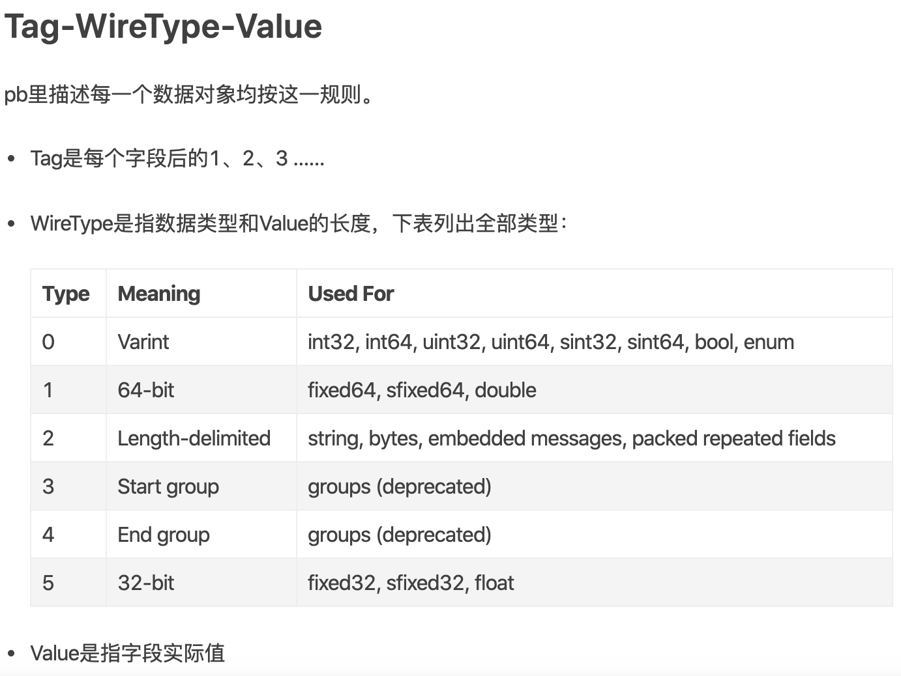

<!-- TOC -->

- [功能描述](#功能描述)
    - [功能](#功能)
    - [图文积压定时警报](#图文积压定时警报)
    - [host白名单](#host白名单)
    - [业务描述](#业务描述)
    - [云剪辑](#云剪辑)
    - [评论补充弹幕](#评论补充弹幕)
    - [用户封禁](#用户封禁)
    - [弹幕屏蔽词](#弹幕屏蔽词)
    - [用户视频播放量定时更新](#用户视频播放量定时更新)
    - [发送通知](#发送通知)
        - [single通知 对notice topic代码的研究](#single通知-对notice-topic代码的研究)
        - [multi 开协程发送通知](#multi-开协程发送通知)
        - [广播模式 databus代码](#广播模式-databus代码)
- [源码研读](#源码研读)
    - [视频源码](#视频源码)
        - [稿件表每个字段的设计意义](#稿件表每个字段的设计意义)
        - [过滤的实现](#过滤的实现)
        - [svid的生成原因](#svid的生成原因)
        - [转码的实现](#转码的实现)
        - [转码url是如何做的](#转码url是如何做的)
- [总结经验](#总结经验)
    - [发布流程](#发布流程)
    - [思路分析](#思路分析)
    - [高并发](#高并发)
    - [全量广播中断](#全量广播中断)
    - [埋点](#埋点)
    - [操作记录](#操作记录)
    - [热加载](#热加载)
    - [富文本的注入解决](#富文本的注入解决)
    - [权限校验](#权限校验)
    - [全量发送](#全量发送)
    - [ios推送通知是富文本格式](#ios推送通知是富文本格式)
    - [重复操作的幂等](#重复操作的幂等)
    - [实例的负载均衡](#实例的负载均衡)
    - [用户输入的东西未必是完全可信的](#用户输入的东西未必是完全可信的)
    - [XSS攻击](#xss攻击)
    - [CSRF](#csrf)
    - [UAT和UT](#uat和ut)
        - [UAT(验收测试，User Acceptance Test)](#uat验收测试user-acceptance-test)
        - [UT(单元测试，Unit Test)](#ut单元测试unit-test)
        - [IT（集成测试，Integration Test）](#it集成测试integration-test)
        - [ST（系统测试，System Test）](#st系统测试system-test)
    - [Mock](#mock)
    - [定义](#定义)
        - [好处](#好处)
    - [gorm](#gorm)
- [传值还是传地址](#传值还是传地址)
- [canal](#canal)
    - [原理](#原理)
    - [应用](#应用)
- [restful 和 rpc 区别](#restful-和-rpc-区别)
    - [用途](#用途)
- [grpc](#grpc)
    - [dubbo使用tcp的原因](#dubbo使用tcp的原因)
    - [grpc的优势](#grpc的优势)
    - [grpc 原理](#grpc-原理)
        - [简单 RPC调用流程](#简单-rpc调用流程)
        - [grpc的api使用](#grpc的api使用)
    - [Request](#request)
    - [Response](#response)
    - [Protobuf](#protobuf)
- [http1  和 http 2](#http1--和-http-2)
    - [http1.x](#http1x)
    - [http2](#http2)
        - [Frame组成](#frame组成)
    - [stream特性](#stream特性)
    - [HPACK(头部简化)](#hpack头部简化)
    - [FlowControl](#flowcontrol)

<!-- /TOC -->


# 主要亮点

分表的方案，checkpoint ，幂等性的处理再细节一点。app保证幂等性，app定时发消息，消息进缓存。做一个定点的缓存，listnotice来控制消息。 qps 5000

# 功能描述

## 功能

## 图文积压定时警报


bug  uat和local一起抢占databus
     redis.do的reply 用redis.bool来判断,结果返回的reply的意义是count;当count为0的时候会报会退出,导致失败


```go

func (d *Dao) GetEarliestTaskTimeDb(ctx context.Context, workflowId int16) (t *time.Time, err error) {
	sqlStr := fmt.Sprintf(_sqlTaskEarliestTime)
	t = new(time.Time)
	row := d.db.QueryRow(ctx, sqlStr, workflowId)
	err = row.Scan(t)
	if err == sql.ErrNoRows {
		return t, nil
	}
	return
}

func (d *Dao) GetTaskCountDb(ctx context.Context, workFlowId int16) (count int, err error) {
	row := d.db.QueryRow(ctx, _sqlTaskStackCount, workFlowId)
	err = row.Scan(&count)
	if err != nil {
		log.Errorc(ctx, "GetTaskCountDb Failed ,error:%v", err)
		return
	}
	return
}

func (d *Dao) SetTaskCountRedis(ctx context.Context, workflowId int16, count int) (int, error) {
	key := fmt.Sprintf(TaskStackCount, workflowId)
	conn := d.redis.Get(ctx)
	defer conn.Close()

	reply, err := conn.Do("SET", key, count)

	if reply != "OK" || err != nil {
		log.Errorw(ctx, "SetTaskCountRedis error", err)
		return -1, err
	}
	_, err = conn.Do("EXPIRE", key, 86400)
	if err != nil {
		log.Errorw(ctx, "SetTaskCountRedis,set expire error:", err)
		return -1, err
	}
	count, err = redis.Int(conn.Do("GET", key))
	if err != nil {
		log.Errorc(ctx, "get TaskStackCount error:%#v", err)
	}
	return count, err
}

func (d *Dao) GetTaskStackCountRedis(ctx context.Context, workflowId int16) (count int, err error) {
	key := fmt.Sprintf(TaskStackCount, workflowId)
	conn := d.redis.Get(ctx)
	defer conn.Close()

	//TODO失效之后去 重置一个数据?
	count, err = redis.Int(conn.Do("GET", key))
	if err != nil {
		log.Errorc(ctx, "Redis Get TaskStackCount Failed ,error:%v", err)
		return
	}
	return
}

func (d *Dao) TaskStackCountIncre(ctx context.Context, workFlow int16) (count int, err error) {
	key := fmt.Sprintf(TaskStackCount, workFlow)
	conn := d.redis.Get(ctx)
	defer conn.Close()

	reply, err := conn.Do("INCR", key)
	if count, err = redis.Int(reply, err); err != nil {
		log.Errorw(ctx, "TaskStackCountIncre", "error", err)
		return
	}
	_, err = conn.Do("EXPIRE", key, 86400)
	if err != nil {
		log.Errorw(ctx, "TaskStackCountIncre,set expire error:", err)
	}

	log.Info("count:%d,workFlow:%d", count, workFlow)
	return count, err
}

func (d *Dao) TaskStackCountDecr(ctx context.Context, workFlow int16, decCount int) (count int, err error) {
	key := fmt.Sprintf(TaskStackCount, workFlow)
	conn := d.redis.Get(ctx)
	defer conn.Close()

	if count, err = redis.Int(conn.Do("DECRBY", key, decCount)); err != nil {
		log.Errorw(ctx, "event", "TaskStackCountDecr", "error", err, "count", count)
	}
	_, err = conn.Do("EXPIRE", key, 86400)
	if err != nil {
		log.Errorw(ctx, "TaskStackCountDecr,set expire error:", err)
	}

	log.Info("count:%d,workFlow:%d", count, workFlow)
	return count, err
}

```
## host白名单
建表
```sql
CREATE TABLE `white_host` (
  `id` bigint(20) unsigned NOT NULL AUTO_INCREMENT COMMENT '唯一主键',
  `host` varchar(255) NOT NULL DEFAULT '' COMMENT '白名单域名',
  `description` varchar(1000) NOT NULL DEFAULT '' COMMENT '域名描述',
  `status` tinyint(4) unsigned NOT NULL DEFAULT '0' COMMENT '域名的状态',
  `ctime` timestamp NOT NULL DEFAULT CURRENT_TIMESTAMP COMMENT '插入时间',
  `mtime` timestamp NOT NULL DEFAULT CURRENT_TIMESTAMP ON UPDATE CURRENT_TIMESTAMP COMMENT '更新时间',
  PRIMARY KEY (`id`),
  KEY `ix_mtime` (`mtime`),
  KEY `ix_host` (`host`)
) ENGINE=InnoDB AUTO_INCREMENT=1 DEFAULT CHARSET=utf8 COMMENT '域名白名单记录表'

```

其中 mtime有两个属性，分别是CURRENT_TIMESTAMP 和ON UPDATE CURRENT_TIMESTAMP两种，使用情况分别如下：

1. CURRENT_TIMESTAMP 

当要向数据库执行insert操作时，如果有个timestamp字段属性设为 CURRENT_TIMESTAMP，则无论这个字段有没有set值都插入当前系统时间


2. ON UPDATE CURRENT_TIMESTAMP
当执行update操作是，并且字段有ON UPDATE CURRENT_TIMESTAMP属性。则字段无论值有没有变化，它的值也会跟着更新为当前UPDATE操作时的时间。

AUTO_INCREMENT=1000是从1000开始增长

```sql
ALTER TABLE white_host ADD UNIQUE (host);  
```
host修改为unique,白名单数据没必要重复


## 业务描述
bbq  cms admin  负责 增加 删除 获取所有host;
增加和删除的时候要删除rediskey;
获取的时候先获取redis,获取不到就数据库,然后更新库

bbq app interface  调用admin  返回给前端host列表
## 云剪辑
长视频剪辑,存标志位,然后存短视频,视频在云端剪好,主站返回svid等信息
## 评论补充弹幕

## 用户封禁

## 弹幕屏蔽词

## 用户视频播放量定时更新

## 发送通知

cms-admin-notice
notice-service 
user-service

单播的时候同步发送
多播的时候开一个协程
广播的时候,把要广播的信息发送到databus上,交给一个consumer来运行

广播,单播,多播通知:
noticebase的信息有:
点赞的时候会发送通知
notice 部分  发送通知后,


redis记录未读通知
### single通知 对notice topic代码的研究


### multi 开协程发送通知

```go
func (s *Service) NoticeMultiUser(c context.Context, req *api.NoticeMultiUserReq) (empty *empty.Empty, err error) {
	midList := req.MidList

	midChan := s.midChanProducer(midList)

	//开一百个notice协程
	for i := 0; i < 100; i++ {
		err = s.midChanConsumer(midChan, req.Text, req.JumpUrl)
		//TODO 有error可以回收吗?
		if err != nil {
			log.Error("ConcurrentNoticeMultiUser Failed error:%#v", err)
			return
		}
	}
	return
}

//开一个协程把mids放入管道
func (s *Service) midChanProducer(mids []int64) (midChan chan int64) {
	midChan = make(chan int64, 100)
	go func() {
		defer close(midChan)
		for _, v := range mids {
			midChan <- v
		}
	}()
	return
}

//开一个协程消费管道中的mid,发送notice给user
//TODO 要不要context
func (s *Service) midChanConsumer(midChan <-chan int64, text string, jumpUrl string) (err error) {
	go func() {
		for mid := range midChan {
			//fmt.Printf("%d 消费了 %d", flag, mid)
			noticeBase := &notice.NoticeBase{
				Text:       text,
				Mid:        mid,
				NoticeType: notice.NoticeTypeSysMsg,
				BizType:    notice.NoticeBizTypeSysMsg,
				JumpUrl:    jumpUrl,
			}
			ctx := context.Background()
			err = s.dao.CreateSingleNotice(ctx, noticeBase)
			if err != nil {
				log.Errorw(ctx, "event", "ConcurrentNoticeMultiUser Failed", "error", err)
				return
			}
		}
	}()
	return
}
```
### 广播模式 databus代码

### 幂等性

### 进度记载

### 消息总线的提交特点

我用的消息总线主要是redis,没有用到kafka

分区+offset的hashMap存在redis里面

commit的时候,对应分区比offset小的全都commit了

所以需要先单线程放到管道里,然后并发消费.

# 源码研读
## 视频源码
service 初始化的时候拿到host,把host经过hash操作后,存储到redis,保证每台主机的dao是唯一的不冲突的

稿件表的设计:

for循环监听,message chan;databus订阅主站稿件变动消息,对消息进行查封,拆成newVideo和oldVideo,和action和table

如果是update,判断是否是删除动态,如果是删除动态就同步把自己的视频展示等级设为不可见;还有一种可能是insert,这两种情况都要通过过滤(过滤规则要加载,有tid过滤,up主过滤,视频属性过滤版权最大最小时长比特率主题);过滤完之后

生成svid;由时间戳mid 等构成

创建一个topicClient  现在还不知道是干嘛用的.

把稿件传递给生产流程,通过稿件里面的dynamic(稿件的表设计为什么这样),提取tags,然后稿件信息传给转码的producerClient(可以画图的结构关系client)

在grpc调用的BVCXCodeCommit中,主要做三件事:生成video记录到数据表,提交转码请求(发送一个hhtp请求,包含svid和cid给配置好的请求地址);就可以对视频进行转码,然后返回结果是视频转码,写回稿件表


### 稿件表每个字段的设计意义

### 过滤的实现

### svid的生成原因

### 转码的实现

### 转码url是如何做的


# 总结经验


## 发布流程

写代码,写日志,本地debug,发到uat,uat测试通过,code review,发到pre,pre测试通过,发到pro,测试通过,删除次要日志,留下关键日志(info里也有很多关键日志),merge到master(merge交给别人来做)

线上发版要提测,跟别人说

平时没事就pull一下,

## 思路分析

自动驾驶汽车放几个摄像头,怎么查发给了多少个用户,不知道就去分析,分析一下就变成知道了

## 高并发

高并发是好事,但是createnotice高并发的是数据库,导致数据库压力过大爆503

## 全量广播中断

broadcastNoitce运行时间很长,会导致长时间无法做msgCommit,这个时候如果全量广播中断,下次再广播依然会消费没有被commit的消息,

```go
func (s *Service) pushNotice(msg *databus.Message) {
	var (
		dm *model.NoticeBaseDatabus
	)
	//因为broadcast占用时间比较长,如果中途停掉,再次开启服务还是会广播,造成多次广播,后面应该加广播幂等性
	defer msg.Commit()
	if err := jsoniter.Unmarshal(msg.Value, &dm); err != nil {
		log.Error("pushNotice Failed")
		return
	}
	if dm.Broadcast {
		log.Info("broadcastNotice:%#v", dm)
		err := s.broadcastNotice(dm)
		if err != nil {
			log.Error("broadcastNotice fail ")
			return
		}
		return
	}
	for _, mid := range dm.MidList {
		log.Info("notBroadcastNotice:%#v", dm)
		noticeBase := &v1.NoticeBase{
			Text:       dm.Text,
			Mid:        mid,
			NoticeType: v1.NoticeTypeSysMsg,
			BizType:    v1.NoticeBizTypeSysMsg,
			JumpUrl:    dm.JumpUrl,
		}
		s.noticeBaseChan <- noticeBase
	}
}
```


## 埋点

## 操作记录

## 热加载
## 富文本的注入解决 
<p>req.text<p>  如果text也是富文本

## 权限校验

## 全量发送 
如果一个出错,不要return 而是 continue
```go

func (s *Service) run() (err error) {
	for noticeBase := range s.noticeBaseChan {
		_, err = s.CreateNotice(context.Background(), noticeBase)
		if err != nil {
			log.Errorw(context.Background(), "event", "noticeBaseChanConsumer Failed", "error", err)
			continue
		}
	}
	return
}
```
## ios推送通知是富文本格式
如果只用text字体会很小
## 重复操作的幂等
去重 唯一id (幂等性)
## 实例的负载均衡
再推到消息总线上,负载均衡来做

## 用户输入的东西未必是完全可信的
判空 判断格式   
```go
if strings.Trim(req.Text, " ") == "" {
		err = errors.New("text不能为空")
		log.Error("SendNoticeDatabus Failed error:%#v", err)
		return
	}
```

## XSS攻击  

人们经常将跨站脚本攻击（Cross Site Scripting）缩写为CSS，但这会与层叠样式表（Cascading Style Sheets，CSS）的缩写混淆。因此，有人将跨站脚本攻击缩写为XSS。

XSS攻击通常指的是通过利用网页开发时留下的漏洞，通过巧妙的方法注入恶意指令代码到网页，使用户加载并执行攻击者恶意制造的网页程序。这些恶意网页程序通常是JavaScript，

详情博客:
https://blog.csdn.net/qq_36119192/article/details/82469035
## CSRF

用户在未登出A网站的前提下,cookie保留,登陆了恶意网站B,B网站利用还未失效的cookie冒充用户访问A网站.

解决办法:
cookie加密

详情博客:
https://www.cnblogs.com/hyddd/archive/2009/04/09/1432744.html

## UAT和UT
### UAT(验收测试，User Acceptance Test)
验收测试是向未来的用户表明系统能够像预定要求那样工作。

经集成测试后，已经按照设计把所有的模块组装成一个完整的软件系统，接口错误也已经基本排除了，接着就应该进一步验证软件的有效性，这就是验收测试的任务，即软件的功能和性能如同用户所合理期待的那样。


### UT(单元测试，Unit Test)
单元测试任务包括：

模块接口测试；
模块局部数据结构测试；
模块边界条件测试；
模块中所有独立执行通路测试；
模块的各条错误处理通路测试。

### IT（集成测试，Integration Test）
也称系统集成测试（System Integration Test）或结合测试。
集成测试阶段是以黑盒法为主，在自底向上集成的早期，白盒法测试占一定的比例，随着集成测试的不断深入，这种比例在测试过程中将越来越少，渐渐地，黑盒法测试占据主导地位。

### ST（系统测试，System Test）
从技术角度看，系统测试是整个测试阶段的最后一步，所有的开发和测试在这一点上集中表现为生成一个具有一定功能的软件系统。
该阶段主要对系统的准确性及完整性等方面进行测试。

主要进行：
功能确认测试、运行测试、强度测试、恢复测试、安全性测试等。

系统测试的测试人员由测试组成员（或质量保证人员）或测试组成员与用户共同测试。在整个系统开发完成，即将交付用户使用前进行。在这一阶段，完全采用黑盒法对整个系统进行测试。

## Mock
https://juejin.im/post/5bd82d796fb9a05d25682a66
## 定义
按照事先规定的接口规范,返回虚拟的数据
### 好处
当使用mock之后，各团队之间可以不需要再互相等待对方的进度，只需要约定好相互之间的数据规范（文档），即可使用mock构建一个可用的接口，然后尽快的进行开发和调试以及自测，提升开发进度的的同时，也将发现缺陷的时间点大大提前。

复现某些接口返回值

提前开始单元测试

## gorm  
废弃gorm,反直觉而且有性能损耗

#  传值还是传地址

go只有值传递,  
传指针则是复制一个指针,可以操作传入参数指向的内存  
传值则是拷贝一份值   
传切片也分传值和传地址:
```go
package main

import (
    "fmt"
)

func main() {
    array := [5]int{0, 1, 2, 3, 4}
    slice := array[:]
    fmt.Println(slice)
    fmt.Printf("slice in main1 %p \n", &slice)
    appendTest(slice)
    fmt.Printf("slice in main2 %p \n", &slice)
    fmt.Println(slice)
    fmt.Println("=============")
    fmt.Println(slice)
    fmt.Printf("slice in main1 %p \n", &slice)
    appendTestRef(&slice)
    fmt.Printf("slice in main2 %p \n", &slice)
    fmt.Println(slice)
}

func appendTest(slice []int) {
    fmt.Printf("slice appendTest1 %p \n", slice)
    slice = append(slice, 5)
    fmt.Println(slice)
    fmt.Printf("slice appendTest2 %p \n", slice)
}

func appendTestRef(slice *[]int) {
    fmt.Printf("slice appendTestRef1 %p \n", slice)
    *slice = append(*slice, 5)
    fmt.Println(slice)
    fmt.Printf("slice appendTestRef2 %p \n", slice)
}
```
```
输出
    [0 1 2 3 4]
    slice in main1 0xc082008520 
    slice appendTest1 0xc08200be90 
    [0 1 2 3 4 5]
    slice appendTest2 0xc08200e1e0 
    slice in main2 0xc082008520 
    [0 1 2 3 4]
    =============
    [0 1 2 3 4]
    slice in main1 0xc082008520 
    slice appendTestRef1 0xc082008520 
    &[0 1 2 3 4 5]
    slice appendTestRef2 0xc082008520 
    slice in main2 0xc082008520 
    [0 1 2 3 4 5]
```

# canal
canal是纯Java开发的，基于数据库增量日志解析，提供增量数据订阅&消费，目前主要支持了mysql。

## 原理

1.      canal模拟mysql slave的交互协议，伪装自己为mysql slave，向mysql master发送dump协议

2.      mysql master收到dump请求，开始推送binary log给slave(也就是canal)

3.      canal解析binary log对象(原始为byte流)

## 应用
canal监听多个表的binlog,解析完成之后,送到kafka的生产者组group-P,topic是cmsTask

再由kafka的对应消费者组group-C,topic也是cmsTask来消费

# restful 

RESTful(Representational State Transfer 具象状态传输)是一种设计风格

1. REST 是面向资源的,对资源的操作与它无关，操作是通过 HTTP动词来体现，所以REST 通过 URI 暴露资源时，会强调不要在 URI 中出现动词。
```
GET /rest/api/getDogs --> GET /rest/api/dogs 获取所有小狗狗 
GET /rest/api/addDogs --> POST /rest/api/dogs 添加一个小狗狗 
GET /rest/api/editDogs/:dog_id --> PUT /rest/api/dogs/:dog_id 修改一个小狗狗 
GET /rest/api/deleteDogs/:dog_id --> DELETE /rest/api/dogs/:dog_id 删除一个小狗狗
```
2. 每一个URI代表1种资源；
3. 客户端使用GET、POST、PUT、DELETE4个表示操作方式的动词对服务端资源进行操作：GET用来获取资源，POST用来新建资源（也可以用于更新资源），PUT用来更新资源，DELETE用来删除资源；
4. 通过操作资源的表现形式来操作资源；
5. 资源的表现形式是XML或者HTML；
6. 客户端与服务端之间的交互在请求之间是无状态的，从客户端到服务端的每个请求都必须包含理解请求所必需的信息。

## RESTful与RPC的用途区别

RESTful API：主要用在为第三方提供调用自家系统的一种途径。(客户端)

RPC：主要用在自家系统之间的互相调用，即实现系统的分布式。(微服务之间的调用)

gRPC可以方便地支持流式通信

# RPC  

简介:  
RPC 样式的 Web 服务客户端将一个装满数据的信封（包括方法和参数信息）通过 HTTP 发送到服务器。服务器打开信封并使用传入参数执行指定的方法。方法的结果打包到一个信封并作为响应发回客户端。客户端收到响应并打开信封。

每个对象都有自己独特的方法以及仅公开一个 URI 的 RPC 样式 Web 服务，URI 表示单个端点。它忽略 HTTP 的大部分特性且**仅支持 POST 方法**。

# dubbo(rpc框架)

## 使用tcp的原因

http的头部很占字节.

**自定义tcp协议可以极大地简化传输头内容。**

但http2.0协议已经优化编码效率问题，像grpc这种rpc库使用的就是http2.0协议。

#  grpc(rpc框架)

传输协议包含: 如著名的 gRPC 使用的 http2 协议，也有如dubbo一类的自定义报文的tcp协议。  
编码协议包含: 如二进制编码的 protobuf binpack ,基于文本编码的 xml json等。  

## grpc的优势
gRPC可以通过protobuf来定义接口，从而可以有更加严格的接口约束条件(约束更强)

protobuf可以将数据序列化为二进制编码，这会大幅减少需要传输的数据量，从而大幅提高性能。(性能更高)

gRPC 通常有四种模式，unary，client streaming，server streaming 以及 bidirectional streaming，对于底层 HTTP/2 来说，它们都是 stream，并且仍然是一套 request + response 模型。

## grpc 原理

grpc通过protocol buffers 的 messages 定义数据结构,定义好数据结构后，可以使用 protocol buffers 编译器(protoc)将其生成其他语言的类。这些类提供所有属性的访问方法，及序列化和反序列方法。例如，你使用的是 C++，运行编译器会生成一个 Person 类，你可以在在你的应用中实例化或序列化来传输这些 protocol buffers 信息。


除了数据结构外，你还可以在 .proto 文件中定义 gRPC 服务，包括服务接口的参数和返回类型。所以除了会生成共传播和序列化的类以外，还会生成 gRPC client 和 server 代码。

### 简单 RPC调用流程
当 client 调用 RPC 方法时，会通知 server 对应的 RPC 方法被调用，包括 client 调用的元数据信息，方法名，以及 deadline
server 也需要通知 client 自己的元数据(这步发生在所有响应之前)，可以直接通知，也可以等收到客户端第一个请求时发送
当 server 接到 client 的请求后，根据请求和业务逻辑生成响应，这些响应包括状态码及payload，并返回给 client
如果状态 OK， client 会收到响应，并在 client 侧完成这次调用

### grpc的api使用
gRPC 使用 .proto 生成 client 和 server 代码及 API。client 调用这些 API, server 实现这些API。

server 侧实现服务声明的方法，并运行 gRPC server 来处理 client 的调用。gRPC 帮助你反序列化请求，执行服务方法，序列化响应并返回给 client.
client 侧 gRPC 会生成一个 client，这个 client 提供和 server 侧一样的接口供用户调用，并且使用 protocol buffer 序列化用户的请求参数，发送给 server，然后反序列化 server 的响应。


## Request
gRPC 的 request 通常包含 Request-Headers, 0 或者多个 Length-Prefixed-Message 以及 EOS。
Request-Headers 直接使用的 HTTP/2 headers，在 HEADERS 和 CONTINUATION frame 里面派发。定义的 header 主要有 Call-Definition 以及 Custom-Metadata。Call-Definition 里面包括 Method（其实就是用的 HTTP/2 的 POST），Content-Type 等。而 Custom-Metadata 则是应用层自定义的任意 key-value，key 不建议使用 grpc- 开头，因为这是为 gRPC 后续自己保留的。

Length-Prefixed-Message 主要在 DATA frame 里面派发，它有一个 Compressed flag 用来表示改 message 是否压缩，如果为 1，表示该 message 采用了压缩，而压缩算啊定义在 header 里面的 Message-Encoding 里面。然后后面跟着四字节的 message length 以及实际的 message。

EOS（end-of-stream） 会在最后的 DATA frame 里面带上了 END_STREAM 这个 flag。用来表示 stream 不会在发送任何数据，可以关闭了。


## Response
Response 主要包含 Response-Headers，0 或者多个 Length-Prefixed-Message 以及 Trailers。如果遇到了错误，也可以直接返回 Trailers-Only。
Response-Headers 主要包括 HTTP-Status，Content-Type 以及 Custom-Metadata 等。Trailers-Only 也有 HTTP-Status ，Content-Type 和 Trailers。Trailers 包括了 Status 以及 0 或者多个 Custom-Metadata。

HTTP-Status 就是我们通常的 HTTP 200，301，400 这些，很通用就不再解释。Status 也就是 gRPC 的 status， 而 Status-Message 则是  gRPC 的 message。Status-Message 采用了 Percent-Encoded 的编码方式

如果在最后收到的 HEADERS frame 里面，带上了 Trailers，并且有 END_STREAM 这个 flag，那么就意味着 response 的 EOS。

## Protobuf

### Protobuf是什么

Protobuf实际是一套类似Json或者XML的数据传输格式和规范，用于不同应用或进程之间进行通信时使用。通信时所传递的信息是通过Protobuf定义的message数据结构进行打包，然后编译成二进制的码流再进行传输或者存储。

### Protobuf的序列化原理

推荐阅读的博客

:https://www.jianshu.com/p/4b987ef826d3

https://blog.csdn.net/carson_ho/article/details/70568606




### Protobuf的优点

相比较而言，Protobuf有如下优点：

- 足够简单
- 序列化后体积很小:消息大小只需要XML的1/10 ~ 1/3
- 解析速度快:解析速度比XML快20 ~ 100倍
- 多语言支持
- 更好的兼容性,Protobuf设计的一个原则就是要能够很好的支持向下或向上兼容


gRPC 的 service 接口是基于 protobuf 定义的，我们可以非常方便的将 service 与 HTTP/2 关联起来。

Path : /Service-Name/{method name}
Service-Name : ?( {proto package name} "." ) {service name}
Message-Type : {fully qualified proto message name}
Content-Type : "application/grpc+proto"

### 


# http1  和 http 2

## http1.x
HTTP/1.x 协议是一个文本协议，可读性非常好，但其实并不高效

交互模式，一个连接每次只能一问一答，也就是client 发送了 request 之后，必须等到 response，才能继续发送下一次请求。如果需要同时进行大量的交互，client 需要跟 server 建立多条连接，但连接的建立也是有开销的，所以为了性能，通常这些连接都是**长连接一直保活**的，虽然对于 server 来说同时处理百万连接也没啥太大的挑战，但终归效率不高。
## http2
HTTP/2 是一个二进制协议，这也就意味着它的可读性几乎为 0,但可以解析

Stream： 一个双向流，一条连接可以有多个 streams。  
Message： 也就是逻辑上面的 request，response。  
Frame:：数据传输的最小单位。每个 Frame 都属于一个特定的 stream 或者整个连接。一个 message 可能有多个 frame 组成。  

### Frame组成
```
+-----------------------------------------------+
|                 Length (24)                   |
+---------------+---------------+---------------+
|   Type (8)    |   Flags (8)   |
+-+-------------+---------------+-------------------------------+
|R|                 Stream Identifier (31)                      |
+=+=============================================================+
|                   Frame Payload (0...)                      ...
+---------------------------------------------------------------+
```
Length：也就是 Frame 的长度，默认最大长度是 16KB，如果要发送更大的 Frame，需要显示的设置 max frame size。

Type：Frame 的类型，譬如有 DATA，HEADERS，PRIORITY 等。Flag 和 R：保留位，可以先不管。

Stream Identifier：标识所属的 stream，如果为 0，则表示这个 frame 属于整条连接。

Frame Payload：根据不同 Type 有不同的格式。

## stream特性
一条连接可以包含多个 streams，多个 streams 发送的数据互相不影响。 


Stream 可以被 client 和 server 单方面或者共享使用。  

Stream 可以被任意一段关闭。 

Stream 会确定好发送 frame 的顺序，另一端会按照接受到的顺序来处理。 


Stream 用一个唯一 ID 来标识。  

stream 有优先级，方便对端为不同的请求分配不同的资源。譬如对于一个 Web 站点来说，优先加载重要的资源，而对于一些不那么重要的图片啥的，则使用低的优先级。

## HPACK(头部简化)

HPACK 提供了一个静态和动态的 table，静态 table 定义了通用的 HTTP header fields，譬如 method，path 等。发送请求的时候，只要指定 field 在静态 table 里面的索引，双方就知道要发送的 field 是什么了。

对于动态 table，初始化为空，如果两边交互之后，发现有新的 field，就添加到动态 table 上面，这样后面的请求就可以跟静态 table 一样，只需要带上相关的 index 就可以了。

同时，为了减少数据传输的大小，使用 Huffman 进行编码。这里就不再详细说明 HPACK 和 Huffman 如何编码了。
## FlowControl
HTTP/2 支持流控，如果 sender 端发送数据太快，receiver 端可能因为太忙，或者压力太大，或者只想给特定的 stream 分配资源，receiver 端就可能不想处理这些数据。

**特性:**
Flow control 是单向的。Receiver 可以选择给 stream 或者整个连接设置 window size。  

Flow control 是基于信任的。Receiver 只是会给 sender 建议它的初始连接和 stream 的 flow control window size。  

Flow control 不可能被禁止掉。当 HTTP/2 连接建立起来之后，client 和 server 会交换 SETTINGS frames，用来设置 flow control window size。  

Flow control 是 hop-by-hop，并不是 end-to-end 的，也就是我们可以用一个中间人来进行 flow control。  


# md5

参考博客: https://www.jianshu.com/p/81c30781d4f7 

## md5 原理

md5将整个文件当做一个大文本信息，通过不可逆的字符串变换算法，产生一个唯一的MD5信息摘要。文件的md5类似于人的指纹，在世界上是独立无二的，如果任何人对文件做了任何改动，其md5的值也就是对应的“数字指纹”都会发生变化。

对MD5算法简要的叙述可以为：MD5以512位分组来处理输入的信息，且每一分组又被划分为16个32位子分组，经过了一系列的处理后，算法的输出由四个32位分组组成，将这四个32位分组级联后将生成一个128位散列值。

md5与对称和非对称加密算法不同，这两种密码是防止信息被窃取，而摘要算法的目标是用于证明原文的完整性。

## md5 用途

**密码的加密存储**，用户设置密码时，服务端只记录这个密码的MD5，而不记录密码本身，以后验证用户身份时，只需要将用户输入的密码再次做一下MD5后，与记录的MD5作一个比较即可验证其密码的合法性。

**数字签名**，比如发布一个程序，为了防止别人在你的程序里插入病毒或木马，你可以在发布这个程序的同时，公开这个程序文件的MD5码，这样别人只需要在任何地方下载这个程序后做一次MD5，然后跟公开的这个MD5作一个比较就知道这个程序是否被第三方修改过。

**文件完整性验证**，比如当下载一个文件时，服务器返回的信息中包括这个文件的md5，在本地下载完毕时进行md5，将两个md5值进行比较，如果一致则说明文件完整没有丢包现象。

**文件上传**，比如百度云实现的秒传，就是对比你上传的文件md5在百度服务器是否已经存在了。

go里面生成md5

```go
data := []byte(str)
has := md5.Sum(data)
md5str1 := fmt.Sprintf("%x", has) //将[]byte转成16进制

fmt.Println(md5str1)
```


## 对称加密和非对称加密

### 对称加密

一方通过密钥将信息加密后，把密文传给另一方，另一方通过这个相同的密钥将密文解密，转换成可以理解的明文。

甲和乙通过同一个 钥匙 加密解密


常见的对称加密算法有DES、3DES、AES、Blowfish、IDEA、RC5、RC6。

### 非对称加密

每个人都有一个公钥和私钥,公钥谁都可以知道,私钥自己维护. 

发给甲的消息被其他人用甲的公钥加密,且只有甲的私钥可以把消息解密.

甲发出的消息都会被甲的密钥加密,只有其他人只有用甲的公钥才能解密

过程如下:

```
李四：
“hi哥们，我想给你发个密文，把你的公钥给我发过来用用。”

张三：
“没问题的，这是我的公钥： d#8yHE8eU#hb*!neb，用这个公钥加密你的信息后给我发过来吧”

李四：
“这是我想对你说的话： *&#@uehuu(**#eehu&$##bfeu&&”

张三收到消息后,用自己的私钥把消息解密
```


常用的非对称加密算法：RSA

非对称加密算法应用非常广泛，SSH, HTTPS, TLS，电子证书，电子签名，电子身份证等等。


### 根证书

(文中有浏览器甲和正规网站乙和认证机构丙的例子)参考博客:https://segmentfault.com/a/1190000012466003

非对称加密算法解决了甲乙之间通信的消息是以密文的形式传递.这样黑客窃取到公钥也没法解密传递的消息.

但是解决不了有人冒充甲或者乙.

所以需要第三方丙.乙想要跟甲通话,需要先找丙,把自己的个人信息和公钥交给丙,丙用自己的私钥加密得到数字证书返回给乙,然后乙拿着丙返回的数字证书给甲展示,甲找丙,要来丙的公钥,解密用丙的私钥加密的乙的个人信息和乙的公钥,甲就可以验证乙的数字证书,

这个时候可以核对乙的个人信息+乙的公钥

核对通过后甲再给乙发送消息.