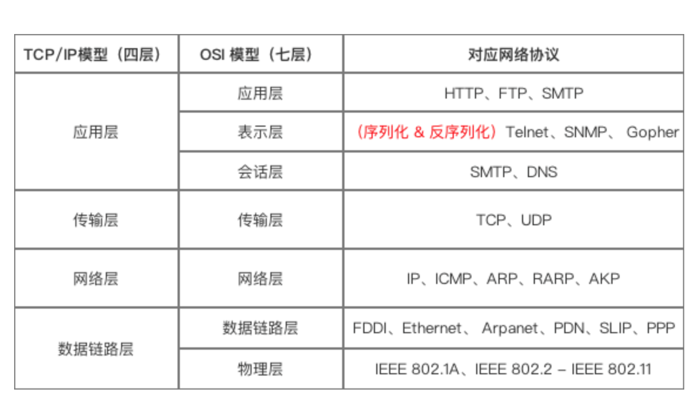
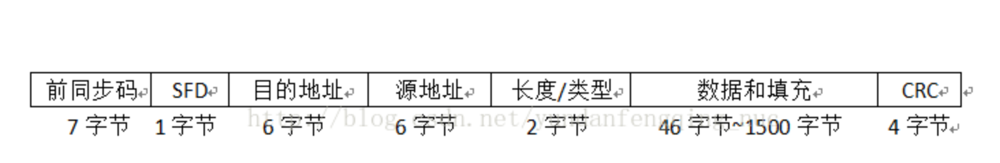
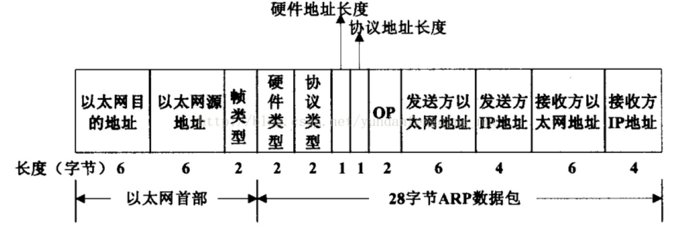

<!-- TOC -->

- [UDP 和 TCP 的特点](#udp-%e5%92%8c-tcp-%e7%9a%84%e7%89%b9%e7%82%b9)
- [UDP 首部格式](#udp-%e9%a6%96%e9%83%a8%e6%a0%bc%e5%bc%8f)
- [TCP 首部格式](#tcp-%e9%a6%96%e9%83%a8%e6%a0%bc%e5%bc%8f)
- [TCP 的三次握手](#tcp-%e7%9a%84%e4%b8%89%e6%ac%a1%e6%8f%a1%e6%89%8b)
- [TCP 的四次挥手](#tcp-%e7%9a%84%e5%9b%9b%e6%ac%a1%e6%8c%a5%e6%89%8b)
- [TCP 可靠传输](#tcp-%e5%8f%af%e9%9d%a0%e4%bc%a0%e8%be%93)
- [TCP 滑动窗口](#tcp-%e6%bb%91%e5%8a%a8%e7%aa%97%e5%8f%a3)
- [TCP 流量控制](#tcp-%e6%b5%81%e9%87%8f%e6%8e%a7%e5%88%b6)
- [TCP 拥塞控制](#tcp-%e6%8b%a5%e5%a1%9e%e6%8e%a7%e5%88%b6)
  - [1. 慢开始与拥塞避免](#1-%e6%85%a2%e5%bc%80%e5%a7%8b%e4%b8%8e%e6%8b%a5%e5%a1%9e%e9%81%bf%e5%85%8d)
  - [2. 快重传与快恢复](#2-%e5%bf%ab%e9%87%8d%e4%bc%a0%e4%b8%8e%e5%bf%ab%e6%81%a2%e5%a4%8d)
    - [15.0.2. TCP三次握手](#1502-tcp%e4%b8%89%e6%ac%a1%e6%8f%a1%e6%89%8b)
    - [15.0.3. TCP四次挥手](#1503-tcp%e5%9b%9b%e6%ac%a1%e6%8c%a5%e6%89%8b)
- [127.0.0.1和0.0.0.0地址的区别](#127001%e5%92%8c0000%e5%9c%b0%e5%9d%80%e7%9a%84%e5%8c%ba%e5%88%ab)
  - [0.0.0.0](#0000)
    - [用途总结](#%e7%94%a8%e9%80%94%e6%80%bb%e7%bb%93)
  - [127.0.0.1](#127001)
    - [用途](#%e7%94%a8%e9%80%94)
  - [总结](#%e6%80%bb%e7%bb%93)

<!-- /TOC -->

网络层只把分组发送到目的主机，但是真正通信的并不是主机而是主机中的进程。传输层提供了进程间的逻辑通信，传输层向高层用户屏蔽了下面网络层的核心细节，使应用程序看起来像是在两个传输层实体之间有一条端到端的逻辑通信信道。

# 常见协议

# Ethernet协议

以太网是目前最流行的一种局域网组网技术（其他常见局域网组网技术还有令牌环局域网、无线局域网、ATM局域网），以太网技术的正式标准是IEEE 802.3标准，它规定了在以太网中传输的数据帧结构，如下图所示。

              

在物理层上看，一个完整的以太网帧有7个字段，事实上，前两个字段并不能算是真正意义上的以太网数据帧，它们是以太网在物理层上发送以太网数据时添加上去的。为了实现底层数据的正确阐述，物理层使用7个字节前同步码（0和1交替的56位（55-55-55-55-55-55-55））实现物理层帧输入/输出同步；使用1个字节的SFD（帧首定界符，固定为10101011）标识帧的开始。上图中剩下的5个字段是真正的以太网数据，其中包含了目的地址和源地址，它们都是6字节长度（通常每个网卡都有1个6个字节MAC地址，以在以太网中唯一地标识自己）。网卡接收数据时，通过将目的地址字段和自身的MAC地址做比较，判断是否接收该数据包。通常，将这里的6字节目的地址按照下面的格式来书写，如：00-01-02-03-04-05。这6个字节在以太网中是按照从左到右的顺序发送的，同时对每个字节来说，最先发送的是最低位bit0，最后是最高位bit7。

      在以太网帧中，目的地址可以分为三类：单播地址、多播地址和广播地址。单播地址通常与一个具体网卡的MAC地址相对应，它要求第一个字节的bit0（即最先发出去的位）必须是0；多播地址则要求第一个字节的bit0为1，这样，在网络中多播地址不会与任何网卡的MAC相同，多播数据可以被很多个网卡同时接收；广播地址的所有48位全为1（即FF-FF-FF-FF-FF-FF），同一局域网中的所有网卡可以接收广播数据包。

上图中的长度/类型具有两个意义，当这两个字节的值小雨1518时，那么它就代表其后数据字段的长度；如果这两个字节的值大于1518，则表示该以太网帧中的数据属于哪个上层协议（例如0x800，代表IP数据包；0x806，代表ARP数据包等。）

在使用网卡进行数据包的发送与接收时，网卡已为我们完成了物理层的所有工作，驱动程序要做的是，在发送数据时，将目的地址、源地址、类型/长度、数据和填充这些值写入网卡，网卡自动计算其CRC并添加在数据帧尾部，同时对数据帧进行物理层的封装，最后将数据帧发送出去；在接收数据时，网卡会自动检测并接收数据包，验证校验和并把上述四个字段的值放在内部SRAM中供控制器读取。

TCP/IP协议有自己的地址：32bit的IP地址（网络地址），网络层发送数据包时只知道目的地址的IP地址，而底层接口（如以太网驱动程序）必须知道对方的硬件地址才能将数据发送出去。

# ARP协议

ARP的功能是在32bit的IP地址和采用不同网络技术的硬件地址之间提供动态映射，为上层将底层的物理地址差异屏蔽起来，这样上层的因特网协议就可以灵活地使用IP地址进行通信了。ARP协议的基本功能是使用目标主机的IP地址，查询其对应的MAC地址，以保证底层链路上数据包通信的进行。为了实现在网络接口物理地址与IP地址间的转换，ARP协议中引入了ARP缓存表的概念。ARP缓存表中记录了一条一条的<IP地址，MAC地址>对，他们是主机最近运行获得的关于周围其他主机的IP地址到物理地址的绑定，当需要发送IP数据包时，ARP层根据目的IP地址来查找ARP缓存表，并将匹配的MAC地址装入以太网帧首部，最后发送以太网数据。

ARP缓存表的建立与ARP数据包是密切相关的。在以太网中，ARP数据包和IP数据包是两个独立的部分，它们都封装在以太网帧中发送。ARP数据包的种类有两种：一是ARP请求包，它是通过以太网广播的方式发送的，用于向具有某个IP地址的主机发送请求，希望该主机返回其MAC地址；二是ARP应答包，收到ARP请求的主机会比对该数据包中的IP地址与自己的IP地址是否符合，若是，则该主机向源主机返回一个ARP应答包。向源主机报告自己的MAC地址。源主机通过提取ARP应答包中的相关字段来更新ARP缓存表。在Windows控制台上输入arp -a，可以查看操作系统中使用的ARP缓存表。

举一个简单的例子来看看ARP的功能。假如我们的主机（192.168.1.11）需要向开发板（192.168.1.37）发送一个IP数据包，当发送数据时，主机会在自己的ARP缓存表中寻找是否有目标IP地址。如果找到了，也就知道了目标MAC地址为（04-02-35-00-00-01），此时，主机直接把目标MAC地址写入以太网首部发送就可以了；如果在ARP缓存表中没有找到相对应的IP地址，此时比较不幸，我们的数据需要被延迟发送，随后主机会先在网络上发送一个广播（ARP请求，以太网目的地址为FF-FF-FF-FF-FF-FF），广播的ARP请求表示同一网段内所有主机将会收到这样一条信息：“192.168.1.37的MAC地址是什么？请回答”。网络IP地址为192.168.1.37（开发板）的主机接收到这个帧后，它有义务做出这样的回答（ARP应答）：“192.168.1.37的MAC地址是（04-02-35-00-00-01）”。这样，主机就知道了开发板的MAC地址，先前被延时的数据包就可以被发送了，此外，主机将这个地址对保存在缓存表中，以便后续数据包发送时使用。

ARP协议的核心就是对ARP缓存表的操作。发送数据包时，查找缓存表以得到目的MAC地址，此外，ARP还需要不断地处理ARP请求包和ARP应答包，以保证缓存表中各个表项的有效性。ARP的实质就是对缓存表的建立、更新、查询等操作。

## 2.2 ARP报文

要在源主机上建立关于目标主机的IP地址与MAC地址对应表项，则源主机和目的主机的基本信息交互式必须的，简单地说就是，源主机如何告诉目的主机：我需要你的MAC地址；而目的主机如何回复：这就是我的MAC地址。这时ARP报文（ARP数据包）就派上用场了。

ARP请求和ARP应答都是被组装在一个ARP数据包中发送的，ARP包的组成结构如下图所示。需要注意的是：ARP包时被封装在以太网帧中发送的，所以在图中也列出了以太网帧头部。

  以太网帧头部中的前两个字段是以太网的MAC地址和源MAC地址，目的地址为全1的特殊地址是以太网广播地址。在ARP表项建立前，源主机只知道目的主机的IP地址，并不知道其MAC地址，所以在数据链路上，源主机只有通过广播的方式将ARP请求数据包发送出去，同一网段上的所有以太网接口都会接收到广播的数据包。

   两个字节长的以太网帧类型表示帧中数据的类型。对于ARP包来说，该字段值为0x0806；对IP包来说，该字段的值为0x0800。接下来就是ARP数据包部分了，第一个硬件类型字段表示发送方想要知道的硬件接口类型，对于以太网MAC地址，它的值为1.协议类型字段表示要映射的协议地址类型，它的值为0x0800时，即表示要映射为IP地址，该值与以太网数据帧头中的类型字段的值使用相同的一组值。

接下来的两个单字节长度的字段，称为硬件地址长度和协议地址长度，它们分别指出硬件地址和协议地址的长度，长度单位为字节。对于以太网上ARP请求或应答来说，它们的值分别为6和4，代表MAC地址的长度和IP地址的长度。在ARP协议包中流出硬件地址长度和协议地址长度字段可以使得ARP协议在任何网络中被使用，而不仅仅只在以太网中。

  操作字段op指出ARP数据包的类型，它们可以使ARP请求（值为1）、ARP应答（值为2）。

  接下来的四个字段是发送端的以太网MAC地址、发送端的IP地址、目的端的以太网MAC地址和目的端的IP地址。

# UDP 和 TCP 的特点

- 用户数据报协议 UDP（User Datagram Protocol）是无连接的，尽最大可能交付，没有拥塞控制，面向报文（对于应用程序传下来的报文不合并也不拆分，只是添加 UDP 首部），支持一对一、一对多、多对一和多对多的交互通信。

- 传输控制协议 TCP（Transmission Control Protocol）是面向连接的，提供可靠交付，有流量控制，拥塞控制，提供全双工通信，面向字节流（把应用层传下来的报文看成字节流，把字节流组织成大小不等的数据块），每一条 TCP 连接只能是点对点的（一对一）。

# UDP 首部格式

  
 

首部字段只有 8 个字节，包括源端口、目的端口、长度、检验和。12 字节的伪首部是为了计算检验和临时添加的。

# TCP 首部格式

  
 

-  **序号**  ：用于对字节流进行编号，例如序号为 301，表示第一个字节的编号为 301，如果携带的数据长度为 100 字节，那么下一个报文段的序号应为 401。

-  **确认号**  ：期望收到的下一个报文段的序号。例如 B 正确收到 A 发送来的一个报文段，序号为 501，携带的数据长度为 200 字节，因此 B 期望下一个报文段的序号为 701，B 发送给 A 的确认报文段中确认号就为 701。

-  **数据偏移**  ：指的是数据部分距离报文段起始处的偏移量，实际上指的是首部的长度。

-  **确认 ACK**  ：当 ACK=1 时确认号字段有效，否则无效。TCP 规定，在连接建立后所有传送的报文段都必须把 ACK 置 1。

-  **同步 SYN**  ：在连接建立时用来同步序号。当 SYN=1，ACK=0 时表示这是一个连接请求报文段。若对方同意建立连接，则响应报文中 SYN=1，ACK=1。

-  **终止 FIN**  ：用来释放一个连接，当 FIN=1 时，表示此报文段的发送方的数据已发送完毕，并要求释放连接。

-  **窗口**  ：窗口值作为接收方让发送方设置其发送窗口的依据。之所以要有这个限制，是因为接收方的数据缓存空间是有限的。

# TCP 的三次握手

  
 

假设 A 为客户端，B 为服务器端。

- 首先 B 处于 LISTEN（监听）状态，等待客户的连接请求。

- A 向 B 发送连接请求报文，SYN=1，ACK=0，选择一个初始的序号 x。

- B 收到连接请求报文，如果同意建立连接，则向 A 发送连接确认报文，SYN=1，ACK=1，确认号为 x+1，同时也选择一个初始的序号 y。

- A 收到 B 的连接确认报文后，还要向 B 发出确认，确认号为 y+1，序号为 x+1。

- B 收到 A 的确认后，连接建立。

**三次握手的原因** (两次握手弊端)

第三次握手是为了防止失效的连接请求到达服务器，让服务器错误打开连接。

客户端发送的连接请求如果在网络中滞留，那么就会隔很长一段时间才能收到服务器端发回的连接确认。客户端等待一个超时重传时间之后，就会重新请求连接。但是这个滞留的连接请求最后还是会到达服务器，如果不进行三次握手，那么服务器就会打开两个连接。如果有第三次握手，客户端会忽略服务器之后发送的对滞留连接请求的连接确认，不进行第三次握手，因此就不会再次打开连接。

# TCP 的四次挥手

  
 

以下描述不讨论序号和确认号，因为序号和确认号的规则比较简单。并且不讨论 ACK，因为 ACK 在连接建立之后都为 1。

- A 发送连接释放报文，FIN=1。

- B 收到之后发出确认，此时 TCP 属于半关闭状态，B 能向 A 发送数据但是 A 不能向 B 发送数据。

- 当 B 不再需要连接时，发送连接释放报文，FIN=1。

- A 收到后发出确认，进入 TIME-WAIT 状态，等待 2 MSL（最大报文存活时间）后释放连接。

- B 收到 A 的确认后释放连接。

**四次挥手的原因** 

客户端发送了 FIN 连接释放报文之后，服务器收到了这个报文，就进入了 CLOSE-WAIT 状态。这个状态是为了让服务器端发送还未传送完毕的数据，传送完毕之后，服务器会发送 FIN 连接释放报文。

**TIME_WAIT** 

客户端接收到服务器端的 FIN 报文后进入此状态，此时并不是直接进入 CLOSED 状态，还需要等待一个时间计时器设置的时间 2MSL。这么做有两个理由：

- 确保最后一个确认报文能够到达。如果 B 没收到 A 发送来的确认报文，那么就会重新发送连接释放请求报文，A 等待一段时间就是为了处理这种情况的发生。

- 等待一段时间是为了让本连接持续时间内所产生的所有报文都从网络中消失，使得下一个新的连接不会出现旧的连接请求报文。

# TCP 可靠传输

TCP 使用超时重传来实现可靠传输：如果一个已经发送的报文段在超时时间内没有收到确认，那么就重传这个报文段。

一个报文段从发送再到接收到确认所经过的时间称为往返时间 RTT，加权平均往返时间 RTTs 计算如下：

  

其中，0 ≤ a ＜ 1，RTTs 随着 a 的增加更容易受到 RTT 的影响。

超时时间 RTO 应该略大于 RTTs，TCP 使用的超时时间计算如下：

  

其中 RTTd 为偏差的加权平均值。

# TCP 滑动窗口

窗口是缓存的一部分，用来暂时存放字节流。发送方和接收方各有一个窗口，接收方通过 TCP 报文段中的窗口字段告诉发送方自己的窗口大小，发送方根据这个值和其它信息设置自己的窗口大小。

发送窗口内的字节都允许被发送，接收窗口内的字节都允许被接收。如果发送窗口左部的字节已经发送并且收到了确认，那么就将发送窗口向右滑动一定距离，直到左部第一个字节不是已发送并且已确认的状态；接收窗口的滑动类似，接收窗口左部字节已经发送确认并交付主机，就向右滑动接收窗口。

接收窗口只会对窗口内最后一个按序到达的字节进行确认，例如接收窗口已经收到的字节为 {31, 34, 35}，其中 {31} 按序到达，而 {34, 35} 就不是，因此只对字节 31 进行确认。发送方得到一个字节的确认之后，就知道这个字节之前的所有字节都已经被接收。

  
 

# TCP 流量控制

流量控制是为了控制发送方发送速率，保证接收方来得及接收。

接收方发送的确认报文中的窗口字段可以用来控制发送方窗口大小，从而影响发送方的发送速率。将窗口字段设置为 0，则发送方不能发送数据。

# TCP 拥塞控制

如果网络出现拥塞，分组将会丢失，此时发送方会继续重传，从而导致网络拥塞程度更高。因此当出现拥塞时，应当控制发送方的速率。这一点和流量控制很像，但是出发点不同。流量控制是为了让接收方能来得及接收，而拥塞控制是为了降低整个网络的拥塞程度。

  
 

TCP 主要通过四个算法来进行拥塞控制：慢开始、拥塞避免、快重传、快恢复。

发送方需要维护一个叫做拥塞窗口（cwnd）的状态变量，注意拥塞窗口与发送方窗口的区别：拥塞窗口只是一个状态变量，实际决定发送方能发送多少数据的是发送方窗口。

为了便于讨论，做如下假设：

- 接收方有足够大的接收缓存，因此不会发生流量控制；
- 虽然 TCP 的窗口基于字节，但是这里设窗口的大小单位为报文段。

  
 

## 1. 慢开始与拥塞避免

发送的最初执行慢开始，令 cwnd = 1，发送方只能发送 1 个报文段；当收到确认后，将 cwnd 加倍，因此之后发送方能够发送的报文段数量为：2、4、8 ...

注意到慢开始每个轮次都将 cwnd 加倍，这样会让 cwnd 增长速度非常快，从而使得发送方发送的速度增长速度过快，网络拥塞的可能性也就更高。设置一个慢开始门限 ssthresh，当 cwnd >= ssthresh 时，进入拥塞避免，每个轮次只将 cwnd 加 1。

如果出现了超时，则令 ssthresh = cwnd / 2，然后重新执行慢开始。

## 2. 快重传与快恢复

在接收方，要求每次接收到报文段都应该对最后一个已收到的有序报文段进行确认。例如已经接收到 M1 和 M2，此时收到 M4，应当发送对 M2 的确认。

在发送方，如果收到三个重复确认，那么可以知道下一个报文段丢失，此时执行快重传，立即重传下一个报文段。例如收到三个 M2，则 M3 丢失，立即重传 M3。

在这种情况下，只是丢失个别报文段，而不是网络拥塞。因此执行快恢复，令 ssthresh = cwnd / 2 ，cwnd = ssthresh，注意到此时直接进入拥塞避免。

慢开始和快恢复的快慢指的是 cwnd 的设定值，而不是 cwnd 的增长速率。慢开始 cwnd 设定为 1，而快恢复 cwnd 设定为 ssthresh。

  
 

### 15.0.2. TCP三次握手

*  为什么要三次握手，不能像http或者UDP一样直接传输

  ​     主要是为了防止已失效的连接请求报文段突然又传到了B,因而报文错乱问题
  
  假定A发出的第一个连接请求报文段并没有丢失，而是在某些网络结点长时间滞留了，一直延迟到连接释放    以后的某个时间才到达B，本来这是一个早已失效的报文段。但B收到此失效的连接请求报文段后，就误认为   是A又发出一次新的连接请求，于是就向A发出确认报文段，同意建立连接。假定不采用三次握手，那么只要B发出确认，新的连接就建立了，这样一直等待A发来数据，B的许多资源就这样白白浪费了。

### 15.0.3. TCP四次挥手

**大厂面试TCP网络调度原理和TCP四次挥手设计**

* 面试题：你知道TCP四次挥手是什么吗？为什么要进行四次挥手

  * 确保数据能够完整传输

  * * 当被动方收到主动方的FIN报文通知时，它仅仅表示主动方没有数据再发送给被动方了。

    * 但未必被动方所有的数据都完整的发送给了主动方，所以被动方不会马上关闭SOCKET,它可能还需要发送一些数据给主动方后，再发送FIN报文给主动方，告诉主动方同意关闭连接
    * 所以这里的ACK报文和FIN报文多数情况下都是分开发送的。

  * 模拟流程

        A:“喂，我不说了 (FIN)。”A->FIN_WAIT1
        
        B:“我知道了(ACK)。等下，上一句还没说完。Balabala…..（传输数据）”B->CLOSE_WAIT | A->FIN_WAIT2
        
        B:”好了，说完了，我也不说了（FIN）。”B->LAST_ACK
        
        A:”我知道了（ACK）。”A->TIME_WAIT | B->CLOSED
        
        A等待2MSL,保证B收到了消息,否则重说一次”我知道了”,A->CLOSED

* 图解分析TCP四次挥手协议

  * TCP前面10种状态切换

    

* TCP第11种状态CLOSING 状态概念

  * 这种状态在实际情况中应该很少见，属于一种比较罕见的例外状态。正常情况下，当一方发送FIN报文后，按理来说是应该先收到（或同时收到）对方的ACK报文，再收到对方的FIN报文。但是CLOSING 状态表示一方发送FIN报文后，并没有收到对方的ACK报文，反而却也收到了对方的FIN报文。什么情况下会出现此种情况呢？那就是当双方几乎在同时close()一个SOCKET的话，就出现了双方同时发送FIN报文的情况，这是就会出现CLOSING 状态，表示双方都正在关闭SOCKET连接。

* netstat -anp|grep 8080 

# 127.0.0.1和0.0.0.0地址的区别
## 0.0.0.0
IPV4中，0.0.0.0地址被用于表示一个无效的，未知的或者不可用的目标。

**在服务器中**，0.0.0.0指的是本机上的所有IPV4地址，如果一个主机有两个IP地址，192.168.1.1 和 10.1.2.1，并且该主机上的一个服务监听的地址是0.0.0.0,那么通过两个ip地址都能够访问该服务。

**在路由中**，0.0.0.0表示的是默认路由，即当路由表中没有找到完全匹配的路由的时候所对应的路由。

### 用途总结

当一台主机还没有被分配一个IP地址的时候，用于表示主机本身。（DHCP分配IP地址的时候）
用作默认路由，表示”任意IPV4主机”。
用来表示目标机器不可用。
用作服务端，表示本机上的任意IPV4地址。

## 127.0.0.1
127.0.0.1属于{127,}集合中的一个，而所有网络号为127的地址都被称之为回环地址，所以回环地址！=127.0.0.1,它们是包含关系，即回环地址包含127.0.0.1。
回环地址：所有发往该类地址的数据包都应该被loop back。

### 用途

回环测试,通过使用ping 127.0.0.1 测试某台机器上的网络设备，操作系统或者TCP/IP实现是否工作正常。

DDos攻击防御：网站收到DDos攻击之后，将域名A记录到127.0.0.1，即让攻击者自己攻击自己。

大部分Web容器测试的时候绑定的本机地址。
## 总结
27.0.0.1 是一个环回地址。并不表示“本机”。0.0.0.0才是真正表示“本网络中的本机”。

在实际应用中，一般我们在服务端绑定端口的时候可以选择绑定到0.0.0.0，这样我的服务访问方就可以通过我的多个ip地址访问我的服务。
比如我有一台服务器，一个外网地址A,一个内网地址B，如果我绑定的端口指定了0.0.0.0，那么通过内网地址或外网地址都可以访问我的应用。但是如果我只绑定了内网地址，那么通过外网地址就不能访问。 所以如果绑定0.0.0.0,也有一定安全隐患，对于只需要内网访问的服务，可以只绑定内网地址。

# Socket连接与HTTP,TCP

## TCP连接

要想明白Socket连接，先要明白TCP连接。手机能够使用联网功能是因为手机底层实现了TCP/IP协议，可以使手机终端通过无线网络建立TCP连接。TCP协议可以对上层网络提供接口，使上层网络数据的传输建立在“无差别”的网络之上。

建立起一个TCP连接需要经过“三次握手”：

第一次握手：客户端发送syn包(syn=j)到服务器，并进入SYN_SEND状态，等待服务器确认；

第二次握手：服务器收到syn包，必须确认客户的SYN（ack=j+1），同时自己也发送一个SYN包（syn=k），即SYN+ACK包，此时服务器进入SYN_RECV状态；

第三次握手：客户端收到服务器的SYN＋ACK包，向服务器发送确认包ACK(ack=k+1)，此包发送完毕，客户端和服务器进入ESTABLISHED状态，完成三次握手。

握手过程中传送的包里不包含数据，三次握手完毕后，客户端与服务器才正式开始传送数据。理想状态下，TCP连接一旦建立，在通信双方中的任何一方主动关闭连接之前，TCP 连接都将被一直保持下去。断开连接时服务器和客户端均可以主动发起断开TCP连接的请求，断开过程需要经过“四次握手”（过程就不细写了，就是服务器和客户端交互，最终确定断开）

## HTTP连接

HTTP协议即超文本传送协议(Hypertext Transfer Protocol )，是Web联网的基础，也是手机联网常用的协议之一，HTTP协议是建立在TCP协议之上的一种应用。

**HTTP连接最显著的特点是客户端发送的每次请求都需要服务器回送响应，在请求结束后，会主动释放连接。从建立连接到关闭连接的过程称为“一次连接”。**

1）在HTTP 1.0中，客户端的每次请求都要求建立一次单独的连接，在处理完本次请求后，就自动释放连接。

2）在HTTP 1.1中则可以在一次连接中处理多个请求，并且多个请求可以重叠进行，不需要等待一个请求结束后再发送下一个请求。

由于HTTP在每次请求结束后都会主动释放连接，因此HTTP连接是一种“短连接”，要保持客户端程序的在线状态，需要不断地向服务器发起连接请求。通常的做法是即时不需要获得任何数据，客户端也保持每隔一段固定的时间向服务器发送一次“保持连接”的请求，服务器在收到该请求后对客户端进行回复，表明知道客户端“在线”。若服务器长时间无法收到客户端的请求，则认为客户端“下线”，若客户端长时间无法收到服务器的回复，则认为网络已经断开。

## SOCKET原理

### 3.1套接字（socket）概念

套接字（socket）是通信的基石，是支持TCP/IP协议的网络通信的基本操作单元。它是网络通信过程中端点的抽象表示，包含进行网络通信必须的五种信息：**连接使用的协议，本地主机的IP地址，本地进程的协议端口，远地主机的IP地址，远地进程的协议端口。**

应用层通过传输层进行数据通信时，TCP会遇到同时为多个应用程序进程提供并发服务的问题。多个TCP连接或多个应用程序进程可能需要通过同一个 TCP协议端口传输数据。为了区别不同的应用程序进程和连接，许多计算机操作系统为应用程序与TCP／IP协议交互提供了套接字(Socket)接口。应用层可以和传输层通过Socket接口，区分来自不同应用程序进程或网络连接的通信，实现数据传输的并发服务。

### 3.2 建立socket连接

建立Socket连接至少需要一对套接字，其中一个运行于客户端，称为ClientSocket ，另一个运行于服务器端，称为ServerSocket 。

套接字之间的连接过程分为三个步骤：**服务器监听，客户端请求，连接确认。**

**服务器监听：**服务器端套接字并不定位具体的客户端套接字，而是处于等待连接的状态，实时监控网络状态，等待客户端的连接请求。

**客户端请求：**指客户端的套接字提出连接请求，要连接的目标是服务器端的套接字。为此，客户端的套接字必须首先描述它要连接的服务器的套接字，指出服务器端套接字的地址和端口号，然后就向服务器端套接字提出连接请求。

**连接确认：**当服务器端套接字监听到或者说接收到客户端套接字的连接请求时，就响应客户端套接字的请求，建立一个新的线程，把服务器端套接字的描述发给客户端，一旦客户端确认了此描述，双方就正式建立连接。而服务器端套接字继续处于监听状态，继续接收其他客户端套接字的连接请求。

## 4、SOCKET连接与TCP连接

创建Socket连接时，可以指定使用的传输层协议，Socket可以支持不同的传输层协议（TCP或UDP），当使用TCP协议进行连接时，该Socket连接就是一个TCP连接。

## 5、Socket连接与HTTP连接

由于通常情况下Socket连接就是TCP连接，因此Socket连接一旦建立，通信双方即可开始相互发送数据内容，直到双方连接断开。但在实际网络应用中，客户端到服务器之间的通信往往需要穿越多个中间节点，例如路由器、网关、防火墙等，大部分防火墙默认会关闭长时间处于非活跃状态的连接而导致 Socket 连接断连，因此需要通过轮询告诉网络，该连接处于活跃状态。

而HTTP连接使用的是“请求—响应”的方式，不仅在请求时需要先建立连接，而且需要客户端向服务器发出请求后，服务器端才能回复数据。

很多情况下，需要服务器端主动向客户端推送数据，保持客户端与服务器数据的实时与同步。**此时若双方建立的是Socket连接，服务器就可以直接将数据传送给客户端；若双方建立的是HTTP连接，则服务器需要等到客户端发送一次请求后才能将数据传回给客户端，因此，客户端定时向服务器端发送连接请求，不仅可以保持在线，同时也是在“询问”服务器是否有新的数据，如果有就将数据传给客户端。**

## **区别简述：**

1）http是一种协议，socket是一种编程接口，主要包括TCP协议和UDP协议;

2)http和TCP/UDP是两个不同层上的的协议。http是应用层的协议，TCP/UDP是传输层的协议，http是在TCP/UDP之上的协议，http协议使用了TCP/UDP,http更加高级一点但是没有很好的灵活性。也就是http使用起来比TCP/UDP要简单，只需要遵循规范就可以进行网络通信了。

